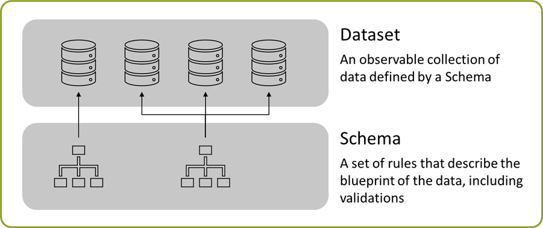
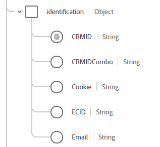

 
Welcome Marketer / DBA / Soon-To-Be AEP Genius...
=============================
__\[The scene opens...\]__
Imagine that you're wearing many hats at a leading Media Company (we'll call them HOLDEN Media Company -- its fake), likely not too dissimalar from your day-to-day responsibilites in the real world.  You've been tasked to both deploy and understand how to build out the upon your AEP deployment -- the deployment has already started so the system should be considered ".  This guide/document here (meant to be reviewed before your HOL session) will give you a detailed look and analysis of the data you're currently loading into your system.

OBJECTIVES:
==============
  - Become familiar with the data sources
  - Understand mixins + schemas
  - Gain new insights into your HOL deployment within AEP
  
YOUR HOL DATA SOURCES:
=================
The data below is what has already been loaded in your system.  Please click on each to review the contents and data dictionary:

  1. CRM
  2. Propensity
  3. Reduced Web
  4. Call Center
  5. Transactions
  
QUICK DATASET/SCHEMA TUTORIAL
============================
Understanding the dataset and schema is a central concept within AEP -- let me provide a quick overview (this will also be covered in class during the Schema chapter/section).

  1. From an 80,000 ft view, here is a diagram that defines the components/parts of schemas within AEP:
  
       <kbd></kbd>

  2. There are 2 essential behaviors (that are also defines as classes) that define schemas/dataset, they are (1) Profile and (2) Experience Event -- here's a breif overview shown below
  
       <kbd></kbd>

  3. Your above datasets fall into these metioned categories in this manner
      (pic here)
  4. As an example, let's explore the Call Center dataset to see it's parts + components.  Here's a screen shot of the full schema
     (pic here)
  5. Please notice that there are 3 different "Mixins" that help contruct parts/sections of the complete schema.  
     
       Mixin #1
       NAME:  Identification Mixin EE
       PURPOSE: A collection of all IDs/values related to a users identification (there could be many ways to link)
     
       <kbd></kbd>
     
 
       Mixin #2
       NAME:  Identification Mixin EE
       PURPOSE: A collection of all IDs/values related to a users identification (there could be many ways to link)
     
     <kbd></kbd>
     
  6. The mixins should be thought of as re-usable schema components (typically assigned as objects) that are groupings of similar/related fields.  This "piece" can be reimplemented in other schemas as to (a) reduced level of effort and work as well as (b) give more meaningful structure to your schema and where items are grouped together
     (pic here)
     
   NOTE: ANY mixin changes/saves will be duplicated/mirrored out to all instances where its utilized,  please look below as an example:
     
  7. Notice that within the mix ==name here== there are different data types used.  There are basic data types and more complex data types.. More info can be found here
  8. Now that the schema is in place, it's ready to recieve data as a dataset (there's a few ways to send/land the data into a dataset- JSON, Parquet, CSV and API to name a few).  Here's a way to conceptualize the relationship between schema and datsets:
  
   <kbd></kbd>

CRM Data - version 002 - added Notes column (small links would go here to "more info about X")
-----------------------------


| Number | FieldName         | DataType<sup>[info](#here)</sup>  | Mixin + Path <sup>[info](#here)</sup> | Example | Notes |
|--------|-------------------|-----------------------|---------------------------------------|---------------------|-----|
| 01     | crmid             |  string               | {{tenantid}}.identification.CRMID     | crmid:3572904408    |  -  |
| 02     | email             |  string               | {{tenantid}}.identification.Email     | leese1838@yahoo.com |  -  |
| 03     | first_name        |  string               | person.name.firstName                 | Roscoe              |  -  |
| 04     | last_name         |  string               | person.name.lastName                  | Lawrence            |  -  |
| 05     | gender            |  enum (string)        | person.gender                         | female              |  -  |
| 06     | mobile_telephone  |  string               | mobilePhone.number                    | 531-075-8094        |  -  |
| 07     | city              |  string               | homeAddress.city                      | Wauwatosa           |  -  |
| 08     | country           |  string               | homeAddress.country                   | United States       |  -  |
| 09     | zip               |  string               | homeAddress.postalCode                | 88430               |  -  |
| 10     | state             |  string               | homeAddress.stateProvince             | Hawaii              |  -  |
| 11     | street_address    |  string               | homeAddress.street1                   | 744 Fratessa        |  -  |
| 12     | birthday          |  string (date)        | person.birthDate                      | 8/17/1972           |  -  |
| 13     | genre<sup>1</sup> |  string               | interestProfileDetails.interestGenre  | Sci-Fi              | [1](https://google.com)|


CRM Data - version 001 - this would be the "extra notes" area -- help explaining stuff (when needed)
-----------------------------


<table>
<tr>
<th>Argument</th>
<th>Description</th>
</tr>
<tr>
<td>appDir</td>
<td>The top level directory that contains your app. If this option is used then
it assumed your scripts are in</td>
</tr>
<tr>
<td>baseUrl</td>
<td>By default, all modules are located relative to this path. If baseUrl is not
explicitly set, then all modules are loaded relative to the directory that holds
the build file. If appDir is set, then baseUrl should be specified as relative
to the appDir.</td>
</tr>
<tr>
<td>dir</td>
<td>The directory path to save the output. If not specified, then the path will
default to be a directory called "build" as a sibling to the build file. All
relative paths are relative to the build file.</td>
</tr>
<tr>
<td>modules</td>
<td>List the modules that will be optimized. All their immediate and deep
dependencies will be included in the module's file when the build is done. If
that module or any of its dependencies includes i18n bundles, only the root
bundles will be included unless the locale: section is set above.</td>
</tr>
</table>


Preview: Order data JSON
-----------------------------

```json
{
  "_id": "3f91922c-78f6-11ea-ba64-b88a60e194fb",
  "timestamp": "2020-03-13 00:25:20",
  "eventType": "transaction",
  "_adobeamericaspot5": {
    "transactionFlag": "1",
    "CRMID": "crmid:1603337965",
    "productDetails": [
      {
        "productSKUCount": "1",
        "productUnitsCount": "2",
        "productSKU": "prd1111",
        "productName": "Graduate Tailored Leg Das Denim Pant",
        "productCategory": "Men",
        "productSubCategory": "Men: Clothing",
        "productSalePrice": "284.5",
        "productMarginPrice": "156.48",
        "productTotalPrice": "569.0",
        "productFlag": 1
      },
      {
        "productSKUCount": "2",
        "productUnitsCount": "4",
        "productSKU": "prd1122",
        "productName": "High-Waist Boot Cut Pant",
        "productCategory": "Women",
        "productSubCategory": "Women: Clothing",
        "productSalePrice": "438.95",
        "productMarginPrice": "280.93",
        "productTotalPrice": "1755.8",
        "productFlag": 1
      }
    ],
    "orderDetails": {
      "orderID": "orderid:247282",
      "orderSKUcount": "2",
      "orderFlag": 1,
    },
    "storeDetails": {
      "storeID": "store:352",
      "storeClerkID": "clerkid:35244",
      "storeZIP": "06880"
    }
  }
}
```


Subscription Data
-----------------------------------

#### Info

This data represents new/renewed subscriptions for services from the fake HOLDEN Media Company.  Subscriptions can happen on web, call center or other customer interaction channels

#### Table


| Number | FieldName                   | DataType<sup>[info](#here)</sup>  | Mixin          | Example | Notes |
|--------|-----------------------------|-----------------------|----------------------------|---------------------|-----|
| 01     | CRMID                       |  string               | identification             | crmid:3572904408      |  -  |
| 02     | subscriptionID              |  string               | subscriptionDetails        | subscriptionid:852331 |  -  |
| 03     | subscriptionSKU             |  string               | subscriptionDetails        | prd1004               |  -  |
| 04     | subscriptionName            |  string               | subscriptionDetails        | Live Streaming Plan: Month-to-Month             |  -  |
| 05     | subscriptionType            |  enum (string)        | subscriptionDetails        | Live Streaming Plan   |  -  |
| 06     | subscriptionLength          |  string               | subscriptionDetails        | Month-to-Month        |  -  |
| 07     | subscriptionPayment         |  string               | subscriptionDetails        | Mastercard            |  -  |
| 08     | subscriptionMethod          |  string               | subscriptionDetails        | website               |  -  |
| 09     | subscriptionAmount          |  string               | subscriptionDetails        | 277.80                |  -  |
| 10     | subscriptionFlag            |  string               | subscriptionDetails        | 1                     |  -  |
| 11     | accountCurrentContractMonth |  string               | homeAddress.street1        | 7                     |  -  |
| 12     | accountOriginChannel        |  string (date)        | person.birthDate           | website               |  -  |
| 13     | accountStatus               |  string               | subscriptionDetails        | renewed               | [1](https://google.com)|

#### JSON Preview

```json
{
  "_id": "c263737f-84d8-11ea-8271-b88a60e194fb",
  "timestamp": "2020-03-17T06:11:13.000Z",
  "eventType": "subscription - website",
  "_adobeamericaspot2": {
    "identification": {
      "CRMID": "crmid:9999463"
    },
    "subscriptionDetails": {
      "subscriptionID": "subscriptionid:852331",
      "subscriptionSKU": "prd1004",
      "subscriptionName": "Live Streaming Plan: Month-to-Month",
      "subscriptionType": "Live Streaming Plan",
      "subscriptionLength": "Month-to-Month",
      "subscriptionPayment": "Mastercard",
      "subscriptionMethod": "website",
      "subscriptionAmount": 277.8,
      "subscriptionFlag": 1
    },
    "accountDetails": {
      "accountCurrentContractMonth": "7",
      "accountOriginChannel": "website",
      "accountStatus": "renewed"
    }
  }
}
```


#### CSV Preview

```
id,eventtype,subscriptionid,crmid,timestamp,accountstatus,subscriptionsku,subscriptionname,subscriptiontype,subscriptionlength,subscriptionpayment,subscriptionmethod,subscriptionamount,subscriptionflag,accountcurrentcontractmonth,accountoriginchannel
c2632694-84d8-11ea-9d0a-b88a60e194fb,subscription - website,subscriptionid:587524,crmid:9999463,2020-03-28T00:15:33.000Z,renewed,prd1118,Basic Plan: Annual,Basic Plan,Annual,Visa,website,452.25,1,16,website
c263737f-84d8-11ea-8271-b88a60e194fb,subscription - website,subscriptionid:852331,crmid:9999463,2020-03-17T06:11:13.000Z,renewed,prd1004,Live Streaming Plan: Month-to-Month,Live Streaming Plan,Month-to-Month,Mastercard,website,277.8,1,7,website
...
```


CRM Data
-----------------------------------

#### Info

This represents the fake CRM data of customers known to HOLDEN Media Company -- like real CRM data, some parts could be blank or unknown.  This data is sent to "Profile" and tend to be flat customer attributes.

#### Table

| Number | FieldName         | DataType<sup>[info](#here)</sup>  | Mixin + Path <sup>[info](#here)</sup> | Example | Notes |
|--------|-------------------|-----------------------|---------------------------------------|---------------------|-----|
| 01     | crmid             |  string               | {{tenantid}}.identification.CRMID     | crmid:3572904408    |  -  |
| 02     | email             |  string               | {{tenantid}}.identification.Email     | leese1838@yahoo.com |  -  |
| 03     | first_name        |  string               | person.name.firstName                 | Roscoe              |  -  |
| 04     | last_name         |  string               | person.name.lastName                  | Lawrence            |  -  |
| 05     | gender            |  enum (string)        | person.gender                         | female              |  -  |
| 06     | mobile_telephone  |  string               | mobilePhone.number                    | 531-075-8094        |  -  |
| 07     | city              |  string               | homeAddress.city                      | Wauwatosa           |  -  |
| 08     | country           |  string               | homeAddress.country                   | United States       |  -  |
| 09     | zip               |  string               | homeAddress.postalCode                | 88430               |  -  |
| 10     | state             |  string               | homeAddress.stateProvince             | Hawaii              |  -  |
| 11     | street_address    |  string               | homeAddress.street1                   | 744 Fratessa        |  -  |
| 12     | birthday          |  string (date)        | person.birthDate                      | 8/17/1972           |  -  |
| 13     | genre             |  string               | interestProfileDetails.interestGenre  | Sci-Fi              |  -  |

#### JSON Preview

```json
{
  "_id": "d369d2b4-84d8-11ea-ac05-b88a60e194fb",
  "_adobeamericaspot2": {
    "identification": {
      "CRMID": "crmid:9994161",
      "Email": "macrobiotus1938@gmail.aephandson.com"
    },
    "interestProfileDetails": {
      "interestGenre": "Action"
    }
  },
  "personalEmail": {
    "address": "macrobiotus1938@gmail.aephandson.com"
  },
  "person": {
    "name": {
      "firstName": "Shenika",
      "lastName": "Caldwell"
    },
    "gender": "female",
    "birthDate": "1955-12-15"
  },
  "mobilePhone": {
    "number": "725-328-9492"
  },
  "homeAddress": {
    "city": "Dolton",
    "country": "United States",
    "postalCode": "71523",
    "stateProvince": "Missouri",
    "street1": "866 Taraval"
  }
}


```

#### CSV Preview

```
crmid,email,first_name,last_name,gender,mobile_telephone,city,country,zip,state,street_address,birthday,genre
crmid:9999463,deceive1927@outlook.aephandson.com,Porfirio,Morris,male,248-153-0606,Burton,United States,45224,Kansas,891 Essex,1943-08-21,Fantasy
crmid:9999425,barite2000@yandex.aephandson.com,Leo,Dejesus,,847-223-9855,Melbourne,United States,74642,Iowa,803 Kamille,1989-12-15,Comedy
...
```


Reduced Web Data
-----------------------------------

#### Info

This is a snapshot of the Web data collected from HOLDEN Media Company -- technically it's a reduction of the Adobe Analytics web data (that has hundreds of values).  This data has been intentionally reduced for lab compreshension and usage.

#### Table

## Default values/fields on EE Schemas

| Number | FieldName             | DataType<sup>[info](#here)</sup>  | Mixin + Path <sup>[info](#here)</sup> | Example | Notes |
|--------|-----------------------|-----------------------|---------------------------------------|---------------------|-----|
| 01     | \_id                  |  string               | \_id                                  | 485ee26b-84d9-11ea-b95a-b88a60e194fb   |  -  |
| 02     | timestamp             |    timestamp            | timestamp                             | 2020-03-30T07:29:59.000Z |  -  |
| 03     | eventType             |  string ?enum         | eventType                             | web - pageview      |  -  |
| 04     | \_adobeamericaspot2   |  string               | tenantId (gloabl)                     | \_adobeamericaspot2            |  -  |


## Specific Web Reduced values/fields

NOTE: {{tenantid}} short hand is {{tid}}

| Number | FieldName             | DataType<sup>[info](#here)</sup>  | Mixin + Path <sup>[info](#here)</sup> | Example | Notes |
|--------|-----------------------|-----------------------|---------------------------------------|---------------------|-----|
| 01     | CRMID            |  string               | {{tenantid}}.identification.CRMID                                 | 485ee26b-84d9-11ea-b95a-b88a60e194fb   |  -  |
| 02     | Cookie           |  string               | {{tenantid}}.identification.Cookie                            | 2020-03-30T07:29:59.000Z |  -  |
| 03     | CRMIDCombo       |  string               | {{tenantid}}.identification.CRMIDCombo                             | web - pageview      |  -  |
| 04     | webProductSKU    |  string               | {{tid}}.webProductDetails.webProductSKU                  | \_adobeamericaspot2            |  -  |
| 05     | webProductName   |  enum (string)        | {{tid}}.webProductDetails.webProductName                          | female              |  -  |
| 06     | webProductType   |  string               | {{tid}}.webProductDetails.webProductType                     | 531-075-8094        |  -  |
| 07     | webProductLength |  string               | {{tid}}.webProductDetails.webProductLength                       | Wauwatosa           |  -  |
| 08     | webProductFlag   |  string               | {{tid}}.webProductDetails.webProductFlag                   | United States       |  -  |
| 09     | webFlag          |  string               | homeAddress.postalCode                | 88430               |  -  |
| 10     | webHitID         |  string               | homeAddress.stateProvince             | Hawaii              |  -  |
| 11     | webPagename      |  string               | homeAddress.street1                   | 744 Fratessa        |  -  |
| 12     | webUserPersona   |  string (date)        | person.birthDate                      | 8/17/1972           |  -  |
| 13     | webUserTier      |  string               | interestProfileDetails.interestGenre  | Sci-Fi              |  -  |
| 14     | postalCode       |  string               | homeAddress.street1                   | 744 Fratessa        |  -  |
| 15     | latitude         |  string (date)        | person.birthDate                      | 8/17/1972           |  -  |
| 16     | longitude        |  string               | interestProfileDetails.interestGenre  | Sci-Fi              |  -  |


#### JSON Preview--

```json

{
  "_id": "485ee26b-84d9-11ea-b95a-b88a60e194fb",
  "timestamp": "2020-03-30T07:29:59.000Z",
  "eventType": "web - pageview",
  "_adobeamericaspot2": {
    "identification": {
      "CRMID": "",
      "Cookie": "497A76D0301EB581-44F48C9F3F294CF4",
      "CRMIDCombo": "crmid:[497A76D0301EB581]"
    },
    "webProductDetails": [
      {
        "webProductSKU": "prd1188",
        "webProductName": "Premium Plan: Month-to-Month",
        "webProductType": "Premium Plan",
        "webProductLength": "Month-to-Month",
        "webProductFlag": 1
      }
    ],
    "webDetails": {
      "webFlag": 1,
      "webHitID": "2F40CFFB85158000-401286A4671D62F9",
      "webPagename": "purchase: step 2",
      "webUserPersona": "persona3",
      "webUserTier": "persona3"
    }
  },
  "placeContext": {
    "geo": {
      "postalCode": "35410",
      "_schema": {
        "latitude": "38.32",
        "longitude": "27.13"
      }
    }
  }
}


```


Propensity Data
-----------------------------------

#### Info

This has propensity scores applied back to the profile.

#### Table
  
 Hi there ppl

#### JSON Preview

```json
{
  "_id": "c2640fb6-84d8-11ea-8a50-b88a60e194fb",
  "timestamp": "2020-03-31T06:19:47.000Z",
  "_adobeamericaspot2": {
    "identification": {
      "CRMID": "crmid:9991105"
    },
    "propensityProfileDetails": {
      "propensityPremium": 7,
      "propensityHighSpeed": 5
    }
  }
}
```


#### CSV Preview

```
id,crmid,propensity_premium,propensity_high_speed
c263737e-84d8-11ea-b522-b88a60e194fb,crmid:9999463,2,7
c2639a8c-84d8-11ea-ac72-b88a60e194fb,crmid:9999463,7,4
...
```


Call Center Data
-----------------------------------

#### Info

This has the call center agent data for HOLDEN Media Company so see what actions/behaviors occured in an offline channel.  This data is unified with we data (in the CJA lab) with the keys "CRMID" and "CRMIDCcombo" to look at online + offline pathways.

#### Table

here

#### JSON Preview

```json
{
  "_id": "bff3bc24-84d8-11ea-8079-b88a60e194fb",
  "timestamp": "2020-03-23T13:12:02.000Z",
  "eventType": "call - Payment Question",
  "_adobeamericaspot2": {
    "identification": {
      "CRMID": "crmid:8127612"
    },
    "callCenterDetails": {
      "callAgentID": "agentid:451",
      "callCenterName": "callcenter:4",
      "callEndtime": "2020-03-23T13:05:31.000Z",
      "callFlag": 1,
      "callID": "372889423",
      "callLength": 42,
      "callSelectedReason": "Payment Question",
      "callStarttime": "2020-03-23T13:12:02.000Z",
      "callSurveyScore": "9"
    }
  }
}
```


#### CSV Preview


```
id,eventtype,callstarttime,crmid,callid,callcentername,callagentid,callselectedreason,calllength,callendtime,callsurveyscore,callflag
bff31e58-84d8-11ea-86ac-b88a60e194fb,call - Subscription Open,2020-03-16T16:05:21.000Z,crmid:1199216,743688988,callcenter:4,agentid:447,Subscription Open,489,2020-03-16T16:05:36.000Z,,1
bff394b0-84d8-11ea-8d79-b88a60e194fb,call - Website Issue,2020-03-26T19:46:04.000Z,crmid:8420927,893399706,callcenter:6,agentid:617,Website Issue,568,2020-03-26T19:51:17.000Z,,1
bff3bc24-84d8-11ea-8079-b88a60e194fb,call - Payment Question,2020-03-23T13:12:02.000Z,crmid:8127612,372889423,callcenter:4,agentid:451,Payment Question,-42,2020-03-23T13:05:31.000Z,9,1
...
```

XDM - Data Type Definitions
------------------------------


| XDM type  | Range                                                     | JSON Schema type | JSON Schema format |
| --------- | --------------------------------------------------------- | ---------------- | ------------------ |
| string    | unlimited                                                 | string           |                    |
| number    | ±2.23×10^308 to ±1.80×10^308 (IEEE 64-bit floating point) | number           |                    |
| long      | (-2^53 + 1) - (2^53 - 1) (54-bit signed integer\*)        | integer          |                    |
| int       | -2^31 - 2^31 (32-bit signed integer)                      | integer          |                    |
| short     | -2^15 - 2^15 (16-bit signed integer)                      | integer          |                    |
| byte      | -2^7 - 2^7 (8-bit signed integer)                         | integer          |                    |
| boolean   | { true, false }                                           | boolean          |                    |
| date      | n/a                                                       | string           | date\*\*           |
| date-time | n/a                                                       | string           | date-time\*\*      |
| map       | n/a                                                       | object           |                    |


For more info, please look (here)[https://github.com/adobe/xdm/blob/master/docs/data_types.md]

Doug Notes:
 - The above examples would be for each data source (not shown yet, its being drafted right now)
 - I'd add the "id" , "eventtype" and "timestamp" as built-ins to the schema
 - I'm gonna add schema and mixin screenshots to show how things are composed
 - I'm going to explain the Mixin + Path with a screenshot (so it helps show what that means)
 - I'm going to add the real mixin, schema and dataset names and IDs -- helpful for query service
 
 **Pulkit -- please let me know what else you think would be rad here!**
