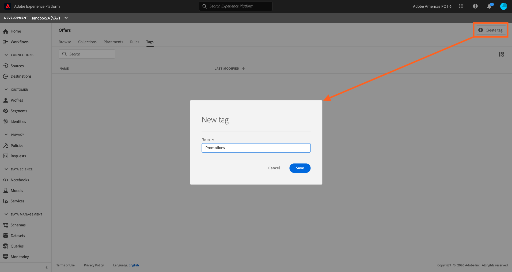
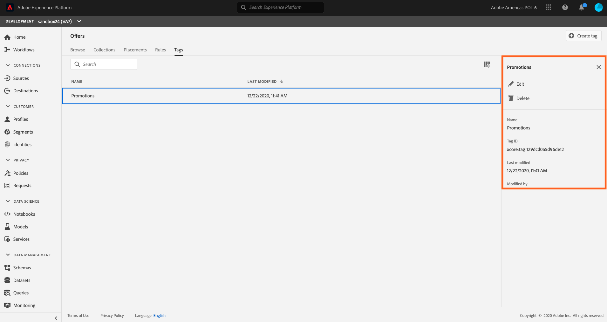

## Exercise 1 - Define a Tag

Associating Tags to your offers makes it easier to keep them organized. For example, you could label your Black Friday offers with the “Black Friday” tag. You can then use the search functionality in the Offer Library to easily locate all of the offers with that tag. Tags can also be used to group offers together into offer collections. 

Let’s create a Tag that we will use for our Lab today.

To create a Tag, follow these steps:

1.	Click on Tags within the Offers navigation.

    

2. Click on `Create Tag`.

    
    
3.	Specify the tag’s name (Promotion + your sandbox number. Ex: Promotion24), then click Save.

4.	Once the tag is created, it displays in the list, where you can select it to display its properties and edit or delete it. 

**Note:** You may need to refresh your browser.
*Please do not edit/delete existing tags as it may break the offers workflow built for demo purposes.*

    
 ---

Next Step: [Exercise 2 - Define a Placement](Exercise2-Placements.md)
