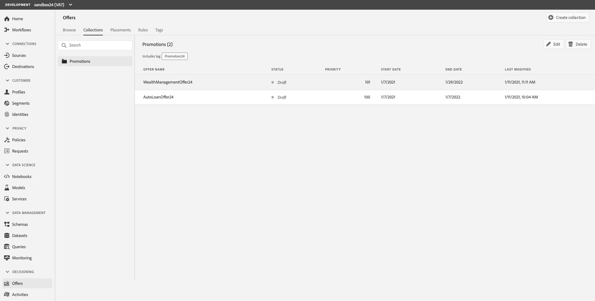

## Exercise 5 - Create a Collection

Collections allows you to organize your offers by regrouping them into categories of your choice. You can, for example, create a “sport” collection that will contain sport-related offers only.

You can create two types of collections:

Dynamic collections are collections of offers based on tags. These collections are updated automatically. For example, if a new offer is created with the selected tag, it will automatically be added to the collection.

Static collections are collections built by manually selecting individual offers to include in the Collection. The collection can only be updated my manually adding more offers to it.

For the purposes of the Lab, we will create a Dynamic collection.

Create a dynamic Collection

1.	Go to the Collections tab, then click `Create collection`

    
    
2.	Specify the name and type of collection to create.
3.	For the purposes of the lab, please use this naming convention. (“Promotion + your sandbox number.” Ex: “Promotions24”)
4.	Select `Create dynamic collection`
5.	Click, `Next`

    
    
6.	Using the left pane, search for the Tag titled “Promotion + your sandbox number. Ex. Promotion24.” Select the tag of the offers to add to the collection, then click `Save` 

    
    
7.	All the offers with the selected tag will be saved in the collection.

    
    
 ---

Next Step: [Exercise 7 - Create an Offer Activity](Exercise7-OfferActivity.md)
