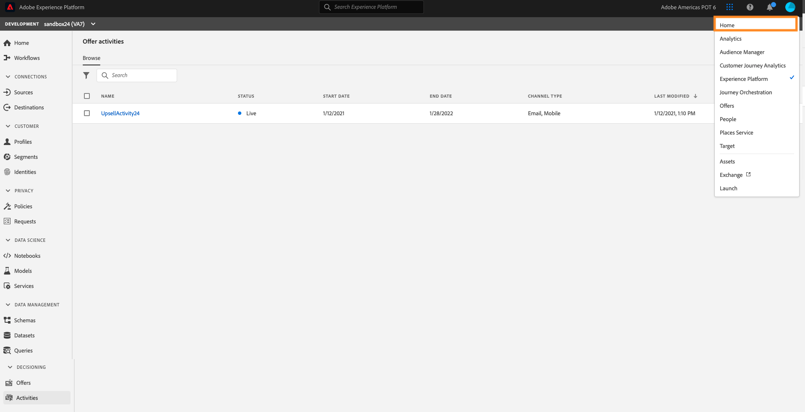
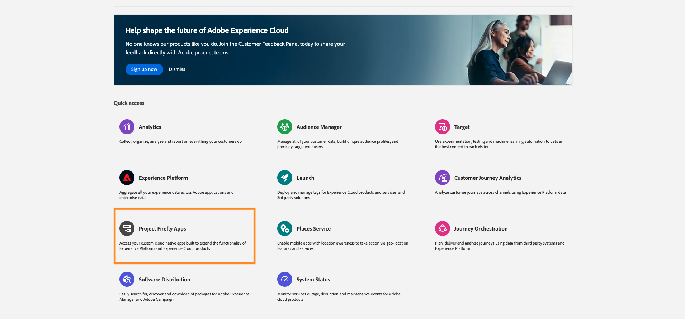
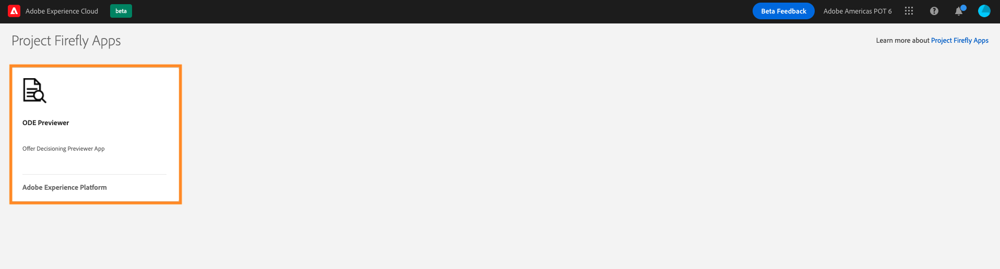
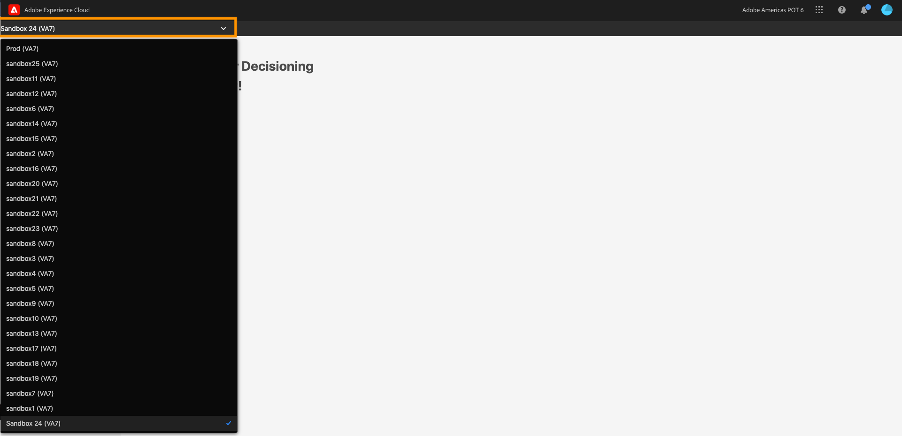
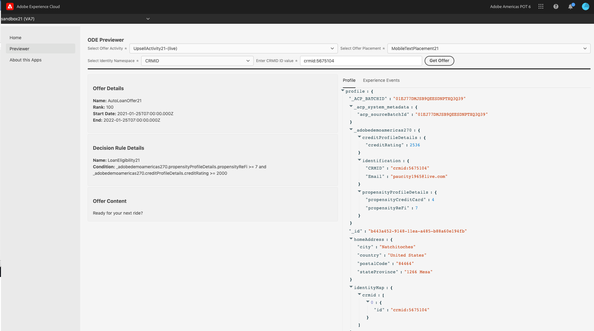
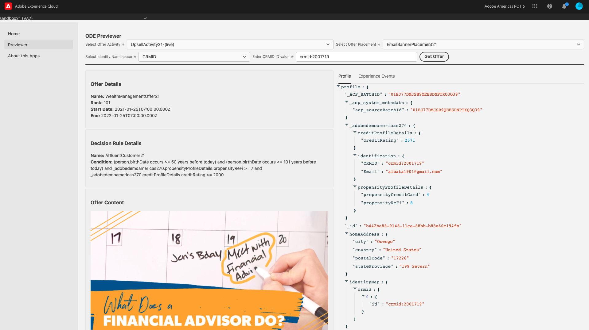
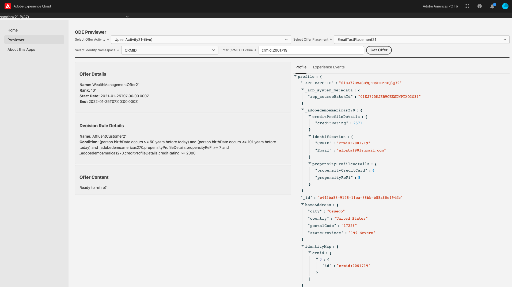
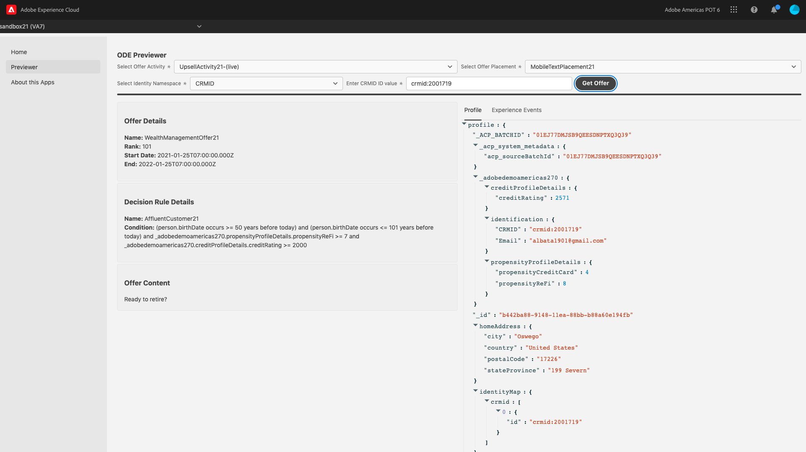

## Exercise 8 - Validate Your Offer

In this exercise, you'll validate that your offers are rendering the right content based on the placements and rules you have defined.

Before we get started, make sure your offers status is set to “Approved” and your activity status is “Live”

   

1.	Navigate to the 9-dot picker dropdown from the top right navigation and select `Home`

    

2.	Select `Project FireflyApps`
 
3.	Select the `ODE Previewer` in the left navigation

   

4.	From the dropdown in the top-left, select your assigned sandbox
 
   

5.	Select `Previewer` from the left navigation
6.	Select the activity you created from the dropdown
7.	Under the Select placement dropdown, select the “EmailBannerPlacement + your sandbox number.” For example: “EmailBannerPlacement24”
8.	Select Identity Name Space (CRMID)
9.	Enter the CRMID you were provided to qualify for an Auto Loan offer in the “Enter Profile ID” field. Make sure the “Dry Run” is toggled on, and then click `Get Offer`

   

11.	You should see the Auto Loan Banner offer you created along with the meta data and experience event details of the offer

   
   
Next, let’s confirm we can see the text and mobile offer.

1.	Select the “EmailTextPlacement + your sandbox number.” For example: “EmailTextPlacement24” from the “Select Placement” dropdown
2.	Click `Get Offer`
3.	Confirm you see the “Ready for your next ride?” message
 
   
 
4.	Select the “MobilelTextPlacement + your sandbox number.” For example: “EmailTextPlacement24” from the “Select Placement” dropdown
5.	Click `Get Offer`
6.	Confirm you see the “Ready for your next ride?” message

    

Let’s now test that we can get all versions of the Wealth Management offer

1.	Select the “EmailBannerPlacement + your sandbox number.” For example: “EmailBannerPlacement24” from the “Select Placement” dropdown
2.	Enter the CRMID you were provided to qualify for a Wealth Management offer in the “Enter Profile ID” field and then click `Get Offer`
3.	Confirm see the Wealth Management Banner offer you created
 
    
    
Let’s confirm we can see the text and mobile offer

1.	Select the “EmailTextPlacement + your sandbox number.” For example: “EmailTextPlacement24” from the “Select Placement” dropdown
2.	Click `Get Offer`
3.	Confirm you see the “Ready to retire?” message

    

4.	Select the “MobilelTextPlacement + your sandbox number.” For example: “EmailTextPlacement24” from the “Select Placement” dropdown
5.	Click `Get Offer`
6.	Confirm you see the “Ready to retire?” message

    
