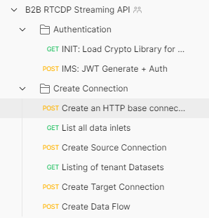
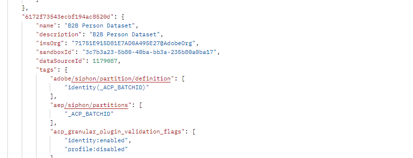
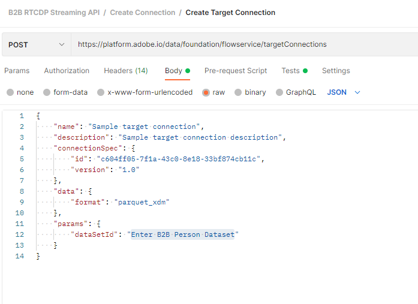
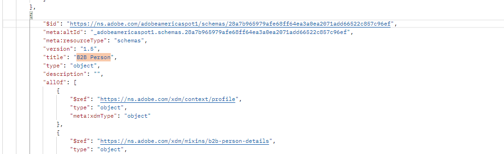
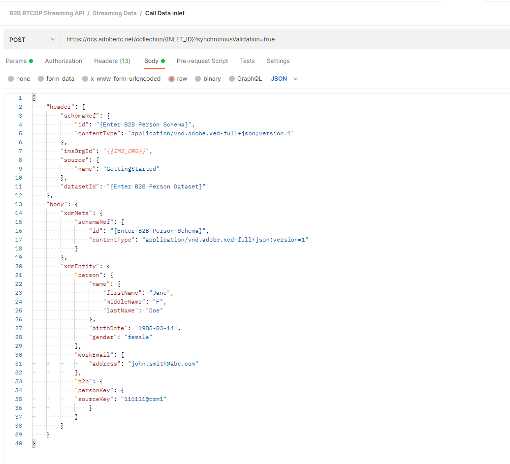
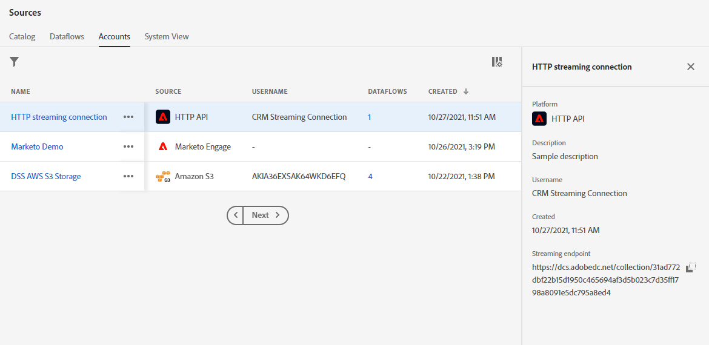

**B2B API Demonstration**
==========
Overview: Walk through how to set up a streaming data connection using APIs in POSTMAN. Stream a CRM profile record into the dataset. View the profile in the UI.

**Postman Workspace:** B2B RTCDP Streaming API

1)	Run 2 calls in order in Authentication folder to establish connection.

 

2)	Under ‘Create Connection’ folder, Run the ‘Create an HTTP base connection” and “Create Source Connection” calls. 
 
 

3)	Run the ‘Listing of Tenant Datasets’ call, find the dataset ID for the ‘B2B Person Dataset’, and copy it. 
 
 

4)	In the ‘Create Target Connection’ call, update the “dataSetId” to match the ID you copied in the previous step, and run the call.

 

5)	Run the ‘Create Data Flow’ call.

6)	In the ‘Streaming Data’ folder, run the ‘Listing of Tenant Schemas’ call, find the schema ID url for the “B2B Person” schema, and copy it. 

 

7)	In the ‘Call Data Inlet’ call, you’ll need to update the following in the body:

 

    * Inlet ID in the POST URL. You can find this from the UI under Sources > Accounts tab, clicking the ‘HTTP streaming connection’ record, and copying the ID at the end of the ‘Streaming endpoint’. 
    
   
    
    * Dataset ID from step 4.
    
    * Schema ID URL from step 6.
    
    * Person details to match the record you want to ingest.
 
8)	Send the ‘Call Data Inlet’ request. 

9)	Look up the profile in AEP using the ‘email’ value specified in step 7. (May take a minute or so to reflect in Profile).

