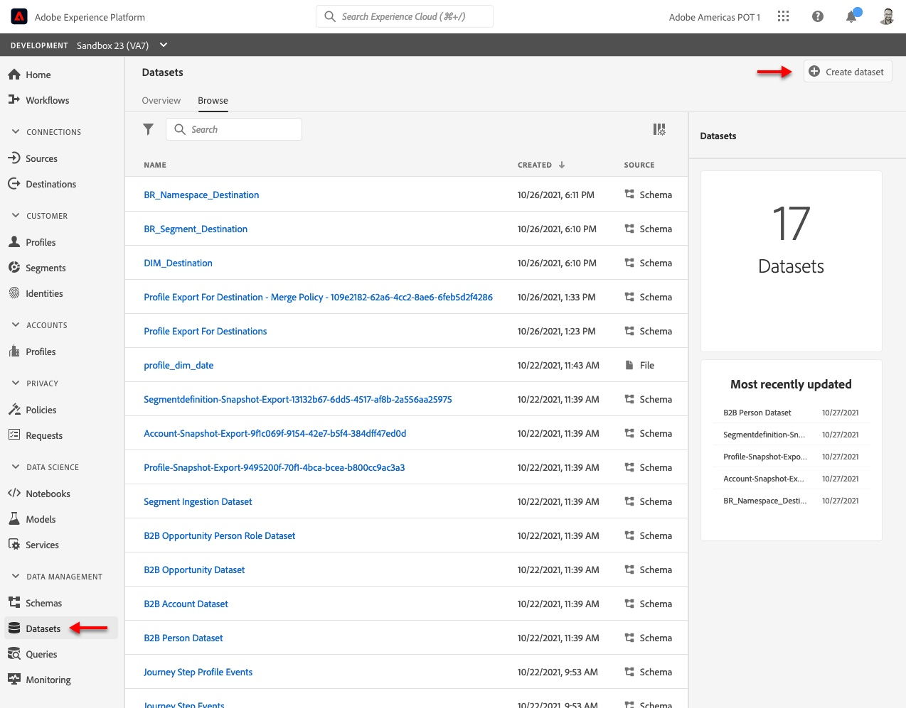
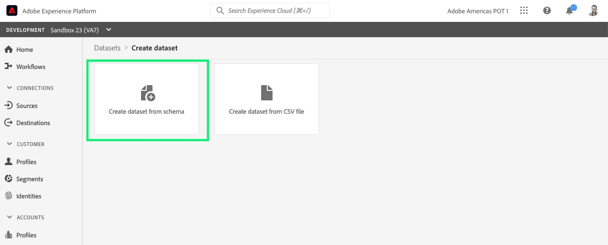
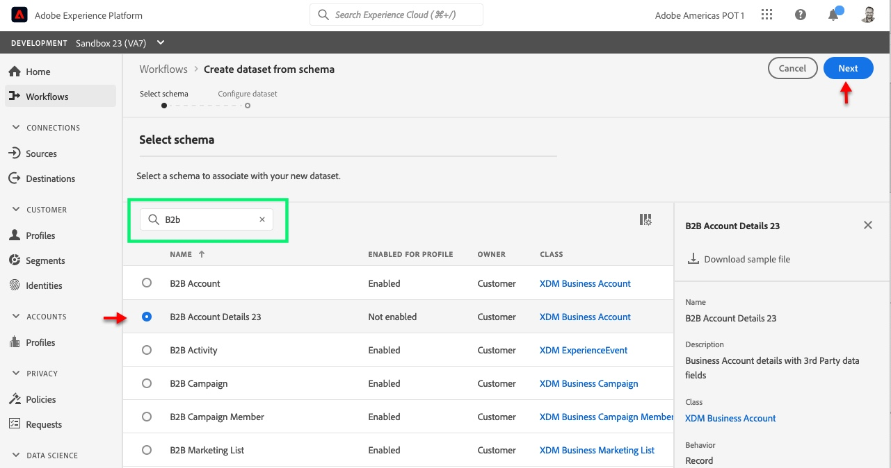
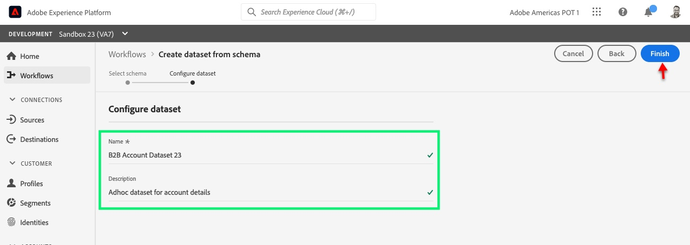
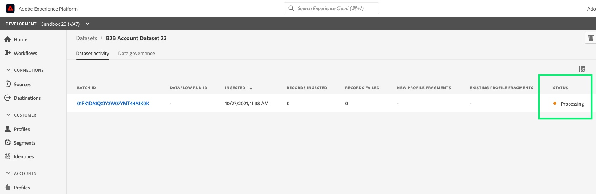
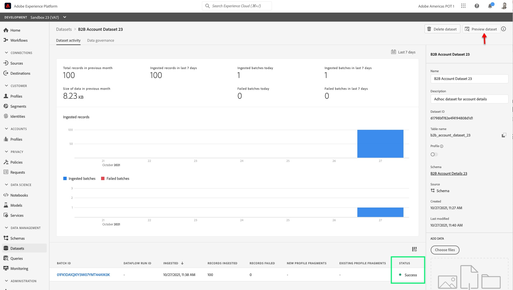

**Create a Dataset from Schema**
===========

**Objective** : Create a dataset for the newly created schema and upload data

**Prerequisites** :

- Built a B2B Account schema
- Exercise files

**Instructions** :

1. On the left-hand menu, navigate to **Datasets**
2. Click on **Create dataset** on the top right corner

3. From the options presented, select **Create dataset from schema**

4. Search for the schema name that you created in the previous Lab, select that schema and click **Next** on the top right corner

5. Fill in the following information about the dataset and click **Finish** to save and exit:
  - Name: _B2B Account Dataset <lab attendee number>_
  - Description: _Adhoc dataset for account details_

We have successfully created the dataset, but this dataset has not ingested data. We will now import a file into this dataset. This time we will import a JSON file and it will simply need to be dragged and dropped into the dataset.

6. On the right panel, scroll down until you see the **ADD DATA** section. Then either Choose files or simply drag and drop the downloaded lab file - [B2B_Account_Data_Lab2-1.json](.assets/B2B/B2B_Account_Data_Lab2-1.json)

You will now see a new row under Dataset activity with the status **Processing**

7. Adobe Experience Platform will perform the XDM mapping and conversion for JSON format to parquet and make this data available on the data lake and the profile store. This process usually only takes a couple minutes. Refresh the page.

Once your batch status is **Success** , you can preview the data by clicking the **Preview Dataset** button on the top right corner

**Congratulations!** You have successfully uploaded data to your schema
