**B2B Profile Exercise **
==========

Overview: Look up a profile, view associated account and opportunities. Traverse to account record, show opportunities and people related to account. 

1)	In the left navigation pane, select ‘Profiles’ under ‘Customer’
  
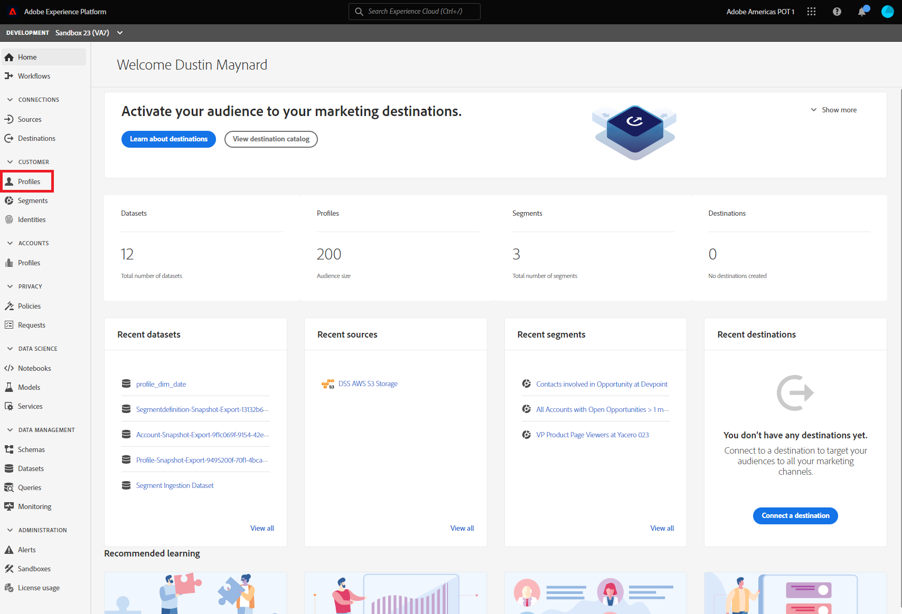

2)	Under the ‘Profiles’ heading, select the ‘Browse’ tab.
  
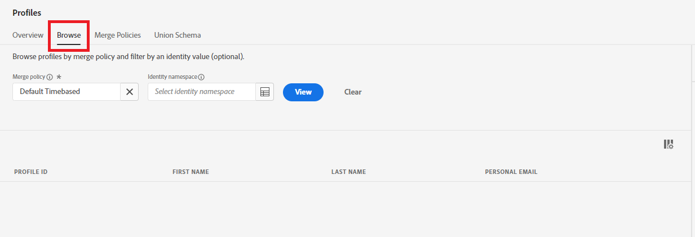

3)	Click the namespace selection button beside ‘Select Identity Namespace’
  
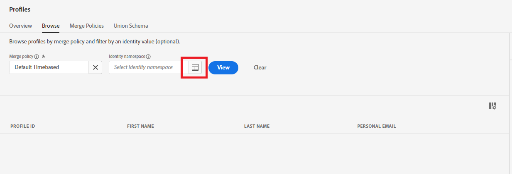

4)	In the identity namespace pop up, select ‘Email’ and then ‘Select’
  
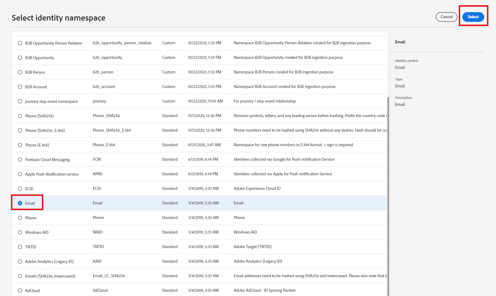

5)	In the ‘Identity Value’ box, paste cblunsen0@amazon.co.uk and select ‘View’
 
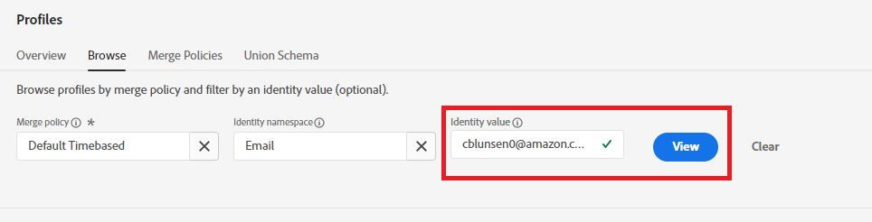
 
6)	Click on the ID value under ‘Profile ID’ to open the Profile Viewer.
  
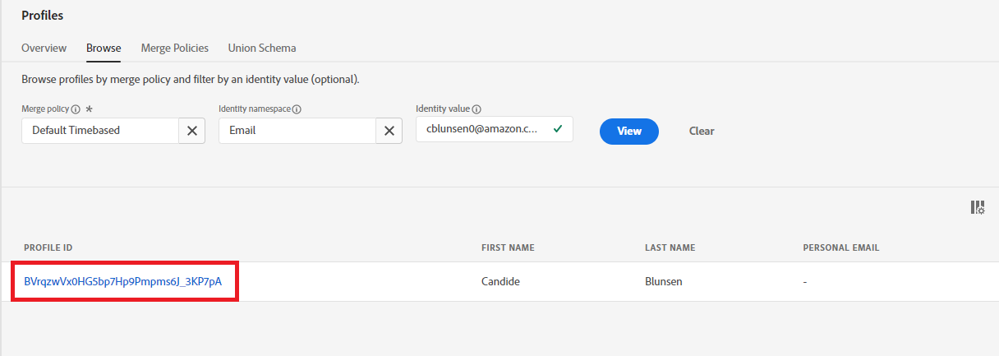

7)	In the Profile View, select the Attributes tab to view all attributes about the profile.
  
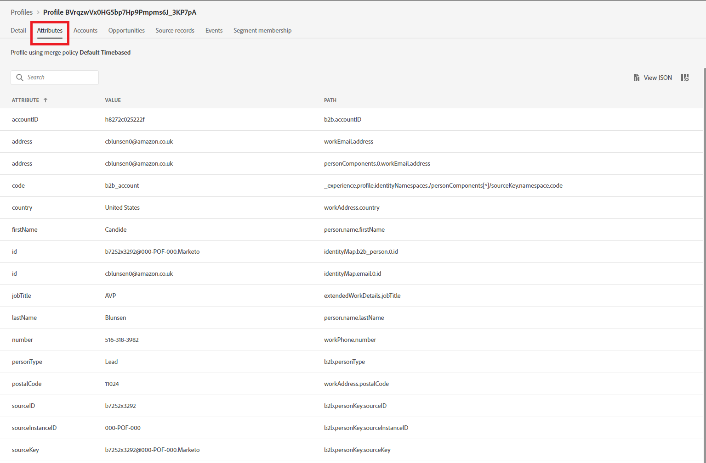

8)	Click the ‘Opportunities’ tab to view opportunities the profile is directly associated with. (This uses the Opportunity Person Relation schema)
  
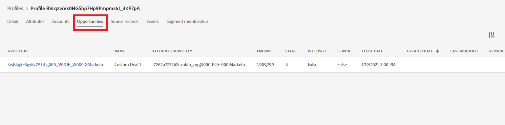

9)	Click the ‘Accounts’ tab to view accounts the profiles is associated with.
  

10)	Click the Profile ID for the Account to open the Account profile view.
  

11)	Select the ‘People ‘tab to view all people associated with the account.
  
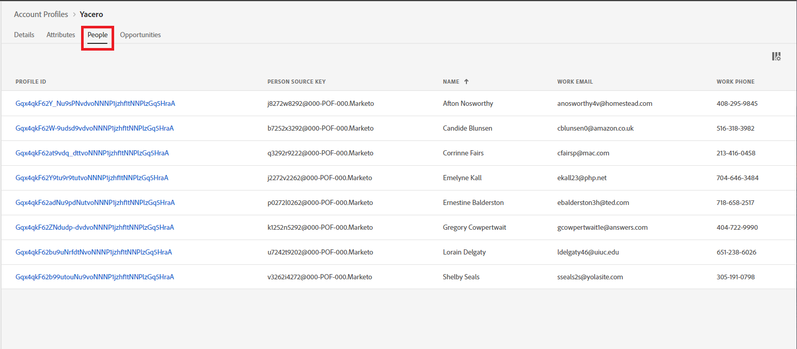

12)	Select the ‘Opportunities’ tab to view all opportunities associated with the account. 
  
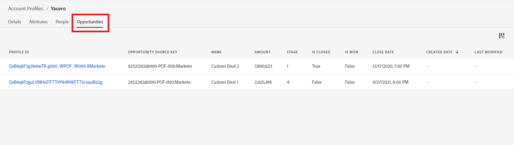

13)	Click an opportunity Profile ID to view an opportunity detail.
	
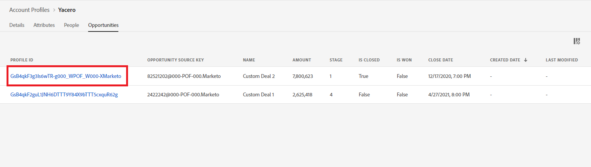

