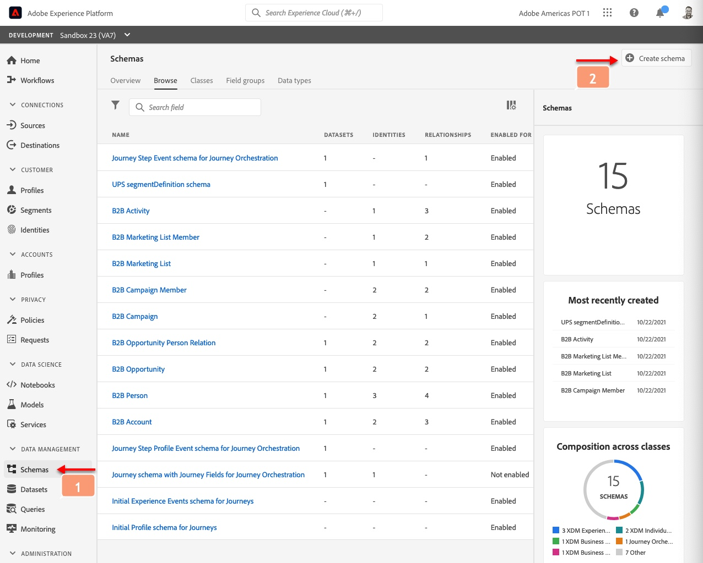
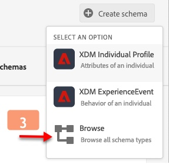
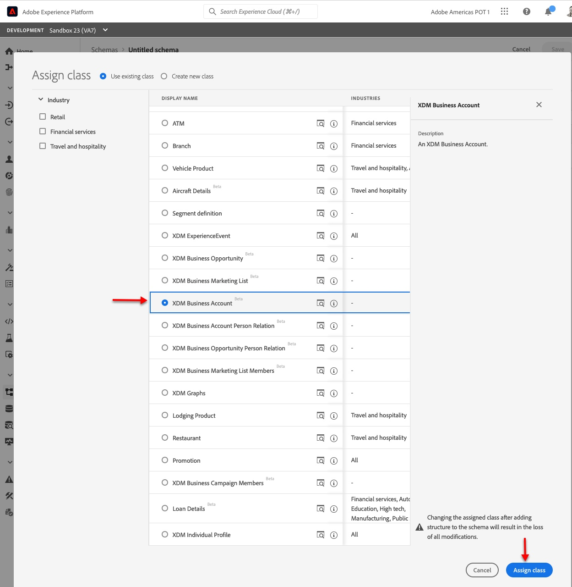
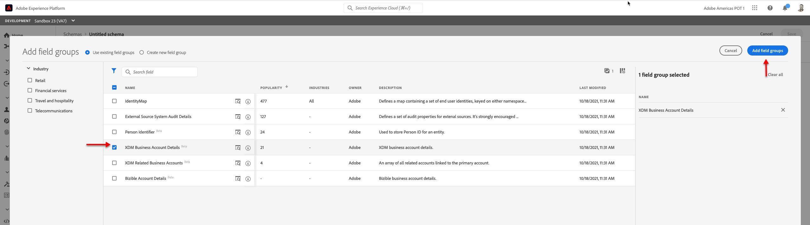
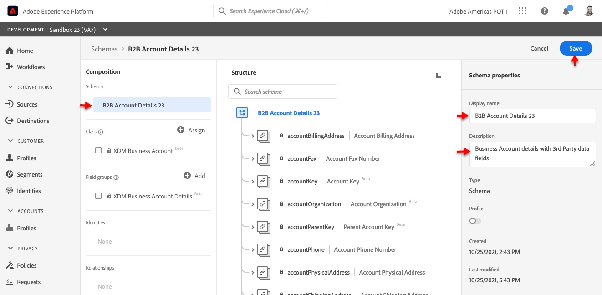
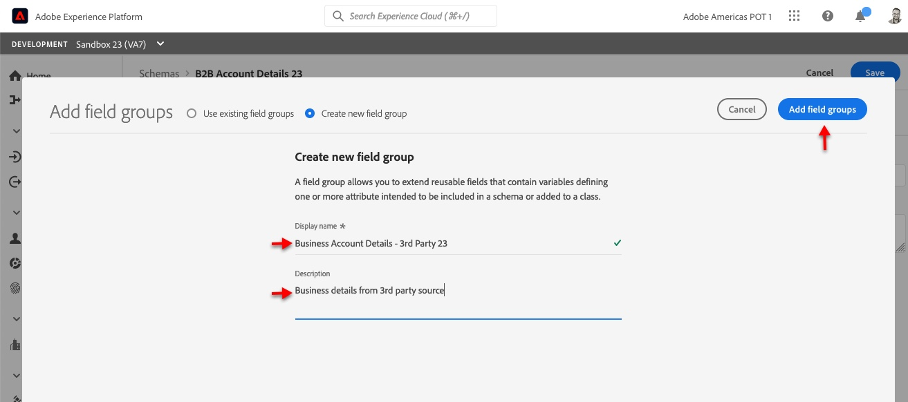
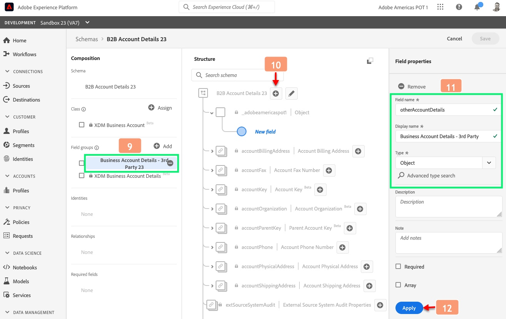
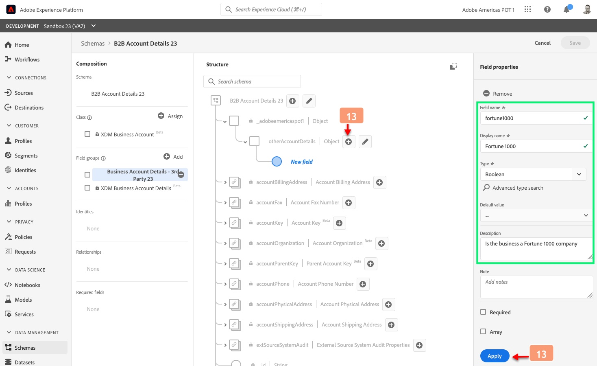
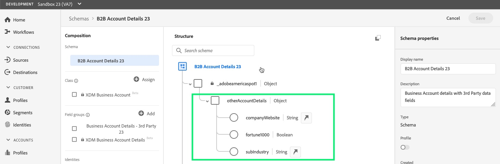

**Build a B2B Account schema**
==========

**Objective** : This lab will show you how to construct a new Business account schema.

**Prerequisites** : Access to your AEP sandbox

**Instructions** :

1. On the left-hand menu, navigate to **Schemas**
2. Click on **Create Schema** on the top right corner

3. Select **Browse** as the option:

4. From the options shown on the screen, select **XDM Business Account** and then select **Assign Class**

5. For this exercise, we will add two field groups:
  - **XDM Business Account Details** – This is a pre-built field group which describes a business account
  - **Business Account Details - 3rd Party** – This is a custom field group that will be created to ingest more information about the business which may have been sourced from a 3rd Party.
 
 On the next screen displayed, select **XDM Business Account Details** and then select **Add field groups** on top right:
 

6. Before we add the second field group, lets first save the schema built so far.
   Select "Untitled Schema" on top left under **Composition** and enter the **Display name** on the top right side of the screen. Use the following information

  - Display Name: _B2B Account Details <lab attendee number>_
  - Description: _Business Account details with 3rd Party data fields_

Click **Save** on the top right

7. Let's add the 2nd field group - **Business Account Details - 3rd Party**.

On left screen, under **Field groups,** click **Add** :

8. On the following screen, select **Create new field group** and then fill in the following details:
  - Display Name: _Business Account Details - 3rd Party <lab attendee number>_
  - Description: _Business details from 3rd party source_

Then exit by selecting "Add field groups"

9. On the left-hand schema **Composition** menu, click on your newly created Field Group (it should be highlighted now)
  
10. Notice that on the **Structure** view "+ Add Field" appears next to the schema name, click on it to start adding fields
  

11. In the **Field properties** panel on the right, add the following:
  - Field Name = _otherAccountDetails_
  - Display Name = _Business Account Details – 3rd Party_
  - Type = _Object_

12. Click **Apply** to save the information.

13. Add new fields under the new &quot;otherAccountDetails&quot; by selecting  button next to &quot;otherAccountDetails&quot;and fill in the details and then click **Apply** :
  - Field Name = _fortune1000_
  - Display Name = _Is Fortune 1000_
  - Type = _Object_

14. Repeat the process for two more field, as following:

| Field name | Display name | Type | Description |
| --- | --- | --- | --- |
| **companyWebsite** | Company Website | String | Website of the company |
| **subIndustry** | Sub-Industry | String | Sub category of the industry type |

15. The final field group should look like below

16. Save the entire schema by clicking on **Save** button on the top right corner.

**Congratulations**! You have created your first B2B Schema!!
