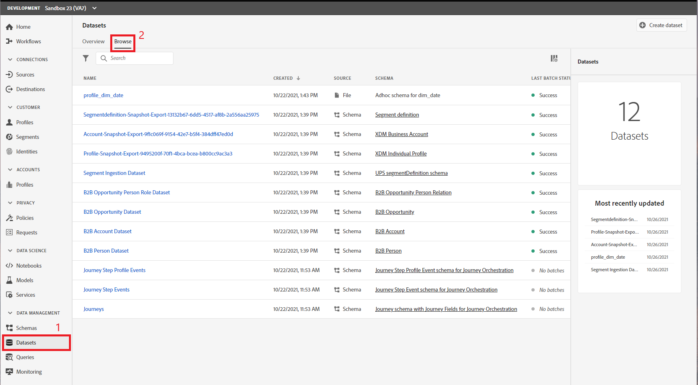
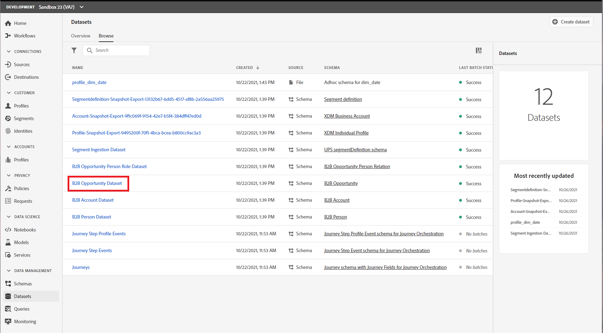
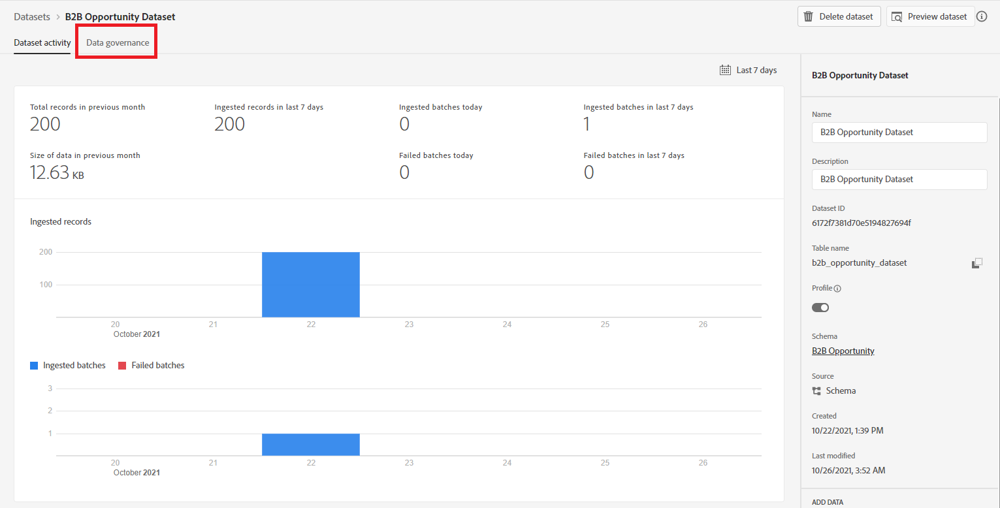
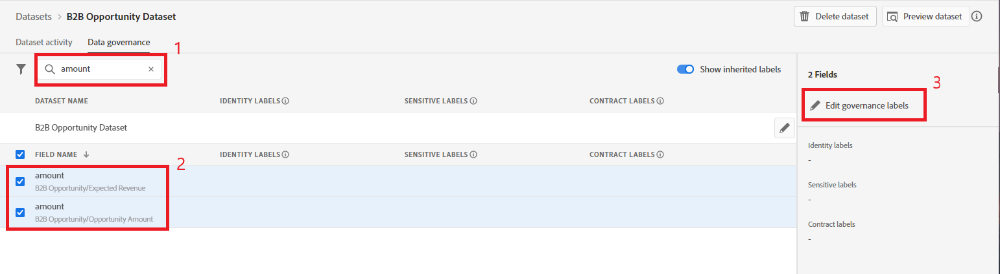
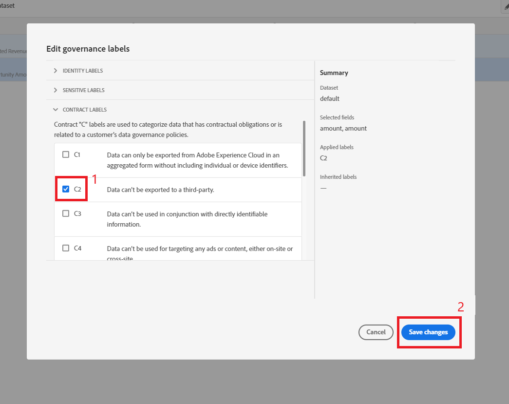
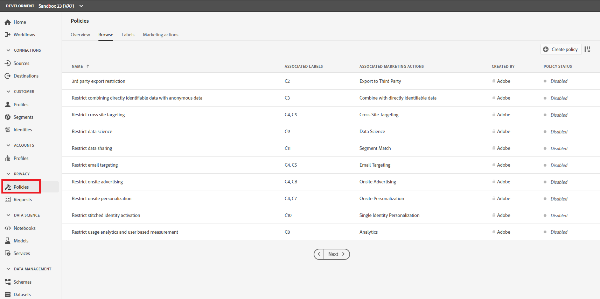
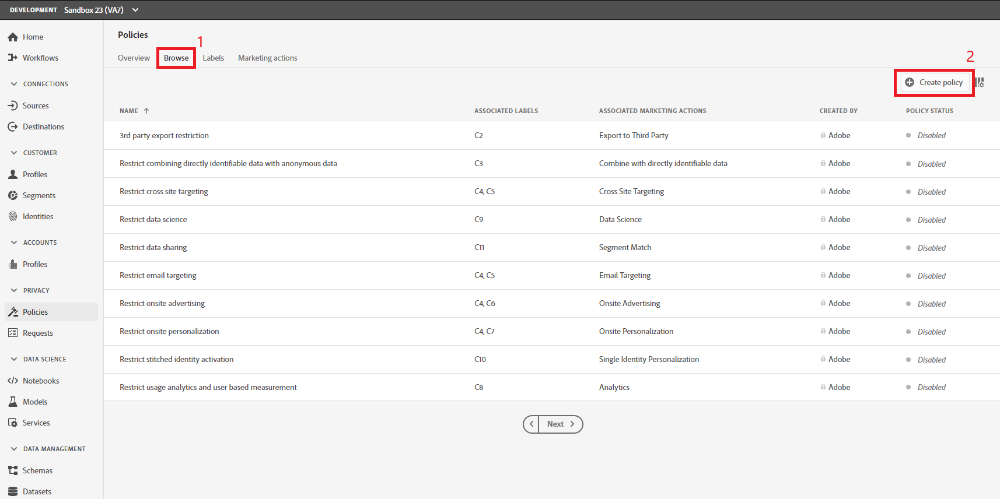
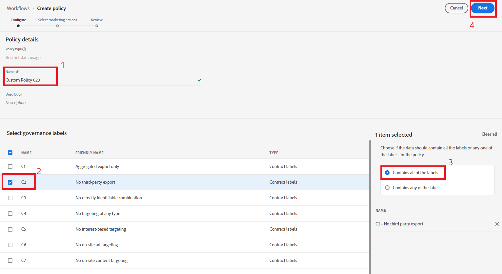
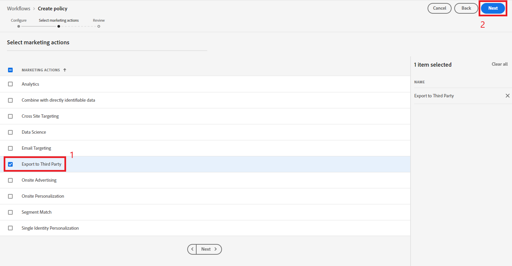
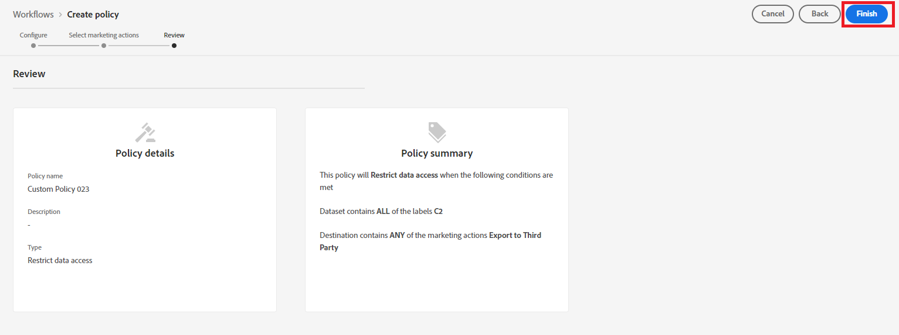

**B2B DULE Exercise**
==========

Overview: Assign data governance label to data attributes in opportunity dataset such as opportunity amount and deal information. The use case is to prevent sensitive opportunity data from going out to destinations. 

1)	In the left navigation, select ‘Datasets’. Verify you are in the ‘Browse’ tab.
 
 
 
2)	Click on the dataset named “B2B Opportunity Dataset”.
  
 
 
3)	In the dataset viewer, select the ‘Data Governance’ tab.
  
 
 
4)	In the Field search box, type “amount” and select the check box beside both “amount” fields (Expected Revenue and Opportunity Amount). Click ‘Edit governance labels’ in the top right dialog.
  
 
 
5)	In the ‘Edit governance labels’ pop up, expand ‘Contract Labels’. Select the check box beside ‘C2’ and click the ‘Save changes’ button.
  
 
 
6)	Now that we have labeled our data, we need to create a Policy. On the left hand menu, navigate to ‘Policies’ under ‘Privacy’.  
 
 
 
7)	Under the ‘Browse’ tab, select ‘Create policy’.
 
  
 
8)	In the ‘Create Policy’ workflow, enter name “Custom Policy [attendee id]”. Under ‘Select governance labels’, select ‘C2’. On the right side, make sure ‘Contains all of the labels’ radio button is selected. Click ‘Next’ in the top right.
  
 
 
9)	Select ‘Export to Third Party’ and click the ‘Next’ button in the top right corner.
  
 
 
10)	Review the policy and click ‘Finish’. 

 
