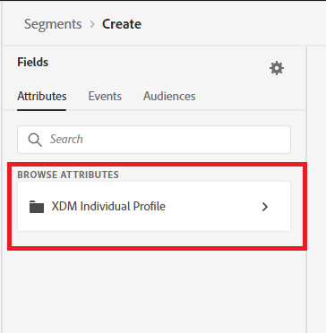
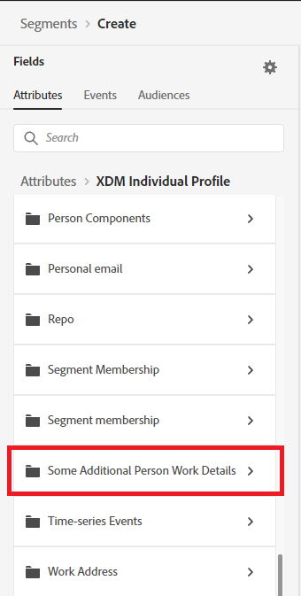
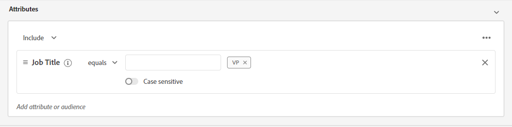
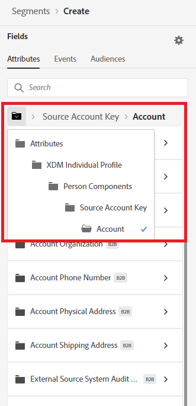
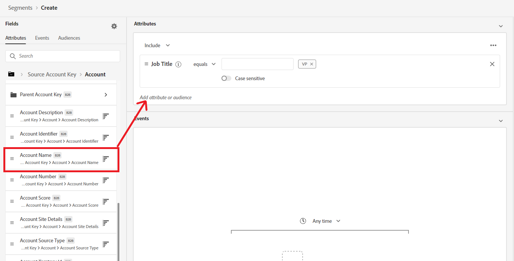
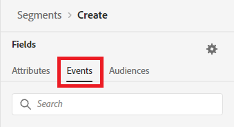
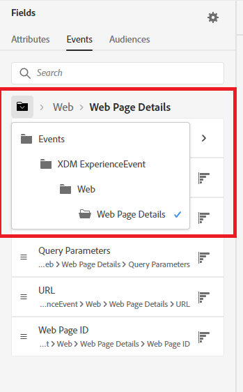
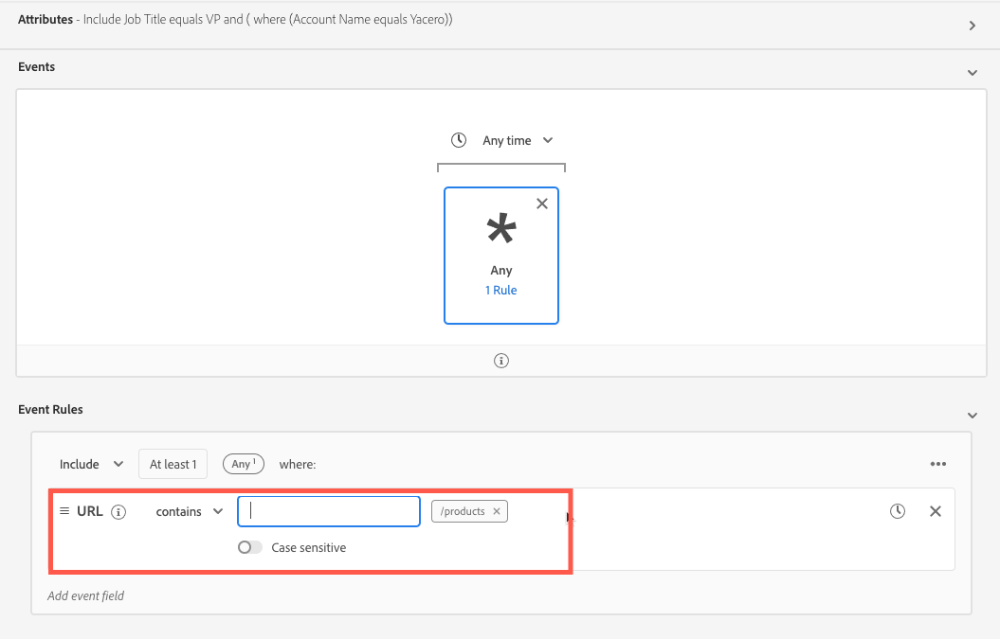

**B2B Segmentation Exercise 1**
==========
Exercise 1 - Create a segment for all contacts who have a position of "VP" who work at account "Yacero" and have visited the products webpage in the past 10 days.

1)	Navigate to Segment Builder in the left navigation

2)	Click ‘Create segment’ on the top right.

 
3)	Click the gear icon to the right of Fields in the left pane

 
4)	Verify ‘Show full XDM schema’ is selected, and if not, select it. Click on the gear icon again to hide the setting.

 
5)	Select ‘Attributes’ under Fields

 
6)	 Click on ‘XDM Individual Profile’ under Browse Classes

 
7)	Click on ‘Some Additional Person Work Details’ 

 
8)	Drag the ‘Job Title’ field over to the Segment canvas

 
9)	In the text box to the right of ‘equals’, type “VP” and press Enter to add the value to the list.

 
10)	In the left pane, click ‘XDM Individual Profile’ to navigate back to the top level of the class.

 
11)	Now, drill down into the folder structure to get to Account level details by selecting ‘Person Components > Source Account Key > Account’. 

 
12)	Drag the ‘Account Name’ field over to the Attributes section of the canvas, where it says ‘Add attribute or audience’.

 
13)	In the text box to the right of ‘equals’, type “Yacero” and press Enter to add the value to the list.

 
14)	In the left pane, click ‘Events’ under Fields.

 
15)	Click ‘XDM Experience Event’ under Browse Classes

 
16)	Drill down into the folder structure to get to Web Details by selecting ‘Web > Web Page Details’.

 
17)	Drag the ‘URL’ field over to the Events section of the canvas.

 
18)	Change the operator to "contains", and in the text box to the right, type “/products” and hit Enter.

 
19)	At the top of the ‘Events’ canvas, update the time value to ‘In Last 7 Days’

 
20)	Enter the segment name “VP Product Page Viewers at Yacero” followed by your lab attendee number. (Ex – “VP Product Page Viewers at Yacero 014”). 

 
21)	Click ‘Save’ in the top right to save the segment.

 
