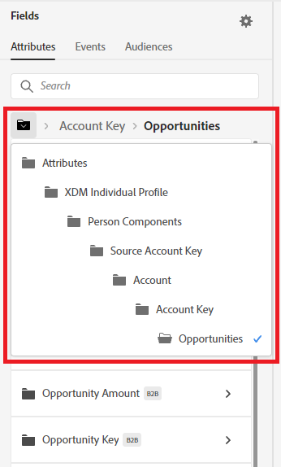
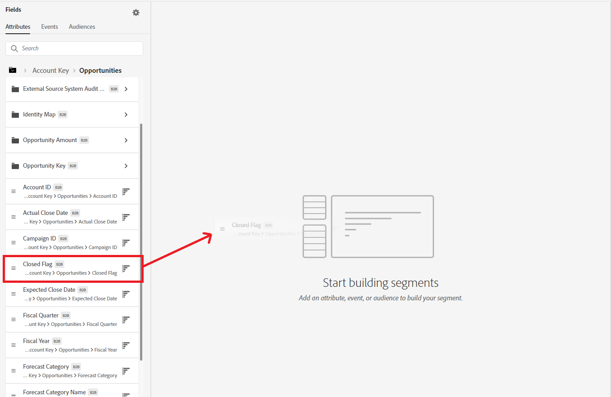
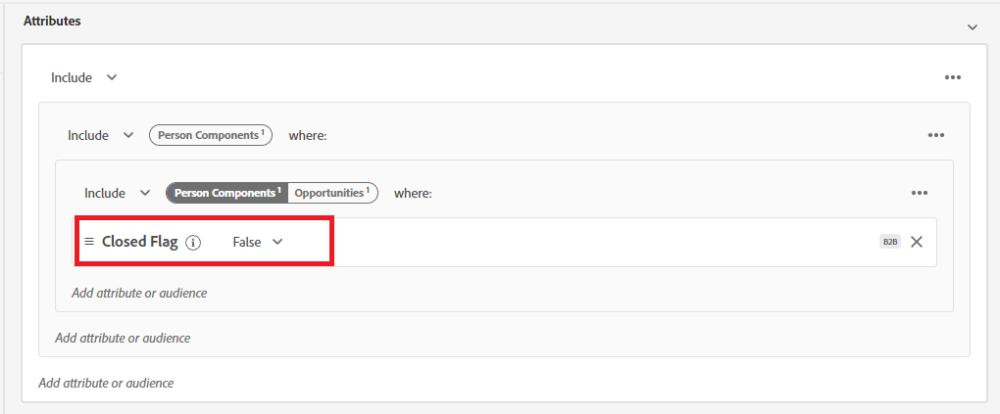
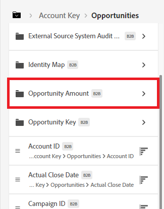
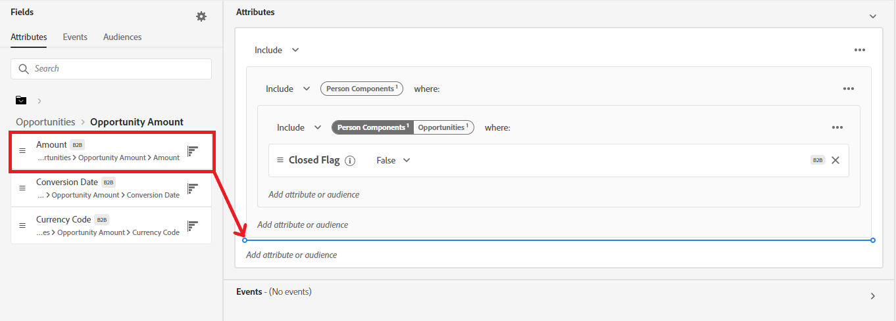
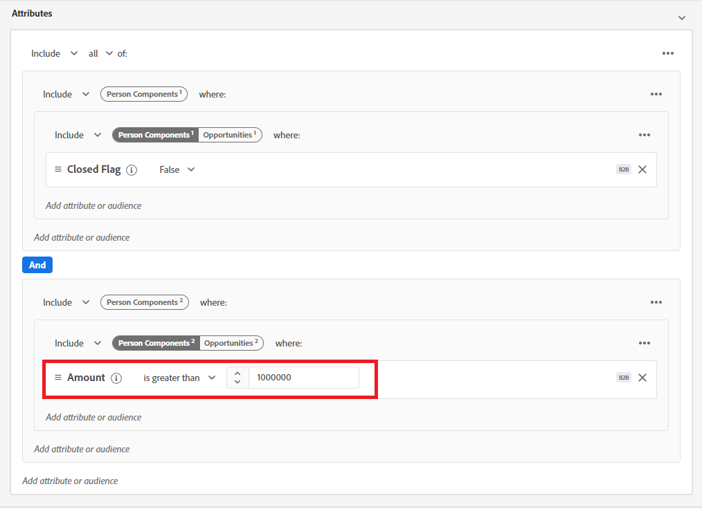
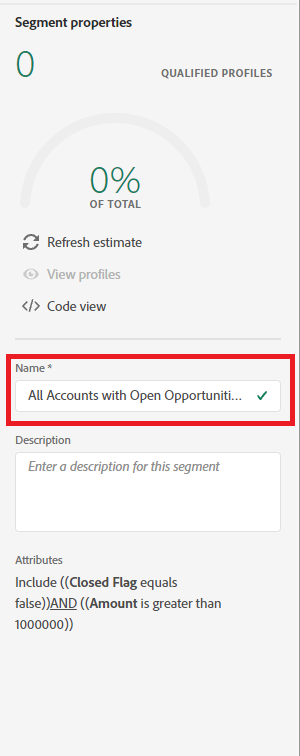

**B2B Segmentation Exercise 2**
==========
Overview: Create a segment for all contacts who work for any company that has an open opportunity with value of > 1 mil (Uses person to account to oppty) 

1)	Navigate to Segments in the left navigation and select ‘Create Segment’ in the top right.
 

2)	Click the gear icon to the right of Fields in the left pane and verify ‘Show full XDM schema’ is selected.
  

3)	Click the gear icon again to hide the setting.
 

4)	In the left pane, select ‘Attributes’ under Fields.
 

 
5)	Click on ‘XDM Individual Profile’ under Browse Attributes. 
  

6)	In the left pane, drill down through the folder structure to ‘Person Components > Source Account Key > Account > Account Key > Opportunities’. This is accessing all opportunities associated with an account.
 

7)	Drag the ‘Closed Flag’ field over to the segment canvas.
  

8)	To the right of ‘Closed Flag’ in the segment canvas, select ‘False’.
  

9)	In the left pane, select the ‘Opportunity Amount’ folder. 
  

10)	Drag the ‘Amount’ field over to the segment canvas underneath the gray ‘Closed Flag’ containers where it says ‘Add attribute or audience’.
  

11)	To the right of the ‘Amount’ field, change the operator to ‘is greater than’ and enter an amount of 1,000,000.
  

12)	Name your segment “All Accounts with Open Opportunities > 1 million” followed by your lab attendee number. (Ex – “Accounts with Open Opportunities > 1 million 014”)
  

13)	Save the Segment by clicking Save in the top right
  

