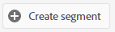
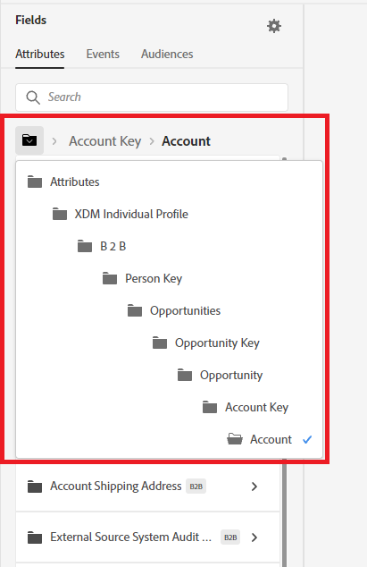
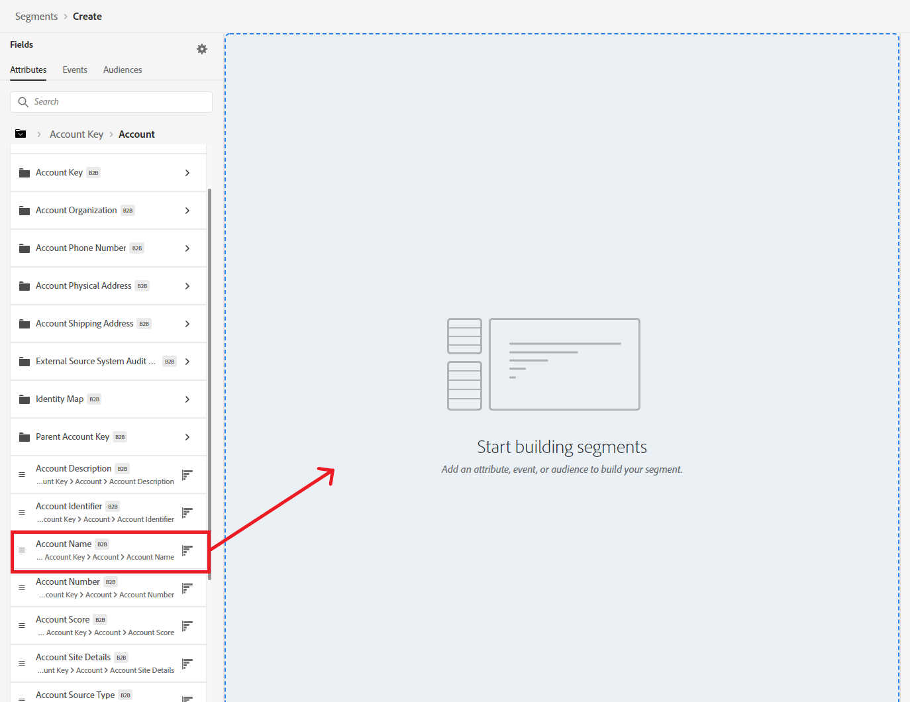
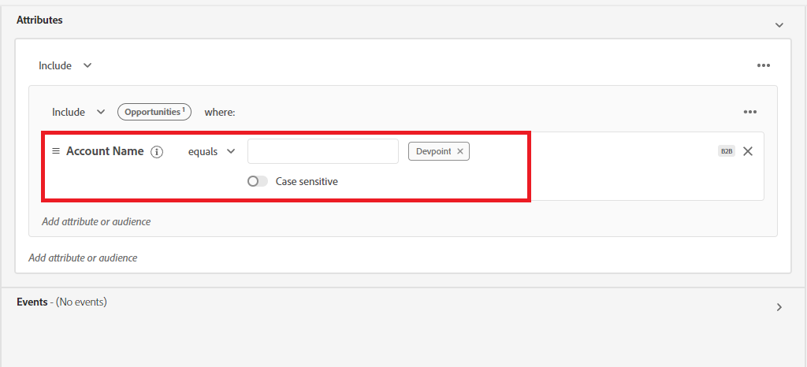
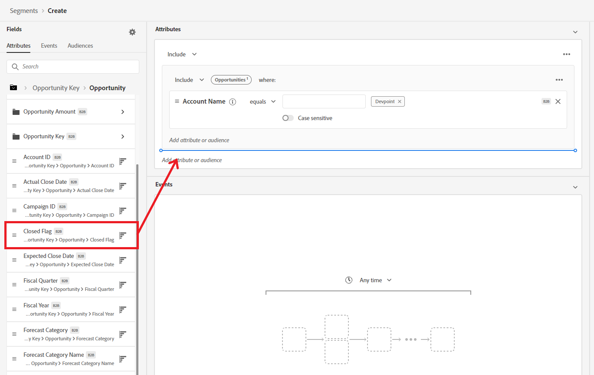
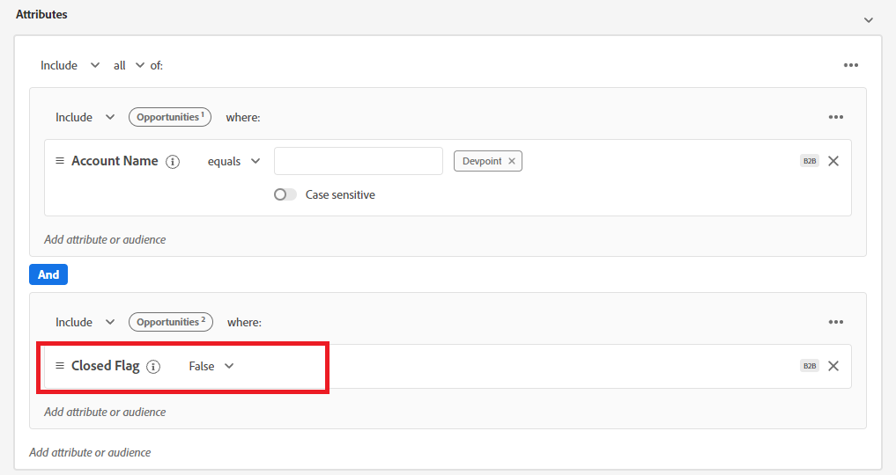
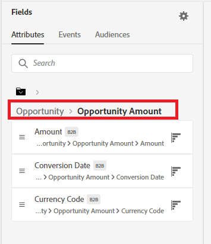
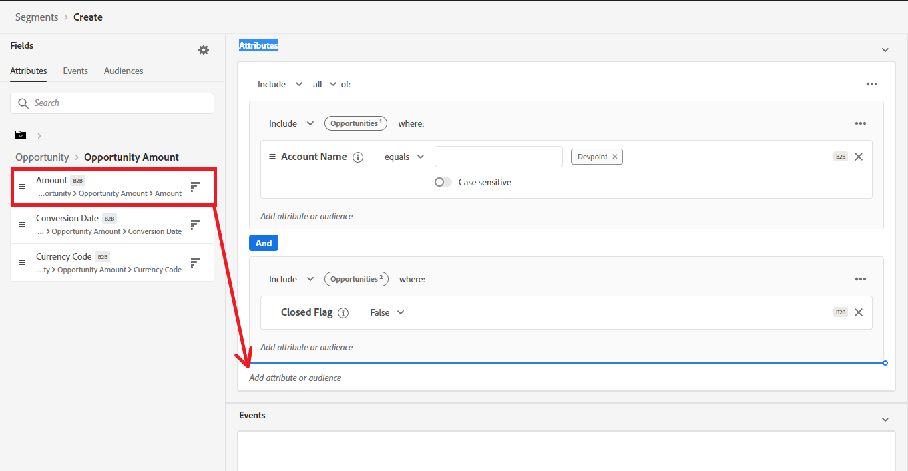
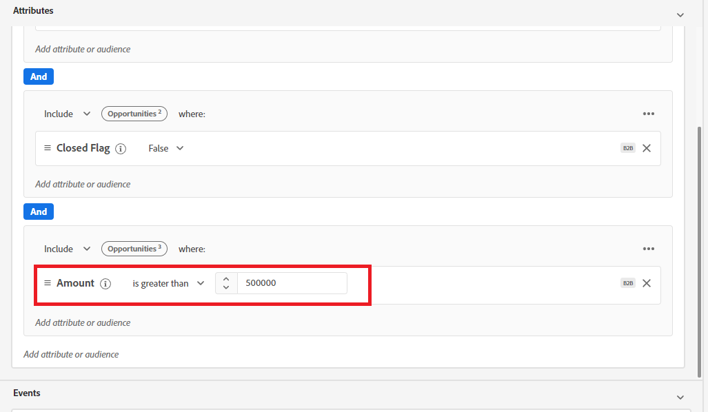
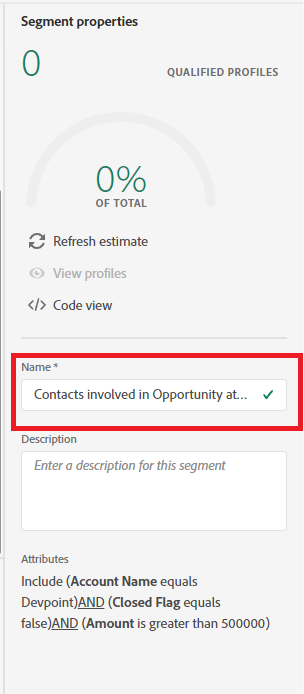

**B2B Segmentation Exercise 3**
==========
Overview: Create a segment of all contacts who are directly involved on an opportunity at account "Devpoint" with an opportunity value > 500k  (Uses Opportunity Person Relation) 

1)	Navigate to Segments in the left navigation and select ‘Create Segment’ in the top right.
  

2)	Click the gear icon to the right of Fields in the left pane and verify ‘Show full XDM schema’ is selected.
   

3)	Click the gear icon again to hide the setting.
  

4)	In the left pane, select ‘Attributes’ under Fields.
   

5)	Click on ‘XDM Individual Profile’ under Browse Attributes. 
   

6)	In the left pane, drill down through the folder structure to ‘B2B > Person Key > Opportunities > Opportunity Key > Opportunity > Account Key > Account’. This is accessing only opportunities that are directly associated with contacts, then traversing to account details. 
  

 
7)	Drag the ‘Account Name’ field on to the segment canvas.
  

 
8)	In the text box to the right of ‘equals’, type “Devpoint” and press Enter.
  

 
9)	In the folder tree on the left, back up 2 levels to ‘B2B > Person Key > Opportunities > Opportunity Key > Opportunity’.
  

 
10)	Drag the ‘Closed Flag’ field over to the segment canvas underneath the gray ‘Account Name’ containers where it says ‘Add attribute or audience’. 
  

11)	To the right of ‘Closed Flag’ in the segment canvas, select ‘False’.
  

 
12)	In the folder tree on the left, select the ‘Opportunity Amount’ folder. 
  

 
13)	Drag the ‘Amount’ field over to the segment canvas underneath the gray ‘Closed Flag’ containers where it says ‘Add attribute or audience’.
  

 
14)	To the right of the ‘Amount’ field, change the operator to ‘is greater than’ and enter an amount of  500,000.
  

 
15)	Name your segment ‘Contacts involved in Opportunity at Devpoint’ followed by your lab attendee number. (Ex - Contacts involved in Opportunity at Devpoint 023)
  

 
16)	Save the Segment by clicking Save in the top right
  
 

