B2P Hybrid Segment Exercise
=================
Synopsis: Create a hybrid segment including profiles who have an active personal savings account and work for account Yacero.

1)	From the Segments section, select the Browse tab, and click the ‘Create Segment’ button in the top right.  

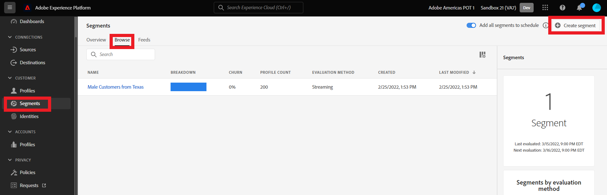

2)	Click the gear icon to the right of Fields in the left pane.  

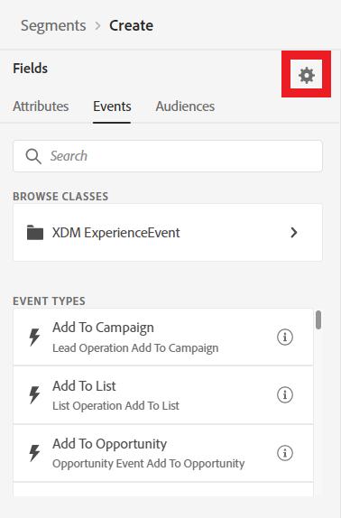

3)	Verify ‘Show full XDM schema’ is selected, and if not, select it. Click the gear icon again to hide the setting. 

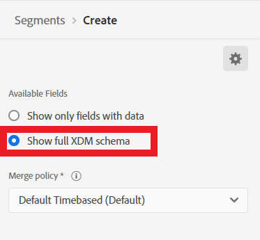

4)	First we’ll be looking for a savings account transaction within the last 60 days. Start by clicking on ‘Events’ under ‘Fields’, then click ‘XDM Experience Event’. 

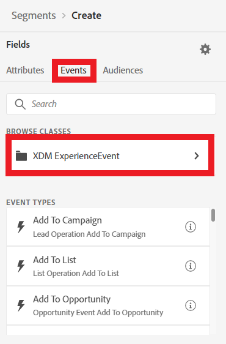

5)	Click on ‘Adobeamericaspot 1’ folder, then ‘transactionDetails’ folder, and drag ‘transactionName’ fields to the Events Canvas.  

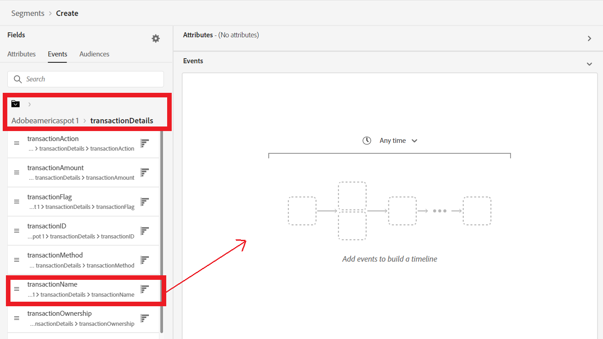

6)	In the text box under ‘Event Rules’, type ‘savings’ and hit Enter to add the value to the list.  

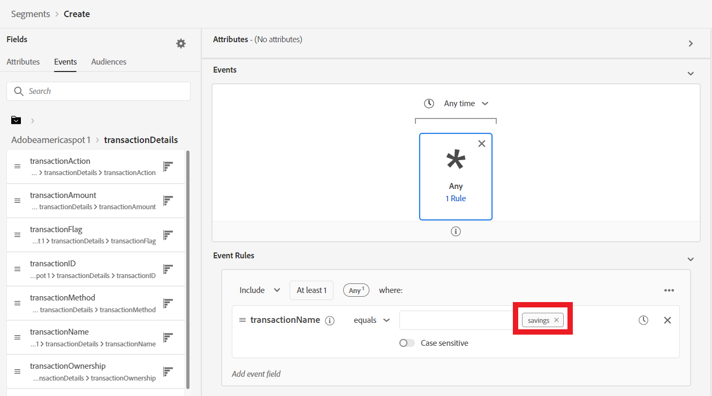

7)	In the ‘Events’ canvas select the ‘Any time’ time window selection, and select ‘Within (+/-)’. Change the days window to 60 days Before Today.  

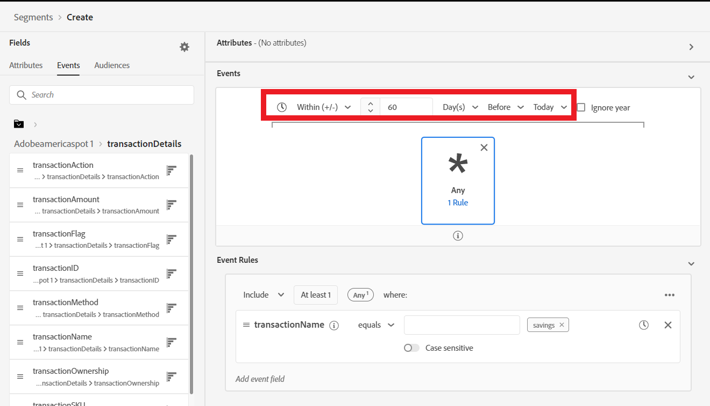

8)	Now we need to add in some B2B elements to this segment. Start by clicking the Attributes tab on the left pane.  

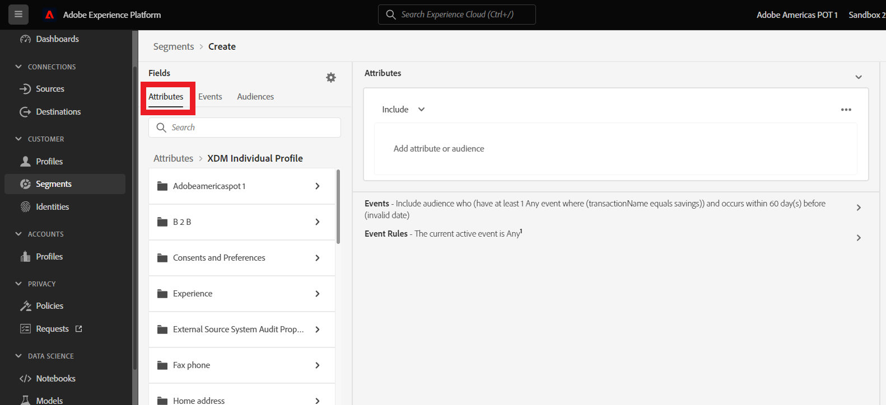

9)	In the folder tree, navigate to ‘XDM Individual Profile > Person Components > Source Account Key > Account’ to access the B2B Account fields.   

10)	Drag ‘Account Name’ field to the Attributes box in the Segment builder. 

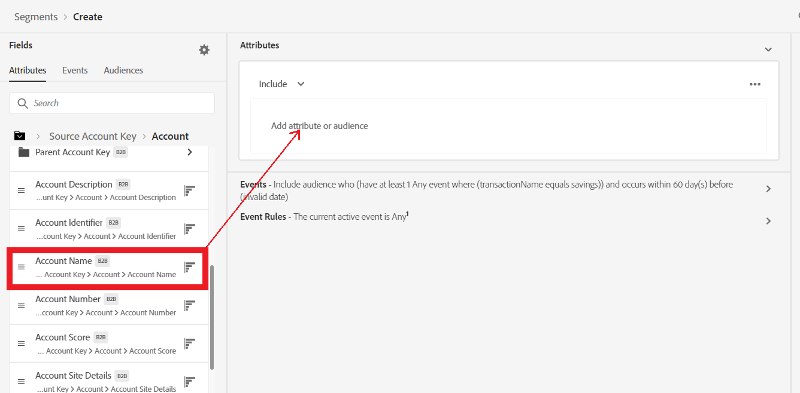

11)	In the text box beside ‘Account Name’, type ‘Yacero’ and hit enter to add it to the list.  

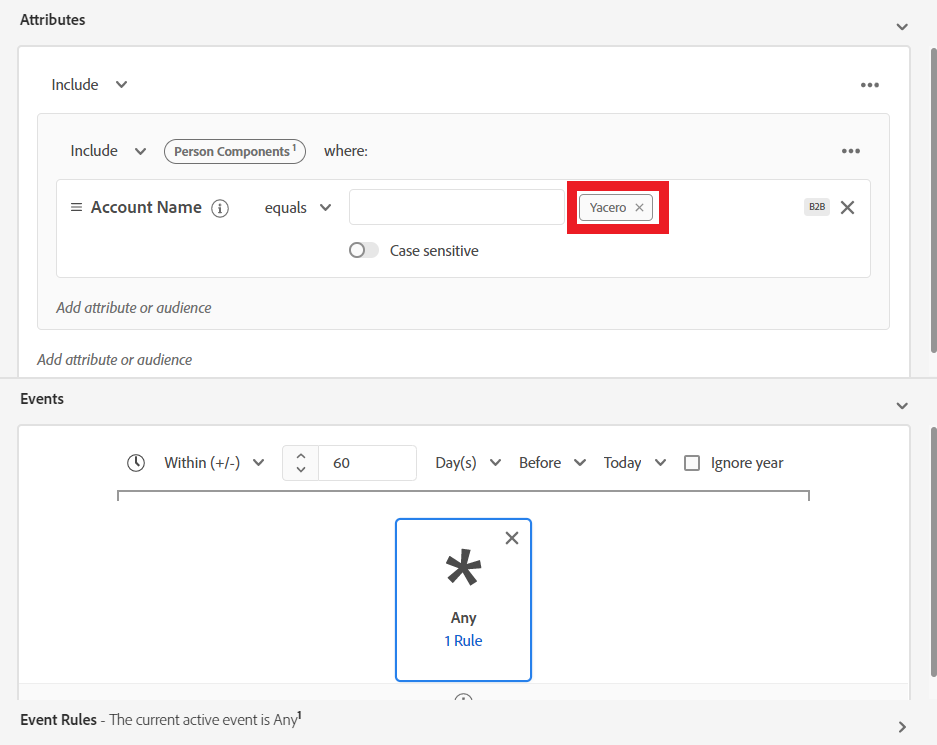

12)	In the Segment Properties window on the right side, name the segment ‘Active Savings Account who work at Yacero <sandbox#>’. Select ‘Save and Close’ to finish and save the segment. 

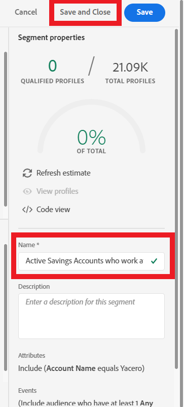
