Lab 2.1 - Construct a CJA Dashboard
==========
<table style="border-collapse: collapse; border: none;" class="tab" cellspacing="0" cellpadding="0">

<tr style="border: none;">

<td width="600" style="border: none;">
<table>
<tbody valign="top">
      <tr width="500">
            <td valign="top"><h3>Objective:</h3></td>
            <td valign="top"> This short lab will show you the how to create a dashboard from scratch
            </td>
     </tr>
     <tr width="500">
           <td valign="top"><h3>Prerequisites:</h3></td>
           <td valign="top"> 
                            <li>CJA Connection + Data View in place
           </td>
     </tr>
</tbody>
</table>
</td>

<td style="border: none;" valign="top">

<table>
<tbody valign="top">
      <tr>
            <td valign="middle" height="70"><b>section</b></td>
            <td valign="middle" height="70"></td>
      </tr>
      <tr>
            <td valign="middle" height="70"><b>version</b></td>
            <td valign="middle" height="70">1.0.1</td>
      </tr>
      <tr>
            <td valign="middle" height="70"><b>date</b></td>
            <td valign="middle" height="70">2020-06-09</td>
      </tr>
</tbody>
</table>
</td>

</tr>
</table>

Accessing CJA:
-----------------

You first must be logged into the Experience Platform [https://experience.adobe.com/](https://experience.adobe.com/) to gain access to CJA

1.  Click on the 3x3 grid in the upper right-hand navigation

     <kbd></kdb>

2.  Then click on "Experience Cloud"

     <kbd></kdb>

3.  Once you've opened the main Experience Cloud product screen (for provisioned/deployed solutions),  click on the icon "Customer Journey Analytics" (it looks similar to the Adobe Analytics logo) 

     <kbd>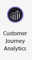</kdb>

**Excellent** -- Now you're ready to go...

**DISCLAIMER**
-----------------
 - These instructions are based off of the "FSI" dataset -- the labels/results might be different from what your industry/environment looks like today, that's fine
 - All instructions should work despite slight differences within the data
 - NOTE: I'm using Connection <here> and Data View <here?

Instructions:
-----------------

You will be creating a brand new CJA dashboard/project.  The focus of this project will be to explore the relationships between researched web products and customer calls that occured in the same session.

Please follow the instructions below

1. In the uppoer left-hand nav menu, navigate to "Projects" and choose "Create New Project"

      <kbd>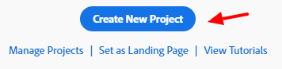</kdb>
      
      
2. This is a blank project.  On the left-hand side, please type/search for "prod" -- this is filtering into the all aspects of the Data View (Dimensions, Metrics, Filters and Date Ranges).

      <kbd></kdb>
      
      
3. Values should be populating below as you type but might be hard to see (with limitied pannel space).  The left-hand pannel can be expanded to make it more legiable -- please do this expansion now (drag to the right).

      <kbd>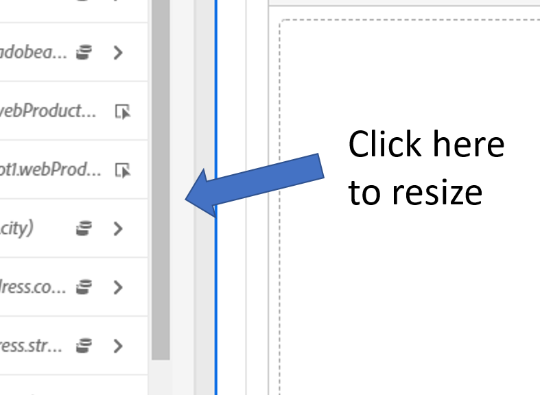</kdb>
 
 
4. While mousing over "Web Product Name" card, please click on the small (i) icon that appears.  This show you both the location of the data (with context to the schema) and a preview of the top contents (according to the timeframe conditions)
         
      <kbd>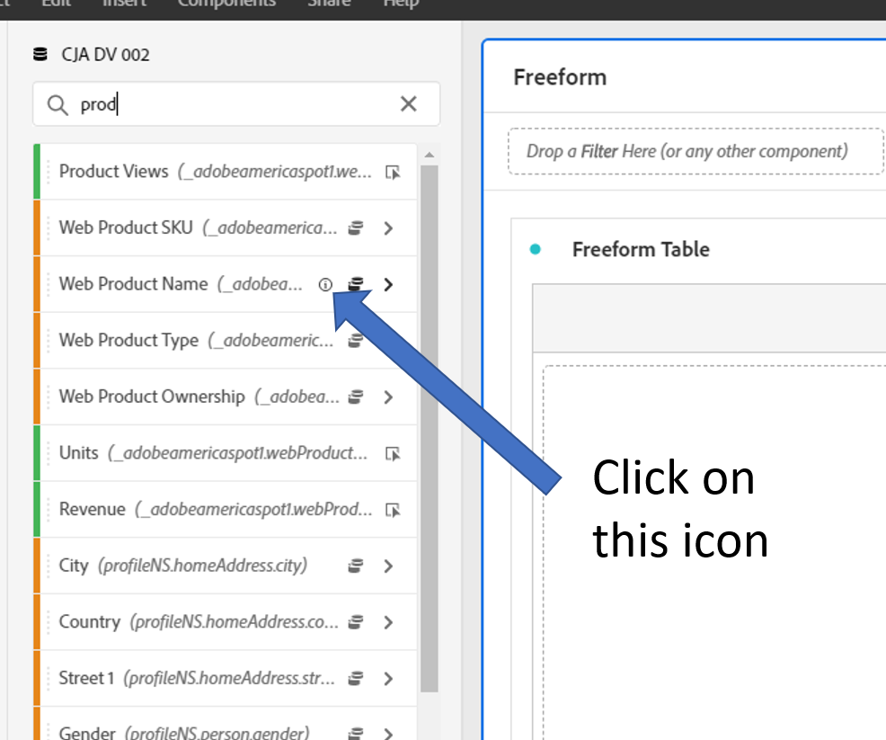</kdb>

   This results in...

      <kbd>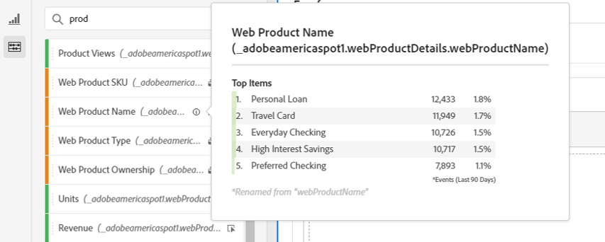</kdb>

5. Close the preview pop-up (click off it).  Left-click on the "Web Product Name" dimension box (these are the product pages that were seen on the website) and drag and drop to the "Freeform Table" area on the right-hand side (this is the Workspace or Project canvas).  DON'T be discouraged if nothing populates -- it's likely the timeframe you're currently using doesn't have data-- this is a aspect of the demo data since it's only a small chunk of time loaded into CJA
      
      
      <kbd></kdb>
 
 
6. On the right-hand side, locate the current timeframe (likely "This Month") left-click to change the time.  On the drop-down you can type "this year" or "year" and select the "This Year" option.  Your HOL instructor might give another timeframe as well. 
      
      
      <kbd></kdb>

      <kbd>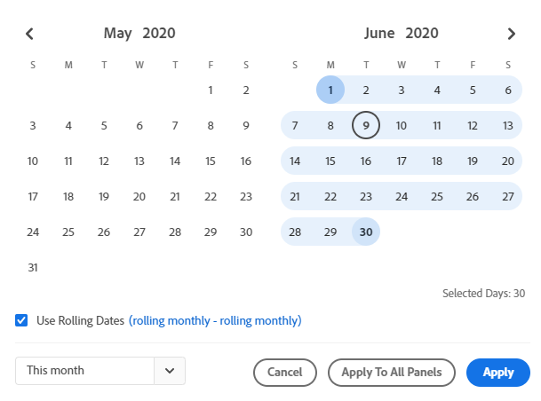</kdb>

7. Before we go further, lets resize the Freeform Table so it's not stretched across the screen.  Follow the screenshots below as examples.

      <kbd>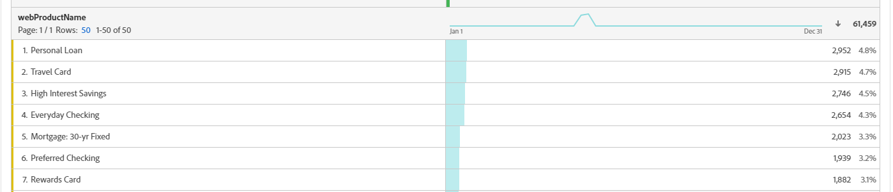</kdb>
      
      <kbd></kdb>

8. The data within "Web Product Name" should have populated with the metric of "Events" -- Events should be thoughts as "instances" of this value occuring.  Let's add some "Orders" to the canvas-- clear the prior search (click the "x" icon on the right-hand side of the search-box).  Now type "orders"

      <kbd>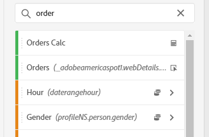</kdb>

      <kbd></kdb>

      <kbd>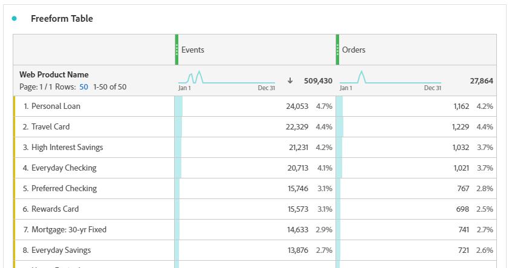</kdb>

9. Now add the "Calls" metric to the visualization

      <kbd></kdb>

   The reason we have zero calls attributed to web products is because the call records doesn't happen on the same hit/record as the web product row/record -- they happen at different times.  The default attribution (of any timeseries based metric) is going to be at the event level.  We'll apply Attribution IQ to this metric.
   
      <kbd>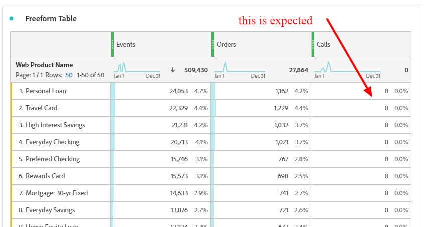</kdb>
    
    Below is an example web + call flow for a customer.  The blue timeline represents the web visit behaviors and the yellow is when they called into the call center.  Note: there needs to be some key that relates these 2 sources together so we can stitch both experiences together.  The call event (in the next instructions) will be related back to 'Product "A" Page'
    
      <kbd>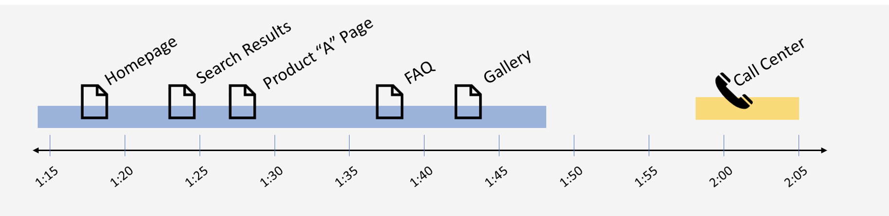</kdb>
       
10. We're now going to fix the Calls metric attribution so it relates back into product names -- with your mouse, hover over the top of the Calls metric column and click on the gear icon

      <kbd></kdb>

12. Steps below....

      <kbd></kdb>

      <kbd>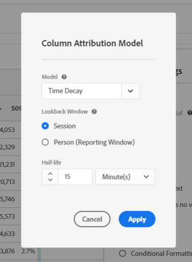</kdb>
      
      <kbd></kdb>
      
      
13. Congratulations !!! you are done with the Dataset exercise.

 
 
 

Return to [Lab Agenda Directory](https://github.com/adobe/AEP-Hands-on-Labs/blob/master/labs/fsi/README.md#lab-agenda)

