Lab  - Build a CJA Dashboard
==========
<table style="border-collapse: collapse; border: none;" class="tab" cellspacing="0" cellpadding="0">

<tr style="border: none;">

<td width="600" style="border: none;">
<table>
<tbody valign="top">
      <tr width="500">
            <td valign="top"><h3>Objective:</h3></td>
            <td valign="top"> This lab will show you how to construct a CJA Dashboard.
            </td>
     </tr>
     <tr width="500">
           <td valign="top"><h3>Prerequisites:</h3></td>
           <td valign="top"> none
           </td>
     </tr>
</tbody>
</table>
</td>

<td style="border: none;" valign="top">

<table>
<tbody valign="top">
      <tr>
            <td valign="middle" height="70"><b>section</b></td>
            <td valign="middle" height="70">CJA</td>
      </tr>
      <tr>
            <td valign="middle" height="70"><b>version</b></td>
            <td valign="middle" height="70">1.0.10</td>
      </tr>
      <tr>
            <td valign="middle" height="70"><b>date</b></td>
            <td valign="middle" height="70">2021-05-24</td>
      </tr>
</tbody>
</table>
</td>

</tr>
</table>

Before we begin:
1. Navigate to [https://experience.adobe.com](https://experience.adobe.com)
2. Login with provided credentials
3. Click on "Customer Journey Analytics" from the Quick Access bar, or navigate to 
4. Click "Projects" in the top navigation
5. Click "Create New Project"

Introduction to Analysis Workspace Interface:
-----------------
The left side rail contains the Panel menu (where new panels can be dragged to the project), the Visualization menu (where visualizations can be dragged to a panel), and the Components menu (where Dimensions, Metrics and Filters are found and can be dragged to the panel visualizations).
If you're familiar with Adobe Analytics Workspace Analysis, you'll notice several features in CJA have been renamed to align with industry standards. Some updated names include:
- Segments are now known as 'Filters'
- Virtual Report Suites are now known as 'Data Views'
- Classifications are now known as 'Lookup datasets'
- Customer attributes are now known as 'Profile datasets'
- Hit containers are now known as 'Event' containers
- Visit containers are now known as 'Session' containers
- Visitor containers are now known as 'Person' containers
-----
**DASHBOARD**

**Add Freeform Panel**

1.	Let's start building a dashboard. 
2.	Ensure that the "DV 001" Data View is selected in the Data View selector
3.	Set Reporting Date Range to March 18-30, 2020 from table below and click "Apply".

<kbd>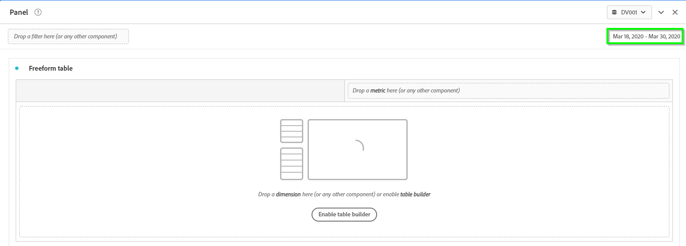</kbd>

4.	Drag the "Day" dimension from the Components menu and drop it into the Freeform Table visualization in the Panel.

<kbd></kbd>

5.	Drag the "Sessions" metric from the Components menu and "Add" it to the right of the "Events" metric by hovering to the right of the "Events" metric until the "+ Add" appears in the Freeform Table visualization in the Panel.

<kbd>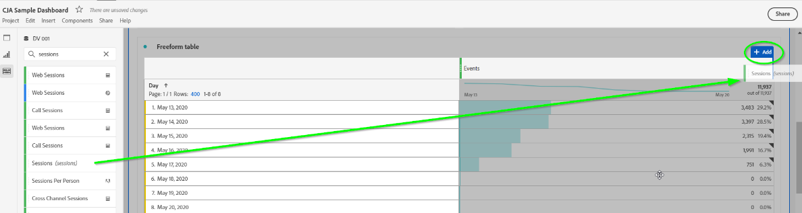</kbd>

6.	Do the same for the "People" metric from the Components menu 
7.	Click on "Freeform Table" in the top left corner of the table and change the name to "Base KPIs Trended".
8.	Click on "Freeform" in the top left corner of the panel and change the name to "Dashboard".

<kbd></kbd>

**Add Line Visualization**
1.	Click on Visualizations in the left menu and drag the Line visualization to the Dashboard panel above the Base KPIs Trended table.

<kbd></kbd>

<kbd></kbd>

2.	The Line visualization will automatically connect to the Base KPIs Trended table and will visualize the dimensions and metrics in that table. The dimension is the x-axis and the metrics are trended. You can click individual metrics to disable them in the visualization.

      - Click on "Line" in the top left corner of the Line visualization and change the name to "Base KPIs Trended".

<kbd></kbd>

**Add Summary Number Visualization**

1.	Right-click on the number under the "Events" metric in the "Base KPIs Trended" table to bring up a menu with several options, including adding a visualization tied to that metric.

<kbd></kbd>

2.	Click on the Visualize option and scroll down to and select Summary Number.

<kbd></kbd>

3.	The Summary Number visualization will be added to the panel. This visualization is showing the total number of Events for the reporting timeframe.

<kbd>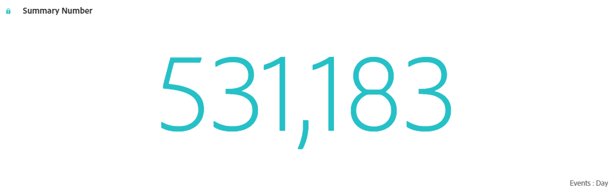</kbd>

4.	This visualization is not "Locked" which means if any selections are made in the Base KPIs Trended table, the Summary Number visualization will change to the new selection.

**Lock Selection**

1.	Click on the number under Sessions and watch what happens to the Summary Number visualization.
2.	Scroll up to the Base KPIs Trended Line visualization and notice it is impacted by the selection in the table.

<kbd>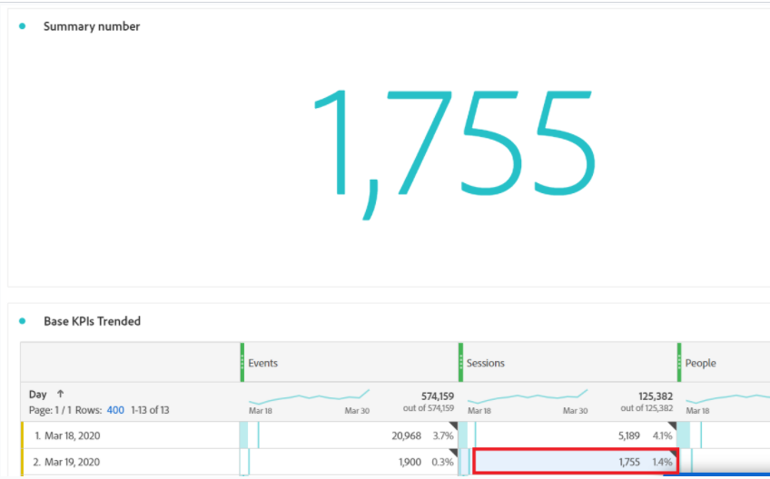</kbd>

3.	Select the number under the "Events" metric again and click on the round dot in the top left corner of the Summary Number visualization to bring up the "Data Sources Settings" menu.
4.	Click on Lock Selection to lock the visualization to the "Events" metric in the table.
5.	Click on "Summary Number" in the Summary Number visualization and name it "Total Events".
6.	Drag the right bottom corner of the Total Events visualization to make it smaller. Make it about 1/3 of the width of the screen.

<kbd>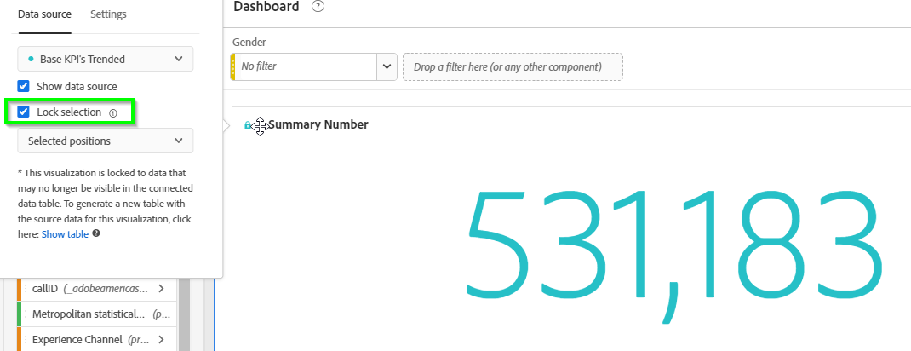</kbd>

<kbd>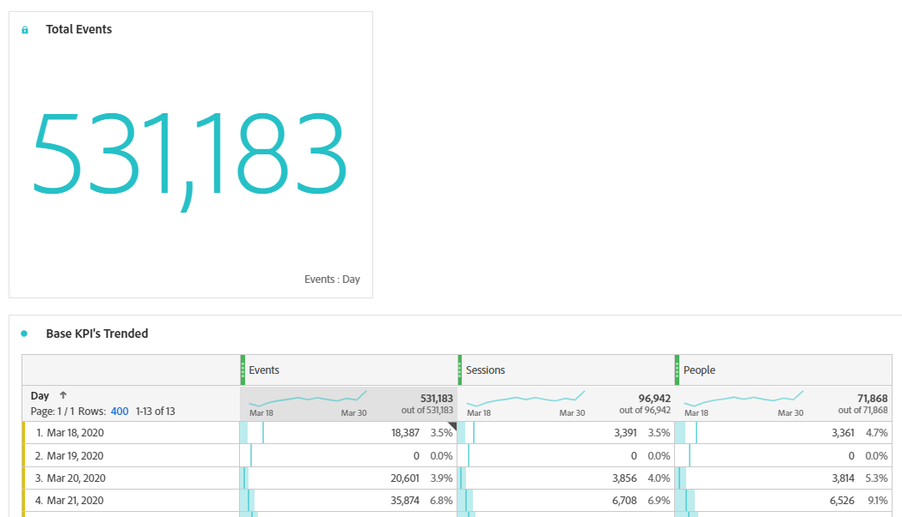</kbd>

**Duplicate Summary Visualizations**

1.	Now let's create a Summary Number visualization for the "Sessions" and "People" metrics.
2.    We could go through the same process, but instead we'll duplicate the Total Sessions summary number visualization, rename it, and lock it to the desired metric
      - Hover your mouse over the top center of the "Total Session" summary number visualization and right-click when you see the mouse change to the crosshairs icon, to bring up the menu.
      - Click on Duplicate Visualization to make a duplicate copy of the "Summary Number" visualization that we just created.
      - Duplicate it again.

<kbd>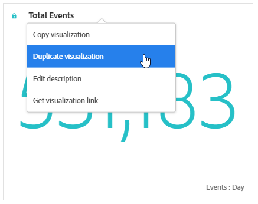</kbd>

3.	We now have 3 instances of the "Total Events" summary number visualization.

      - Drag one copy to the right of the first instance and drag the other copy next to that one.

      - Click on the number under the "Sessions" metric in the Base KPIs Trended table.

      - Click on the round dot in the top left corner of the Total Events (2) Summary Number visualization to bring up the Data Sources Settings menu.

      - Deselect the "Lock Selection" to unlock it from the "Events" metric.

4.	Because the "Sessions" metric is selected in the "Base KPIs Trended" table, and the duplicated Summary Number has been unlocked, the Summary Number visualization will now be tied to the "Sessions" metric.
      - Click on the "Lock Selection" checkbox again to lock it to the "Sessions" metric.
      - Click on "Total Events (2)" in the duplicated Summary Number visualization and name it "Total Sessions" to match the metric it represents.

      - Click on the number under the "Sessions" metric in the Base KPIs Trended table.
      - Then click on the round dot in the top left corner of the Total Events (2) Summary Number visualization to bring up the Data Sources Settings menu.

      - Deselect the "Lock Selection" to unlock it from the "Events" metric.

5.	Because the People metric is selected in the Base KPIs Trended table, and the duplicated Summary Number has been unlocked, the Summary Number visualization will now be tied to the People metric.
      - Click on the "Lock Selection" checkbox again to  lock it to the People metric.

      - Click on "Total Events (3)" in the duplicated Summary Number visualization and name it "Total People" to match the metric it represents.

<kbd>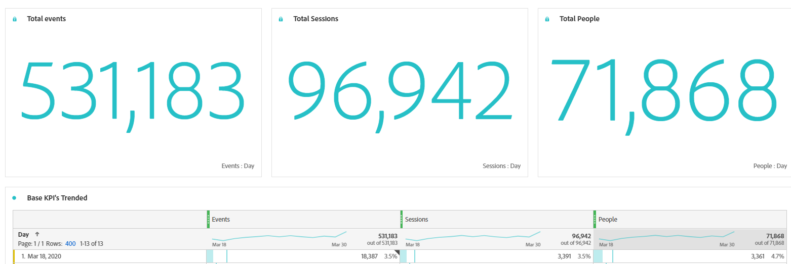</kbd>

**Save Project**

1.	Now would be a good time to save this Project so we don't lose any of our work.
2.	Click on Project and then Save to open the Save Project window.
3.	Name the project "Hands-on Lab Working Project" and click Save Project.

<kbd>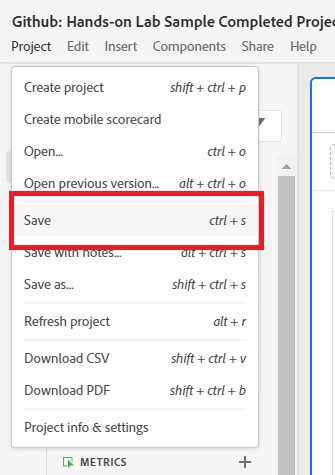</kbd>

**Donut Visualization**

1.	Now let's add a Donut visualization to this panel that is built off another dimension of data (other than Day). The Donut visualization, like the Line visualization is tied to a table, so we need to add a table with the dimension and metrics that we want to visualize in the Donut visualization.

      - Click on Visualizations in the left menu and drag a Freeform Table and drop it in the project above the "Base KPIs Trended" table.

<kbd>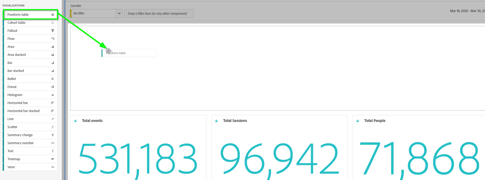</kbd>

2.	The dimension that we want to work with in this case is the Web Marketing Channel that we looked at when we built the Data View, and configured to have a default attribution model of Last Touch at a Person level.

      - Drag the "Web Marketing Channel" from the Components menu into the Freeform Table you added to the panel. If you can't find it in the Components menu, you can search for it at the top.

<kbd></kbd>

3.	The table will default to the "Events" metric, but let's say we want to see the Sessions driven by each Web Marketing Channel as well as the conversions that each of these Marketing Channels are driving from a Last Touch perspective.

      - Drag the "Sessions" metric from the Components menu and replace the "Events" metric with it, by hovering over the "Events" metric until it says "Replace" and then dropping it.

<kbd>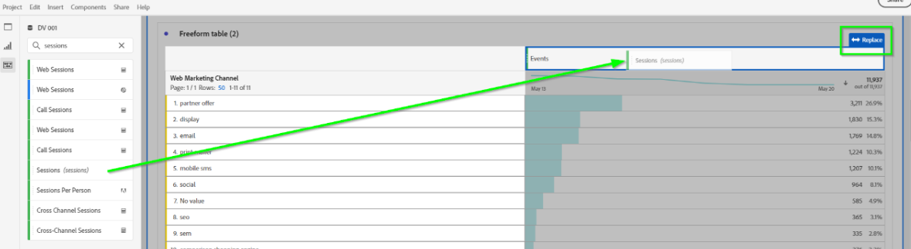</kbd>

4.	Drag the "New Accounts" metric from the Components menu and "Add" it to the right of the "Sessions" metric you just added to the table.
5.	We now have a table with the dimension and metrics we want to represent in the Donut visualization. Rename the "Freeform Table (2)" table to "Marketing Channel Performance".

<kbd>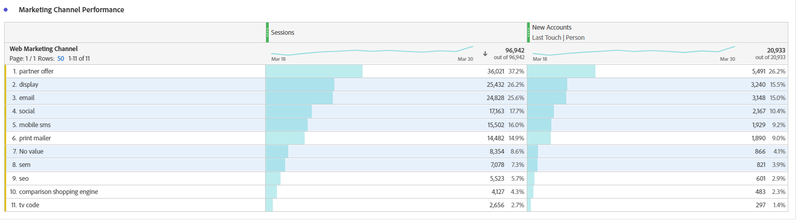</kbd>

6.	Drag the Donut visualization from the Visualizations menu and drop it above the "Marketing Channel Performance" table.

7.	The Donut visualization automatically connects to the last table that was added to the project, but if we wanted it to connect to a different table we could by clicking the round dot in the top left corner of the visualization to Manage Data Sources and selecting the table that we want the visualization tied to.

8.	We'll keep it tied to the Marketing Channel Performance table.
      a. Rename the Donut visualization to "Marketing Channel Performance".

9.	The Donut visualization will automatically show the top 6 items in the table it is tied to, but this can be customized.

<kbd>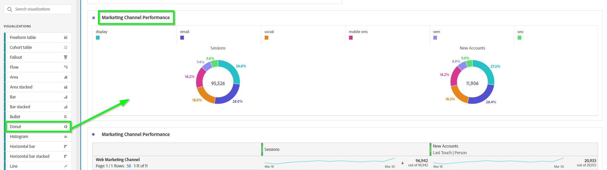</kbd>

10.	If we wanted to show specific channels instead of the top 6. We can select those channels in the table and lock the Donut visualization to those selections.

**Lock Selected Items in Donut Visualization**

1.	In the Marketing Channel Performance table, select the following channels:

      - display
      - email
      - social
      - mobile sms
      - sem
      - seo

<kbd>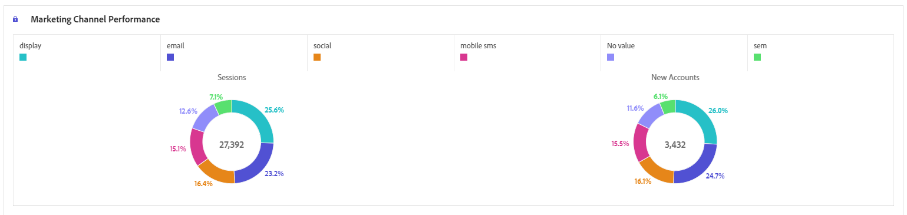</kbd>

2.	Click on the round dot in the top left corner of the Donut visualization to bring up the Data Source Settings menu and click the "Lock Selection" checkbox.

3.	Under the "Lock Selection" checkbox is a drop-down list that defaults to "Selected Positions". This means that the Donut visualization is tied to the elements in the selected positions in the table. That's not what we want because these channels of interest may move around in the table over time based on performance.
      - Click on the drop-down and select "Selected Items" instead of "Selected Positions". This will tie the Donut visualization to the specific channels of interest.

<kbd></kbd>

4.	The number of items the Donut visualization will show can be configured by clicking on the gear in the top right corner of the Donut visualization and increasing or decreasing the "Limit Max Items" setting.

**Dashboard Cleanup**

1.	We can now clean up the dashboard to look more organized.
2.	Drag the Base KPIs Trended Line Graph below the Summary Number visualizations.
3.	Drag the right side of the Line Graph and change the size of the visualization to cover just the left half of the project.
4.	Scroll down and drag the left side of the Donut visualization so it pops up to the right side of the Line Graph.
5.	The tables the visualizations are built from can now be minimized or even hidden since we're only interested in the visualizations.
6.	Click on the small downward facing arrow in the top right corner of the "Marketing Channel Performance" and "Base KPIs Trended" tables to minimize them.
7.	The tables have now been minimized.
8.	To fully hide the tables, click on the Data Sources Settings round dot for any visualization that uses that table and deselect the checkbox for "Show Data Source".
 
<kbd></kbd> 

9.	The tables are now fully hidden.

<kbd>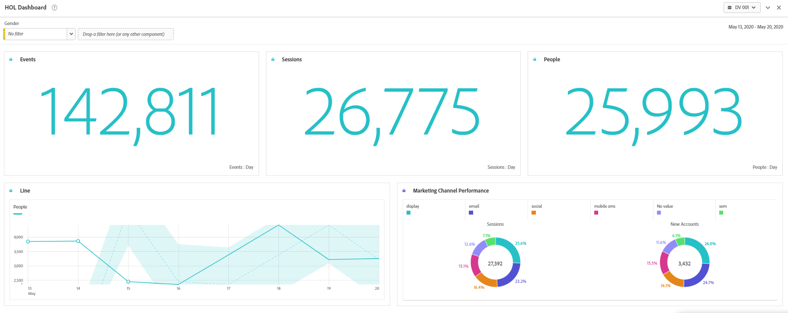</kbd>

### This completes the Dashboard building excercise in CJA  
Next we will review how to create and apply [Filters](https://github.com/adobe/AEP-Hands-on-Labs/blob/master/labs/fsi/CJA/Filters.md)

