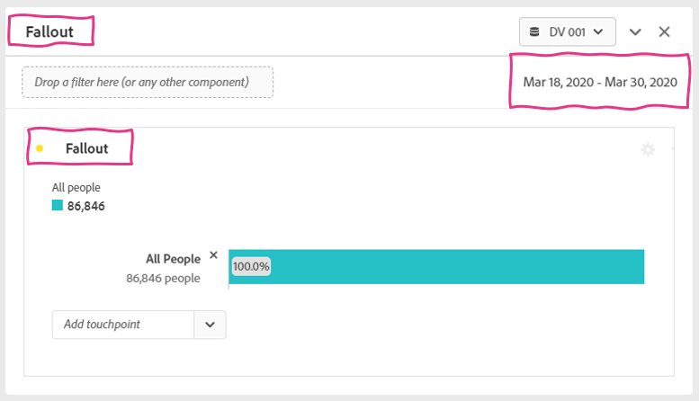
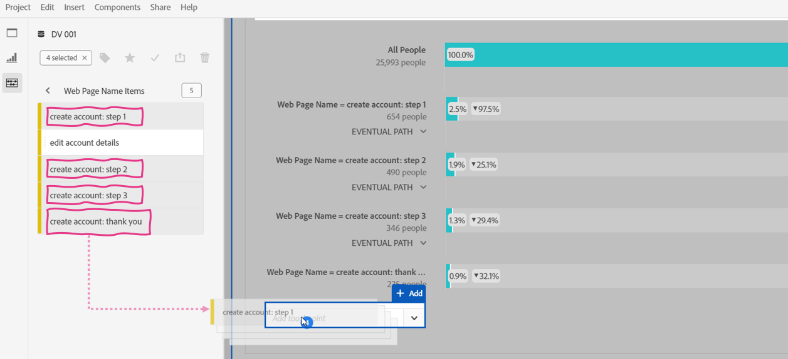
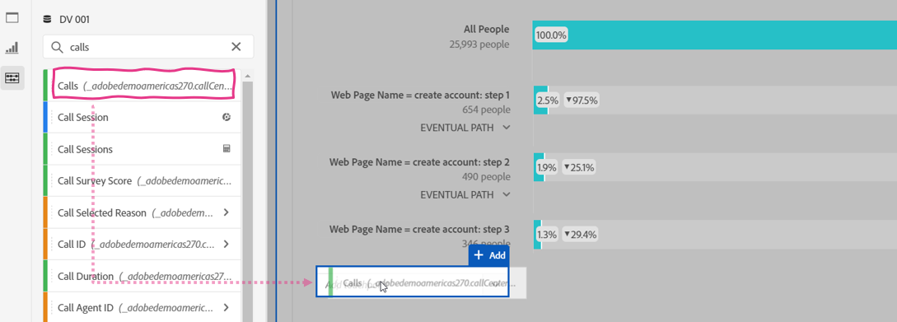
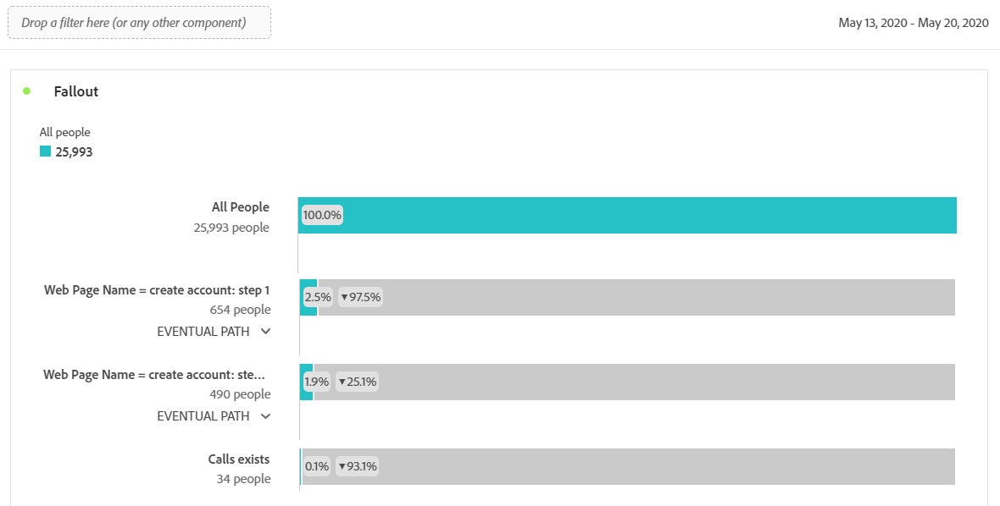

Lab  - Fallout
==========
<table style="border-collapse: collapse; border: none;" class="tab" cellspacing="0" cellpadding="0">

<tr style="border: none;">

<td width="600" style="border: none;">
<table>
<tbody valign="top">
      <tr width="500">
            <td valign="top"><h3>Objective:</h3></td>
            <td valign="top"> This lab will show you how to understand customer paths through Fallout
            </td>
     </tr>
     <tr width="500">
           <td valign="top"><h3>Prerequisites:</h3></td>
           <td valign="top"> none
           </td>
     </tr>
</tbody>
</table>
</td>

<td style="border: none;" valign="top">

<table>
<tbody valign="top">
      <tr>
            <td valign="middle" height="70"><b>section</b></td>
            <td valign="middle" height="70">CJA</td>
      </tr>
      <tr>
            <td valign="middle" height="70"><b>version</b></td>
            <td valign="middle" height="70">1.0.10</td>
      </tr>
      <tr>
            <td valign="middle" height="70"><b>date</b></td>
            <td valign="middle" height="70">2021-05-24</td>
      </tr>
</tbody>
</table>
</td>

</tr>
</table>

Now that we've reviewed Flow visualizations, let's move on to Fallouts.

**FALLOUT**

The Fallout visualization is great for understanding customer paths when there are specific points or events you want to account for. For example, measuring a process on the site.

1. Create a new panel, title it “Fallout” and ensure your date range for POT1 is March 18-30, 2020. Select the Fallout visualization as the starting point of the panel.

<kbd></kbd>

The Fallout visualization requires touchpoints in the process you want to measure fall-through as well as fall-out for.

2. From the Components menu, click on the arrow to the right of the “webPageName" dimension, click on “Show items from the last X months” until the values show up, and search for “account".
      - Drag "create account: step 1" into the Add Touchpoint drop zone

<kbd></kbd>

We can see that 2,327 people have started the process of creating an account.

4. Next,
      - Drag "create account: step 2" into the Add Touchpoint drop zone
      - Drag "create account: step 3" into the Add Touchpoint drop zone
      - Drag "create account: thank you" into the Add Touchpoint drop zone

<kbd></kbd>

We can see that out of 2,327 people who started the account creation process, 350 made it to the end goal

5. Right-click on “step 3” in the Fallout and review all the options you have to drill deeper into analysis.
      - Of particular interest is the ability to see where people go next after Step 3, if they **fall-through** (make it to the Thank You page) or **fall-out** (don't make it to the Thank You page)

<kbd></kbd>
_(no action needed on this view)_

Let's see how many of these people call into the call center.

6. Remove the last step in the fallout by clicking on the "x" to the right of the last step.
      - Now drag the "Calls" metric and drop it into the Touchpoint drop zone

<kbd></kbd>

  We can see that there are 350 people that make it to step 3 and then call into the call center

7. Remove step 3 in the fallout by clicking the "x" to the right of step 3.

<kbd></kbd>

  We can see that 490 people make it to step 2 and then call.
  
  
### This completes the Fallout excercise in CJA
Next we will review how to create [Cohort](https://github.com/adobe/AEP-Hands-on-Labs/blob/master/labs/fsi/CJA/Cohort.md) tables

