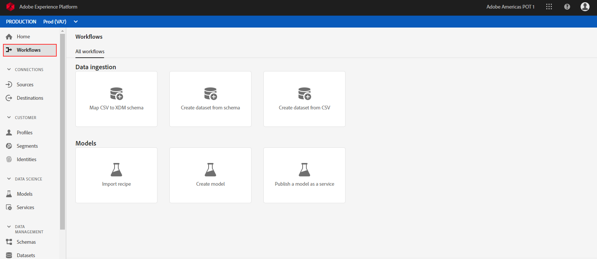
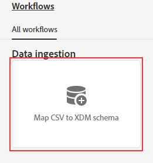
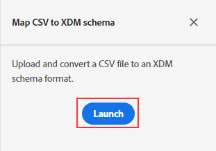
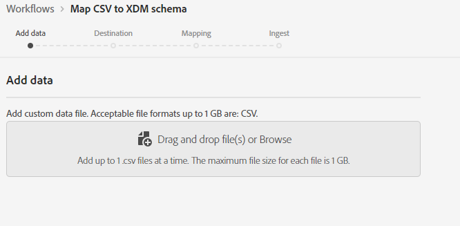
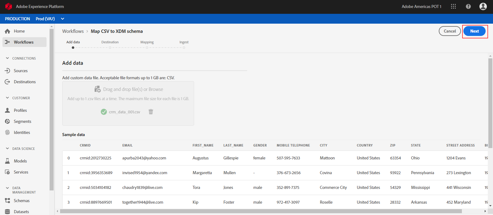
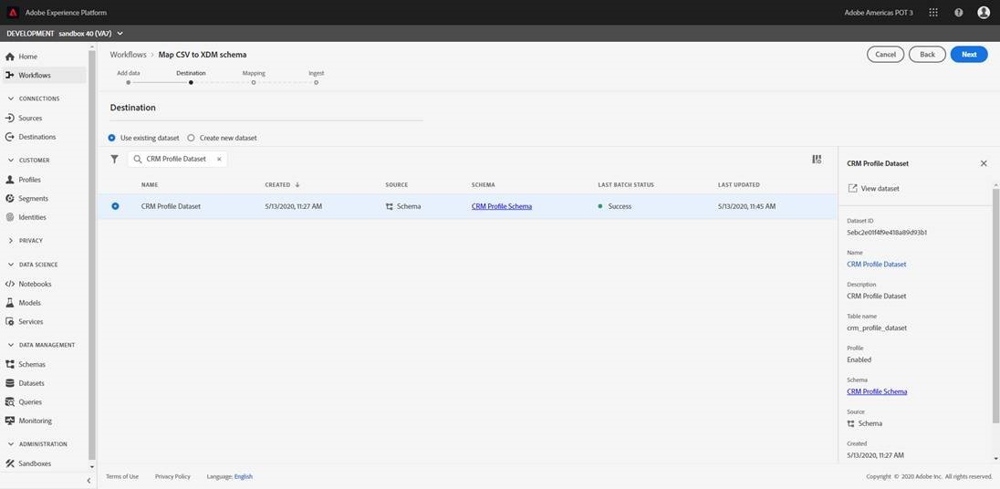
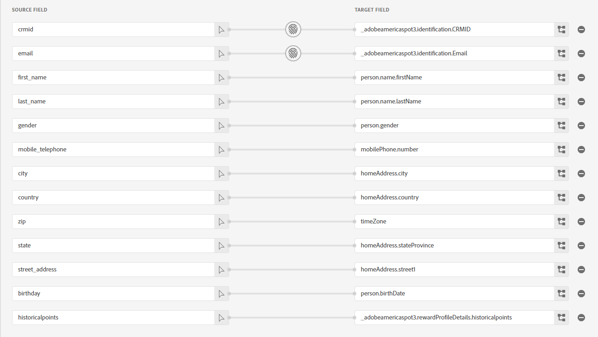
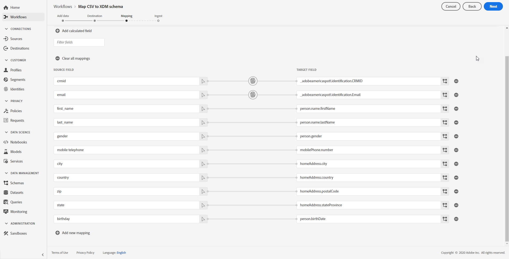
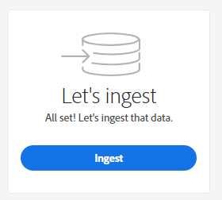
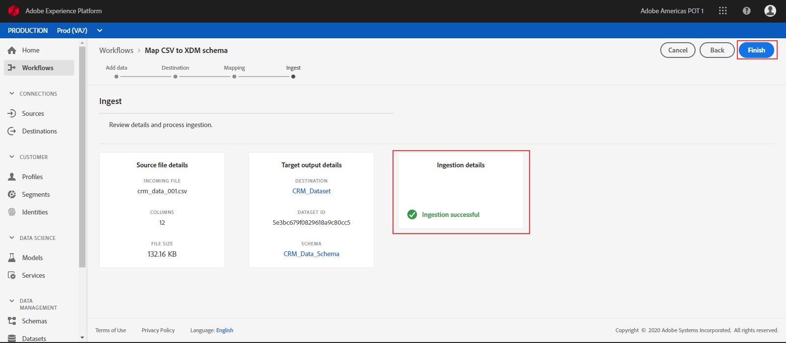

Lab - Ingestion - CSV to XDM Mapping
==========
<table style="border-collapse: collapse; border: none;" class="tab" cellspacing="0" cellpadding="0">

<tr style="border: none;">

<td width="600" style="border: none;">
<table>
<tbody valign="top">
      <tr width="500">
            <td valign="top"><h3>Objective:</h3></td>
            <td valign="top"> This lab will show you how to add CSV data to the AEP datasets in a manner that will be usable (or conformed) to either the user Profile or Experience Event schema.
            </td>
     </tr>
     <tr width="500">
           <td valign="top"><h3>Prerequisites:</h3></td>
           <td valign="top"> <ul><li>Download and save the "crm_data.csv" file to a location on your computer</li>
                            <li>schema in place</li>
                 <li>dataset in place</li></ul>
           </td>
     </tr>
</tbody>
</table>
</td>

<td style="border: none;" valign="top">

<table>
<tbody valign="top">
      <tr>
            <td valign="middle" height="70"><b>section</b></td>
            <td valign="middle" height="70"></td>
      </tr>
      <tr>
            <td valign="middle" height="70"><b>version</b></td>
            <td valign="middle" height="70">1.0.1</td>
      </tr>
      <tr>
            <td valign="middle" height="70"><b>date</b></td>
            <td valign="middle" height="70">2020-05-11</td>
      </tr>
</tbody>
</table>
</td>

</tr>
</table>

Instructions:
-----------------
Go to https://platform.adobe.com/home

1. In the left-hand menu, navigate to "Workflows".

      

2. We will be ingesting an ad hoc CSV file. Please select "Map CSV to XDM schema".

      
      
      
3. Click "Launch" to start the workflow.

      

4. First step in the workflow is to Add data. 

      
      

5. Drag and drop the 'crm_data_001.csv' file profiled in the lab downloads. Within a few seconds you will see a preview of the data. Click "Next". 

      
      
      
6. The next step is to select a Destination for this data. Search for "CRM Profile Dataset", select it and click "Next".

      
      
      
7. Next, we need to map the CSV file fields to the XDM fields in the schema. The mapper tried to parse and map fields however there are some that were not mapped or are mis mapped. We will make corrections.

      
      

8. To remap a field click the  icon to open the schema. Remapping the list is left as a exercise for the participant.

Once corrected, the mappings should match the screenshot below. Once you have verified that the mappings are correct, click "Next".

    

9. Finally, we are ready to ingest the data. Click "Ingest".

    

10. Adobe Experience Platform will start the workflow of converting the CSV file data to XDM format. This process takes a few minutes. Once completed, click "Finish" to complete the workflow.

    

11. Congratulations! You have imported an adhoc file into Adove Experience Platform.

 
 
 
 

Return to [Lab Agenda Directory](https://github.com/adobe/AEP-Hands-on-Labs/blob/master/labs/fsi/README.md#lab-agenda)

