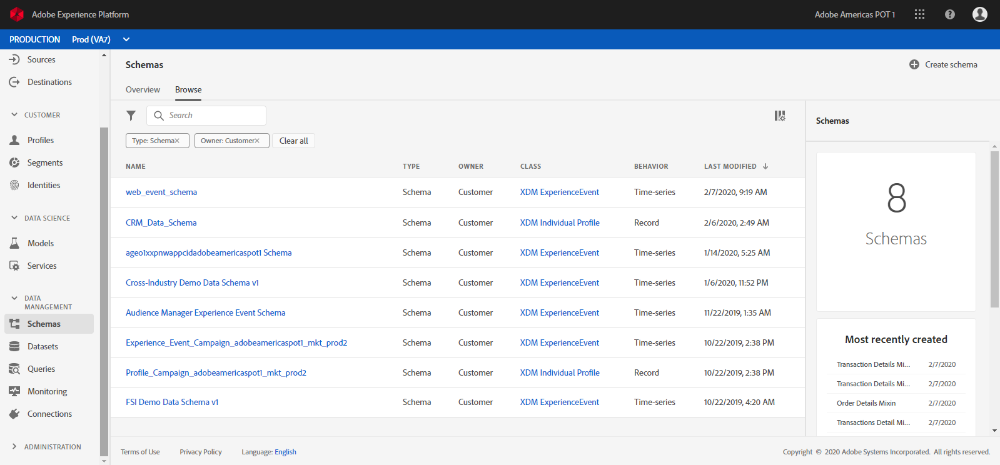
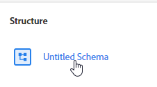
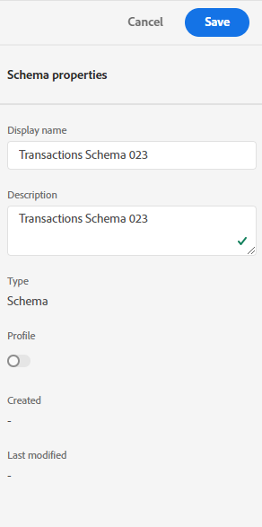
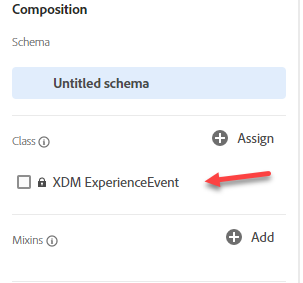
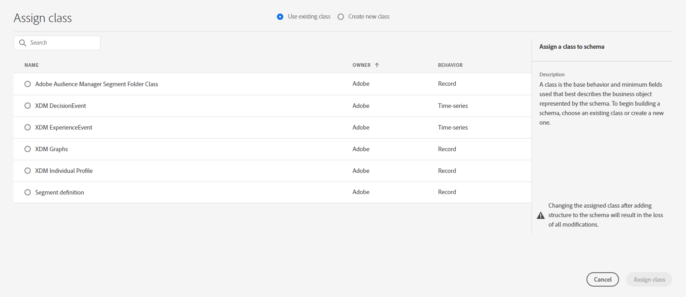
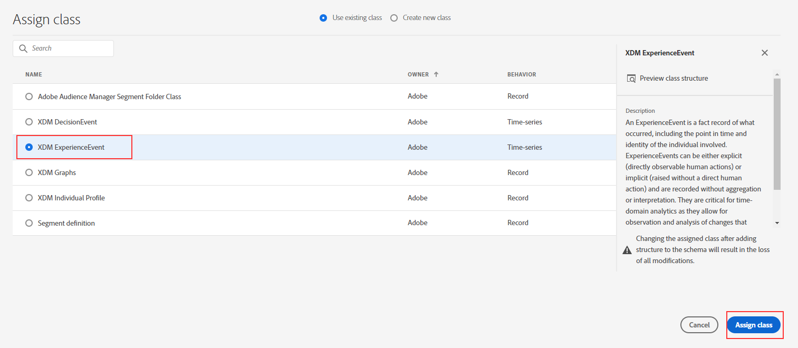

Lab  - Build a Transactions schema (ExperienceEvent)
==========
<table style="border-collapse: collapse; border: none;" class="tab" cellspacing="0" cellpadding="0">

<tr style="border: none;">

<td width="600" style="border: none;">
<table>
<tbody valign="top">
      <tr width="500">
            <td valign="top"><h3>Objective:</h3></td>
            <td valign="top"> This long lab will show you how to construct 
            </td>
     </tr>
     <tr width="500">
           <td valign="top"><h3>Prerequisites:</h3></td>
           <td valign="top"> none
           </td>
     </tr>
</tbody>
</table>
</td>

<td style="border: none;" valign="top">

<table>
<tbody valign="top">
      <tr>
            <td valign="middle" height="70"><b>section</b></td>
            <td valign="middle" height="70"></td>
      </tr>
      <tr>
            <td valign="middle" height="70"><b>version</b></td>
            <td valign="middle" height="70">1.0.1</td>
      </tr>
      <tr>
            <td valign="middle" height="70"><b>date</b></td>
            <td valign="middle" height="70">2020-01-06</td>
      </tr>
</tbody>
</table>
</td>

</tr>
</table>

Before be begin go to [https://platform.adobe.com/home](https://platform.adobe.com/home). Follow the instructions detailed below.

Instructions:
-----------------
1. In the left-hand menu, navigate to "Schemas"
      
      
2. Click "Create Schema" on the top right
      
      
3. Click on "Untitled Schema" in the structure view
      
      
4. In the right-hand menu, name it "Transactions Schema <your-assigned-number>" (Description is optional)
      
      
5. In the left-hand schema composition menu, click on the "Assign" button across from Class
      
      
      Here's where you can choose your base level schema behavior:
     - Time-based Events (ExperienceEvent)
     - Customer Snapshots (Profile)
     
      
      
      Note: There are other classes avaiable out of the box that represent specific objects needed for Experience Modeling.

6. In this example, choose "XDM ExperienceEvent" and click "Assign class"
      
      
7. In the left-hand schema composition menu, click on the class "XDM ExperienceEvent"
8. Below that area, click on the "Add" button across from "Mixins"
9. Here's where you can build your own Mixin or use a prior/similar Mixin object that conforms to your data.
10. Click on a  "Adobe" pre-built Mixin and select the "Preview mixin structure" option on the right-hand side to see it's contents
11. Add in two pre built mixins
      - Order Details Mixin, and 
      - identities
      
    For Refference Order Details mixin had the following fields.
   
    Order Details Mixin 
      - Order ID - String
      - Product SKU - String
      - Product Category- String
      - Purchase Amount - Decimal
      - Currency Type - String
      - Product Name - String
    
    and, Identities has the fields below
      - CRMID - String
      - emailID - String
        
12. In this lab, we'll also create a new Mixin from scratch.  Click "Create new mixin" on the very top
13. Display name is "Transactions Details Mixin 001 <your-initials>"
14. Notice that "timestamp" is a required field appended to the base level of the schema-- this is intentional since this is where each timestamp needs to be provided for each record
15. In the left-hand schema composition menu, click on your newly create Mixin (it should be highlighted now)
16. ***Finally the good stuff*** here's where we add items/fields to the schema that corresponds to the file or table we'll be pushing up into AEP
17. You have the "option" to create an Object data-type where other values/data-fields are children to the Object. This object hierarchy could help keep certain aspects of the data better organized and menued-- but this isn't a requirement.For this lab, you'll create a new top level object called "Transaction Details", here's how

18. Click "Add Field"
19. Input "transactionDetails" as Field Name and "Transaction Details" as Display name. 
20. On data-type dropdown, select "Object"
21. Scroll to the very bottom and hit Apply
22. Within the Structure view click "+Add Field" next to the "transactionDetails" object to and add fields to the Object.
    Below is a reference on fields we will be adding
    
    Transaction Details
    |Field name| Display Name|Data Type|
    |transactionID| Transaction ID|String|
    |branchID| Branch ID|String|
    
 23. Hit Save
 24. Congratulations!!! you have constructed your schema.
 
 
 

Return to [Lab Agenda Directory](https://github.com/adobe/AEP-Hands-on-Labs/blob/master/labs/fsi/README.md#lab-agenda)

