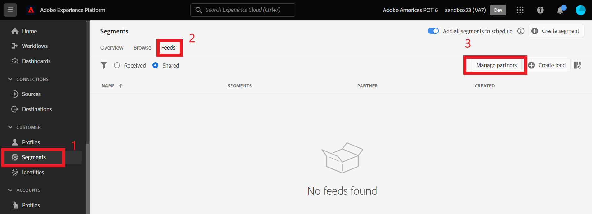
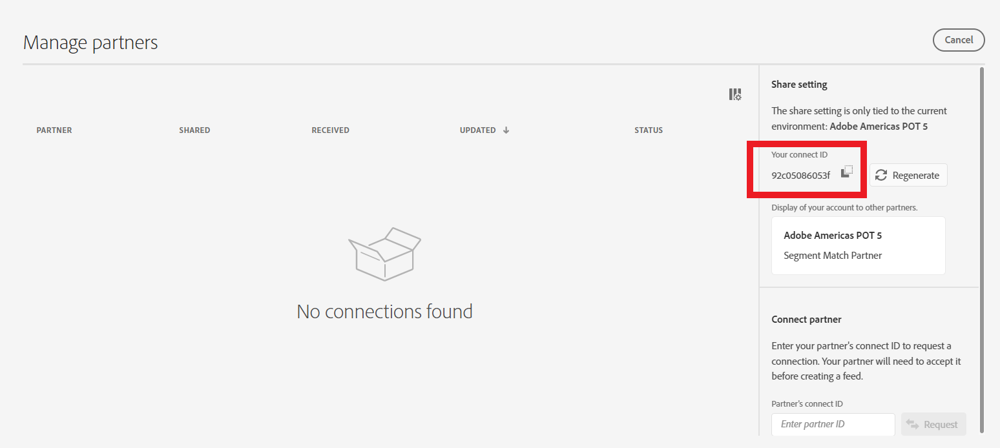
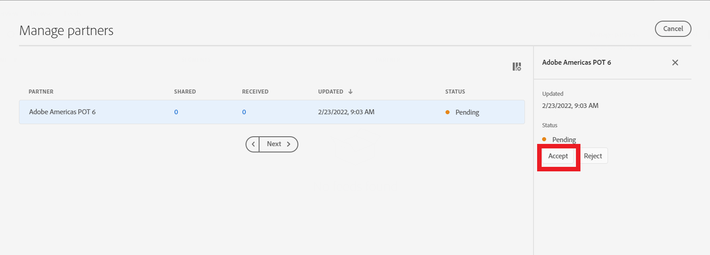
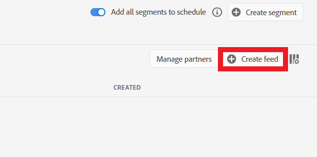
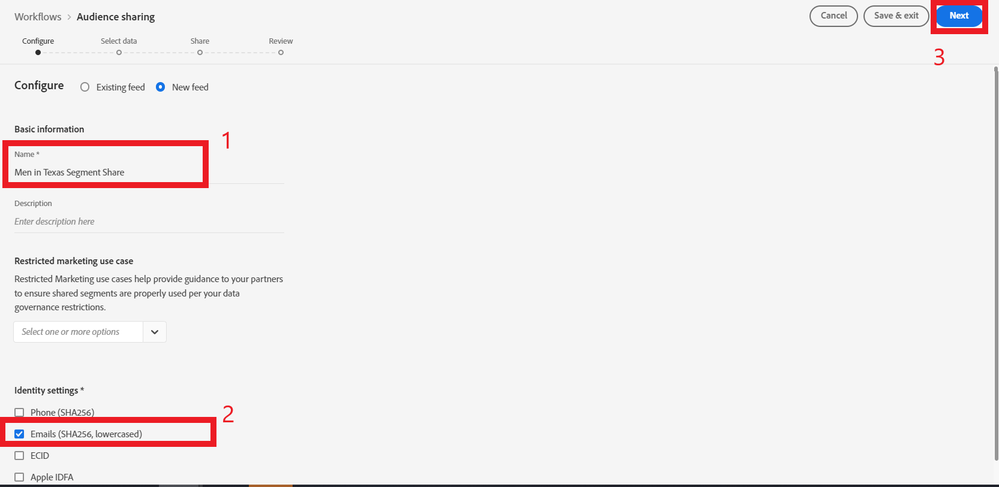
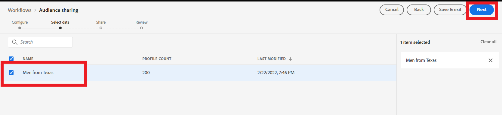
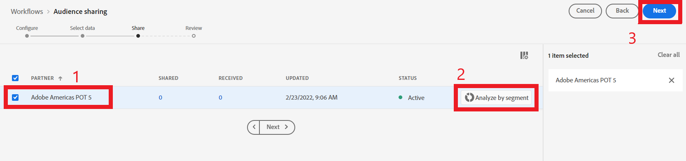
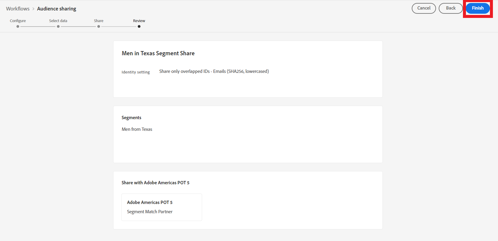
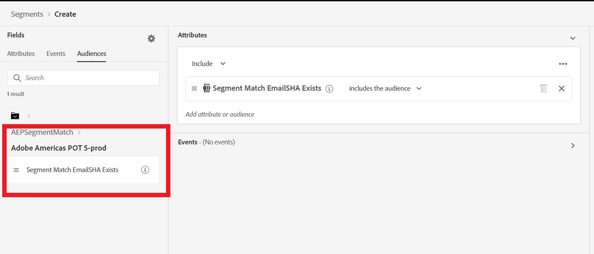

Segment Match Demonstration
==========================
Note: For purposes of this demo, ‘crm_seg_match.csv’ file must be loaded to both environments which will be used in the sharing process. The screenshots below showcase sharing a segment between 2 orgs, but the recommended approach for this demo is to share between 2 sandboxes within the org.

Part 1 – Set up Partner Connection

1)	In the environment which will be receiving the segment, navigate to the ‘Segments’ screen, select ‘Feeds’ tab at the top, and then click ‘Manage Partners’ button on the right side. 

2)	In the ‘Manage Partners’ pop up window, copy the ‘connect ID’ in the ‘Share setting’ section on the right.

3)	In the environment which will be sending the segment, navigate to the ‘Segments’ screen, select ‘Feeds’ tab at the top, and then click ‘Manage Partners’ button on the right side.

4)	Paste the partners connect ID in the ‘Partners connect ID’ box and select ‘Request’. You should see a Pending invitation appear in the list.

5)	In the environment which will be receiving the segment, navigate to the ‘Segments’ screen, select ‘Feeds’ tab at the top, and then click ‘Manage Partners’ button on the right side.

6)	In the Manage Partners window, select the pending invitation row, and click the ‘Accept’ button on the right side. The status will now change to ‘Active’.

Part 2 – Set up Segment Feed

7)	In the environment which will be sending the segment, navigate to the ‘Segments’ screen, select ‘Feeds’ tab at the top, and then click ‘Create Feed’ button on the top right.

8)	In the Audience Sharing workflow, select ‘New feed’, Name the feed ‘Men in Texas Segment Share’, and select ‘Emails (SHA256 lowercased)’ in the Identity settings section. Click ‘Next’.

9)	Select the ‘Men from Texas’ segment and click ‘Next’.

10)	Check the box beside the Partner you wish to share the segment with. You can click the ‘Analyze by Segment’ button to view estimated overlap. Click Next.

11)	Review the share details and select ‘Finish’.

12)	In the environment receiving the segment, navigate to the ‘Segments’ screen, select ‘Feeds’ tab at the top, and select ‘Received’ radio button. Select the ‘Men in Texas Segment Share’ and toggle ‘Enable for profile’ on the right hand side. 

13)	The segment share is now active and will show in the receiving environment for activation within 24 hours. You can leverage this audience from the segment builder in the Audiences section. Example in Prod POT6: 

