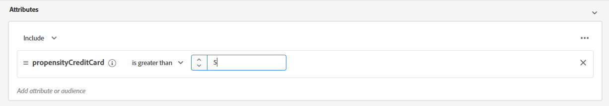

Lab 6.1 - Segmentation - Profile Attribute Segmentation
==========
<table style="border-collapse: collapse; border: none;" class="tab" cellspacing="0" cellpadding="0">

<tr style="border: none;">

<td width="600" style="border: none;">
<table>
<tbody valign="top">
      <tr width="500">
            <td valign="top"><h3>Objective:</h3></td>
            <td valign="top"> In this exercise, we’ll create a basic segment using a single field in Call Center ExperienceEvent.
 
 A marketer wants to create a basic segment for customers who report Account security issues with a Call Center representative. 
            </td>
     </tr>
     <tr width="500">
           <td valign="top"><h3>Prerequisites:</h3></td>
           <td valign="top"> none</td>
     </tr>
</tbody>
</table>
</td>

<td style="border: none;" valign="top">

<table>
<tbody valign="top">
      <tr>
            <td valign="middle" height="70"><b>section</b></td>
            <td valign="middle" height="70"></td>
      </tr>
      <tr>
            <td valign="middle" height="70"><b>version</b></td>
            <td valign="middle" height="70">1.0.1</td>
      </tr>
      <tr>
            <td valign="middle" height="70"><b>date</b></td>
            <td valign="middle" height="70">2020-01-06</td>
      </tr>
</tbody>
</table>
</td>

</tr>
</table>

Instructions:
-----------------
1.	Navigate to Segment Builder in the left navigation

      <kbd></kbd>

2.    Click "Create segment" on the top right.

      <kbd></kbd>

3.	Click the gear icon to the right of Fields in the left pane

      <kbd></kbd>

4.	Verify ‘Show full XDM schema’ is selected, and if not, select it
           
      <kbd></kbd>
      
5.	Click on the gear icon again to hide the setting

      <kbd></kbd>

6.	Select ‘Events’ under Fields

      <kbd></kbd>

7.	Click on ‘XDM ExperienceEvent’ under Browse Classes

      <kbd></kbd>
      
8.	Click on ‘Adobeamericaspot 1’ to expand the objects below that namespace
      
      <kbd></kbd>

9.	Click on ‘callcenterDetails’
   
      <kbd></kbd>      

10.	Drag the ‘callSelectedReason’ field over to the Segment canvas
            
      <kbd></kbd>    
      
11.	In the text box to the right of equals, type “Account Security Issue” and press ‘Enter’
           
      <kbd></kbd>  

12.	Enter the segment name “Call Center Account Security” followed by your Student ID (e.g. “Call Center Account Security 025”)
	 Enter the same value as the description
      
      <kbd></kbd>       
           
13.	Save the Segment
           
      <kbd></kbd>  
      
NOTE: Estimate link may not show results if qualified profiles are statistically small and not recognized across datset scans 
 
 
 

Lab 6.2 - Segmentation - Profile Attribute with Experience Event Segmentation
==========
<table style="border-collapse: collapse; border: none;" class="tab" cellspacing="0" cellpadding="0">

<tr style="border: none;">

<td width="600" style="border: none;">
<table>
<tbody valign="top">
      <tr width="500">
            <td valign="top"><h3>Objective:</h3></td>
            <td valign="top"> Similar to the prior lab, in this lab you will build a customer segment based on the unified experience event data (from EE Schemas/Datasets) that are streaming into platform</td>
     </tr>
     <tr width="500">
           <td valign="top"><h3>Prerequisites:</h3></td>
           <td valign="top"> none</td>
     </tr>
</tbody>
</table>
</td>

<td style="border: none;" valign="top">

<table>
<tbody valign="top">
      <tr>
            <td valign="middle" height="70"><b>section</b></td>
            <td valign="middle" height="70"></td>
      </tr>
      <tr>
            <td valign="middle" height="70"><b>version</b></td>
            <td valign="middle" height="70">1.0.1</td>
      </tr>
      <tr>
            <td valign="middle" height="70"><b>date</b></td>
            <td valign="middle" height="70">2020-01-06</td>
      </tr>
</tbody>
</table>
</td>

</tr>
</table>

Instructions:
-----------------
<ol>
 <li>In the left navigation, select 'Segments' if you are not already there.</li>
<li>In the upper right corner, select 'Create Segment'.</li>
<li>In the right pane within the 'Create Segment' interface, enter the segment name 'High Credit Card Propensity' following by your Student Number (e.g. 'High Credit Card Propensity 001'). Enter the same value in the Description field.</li>
<li>If the 'Streaming' toggle is not active, activate it.</li>
<li>In the left pane, drill down the 'XDM ExperienceEvent' under Attributes by clicking on it.</li>
<li>Under 'Browse Attributes', click on 'Adobeamericaspot 1'.</li>
<li>Expand 'propensityProfileDetails' and drag 'propensityCreditCard' to the segment canvas</li>	
<li>Select "is greater than" from the condition list box and enter "5" in the text box</li>	
<kbd></kbd>  	
	
	
<li>In the left pane, drill down the 'XDM ExperienceEvent' under Events by clicking on it.</li>
<li>Scroll the resulting list until you locate 'Experience'.</li>
<li>Click on 'Experience' to expand the object. </li>
<li>Click on 'Analytics' to expand the object</li>
<li>Click on 'Event 1 to 100' to expand the object.</li>
<li>Click on 'Account Creation: Step 1'. This will display the field value for this event.</li>
<li>Drag the field to the Segment Canvas.</li>   
<li>In the left pane, click on the 'Event 1 to 100' link to display the event list again</li>
<li>Click on 'Account Creation: Step 2'. This will display the field value for this event.</li>     
<li>Drag the field to the right of the existing event in the Segment Canvas.</li>
<li>In the left pane, click on the 'Event 1 to 100' link to display the event list again</li>
<li>Click on 'Account Creation: Step 3'. This will display the field value for this event.</li>     
<li>Drag the field to the right of the last (second) event in the Segment Canvas.</li>
<li>You should now see three events positioned horizontally in the Segment Canvas. We're going to configure each event with a rule next.</li>
<li>Click on the leftmost event. You will see the rule editor activate below. Enter '1' in the Number field to modify the condition.</li>
<li>Click on the middle event. You will see the rule editor activate below. Enter '1' in the Number field to modify the condition.</li>
<li>Click on the last event. Click on the arrow to the right of 'equals' and select 'does not exist' from the list to modify the condition.</li>
<li>At the top of the ‘Events’ canvas, update the time value to ‘In last 24 Hour(s)’</li>
<li>In the Segment properties pane, select the ‘Refresh estimate’ link.</li>
<li>Save your segment</li>
</ol>    
 
 
 
 

Return to [Lab Agenda Directory](https://github.com/adobe/AEP-Hands-on-Labs/blob/master/labs/fsi/README.md#lab-agenda)
 
 
