Lab 6.1 - Segmentation - Profile Attribute Segmentation
==========
<table style="border-collapse: collapse; border: none;" class="tab" cellspacing="0" cellpadding="0">

<tr style="border: none;">

<td width="600" style="border: none;">
<table>
<tbody valign="top">
      <tr width="500">
            <td valign="top"><h3>Objective:</h3></td>
            <td valign="top"> In this exercise, we’ll create a basic segment using a single field in Call Center ExperienceEvent.
 
 A marketer wants to create a basic segment for customers who report Account security issues with a Call Center representative. 
            </td>
     </tr>
     <tr width="500">
           <td valign="top"><h3>Prerequisites:</h3></td>
           <td valign="top"> none</td>
     </tr>
</tbody>
</table>
</td>

<td style="border: none;" valign="top">

<table>
<tbody valign="top">
      <tr>
            <td valign="middle" height="70"><b>section</b></td>
            <td valign="middle" height="70"></td>
      </tr>
      <tr>
            <td valign="middle" height="70"><b>version</b></td>
            <td valign="middle" height="70">1.0.1</td>
      </tr>
      <tr>
            <td valign="middle" height="70"><b>date</b></td>
            <td valign="middle" height="70">2020-01-06</td>
      </tr>
</tbody>
</table>
</td>

</tr>
</table>

Instructions:
-----------------
1.	Navigate to Segment Builder in the left navigation

      <kbd></kbd>

2.    Click "Create segment" on the top right.

      <kbd></kbd>

3.	Click the gear icon to the right of Fields in the left pane

      <kbd></kbd>

4.	Verify ‘Show full XDM schema’ is selected, and if not, select it
           
      <kbd>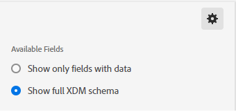</kbd>
      
5.	Click on the gear icon again to hide the setting

      <kbd>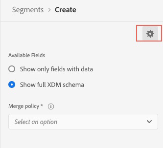</kbd>

6.	Select ‘Events’ under Fields

      <kbd></kbd>

7.	Click on ‘XDM ExperienceEvent’ under Browse Classes

      <kbd>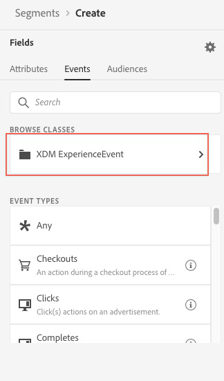</kbd>
      
8.	Click on ‘Adobeamericaspot 1’ to expand the objects below that namespace
      
      <kbd>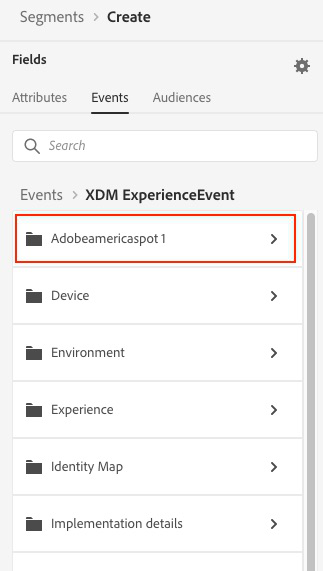</kbd>

9.	Click on ‘callcenterDetails’
   
      <kbd>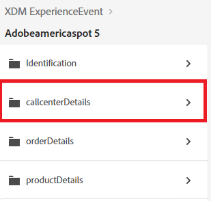</kbd>      

10.	Drag the ‘callSelectedReason’ field over to the Segment canvas
            
      <kbd></kbd>    
      
11.	In the text box to the right of equals, type “Account Security Issue” and press ‘Enter’
           
      <kbd>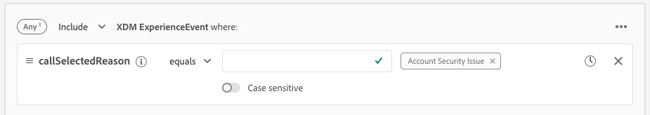</kbd>  

12.	Enter the segment name “Call Center Account Security” followed by your Student ID (e.g. “Call Center Account Security 025”)
	 Enter the same value as the description
      
      <kbd>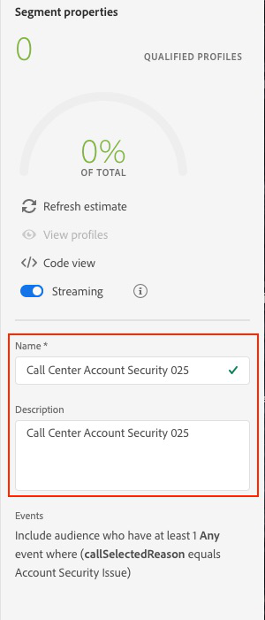</kbd>       
           
13.	Save the Segment
           
      <kbd></kbd>  
      
NOTE: Estimate link may not show results if qualified profiles are statistically small and not recognized across datset scans 
 
 
 

Lab 6.2 - Segmentation - Profile Attribute with Experience Event Segmentation (Multi-Entity Segmentation)
==========
<table style="border-collapse: collapse; border: none;" class="tab" cellspacing="0" cellpadding="0">

<tr style="border: none;">

<td width="600" style="border: none;">
<table>
<tbody valign="top">
      <tr width="500">
            <td valign="top"><h3>Objective:</h3></td>
            <td valign="top"> In this exercise, we’ll create a segment using both a Profile Attribute and ExperienceEvents.  
      A marketer wants to create a segment of female customers that performed IRA (Traditional or Roth) transactions with a broker in the last 24 hours. 
     </td>
     </tr>
     <tr width="500">
           <td valign="top"><h3>Prerequisites:</h3></td>
           <td valign="top"> none</td>
     </tr>
</tbody>
</table>
</td>

<td style="border: none;" valign="top">

<table>
<tbody valign="top">
      <tr>
            <td valign="middle" height="70"><b>section</b></td>
            <td valign="middle" height="70"></td>
      </tr>
      <tr>
            <td valign="middle" height="70"><b>version</b></td>
            <td valign="middle" height="70">1.0.1</td>
      </tr>
      <tr>
            <td valign="middle" height="70"><b>date</b></td>
            <td valign="middle" height="70">2020-01-06</td>
      </tr>
</tbody>
</table>
</td>

</tr>
</table>

Instructions:
-----------------
1.	Navigate to Segment Builder in the left navigation

      <kbd></kbd>

2.    Click "Create segment" on the top right.

      <kbd></kbd>

3.	Click the gear icon to the right of Fields in the left pane

      <kbd></kbd>

4.	Verify ‘Show full XDM schema’ is selected, and if not, select it
           
      <kbd></kbd>
      
5.	Click on the gear icon again to hide the setting

      <kbd></kbd>

6. 	Select ‘Attributes’ under Fields

	<kbd></kbd>

7.	Click on the ‘XDM Individual Profile’ object under Browse Attributes

	<kbd></kbd>

8.	Click on ‘Person’ 

	<kbd></kbd>

9.	Drag the ‘Gender’ field to the Segment canvas

	<kbd></kbd>

10.	Start entering ‘Female’ in the text box and when the value displays, select it and press Enter. The ‘Gender’ field is an enum field to limit the values stored in that field.
	<kbd></kbd>

11.	Select ‘Events’ under Fields

       <kbd></kbd>
       
12.	Click on ‘XDM ExperienceEvent’ under Browse Classes

      <kbd></kbd>
      
13.	Click on ‘Adobeamericaspot 1’ to expand the objects below that namespace
      
      <kbd></kbd>

14.	Click on 'transactionDetails'

	<kbd>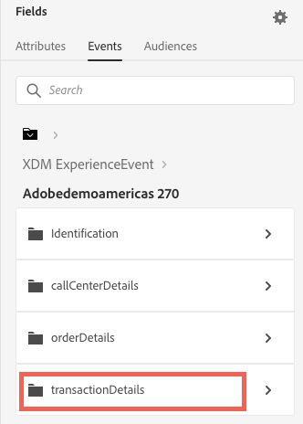</kbd>

15.	Drag the ‘transactionMethod’ field over to the Segment canvas

	<kbd>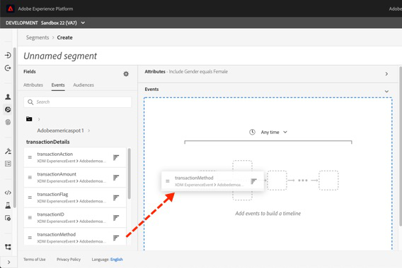</kbd>

16.	In the left pane, find 'transactionName' and drag it to the canvas below the 'transactionMethod' event so they are vertically stacked.  The AND operator should remain.

	<kbd>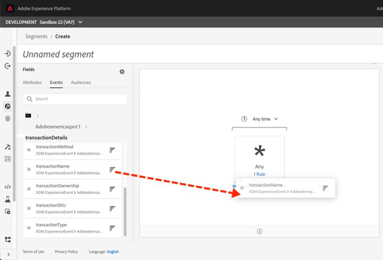</kbd>

17.	In the segment canvas, select the 'transactionMethod' event. A container will appear below to configure the rule for the event.  In the text box to the right of equals, type “broker” and press ‘Enter’

	<kbd>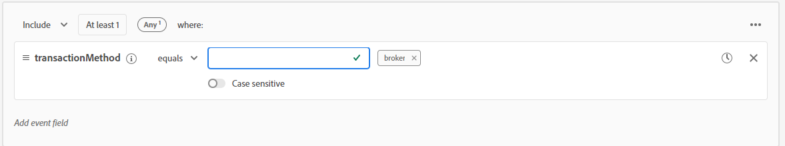</kbd>

18.  In the segment canvas, select the 'transactionName' event.  In the event rule container, change the condition from equals to contains.  In the text box to the right of contains, type "IRA" and press 'Enter'

       <kbd>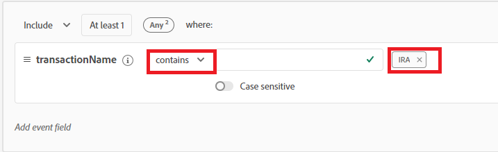</kbd>

19.  At the top of the ‘Events’ canvas, update the time value to ‘In last 24 Hour(s)’

	<kbd>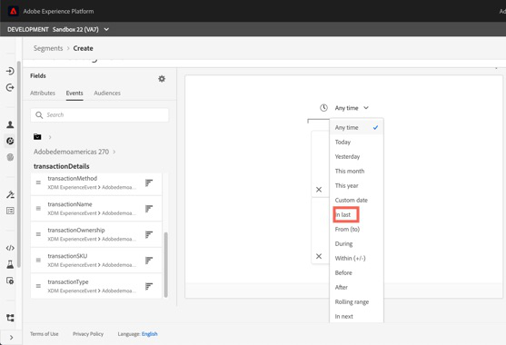</kbd>

20.	Enter the segment name “Female IRA customer working with Broker” followed by your Student ID (e.g. “Female IRA customer working with Broker 025”)
	 Enter the same value as the description   
	
	<kbd></kbd>
           
21.	Save the Segment
           
      <kbd></kbd>  
 
 
 
 

Return to [Lab Agenda Directory](https://github.com/adobe/AEP-Hands-on-Labs/blob/master/labs/fsi/README.md#lab-agenda)
 
 
