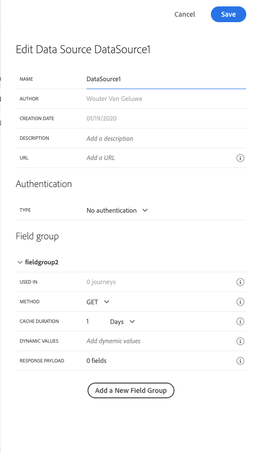

## Exercise 12.2 - Define an External Data Source

In this exercise, you'll create a custom External Data Source by making use of Journey Orchestration in combination with Adobe Experience Platform

Go to [https://experience.adobe.com/#/@adobeamericaspot1/home](https://experience.adobe.com/#/@adobeamericaspot1/home)

You'll see the ``Adobe Experience Cloud``-homepage.

Click on ``Journey Orchestration``.
 

Next, you'll see the ``Journey Orchestration``-homepage.

In the menu, click on ``Data Sources``.

You'll then see the ``Data Sources``-list.

Click ``Add`` to start adding your data source.

You'll see an empty data source popup.

We will use ``Open Weather Map``-service. For reference you can go to [https://openweathermap.org/](https://openweathermap.org/).

Back to ``Journey Orchestration``, to your empty ``External Data Source``-popup.
 

As a Name for the Data Source, use **weatherApiemailAddress** and replace **emailAddress** with your emailAddress. In this example, the Data Source Name is **weatherApiPuchadha**.

Set Description to: **Access to the Open Weather Map**.

The URL for the Open Weather Map API is: ``http://api.openweathermap.org/data/2.5/weather?units=metric``

Next, you need to select the Authentication to use. 

Use these variables:

| Field               | Value              |
|:-----------------------:| :-----------------------|
| Type            |**API key**            |
| Name           | **APPID**         |
| Value           | **your API Key**         |
| Location           | **Query Parameter**         |

Finally, you need to define a ``FieldGroup``, which is basically the request you'll be sending to the Weather API. In our case, we want to use the name of the City to request the Current Weather for that City.

According to the Weather API Documentation, we need to send a parameter ``q=City``.

In order to match the expected API Request, configure your FieldGroup as follows:

**IMPORTANT** 

The Field group name has to be unique, please use this naming convention: **WeatherByCityLdap** so in this case, the name should be **WeatherByCityVangeluw**

For the Response Payload, you need to paste an example of the Response that will be sent by the Weather API.

You can find the expected API JSON Response on the API Documentation page [here](https://openweathermap.org/current).

Or you can copy the JSON Response from here:

``
{"coord": { "lon": 139,"lat": 35},
  "weather": [
    {
      "id": 800,
      "main": "Clear",
      "description": "clear sky",
      "icon": "01n"
    }
  ],
  "base": "stations",
  "main": {
    "temp": 281.52,
    "feels_like": 278.99,
    "temp_min": 280.15,
    "temp_max": 283.71,
    "pressure": 1016,
    "humidity": 93
  },
  "wind": {
    "speed": 0.47,
    "deg": 107.538
  },
  "clouds": {
    "all": 2
  },
  "dt": 1560350192,
  "sys": {
    "type": 3,
    "id": 2019346,
    "message": 0.0065,
    "country": "JP",
    "sunrise": 1560281377,
    "sunset": 1560333478
  },
  "timezone": 32400,
  "id": 1851632,
  "name": "Shuzenji",
  "cod": 200
}
``

Copy the above JSON Response to your clipboard, then go to your custom Data Source configuration screen.

Click the ``Edit Payload``-icon.

You'll see a popup where you now have to paste the above JSON Reponse.

Paste your JSON Response.

Click ``Save``.

Your custom Data Source configuration is now complete. Scroll up and click ``Save``.

Your Data Source has now been created successfully and is part of the ``Data Sources``-list.

---

Next Step: [Exercise 3 - Define a Custom Action](./Exercise3-Action.md)

