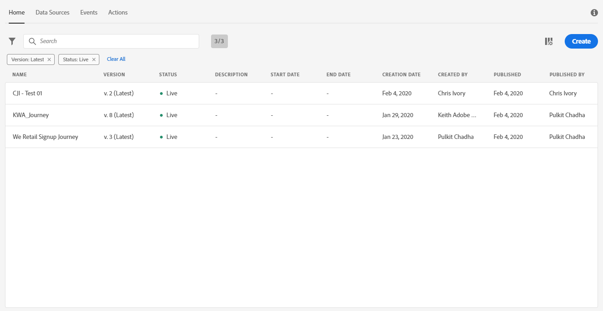
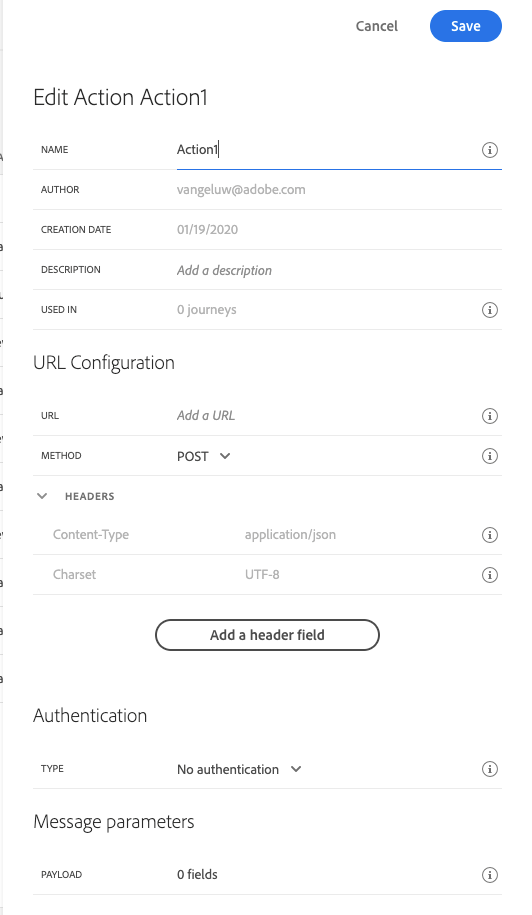

## Exercise 3 - Define Custom Actions

In this exercise, you'll create 2 custom Actions by making use of Journey Orchestration in combination with Adobe Experience Platform

Go to [https://experience.adobe.com/#/@adobeamericaspot1/home](https://experience.adobe.com/#/@adobeamericaspot1/home)

You'll see the ``Adobe Experience Cloud``-homepage.

Click on ``Journey Orchestration``.
 

Next, you'll see the ``Journey Orchestration``-homepage.

In the menu, click on ``Actions``.

You'll then see the ``Actions``-list.

You'll define 2 actions:

* 1 Action that sends an SMS using an external application, Nexmo
* 1 Action that sends a text to a Slack channel

### Action: Send SMS using Nexmo

Nexmo is a 3rd party provider of SMS Messages. It has an easy-to-use API and we'll use Journey Orchestration to trigger their API.

Click ``Add`` to start adding your action.

You'll see an empty Action popup.

As a Name for the Action, use **smsNexmoemailAddress** and replace **emailAddress** with your LDAP. In this example, the Action Name is **smsNexmoPuchadha**.

For the ``URL Configuration``, use this:

* URL: ``https://rest.nexmo.com/sms/json``
* Method: ``POST``

You don't need to change the Header Fields.

(For transparency, we're using an AWS API Gateway and AWS Lambda function that sits behind the above URL to handle the authentication and sending of SMSs to Nexmo.)

``Authentication`` should be set to ``No Authentication``.

For the ``Message Parameters``, you need to define which fields should be sent towards Nexmo. Logically, we want Journey Orchestration and Adobe Experience Platform to be the brain of personalization, so the SMS Message Text and the Mobile Number to send the SMS towards should be defined by Journey Orchestration and then sent to Nexmo for execution.

So for the ``Message Parameters``, click the ``Edit Payload``-icon.

You'll then see an empty popup-window. 

Copy the below text and paste it in the empty popup-window.

``
{
	"body": {
		"textMessage": {
			"toBeMapped": true,
			"dataType": "string",
			"label": "textMessage"
		},
		"to": {
			"toBeMapped": true,
			"dataType": "string",
			"label": "mobileNr"
		}
	}
}
``

FYI: by specifying the below fields, these fields will become accessible from your Customer Journey and you'll be able to populate them dynamically from the Journey:

**"toBeMapped": true,**

**"dataType": "string",**

**"label": "textMessage"**

You'll then see this:

Click ``Save``.

Scroll up and click ``Save`` one more time to save your custom Action.

Your custom Action is now part of the ``Actions``-list.

Let's define your second action now.

You've now defined Events, Data Sources and Actions - let's consolidate all of that in 1 Orchestrated Journey.

---

Next Step: [Exercise 14 - Design a trigger-based Customer Journey](./Exercise4-Journey.md)

