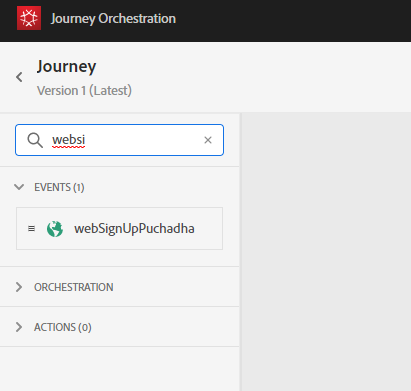
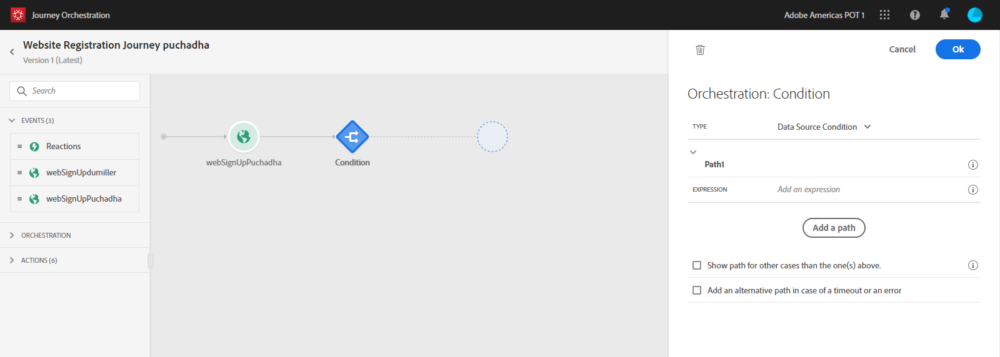
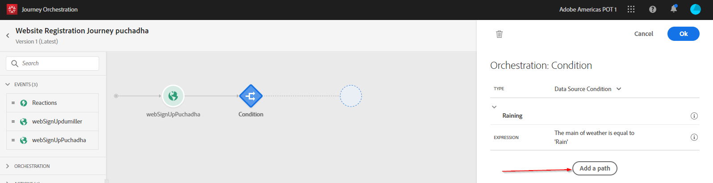

## Exercise 4 - Design a trigger-based Customer Journey

In this exercise, you'll create an Orchestrated Journey by making use of Journey Orchestration in combination with Adobe Experience Platform

Go to [https://experience.adobe.com/#/@adobeamericaspot1/home](https://experience.adobe.com/#/@adobeamericaspot1/home)

You'll see the ``Adobe Experience Cloud``-homepage.

Click on ``Journey Orchestration``.
 

Next, you'll see the ``Journey Orchestration``-homepage, which shows all existing Journeys.

Click ``Create`` to start creating your Journey.

You'll then see a new, blank Journey.

You should first name your Journey.

As a Name for the Journey, use **Website Registration Journey emailAddress** and replace **emailAddress** with LDAP. In this example, the Journey Name is **Website Registration Journey puchadha**. No other values must be set at this moment.

Click ``OK``.

On the left side of your screen, have a look at ``Events``. You should see your previously create Event in that list. Select it, then drag and drop it on the Journey Canvas.

Your Journey then looks like this:

Next, click on ``Orchestration``.

You now see ``Orchestration``-capabilities. 

Select ``Condition``, then drag and drop it on the Journey Canvas.

You now have to define 2 conditions: 

* It's Raining
* It's Clear

Let's define the first condition.

#### Condition 1: It's Raining

Click on the ``Condition``.

Click on the ``Edit``-icon for the expression of Path1.

You'll then see an empty ``Simple Editor``-screen.

Our query will be a bit more advanced, so we'll need the ``Advanced Mode``.
Click ``Advanced Mode``.

You'll then see the ``Advanced Editor`` which allows code entry.

Select the below code and paste it in the ``Advanced Editor``.

``##{weatherApiPuchadha.WeatherByZipemailAddress.weather.main} == 'Rain'`` (replace emailAddress)

You'll then see this.

In order to retrieve the temperature as part of this Condition, you need to provide the zipCode in which the customer currently is.
The ``zipCode`` needs to be linked to the dynamic parameter ``zip``.

Click the field ``dynamic val: zip`` as indicated in the screenshot.

You then need to find the field that contains the current zip code of the customer in the AEP Data Sources. Here we are leveraging the unified profile data in AEP to get the profiles zip code.

You can navigate the field structure from the panel or simply paste the expression below into the expression text box.
``#{ExperiencePlatform.ProfileFieldGroup.profile.homeAddress.postalCode}`` 

Click ``OK``.

Rename the path from path1 to 'Raining'

Next, we'll add the 2nd condition.

#### Condition 2: Its Clear

After having added the first condition, you'll see this screen.

Click ``Add Path``.

Click on the ``Edit``-icon for the expression of Path2.

You'll then see an empty ``Simple Editor``-screen.

Our query will be a bit more advanced, so we'll need the ``Advanced Mode``.
Click ``Advanced Mode``.

You'll then see the ``Advanced Editor`` which allows code entry.

Select the below code and paste it in the ``Advanced Editor``.

``#{weatherApiLdap.WeatherByCityLdap.main.temp} > 10 and #{weatherApiLdap.WeatherByCityLdap.main.temp} <= 25`` (Replace Ldap by your LDAP)

You'll then see this.

In order to retrieve the temperature as part of this Condition, you need to provide the city in which the customer currently is.
The ``City`` needs to be linked to the dynamic parameter ``q``, just like we saw previously in the Open Weather API Documentation.

Click the field ``dynamic val: q`` as indicated in the screenshot.

You then need to find the field that contains the current city of the customer in one of the available Data Sources. 

You can find the field by navigating to ``geofenceEntryLdap._experienceplatform.locationService.currentPoiCity`` (Replace Ldap by your LDAP). By clicking that field, it will be added as the dynamic value for the parameter ``q``. This field will be populated by f.i. the geolocation-service that you've implemented in your Mobile App.

Click ``OK``.

Next, we'll add the 3nd condition.

#### Path 1

For each of the temperature contexts, we'll attempt to send an SMS Message to our customer. We can only send an SMS if we have a Mobile Number available for a customer, so we'll first have to verify that we do.

Let's focus on ``Path1``.

Let's take another ``Condition``-element and drag it as indicated in the screenshot above. We'll verify if for this customer, we have a mobile number available.
 

Click on the ``Edit``-icon for the Expression for Path1.

In the Data Sources, navigate to ``ExperiencePlatformDataSource.ProfileFieldGroup.profile.mobilePhone.number``. You're now reading the mobile phone number directly from Adobe Experience Platform's Real-time Customer Profile.

Select the field ``Number``, then drag and drop it to the Condition Canvas.

Select the operator ``is not empty``.

Click ``Accept``.

You'll then see this:

Click ``OK``.

Your Journey will then look like this. Click on ``Actions`` as indicated in the screenshot.

Select the smsTwilioLdap - action (verify your LDAP), then drag and drop it after the condition you just added.

You'll see a popup.

Navigate to the ``Action Parameters``.

Click on the ``Edit``-icon for the Action Paramater ``TEXTMESSAGE``.

In the popup you'll see, click on ``Advanced Mode``.

Select the below code, copy it and paste it in the ``Advanced Mode Editor``.

``"Brrrr..." + #{ExperiencePlatformDataSource.ProfileFieldGroup.profile.person.name.firstName} + " It's freezing. 20% discount on Jackets today!"``

Click ``OK``.

Click on the ``Edit``-icon for the Action Paramater ``MOBILENR``.

You'll see a popup with the ``Simple Mode Editor``.

In the popup you'll see, click on ``Advanced Mode``.

Paste this code in the ``Advanced Mode Editor``. Click ``OK``.

``substr(#{ExperiencePlatformDataSource.ProfileFieldGroup.profile.mobilePhone.number}, 0, 12)``

Click ``OK``.

In the left menu, go back to ``Actions``, select the Action ``textSlackLdap``, then drag and drop it after the ``smsTwilioLdap``-Action (Replace Ldap by your LDAP).

Go to ``Action Parameters`` and click the ``Edit``-icon for the parameter ``TEXTTOSLACK``.

In the popup-window, click ``Advanced Mode``.

Select the below code, copy it and paste it in the ``Advanced Mode Editor``.

``"Brrrr..." + #{ExperiencePlatformDataSource.ProfileFieldGroup.profile.person.name.firstName} + " It's freezing. 20% discount on Jackets today!"``

Click ``OK``.

Click ``OK``.

In the left menu, go to ``Orchestration``, select ``End``, then drag and drop ``End`` after the ``textSlackLdap``-Action.

#### Path 2

For each of the temperature contexts, we'll attempt to send an SMS Message to our customer. We can only send an SMS if we have a Mobile Number available for a customer, so we'll first have to verify that we do.

Let's focus on ``Path2``.

Let's take another ``Condition``-element and drag it as indicated in the screenshot above. We'll verify if for this customer, we have a mobile number available.
 

Click on the ``Edit``-icon for the Expression for Path1.

In the Data Sources, navigate to ``ExperiencePlatform.ProfileFieldGroup.profile.mobilePhone.number``. You're now reading the mobile phone number directly from Adobe Experience Platform's Real-time Customer Profile.

Select the field ``Number``, then drag and drop it to the Condition Canvas.

Select the operator ``is not empty``.

Click ``Accept``.

You'll then see this:

Click ``OK``.

Your Journey will then look like this. Click on ``Actions`` as indicated in the screenshot.

Select the smsTwilioLdap - action (verify your LDAP), then drag and drop it after the condition you just added.

You'll see a popup.

Navigate to the ``Action Parameters``.

Click on the ``Edit``-icon for the Action Paramater ``TEXTMESSAGE``.

In the popup you'll see, click on ``Advanced Mode``.

Select the below code, copy it and paste it in the ``Advanced Mode Editor``.

``"What a nice spring weather, " + #{ExperiencePlatformDataSource.ProfileFieldGroup.profile.person.name.firstName} + " 20% discount on Sweaters today!"``

Click ``OK``.

Click on the ``Edit``-icon for the Action Paramater ``MOBILENR``.

You'll see a popup with the ``Simple Mode Editor``.

In the popup you'll see, click on ``Advanced Mode``.

Paste this code in the ``Advanced Mode Editor``. Click ``OK``.

``substr(#{ExperiencePlatformDataSource.ProfileFieldGroup.profile.mobilePhone.number}, 0, 12)``

Click ``OK``.

In the left menu, go back to ``Actions``, select the Action ``textSlackLdap``, then drag and drop it after the ``smsTwilioLdap``-Action. (Replace Ldap by your LDAP)

Go to ``Action Parameters`` and click the ``Edit``-icon for the parameter ``TEXTTOSLACK``.

In the popup-window, click ``Advanced Mode``.

Select the below code, copy it and paste it in the ``Advanced Mode Editor``.

``"What a nice spring weather, " + #{ExperiencePlatformDataSource.ProfileFieldGroup.profile.person.name.firstName} + " 20% discount on Sweaters today!"``

Click ``OK``.

In the left menu, go to ``Orchestration``, select ``End``, then drag and drop ``End`` after the ``textSlackLdap``-Action.

Click ``OK``.

In the left menu, go back to ``Actions``, select the Action ``textSlackLdap``, then drag and drop it after the ``smsTwilioLdap``-Action.

Go to ``Action Parameters`` and click the ``Edit``-icon for the parameter ``TEXTTOSLACK``.

In the popup-window, click ``Advanced Mode``.

Select the below code, copy it and paste it in the ``Advanced Mode Editor``.

``"So warm, " + #{ExperiencePlatformDataSource.ProfileFieldGroup.profile.person.name.firstName} + "! 20% discount on Swimming Trunks today!"``

Click ``OK``.

Click ``OK``.

In the left menu, go to ``Orchestration``, select ``End``, then drag and drop ``End`` after the ``textSlackLdap``-Action.

Your Journey is now fully configured.

Click ``Pubish``.

Click ``Publish``.

Your Journey is now published.

---

Next Step: [Exercise 5 - Trigger your Orchestrated Customer Journey](./ex5.md)

