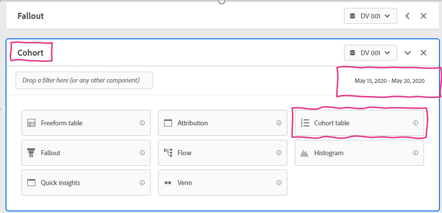
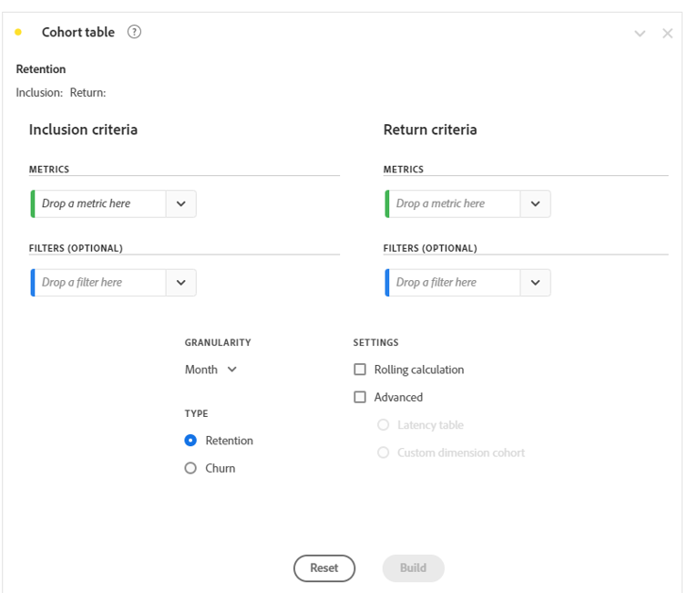
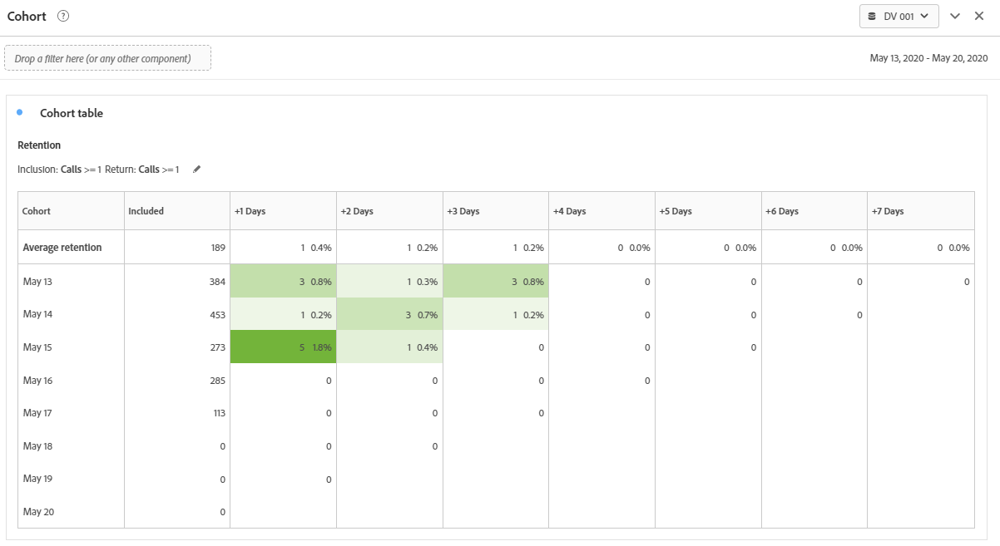

Lab  - Cohort
==========
<table style="border-collapse: collapse; border: none;" class="tab" cellspacing="0" cellpadding="0">

<tr style="border: none;">

<td width="600" style="border: none;">
<table>
<tbody valign="top">
      <tr width="500">
            <td valign="top"><h3>Objective:</h3></td>
            <td valign="top"> This lab will show you how to measure downstream behavior through Cohort Tables            </td>
     </tr>
     <tr width="500">
           <td valign="top"><h3>Prerequisites:</h3></td>
           <td valign="top"> none
           </td>
     </tr>
</tbody>
</table>
</td>

<td style="border: none;" valign="top">

<table>
<tbody valign="top">
      <tr>
            <td valign="middle" height="70"><b>section</b></td>
            <td valign="middle" height="70">CJA</td>
      </tr>
      <tr>
            <td valign="middle" height="70"><b>version</b></td>
            <td valign="middle" height="70">1.0.10</td>
      </tr>
      <tr>
            <td valign="middle" height="70"><b>date</b></td>
            <td valign="middle" height="70">2021-05-24</td>
      </tr>
</tbody>
</table>
</td>

</tr>
</table>

We just reviewed Fallout visualizations, now let's move onto Cohorts.

**COHORT**

The Cohort Table allows us to measure downstream behavior after an event of interest.
In this case, we want to understand customer call behaviors. Specifically, we want to understand the repeat call behaviors of those customers.

1. Create a new panel below the last panel we just worked on, title it “Cohort”, ensure your date range for POT5 is March 18-30, 2020 and select the Cohort Table visualization.

<kbd></kbd>

   The Cohort table is a sophisticated visualization with many different configuration options. We’ll use it for a basic analysis use-case in this exercise, but know that it can support much more complex use-cases.
   
The Cohort table configuration should look like this:

<kbd></kbd>

- The **Inclusion Criteria** allows you to set a metric as Day 0. Anyone that has this event will fall into Day 0. Filters can be applied to be very specific about the event criteria.
 
- The **Return Criteria** allows you to set a metric as the event that will happen in the future that you want to measure. Anyone that met the inclusion criteria and then meets the return criteria will be measured.

Let's say we want to measure people that call and then understand if they call again in the future. In that case, the Inclusion Criteria as well as the Return Criteria will be the Calls metric.

2. Drag the "Calls" metrics to the "Inclusion Criteria Metrics" and "Return Criteria Metrics" drop zones.
      - Set the granularity to "Day" since we want to see the data over days
      - Click "Build"

<kbd></kbd>

The resulting Cohort Table shows the number of people who called by day as well as the number of people that called back in the + Days after that call:

<kbd></kbd>

There aren't a lot of people with repeat calls, but there are some.
- For example, there were 234 calls on March 18. By March 30 (12 days later), 13 of those calls were repeat callers

To dig deeper, you could also add Call Reason filters to the Inclusion and Return Criteria to see if they are calling for the same or different reasons. Go on and try it!

### This completes the excercise on Cohorts
Next we will review [Sequential Filtering](https://github.com/adobe/AEP-Hands-on-Labs/blob/master/labs/retail/Foundations/CJA-SequentialFiltering.md)

