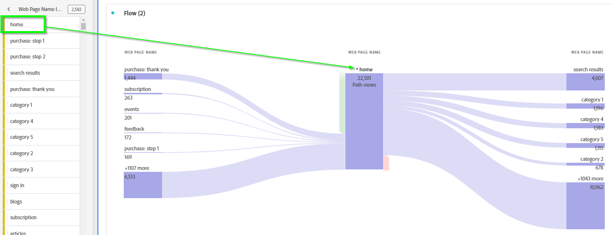
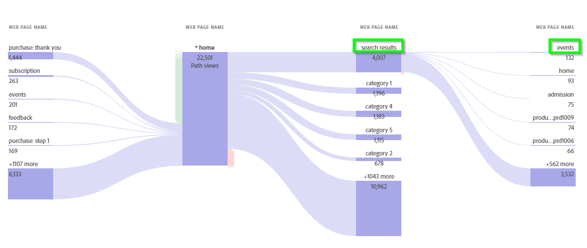
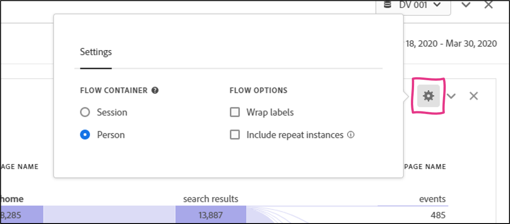
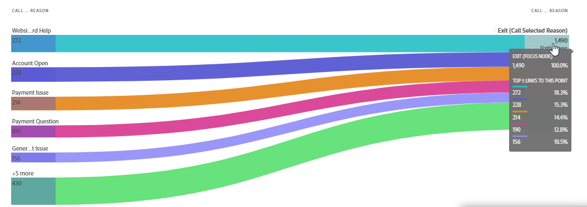
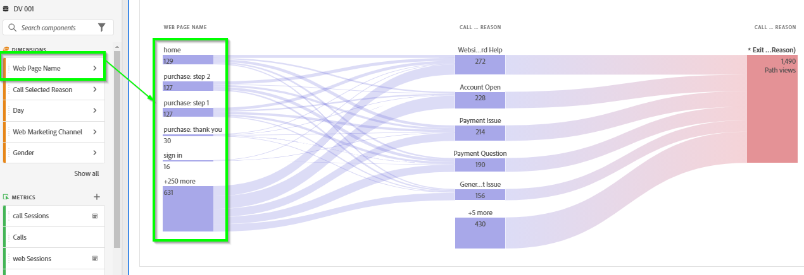
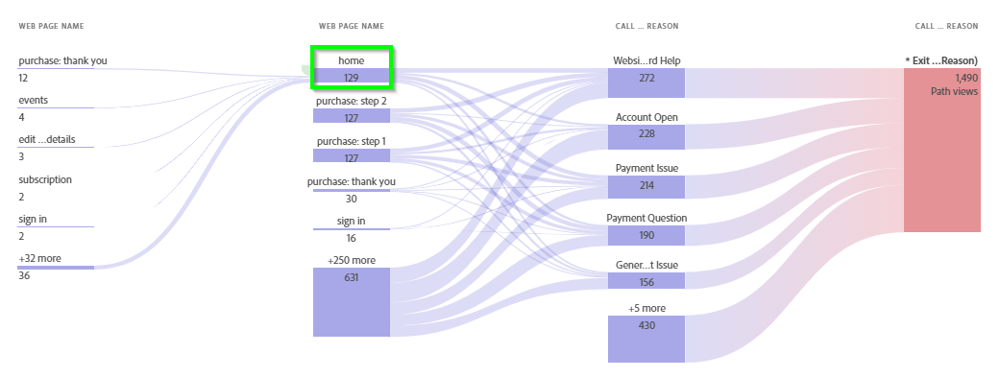

Lab  - Flow Visualization
==========
<table style="border-collapse: collapse; border: none;" class="tab" cellspacing="0" cellpadding="0">

<tr style="border: none;">

<td width="600" style="border: none;">
<table>
<tbody valign="top">
      <tr width="500">
            <td valign="top"><h3>Objective:</h3></td>
            <td valign="top"> This lab will show how to analyze customer journeys with Flow visualizations
            </td>
     </tr>
     <tr width="500">
           <td valign="top"><h3>Prerequisites:</h3></td>
           <td valign="top"> none
           </td>
     </tr>
</tbody>
</table>
</td>

<td style="border: none;" valign="top">

<table>
<tbody valign="top">
      <tr>
            <td valign="middle" height="70"><b>section</b></td>
            <td valign="middle" height="70">CJA</td>
      </tr>
      <tr>
            <td valign="middle" height="70"><b>version</b></td>
            <td valign="middle" height="70">1.0.10</td>
      </tr>
      <tr>
            <td valign="middle" height="70"><b>date</b></td>
            <td valign="middle" height="70">2021-05-24</td>
      </tr>
</tbody>
</table>
</td>

</tr>
</table>

Now that we completed the Attribution IQ lab let's review Flow Visualizations.

**FLOW**

The Flow visualization is very powerful for understanding customer journeys in a single channel or across channels. This analysis is perfect for our use-case.

1. Click the "+" beneath the last panel that you created to create a new panel.
      - Title it “Flow” and ensure your date range for POT6 is May 13-20, 2020
      - Select the Flow visualization and this will bring you to the Flow visualization configuration view:

<kbd></kbd>

**Notes on Dimension configuration:** 
- Dropping a dimension as the Entry point will show the top first values seen in that dimension either at a Session or Person level
- Dropping a dimension as the Exit point will show the top last values seen for a dimension at a Session or Person level
- Dropping a dimension or a dimensional element in the middle will show you how often that element is the entry or exit, as well as the top elements a person saw prior or after from a pathing perspective. This can also be configured at the Session or Person level.

Let's try this from a Web Pathing perspective to start with.

2. From the Components menu, click on the arrow to the right of the “Web page name” dimension.
      - Click on “Show items from last X months” until the values show up
      - Drag the “home” page and drop it into the center drop zone for the Flow visualization:

<kbd></kbd>

This is what your panel should look like now:

<kbd></kbd>

_(If you get 0 results make sure you're using the correct date range and that you're in the DV 001 Data View)_

This view allows you to see:
      - how many people enter the site at the home page 
      - how many people exit the site at the home page 
      - the top pages that drive customers to the home page
      - the top pages that customers go to from the home page

3. Click on the "search results" page on the branch on the right to see where customers go to from there.
      - Then right-click on the "events" node within the branch to the right to see the various options as it relates to digging deeper into this data

<kbd></kbd>

   Selecting "Create filter for this path" will create a filter based on customers that follow that specific path. This becomes an interesting way to do further analysis around the types of customers that follow a specific path.

4. Click the gear in the top right of the visualization to bring up the Flow Settings menu. From here we can define if we want to see paths at a Session or Person level.

<kbd></kbd>

_No action needed in this view_

5. From the Visualizations menu, drag a Flow visualization beneath the Flow visualization we just built and drop it in the panel we're working on.

<kbd></kbd>

Let's go back to the use case that we've been working on: Understanding how customers navigate from Web to the Call Center. We want to understand the journey that customers are taking from the web site into the call center. To do this, we will start with call reason.

6. Drag the “New Accounts" dimension and drop it in the Exit drop zone:

<kbd></kbd>

  This shows us the top Call Reasons for customer calls into the call center.

One very powerful capability the Flow visualization supports is the ability to mix and match the dimensions being used.

7. Drag the “Web page name" dimension and drop it to the left of the “Call Reason" values on the left side of the visualization when you get the blue "Add" box.
The result is a view into the top pages customers interact with prior to a call, broken out by call type:

<kbd></kbd>

8. Drill into the "home" page to see what customers interact with prior to that on their path to a call.

<kbd></kbd>

This can be very powerful in understanding customer journeys across channels.

### This completes the Flow Visualization excercise in CJA
Next we will review how to create [Fallout](https://github.com/adobe/AEP-Hands-on-Labs/blob/master/labs/retail/Foundations/CJA-Fallout.md) charts

