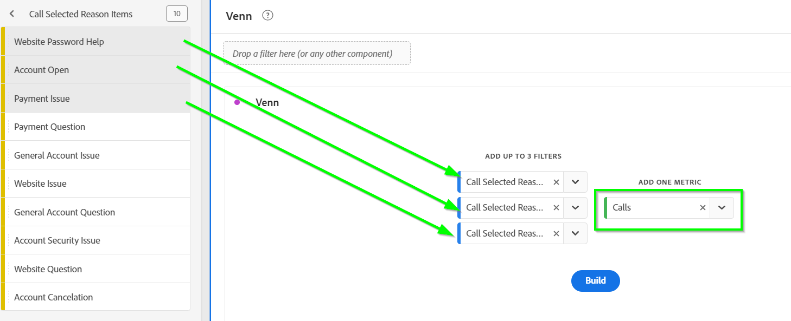
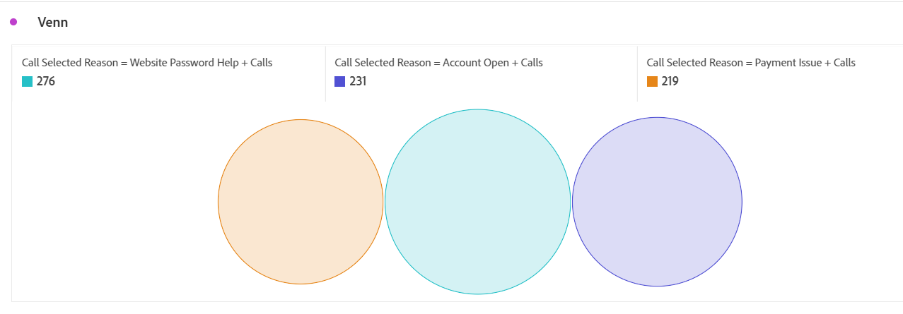
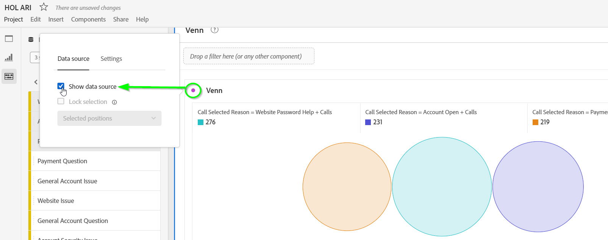
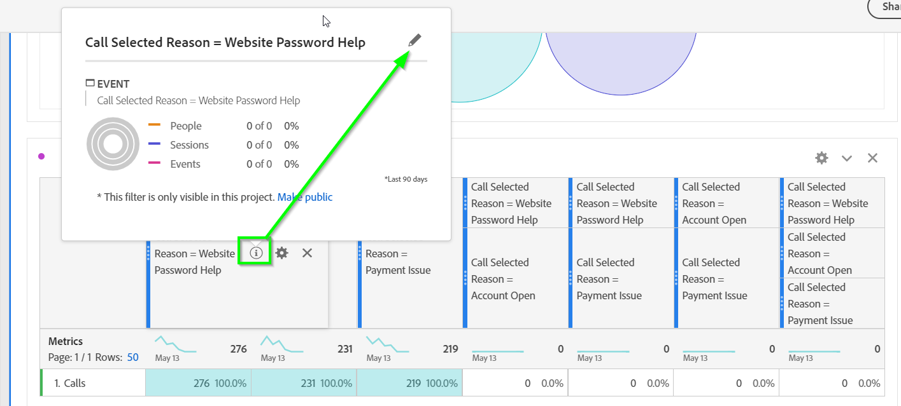
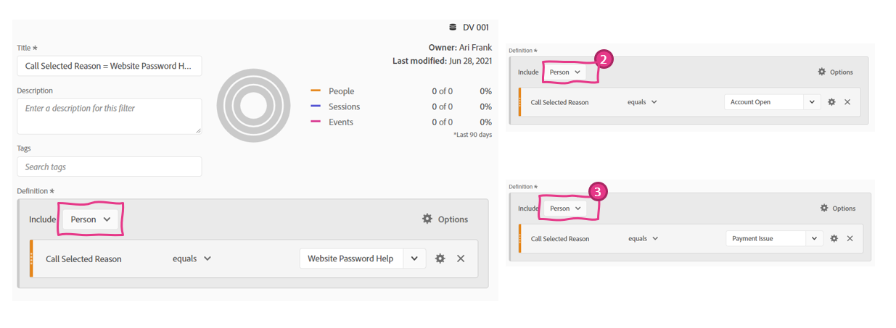
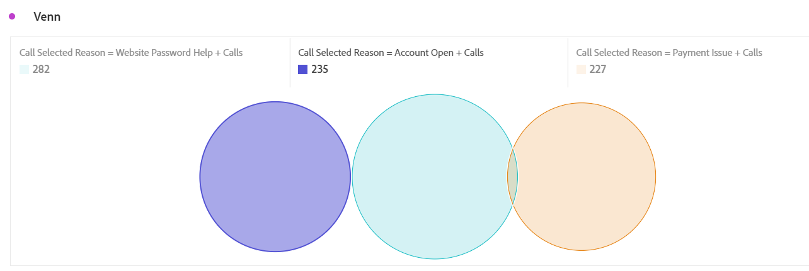

Lab  - Venn Visualization
==========
<table style="border-collapse: collapse; border: none;" class="tab" cellspacing="0" cellpadding="0">

<tr style="border: none;">

<td width="600" style="border: none;">
<table>
<tbody valign="top">
      <tr width="500">
            <td valign="top"><h3>Objective:</h3></td>
            <td valign="top"> This lab shows how to understand cross-over performance with Venn Visualizations</td>
     </tr>
     <tr width="500">
           <td valign="top"><h3>Prerequisites:</h3></td>
           <td valign="top"> none
           </td>
     </tr>
</tbody>
</table>
</td>

<td style="border: none;" valign="top">

<table>
<tbody valign="top">
      <tr>
            <td valign="middle" height="70"><b>section</b></td>
            <td valign="middle" height="70">CJA</td>
      </tr>
      <tr>
            <td valign="middle" height="70"><b>version</b></td>
            <td valign="middle" height="70">1.0.10</td>
      </tr>
      <tr>
            <td valign="middle" height="70"><b>date</b></td>
            <td valign="middle" height="70">2021-05-24</td>
      </tr>
</tbody>
</table>
</td>

</tr>
</table>

Now that we've completed the Sequential Filtering lab, let's review Venn diagrams.

**VENN**

The Venn Visualization is great for measuring cross-over between events, sessions, or people, as it allows us to visually represent the cross-over. Let's use it to measure the crossover between different call reasons. We'll take the top 3 reasons and create a Venn Visualization that allows us to see cross-over at a Person level.

1. Create a new panel below the last panel we just worked on, title it “Venn”, ensure your date range for POT6 is May 13-20, 2020 and select the Venn visualization
      - Drag the top 3 “Call reason” individually into the Filters zone
      - From the “Add One Metric” dropdown, select the "Calls" metric (alternatively, you can drag & drop the Calls metric from Components into the Metric drop zone)
      - Click "Build"

<kbd></kbd>

The Venn visualization defaults to an Event level analysis:

<kbd></kbd>

There are no Events where a customer calls about 2 reasons, therefore there is no overlap.

Lets configure this to be at the Person level.

2. Click the round dot in the top left corner of the visualization to open the Data Sources Settings and select "Show Data Source":

<kbd></kbd>

**Note**: The Venn visualization automatically creates a hidden table with some virtual Filters upon clicking “Build.” We are unhiding the table so we can edit the level of the Filters.

3. In the table, click the “i" to the right of the first Filter to see the level of the filter (Event) and then click on the pencil to open it up in the Filter Builder:

<kbd></kbd>

4. Change the "Include Event" to "Include Person" and Click Save.
      - Do the same for the next 2 filters and review the resulting Venn visualization:

<kbd></kbd>

Although there isn't a lot of overlap, there is some:

<kbd></kbd>

You can hover over the Venn circles to see the exact overlap:
- 95 Calls where the reason was Payment Issue & Account Password Help
- 84 Calls where the reason was Account Password Help & Order Created
- 84 Calls where the reason was Payment Issue & Order Created

**NOTE:** If you want to hide the table from view, click on the round dot in the top left corner of the Venn visualization and deselect the checkbox to “Show Data Source”

### Well done, this completes the last section of the CJA lab!

