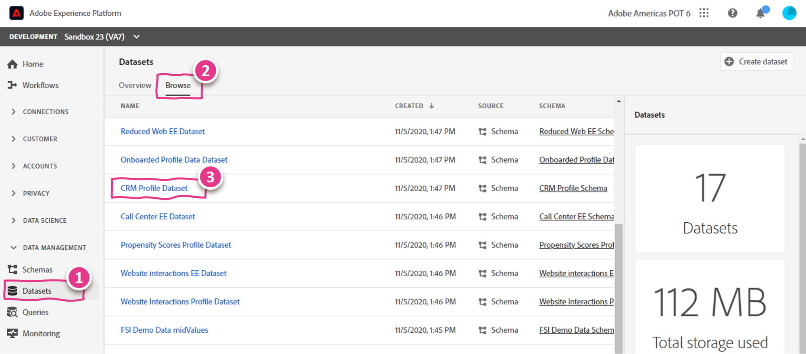
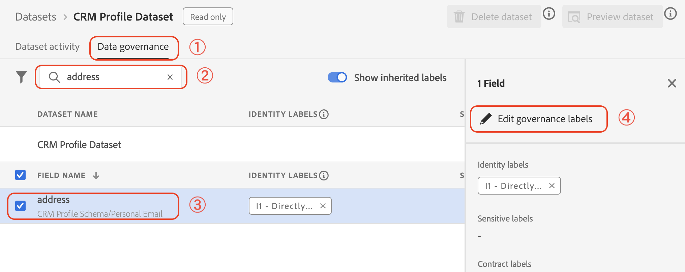
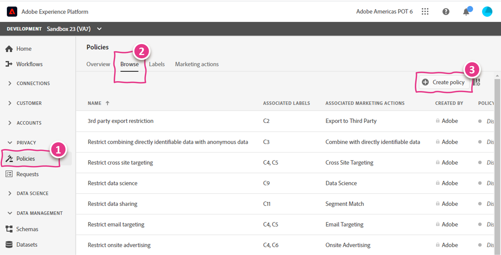
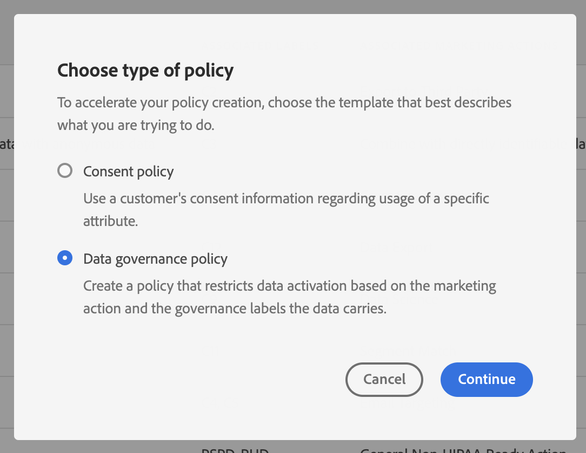
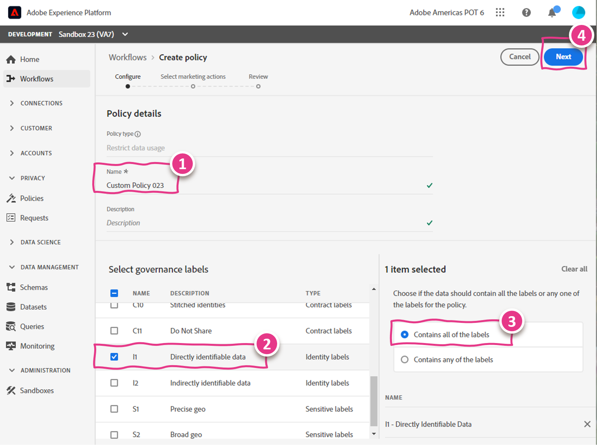
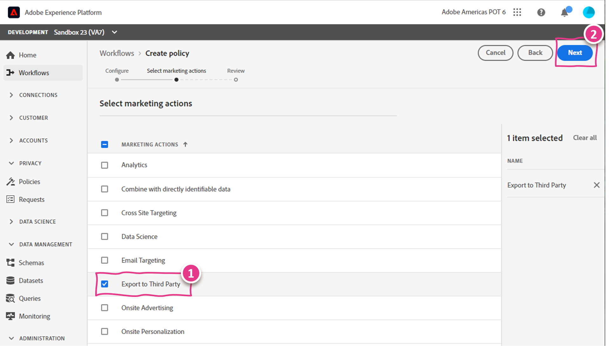
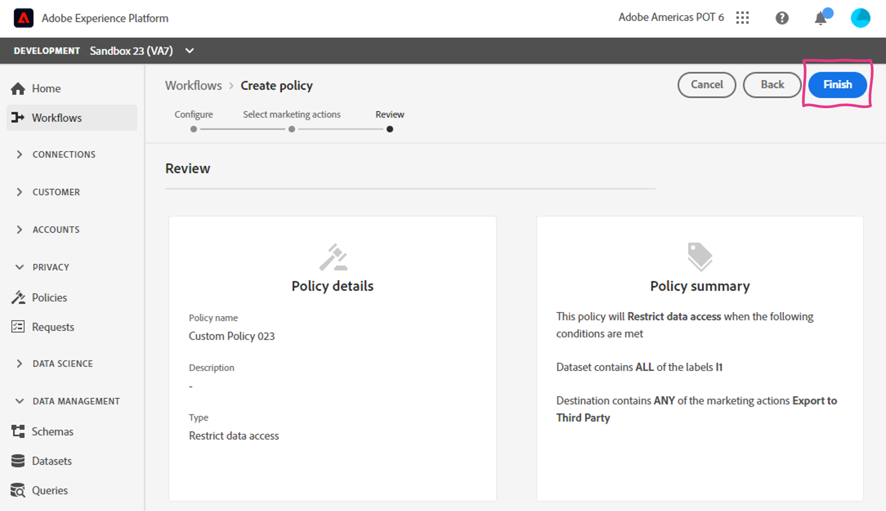

# Lab - DULE - Apply Data Usage Label and Create Custom Data Usage Policy

<table style="border-collapse: collapse; border: none;" class="tab" cellspacing="0" cellpadding="0">

<tr style="border: none;">

<td width="600" style="border: none;">
<table>
<tbody valign="top">
      <tr width="500">
            <td valign="top"><h3>Objective:</h3>
            </td>
            <td valign="top"> この実習では、データセット フィールドにデータ使用ラベルを適用する方法と、カスタム データ使用ポリシーを作成する方法を説明します。
            </td>
     </tr>
     <tr width="500">
           <td valign="top"><h3>Prerequisites:</h3></td>
           <td valign="top"> <li>dataset in place</li>
           </td>
     </tr>
</tbody>
</table>
</td>

<td style="border: none;" valign="top">

<table>
<tbody valign="top">
      <tr>
            <td valign="middle" height="70"><b>section</b></td>
            <td valign="middle" height="70">
            </td>
      </tr>
      <tr>
            <td valign="middle" height="70"><b>version</b></td>
            <td valign="middle" height="70">1.0.1</td>
      </tr>
      <tr>
            <td valign="middle" height="70"><b>date</b></td>
            <td valign="middle" height="70">2020-04-10</td>
      </tr>
</tbody>
</table>
</td>

</tr>
</table>

まず "[https://platform.adobe.com/home](https://platform.adobe.com/home)"にアクセスしてください。 その後、次の手順に従ってください。

## Instructions:

1. 左側のメニューから、「 **Datasets** 」に移動します。「 **Browse** 」タブが表示されていることを確認します。スクロールダウンして、"**CRM Profile Dataset** "というデータセットを選択します。:

   

2. 「**Data governance**」タブをクリックします。「 **Search**」フィールドに" **address** "を入力して絞り込みます。「FIELD NAME」リストにある「 **address** 」を選択し" **Edit governance labels** "をクリック:

   

3. Edit governance labels オーバーレイで、"**IDENTITY LABELS** "を展開します。「 **I1** 」を選択し、「 **Save changes** 」ボタンをクリックします。:

   

   おめでとうございます。データセットフィールドに初めて「**data usage label**」を適用しました。簡単でしょう？

4. 左側のメニューから「 **Policies** 」（「**PRIVACY**」ドロップダウン内）に移動します。「 **Browse** 」タブにいることを確認します。右上の「 **＋ Create policy **」をクリックします。:

   

   "**Data governance policy**"を選択し"**Continue**"を選択:
   
   

5. **Policy Details**で、Nameに「 **Custom Policy[自分の番号]** 」を入力します。リストから" **I1** "ガバナンスレベルを選択します。右側の「 **Contains all of the labels** 」ラジオボタンが選択されていることを確認します。右上の "**Next** "ボタンをクリックします。:

   

6. " **Export to Third Party** "を選択し、右上の " **Next** "ボタンをクリックします。:

   

7. ポリシーを確認し、" **Finish** "をクリックします。:

   

おめでとうございます。カスタムデータ使用ポリシーを作成しました。
 
 
 

Return to [Lab Agenda Directory](https://github.com/adobe/AEP-Hands-on-Labs/blob/master/labs/retail/README.md#lab-agenda)
