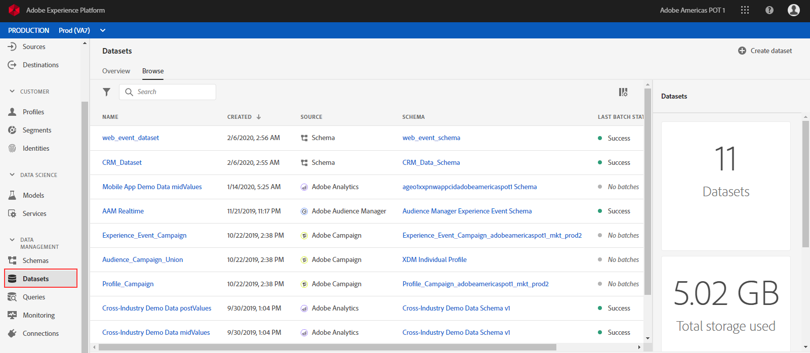
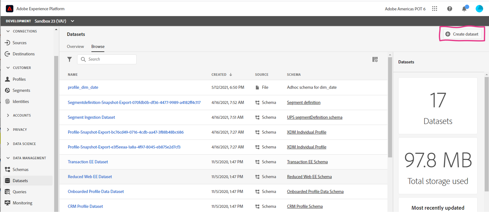
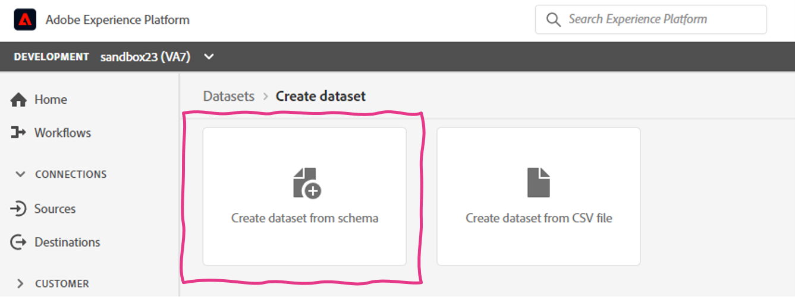
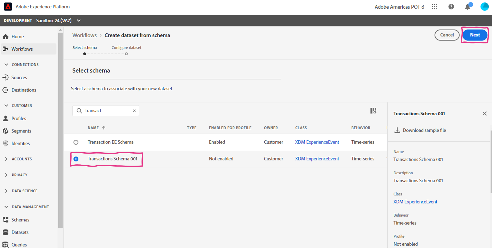
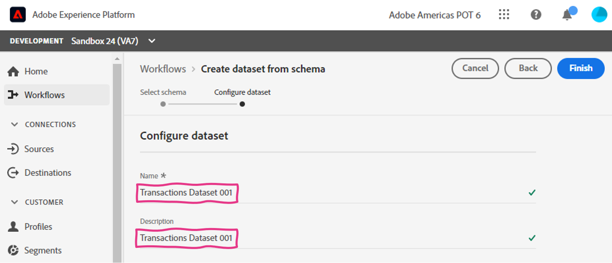
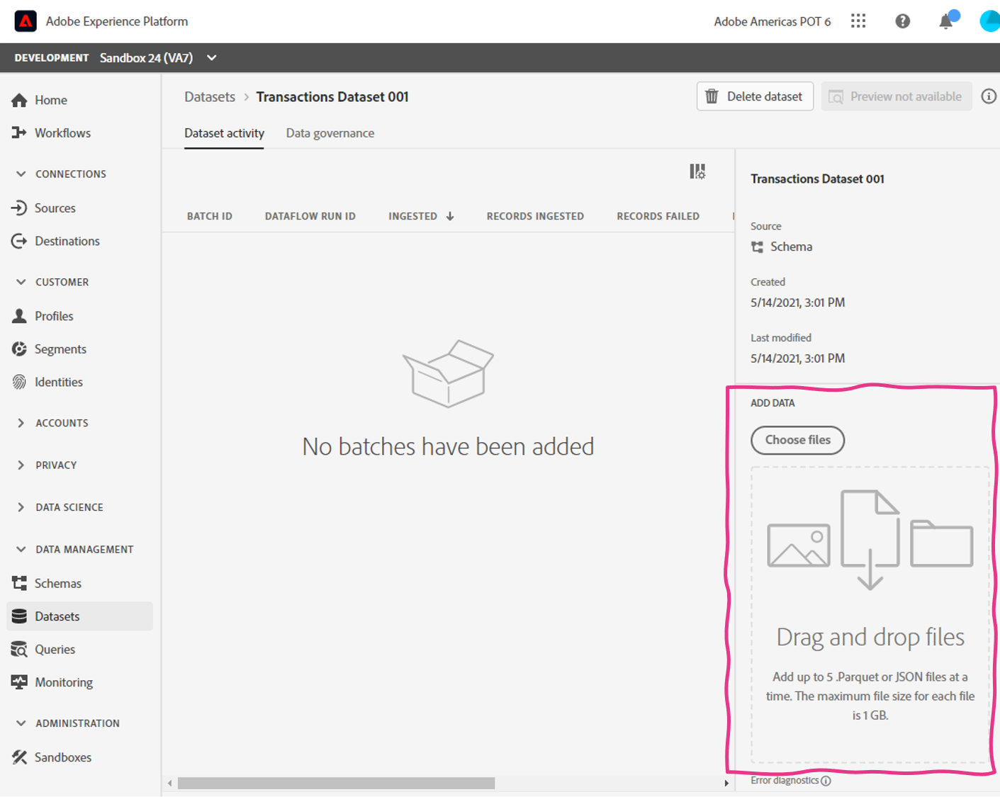
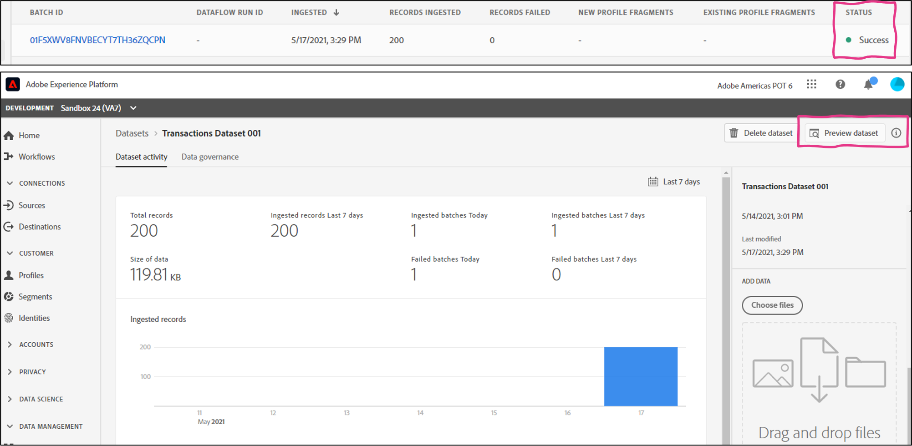

Lab 2.1 - Construct a Dataset from Schema
==========
<table style="border-collapse: collapse; border: none;" class="tab" cellspacing="0" cellpadding="0">

<tr style="border: none;">

<td width="600" style="border: none;">
<table>
<tbody valign="top">
      <tr width="500">
            <td valign="top"><h3>Objective:</h3></td>
            <td valign="top"> This short lab will show you the how to create a dataset
            </td>
     </tr>
     <tr width="500">
           <td valign="top"><h3>Prerequisites:</h3></td>
           <td valign="top"> 
                            <li>schema in place
           </td>
     </tr>
</tbody>
</table>
</td>

<td style="border: none;" valign="top">

<table>
<tbody valign="top">
      <tr>
            <td valign="middle" height="70"><b>section</b></td>
            <td valign="middle" height="70"></td>
      </tr>
      <tr>
            <td valign="middle" height="70"><b>version</b></td>
            <td valign="middle" height="70">1.0.1</td>
      </tr>
      <tr>
            <td valign="middle" height="70"><b>date</b></td>
            <td valign="middle" height="70">2020-01-06</td>
      </tr>
</tbody>
</table>
</td>

</tr>
</table>

Go to [https://platform.adobe.com/home](https://platform.adobe.com/home).

Instructions:
-----------------

We will be creating a dataset for the schema we created in the previous exercise. Please follow the steps below.
1. In the left-hand menu, navigate to "Datasets".

      
      
      
2. Click "+ Create dataset".

      
      
      
3. We will be creating the dataset from a schema, so please select "Create dataset from schema".

      
 
 
4. On the "Select schema" page, search for "Transactions Schema [your-assigned-number]" then select the schema and click "Next".
      
      
      
      
      
3. Name your dataset "Transactions Dataset [your-assigned-number]" and give it the same description.
      
      
       
 
 
4. Click Finish to save the dataset.
      
      
       

5. We have successfully created the dataset, but this dataset has not ingested data. We will now import a file into this dataset. This time we will import a JSON file and it will simply need to be dragged and dropped into the dataset. 

    On the right panel, scroll down until you see the 'ADD DATA' section.

     

6. From the lab files you downloaded, drag and drop the 'transactions_data_xxx.json' file into the 'ADD DATA' section. You will now see a batch with a 'Loading' status.

    <!---
    
    --->

    <kbd></kdb>

7. Adobe Experience Platform will perform the XDM mapping and conversion for JSON format to parquet and make this data available on the data lake and the profile store. This process usually only takes a couple minutes. 

    Once your batch status is "Success", you can preview the data by clicking the "Preview Dataset" button on the top right corner.

    

8. Congratulations! You created a dataset and imported a JSON file.

 
 
 

Return to [Lab Agenda Directory](https://github.com/adobe/AEP-Hands-on-Labs/blob/master/labs/fsi6/README.md#lab-agenda)

