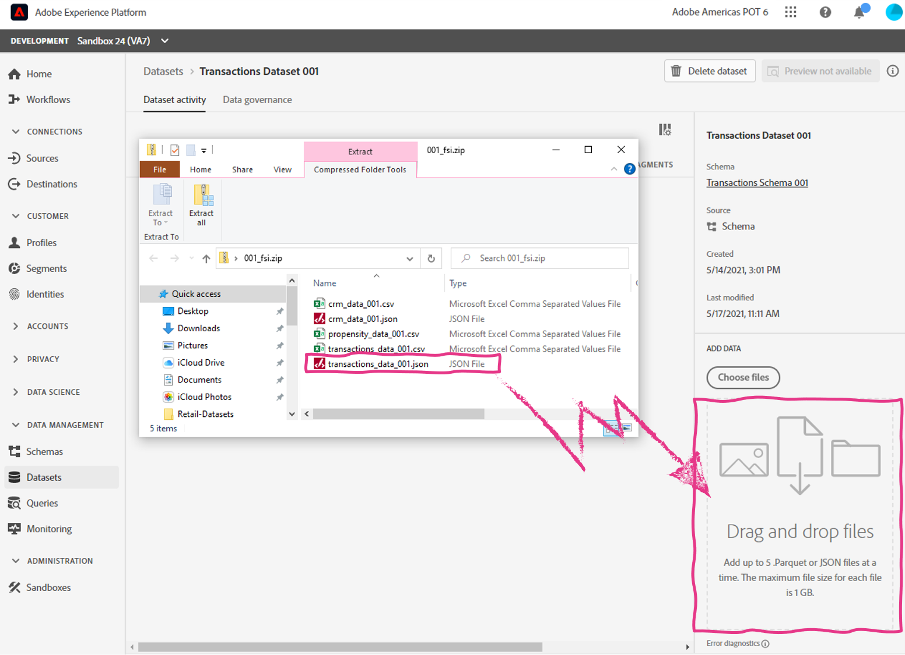

Lab 2.1 - Construct a Dataset from Schema
==========
<table style="border-collapse: collapse; border: none;" class="tab" cellspacing="0" cellpadding="0">

<tr style="border: none;">

<td width="600" style="border: none;">
<table>
<tbody valign="top">
      <tr width="500">
            <td valign="top"><h3>Objective:</h3></td>
            <td valign="top"> この短いラボでは、データセットを作成する方法を紹介します。
            </td>
     </tr>
     <tr width="500">
           <td valign="top"><h3>Prerequisites:</h3></td>
           <td valign="top"> 
                            <li>スキーマの設定
           </td>
     </tr>
</tbody>
</table>
</td>

<td style="border: none;" valign="top">

<table>
<tbody valign="top">
      <tr>
            <td valign="middle" height="70"><b>section</b></td>
            <td valign="middle" height="70"></td>
      </tr>
      <tr>
            <td valign="middle" height="70"><b>version</b></td>
            <td valign="middle" height="70">1.0.1</td>
      </tr>
      <tr>
            <td valign="middle" height="70"><b>date</b></td>
            <td valign="middle" height="70">2020-01-06</td>
      </tr>
</tbody>
</table>
</td>

</tr>
</table>

Go to [https://platform.adobe.com/home](https://platform.adobe.com/home).

Instructions:
-----------------

前回の演習で作成したスキーマをベースにしたデータセットを作成することにします。以下の手順で進めてください。

1. 左側のメニューから、"**Datasets** "に移動します。

      
      
      
2. 右上の「**＋ Create dataset**」をクリックします

      
      
      
3. スキーマ定義からデータセットを作成するので、"**Create dataset from schema**" を選択してください。

      
 
 
4. 「Select schema」ページで、「**Transactions Schema [自分の番号]** 」を検索し、スキーマを選択して「**Next**」をクリックします。
      
      
      
      
      
5. 次に、データセットを設定するために、名前を付ける必要があります。「**Transactions Dataset [自分の番号]**」と名付け、同じ説明をつけてください。
      
      
       
 
 
6. 「 **Finish** 」をクリックして、データセットを保存します。
      
      
       

7. データセットの作成には成功しましたが、このデータセットにはデータが取り込まれていません。では、このデータセットにファイルをインポートしてみましょう。今回は**JSONファイル**をインポートするので、データセットにドラッグ＆ドロップしてください。

    右側のパネルで、"ADD DATA "の項目が表示されるまで下にスクロールしてください。

     

8. ダウンロードしたラボファイルから、「**transactions_data_001.json**」ファイルを「**ADD DATA**」セクションにドラッグ＆ドロップしてください。 

      

      バッチが「 **Processing** 」と表示されます。

      <kbd></kdb>

9. Adobe Experience Platformは、JSONフォーマットからparquetへのXDMマッピングと変換を行い、このデータをデータレイクとプロファイルストアで利用できるようにします。このプロセスは通常、数分しかかかりません。

    バッチのステータスが「**Success**」になったら、右上の「**Preview Dataset**」ボタンをクリックして、データをプレビューすることができます。

    

10. おめでとうございます。スキーマからデータセットを作成し、JSON ファイルをインポートしました。

 
 
 

Return to [Lab Agenda Directory](https://github.com/tetsushijp/AEP-Hands-on-Labs/blob/master/labs/fsi6/README.md#lab-agenda)

