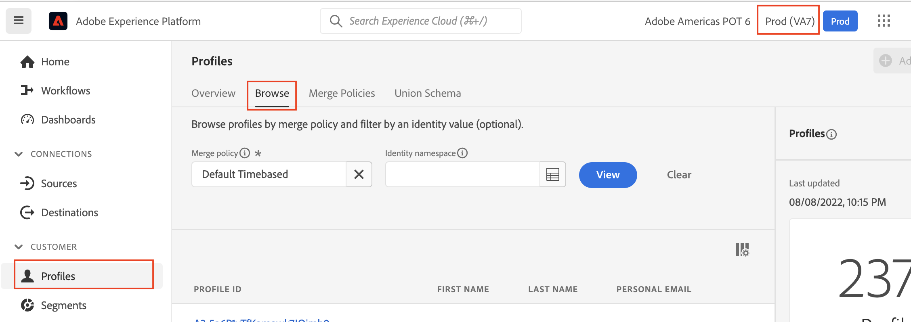
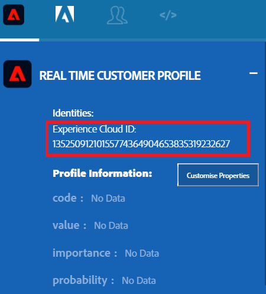

Lab 5.1 - Profiles - UPS Review
==========
<table style="border-collapse: collapse; border: none;" class="tab" cellspacing="0" cellpadding="0">

<tr style="border: none;">

<td width="600" style="border: none;">
<table>
<tbody valign="top">
      <tr width="500">
            <td valign="top"><h3>Objective:</h3></td>
            <td valign="top"> このラボでは、顧客プロファイルを調べます。
            </td>
     </tr>
     <tr width="500">
           <td valign="top"><h3>Prerequisites:</h3></td>
           <td valign="top"> なし</td>
     </tr>
</tbody>
</table>
</td>

<td style="border: none;" valign="top">

<table>
<tbody valign="top">
      <tr>
            <td valign="middle" height="70"><b>section</b></td>
            <td valign="middle" height="70"></td>
      </tr>
      <tr>
            <td valign="middle" height="70"><b>version</b></td>
            <td valign="middle" height="70">1.0.1</td>
      </tr>
      <tr>
            <td valign="middle" height="70"><b>date</b></td>
            <td valign="middle" height="70">2020-01-06</td>
      </tr>
</tbody>
</table>
</td>

</tr>
</table>

このラボでは、カスタマー・プロファイルを調べます。 この機能は、私たちのすべてのお客様が何年も前から手に入れようとしていたもので、顧客情報を一元的に見ることができるのです。

Instructions:
-----------------
1. 	このURLにアクセスして、Adobe Experience Platformにログインします。: https://platform.adobe.com
2.	ログインすると、Adobe Experience Platformのトップページが表示されます。
3.	サンドボックスインスタンスではなく、「 **Prod(VA7)** 」インスタンスであることを確認してください。
4.	左側のメニューから、「　**Profiles** 」を選択します。
5. 「 **Browse** 」タブをクリックします。名前空間を入力するUIが表示されます。
 
<kbd></kbd>
 
6.	次に、ブラウザで https://americaspot6-publish.adobedemo.com/content/we-finance-pot/language-masters/en.html# にアクセスします。
7.	左の余白にある、**「 人 」のアイコン**をクリックします。本サイトのX-Rayパネルが表示されます。
 
 
8.	"**REAL TIME CUSTOMER PROFILE**" セクションを展開し、IDを確認します。
 
<kbd></kbd>
 
9.	ECIDの値をコピーし、Profiles Browseビューに戻る。
10.	「**Identity namespace**」で「ECID」を入力し、「**Identity value**」フィールドに前回コピーしたECIDの値を貼り付ける。
11.	"**PROFILE ID**"をクリック
 
<kbd></kbd>

 <kbd></kbd>

Return to [Lab Agenda Directory](https://github.com/tetsushijp/AEP-Hands-on-Labs/blob/master/labs/fsi6/README.md#lab-agenda)
