# Lab - Build a Transactions schema (ExperienceEvent)

<table style="border-collapse: collapse; border: none;" class="tab" cellspacing="0" cellpadding="0">

<tr style="border: none;">

<td width="600" style="border: none;">
<table>
<tbody valign="top">
      <tr width="500">
            <td valign="top"><h3>Objective:</h3></td>
            <td valign="top"> This  lab will show you how to construct an XDM schema
            </td>
     </tr>
     <tr width="500">
           <td valign="top"><h3>Prerequisites:</h3></td>
           <td valign="top"> none
           </td>
     </tr>
</tbody>
</table>
</td>

<td style="border: none;" valign="top">

<table>
<tbody valign="top">
      <tr>
            <td valign="middle" height="70"><b>section</b></td>
            <td valign="middle" height="70"></td>
      </tr>
      <tr>
            <td valign="middle" height="70"><b>version</b></td>
            <td valign="middle" height="70">1.0.10</td>
      </tr>
      <tr>
            <td valign="middle" height="70"><b>date</b></td>
            <td valign="middle" height="70">2020-01-06</td>
      </tr>
</tbody>
</table>
</td>

</tr>
</table>

Go to [https://platform.adobe.com/home](https://platform.adobe.com/home). Follow the instructions detailed below.

## Instructions:

1. In the left-hand menu, navigate to "Schemas".

      <kbd></kdb>

2. Click "+ Create Schema" in the top right. Select "XDM ExperienceEvent".

      <kbd>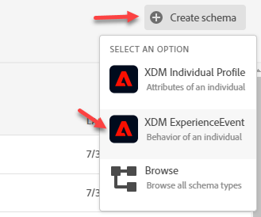</kdb>

3. Click on "Untitled Schema" in the structure view

    <kbd></kdb>

4. In the right-hand menu, name it "Transactions Schema [your-assigned-number]". Description is optional.

    <kbd></kdb>
   
5. In the left-hand schema composition menu, notice the Class has been set to XDM ExperienceEvent. The class was assigned based on the option selected after clicking "+ Create Schema" in a prior step.

   <kbd>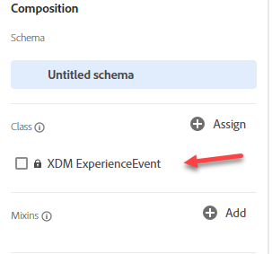</kdb>

Reminder: the class defines the smallest set of fields used to build a schema and is the base level schema behavior:
    - Time-series (ExperienceEvent)
    - Record (Profile)

<kbd>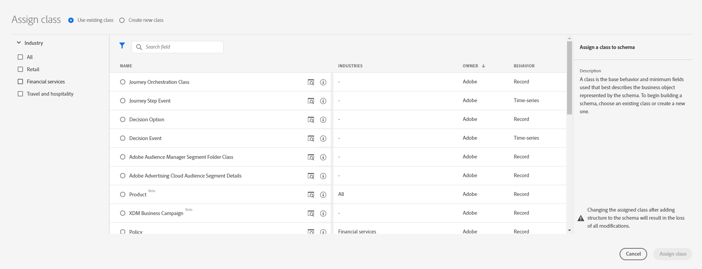</kdb>

    Note: There are other classes available out of the box that represent specific objects needed for Experience Modeling.

6. Click on the "Add" button across from "Mixins" in left-hand schema composition menu.

    <kbd>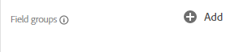</kdb>

    Here you can build your own Mixin or use a prior/similar Mixin object that conforms to your data.

7. In this lab, we will be adding two pre-built mixins listed below:

   - Identities Mixin EE
   - Transaction Details Mixin EE

   Select the "Transaction Details Mixin EE" and "Identities Mixin EE" mixins and click "Add mixin".

   <kbd></kdb>

   Hit +Add to go back to the Mixin list

   <kbd>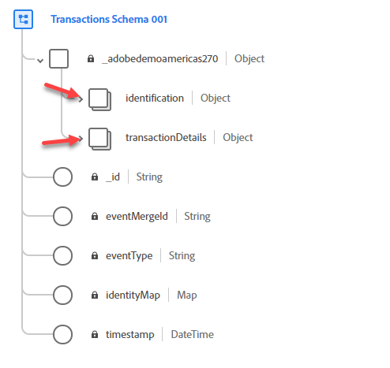</kdb>

   Repeat the steps for 'Identities Mixin EE' mixin

   <kbd></kdb>

8. Now, we'll also create a new Mixin from scratch. Go back and hit the +Add button on the left panel.

   <kbd>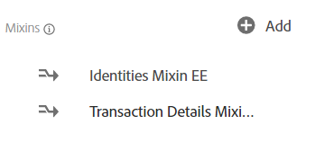</kdb>

9. Click "Create new mixin" at the top.

      <kbd>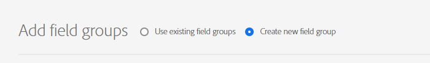</kdb>

10. Enter "Order Details Mixin EE [your-assigned-number]" as the "Display name" and click "Add Mixin".

    <kbd>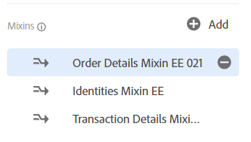</kdb>
    
11. In the left-hand schema composition menu, click on your newly create Mixin (it should be highlighted now)

    <kbd></kdb>

12. Notice that on the Structure view a '+Add Field' appears next to the Schema name, Click it to start adding fields

    <kbd>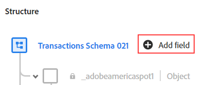</kdb>

13. On the Field Properties panel to the right add the following  
    - FieldName = orderDetails
    - Description = Order Details
    - Type = Object

    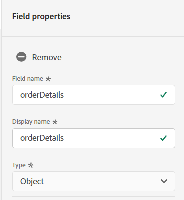

    Scroll  down and hit Apply

    

14. Next, we will be adding fields to the 'orderDetails' object Click "+Add Field" next to this object

    <kbd>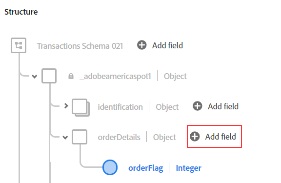</kdb>

15. On the Field Properties panel to the right add the following  
    - FieldName = orderFlag
    - Description = Order Flag
    - Type = Integer

     

     Scroll down and hit Apply

    

16. We will be adding one more field to the 'orderDetails' object Click "+Add Field" next to this object

    <kbd></kdb>

17. On the Field Properties panel to the right add the following  
    - FieldName = orderID
    - Description = Order ID
    - Type = String

    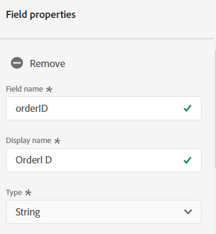

    Scroll down and hit Apply

    

18. Next, We will be adding our final field to the 'orderDetails' object Click "+Add Field" next to this object

    <kbd>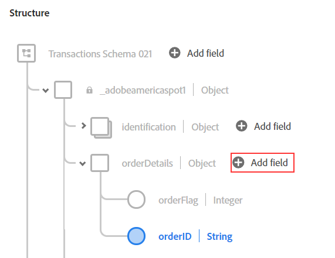</kdb>

19. On the Field Properties panel to the right add the following  
    - FieldName = orderType
    - Description = Order Type
    - Type = String

    

    Scroll down and hit Apply

    

20. We are done with modeling the schema. To Save your work hit Save on the top right corner. Make sure that your schema structure looks like the one in the screenshot below

    <kbd>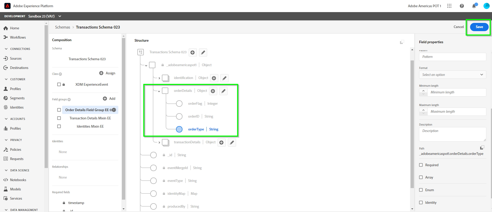</kdb>

21. Congratulations! You constructed a schema.

 
 
 

Return to [Lab Agenda Directory](https://github.com/adobe/AEP-Hands-on-Labs/blob/master/labs/fsi6/README.md#lab-agenda)
