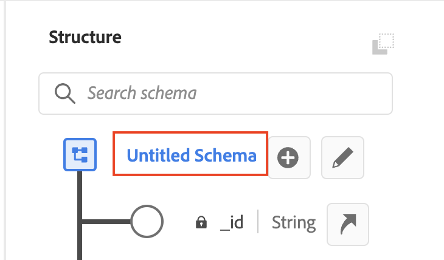
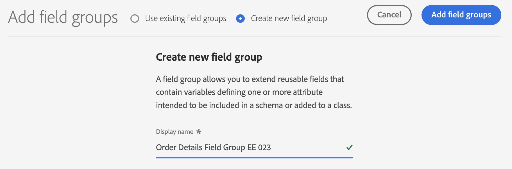

# Lab - Build a Transactions schema (ExperienceEvent)

<table style="border-collapse: collapse; border: none;" class="tab" cellspacing="0" cellpadding="0">

<tr style="border: none;">

<td width="600" style="border: none;">
<table>
<tbody valign="top">
      <tr width="500">
            <td valign="top"><h3>Objective:</h3></td>
            <td valign="top"> このラボでは、XDM スキーマを構築する方法を紹介します。
            </td>
     </tr>
     <tr width="500">
           <td valign="top"><h3>Prerequisites:</h3></td>
           <td valign="top"> なし
           </td>
     </tr>
</tbody>
</table>
</td>

<td style="border: none;" valign="top">

<table>
<tbody valign="top">
      <tr>
            <td valign="middle" height="70"><b>section</b></td>
            <td valign="middle" height="70"></td>
      </tr>
      <tr>
            <td valign="middle" height="70"><b>version</b></td>
            <td valign="middle" height="70">1.0.10</td>
      </tr>
      <tr>
            <td valign="middle" height="70"><b>date</b></td>
            <td valign="middle" height="70">2020-01-06</td>
      </tr>
</tbody>
</table>
</td>

</tr>
</table>

Go to [https://platform.adobe.com/home](https://platform.adobe.com/home). Follow the instructions detailed below.

## Instructions:

1. 左側のメニューで、「**Schema**」に移動します。

      <kbd></kdb>

2. 右上の「**＋Create Schema**」をクリックします。"**XDM ExperienceEvent**"を選択します。

      <kbd></kdb>

3. Structure Viewで「**Untitled Schema**」をクリックします。

    <kbd></kdb>

4. 右側のメニューで、「**Transactions Schema [自分の番号]**」と名前を付けます。説明は任意です。

    <kbd></kdb>
   
5. 左側のスキーマ構成メニューで、クラスが **XDM ExperienceEvent** に設定されていることに注意してください。このクラスは、前のステップで「**+ スキーマの作成**」をクリックした後に選択したオプションに基づいて割り当てられました。

   <kbd></kdb>

    注意: クラスはスキーマを構築するために使用されるフィールドの最小セットを定義し、ベースレベルのスキーマの動作となります。例:
    - Time-series (ExperienceEvent)
    - Record (Profile)

<kbd></kdb>

    Note: 他にもエクスペリエンス・モデリングに必要な特定のオブジェクトを表すクラスが事前に用意されています。

6. 左側のスキーマ構成メニューの「**Field Group**」の向かいにある「**＋Add**」ボタンをクリックします。

    <kbd></kdb>

    ここでは、独自のField Groupを作成するか、データに適合する類似のField Groupオブジェクトを使用することができます。

7. このラボでは、以下の2つの事前定義されたフィールドグループを追加する予定です。:

   - Identities Mixin EE
   - Transaction Details Mixin EE

   "**Transaction Details Mixin EE**" と "**Identities Mixin EE**" のMixinを選択し、"**Add field groups**" をクリックします。.

   <kbd></kdb>

   これで、スキーマには「**identification**」と「**transactionDetails**」オブジェクトと、このオブジェクト内のすべてのフィールドが含まれることになります。

   <kbd></kdb>

8. ここで、ゼロから新しいField Groupを作成します。左側のスキーマ構成メニューの**Field Groups**の向かいにある「**＋Add**」ボタンを押します。

   <kbd></kdb>

9. 上部にある「**Create new field group**」をクリックします。

      <kbd></kdb>

10. Displa Nameに「**Order Details Field Group EE [自分の番号]**」を入力し、「**Add field groups**」をクリックします。
      <kbd></kdb>

    
11. 左側のスキーマ構成メニューで、新しく作成したフィールドグループをクリックします（現在ハイライトされているはずです）。

    <kbd></kdb>

12. 構造ビューのスキーマ名の横に「**＋フィールドの追加**」 アイコンが表示されていることに注目し、クリックします。

    <kbd></kdb>

13. 右側のフィールドプロパティパネルで、以下を追加します。:  
    - **FieldName** = orderDetails
    - **DisplayName** = orderDetails
    - **Type** = Object
    - **Assign field group** = Order Detail EE [自分の番号]

    

    下にスクロールして、[**Apply**]をクリックします。

    

14. 次に、'orderDetails' オブジェクトにフィールドを追加します。 このオブジェクトの横にある "**＋ Add Field**" をクリックします。

    <kbd></kdb>

15. 右側のフィールドプロパティパネルで、以下を追加します。:  
    - FieldName = orderFlag
    - Description = Order Flag
    - Type = Integer

     

     下にスクロールして、[**Apply**]をクリックします。

    

16. '**orderDetails**' オブジェクトにフィールドをさらにもう一つ追加します。 このオブジェクトの横にある "**+ Add Field**" をクリックします。

    <kbd></kdb>

17. 右側のフィールドプロパティパネルで、以下を追加します。:  
    - FieldName = orderID
    - Description = Order ID
    - Type = String

    

    下にスクロールして、[**Apply**]をクリックします。

    

18. 最後に３つ目のフィールドを '**orderDetails**' オブジェクトに追加します。 このオブジェクトの横にある "**＋ Add Field**" をクリックします。

    <kbd></kdb>

19. 右側のフィールドプロパティパネルで、以下を追加します。:  
    - FieldName = orderType
    - Description = Order Type
    - Type = String

    

    下にスクロールして、[**Apply**]をクリックします。

    

20. スキーマのモデリングは終了です。作業内容を保存するには、右上の「 **Save** 」をクリックしてください。スキーマの構造が以下のスクリーンショットのようになっていることを確認してください。

    <kbd></kdb>

21. おめでとうございます。スキーマを構築できました。

 
 
 

Return to [Lab Agenda Directory](https://github.com/tetsushijp/AEP-Hands-on-Labs/blob/master/labs/fsi6/README.md#lab-agenda)
