Lab 6.1 - Segmentation - Profile Attribute Segmentation
==========
<table style="border-collapse: collapse; border: none;" class="tab" cellspacing="0" cellpadding="0">

<tr style="border: none;">

<td width="600" style="border: none;">
<table>
<tbody valign="top">
      <tr width="500">
            <td valign="top"><h3>Objective:</h3></td>
            <td valign="top"> In this exercise, we’ll create a basic segment using a single field in Call Center ExperienceEvent.
 
 A marketer wants to create a basic segment for customers who report Account security issues with a Call Center representative. 
            </td>
     </tr>
     <tr width="500">
           <td valign="top"><h3>Prerequisites:</h3></td>
           <td valign="top"> none</td>
     </tr>
</tbody>
</table>
</td>

<td style="border: none;" valign="top">

<table>
<tbody valign="top">
      <tr>
            <td valign="middle" height="70"><b>section</b></td>
            <td valign="middle" height="70"></td>
      </tr>
      <tr>
            <td valign="middle" height="70"><b>version</b></td>
            <td valign="middle" height="70">1.0.1</td>
      </tr>
      <tr>
            <td valign="middle" height="70"><b>date</b></td>
            <td valign="middle" height="70">2020-01-06</td>
      </tr>
</tbody>
</table>
</td>

</tr>
</table>

Instructions:
-----------------
1.	Navigate to Segment Builder in the left navigation

      <kbd>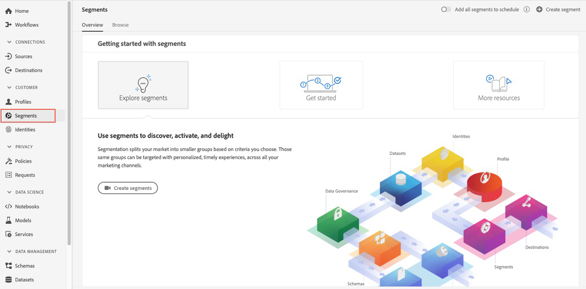</kbd>

2.    Click "Create segment" on the top right.

      <kbd>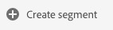</kbd>

3.	Click the gear icon to the right of Fields in the left pane

      <kbd>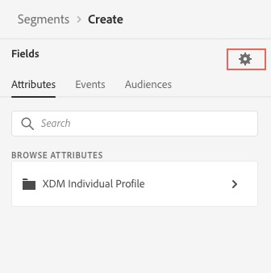</kbd>

4.	Verify ‘Show full XDM schema’ is selected, and if not, select it
           
      <kbd></kbd>
      
5.	Click on the gear icon again to hide the setting

      <kbd></kbd>

6.	Select ‘Events’ under Fields

      <kbd></kbd>

7.	Click on ‘XDM ExperienceEvent’ under Browse Classes

      <kbd></kbd>
      
8.	Click on ‘Adobedemoamericas 270’ to expand the objects below that namespace
      
      <kbd></kbd>

9.	Click on ‘callcenterDetails’
   
      <kbd></kbd>      

10.	Drag the ‘callSelectedReason’ field over to the Segment canvas
            
      <kbd></kbd>    
      
11.	In the text box to the right of equals, type “Account Security Issue” and press ‘Enter’
           
      <kbd>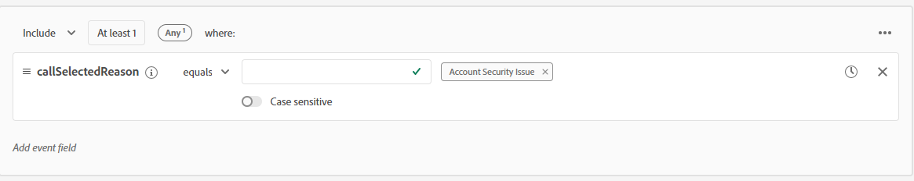</kbd>  

12.	Enter the segment name “Call Center Account Security” followed by your Student ID (e.g. “Call Center Account Security 025”)
	 Enter the same value as the description
      
      <kbd></kbd>       
           
13.	Save the Segment
           
      <kbd></kbd>  
      
NOTE: Estimate link may not show results if qualified profiles are statistically small and not recognized across datset scans 
 
 
 

Lab 6.2 - Segmentation - Profile Attribute with Experience Event Segmentation
==========
<table style="border-collapse: collapse; border: none;" class="tab" cellspacing="0" cellpadding="0">

<tr style="border: none;">

<td width="600" style="border: none;">
<table>
<tbody valign="top">
      <tr width="500">
            <td valign="top"><h3>Objective:</h3></td>
            <td valign="top"> In this exercise, we’ll create a segment using both a Profile Attribute and ExperienceEvents.  
      A marketer wants to create a segment of female customers that performed IRA (Traditional or Roth) transactions with a broker in the last 24 hours. 
     </td>
     </tr>
     <tr width="500">
           <td valign="top"><h3>Prerequisites:</h3></td>
           <td valign="top"> none</td>
     </tr>
</tbody>
</table>
</td>

<td style="border: none;" valign="top">

<table>
<tbody valign="top">
      <tr>
            <td valign="middle" height="70"><b>section</b></td>
            <td valign="middle" height="70"></td>
      </tr>
      <tr>
            <td valign="middle" height="70"><b>version</b></td>
            <td valign="middle" height="70">1.0.1</td>
      </tr>
      <tr>
            <td valign="middle" height="70"><b>date</b></td>
            <td valign="middle" height="70">2020-01-06</td>
      </tr>
</tbody>
</table>
</td>

</tr>
</table>

Instructions:
-----------------
1.	Navigate to Segment Builder in the left navigation

      <kbd></kbd>

2.    Click "Create segment" on the top right.

      <kbd></kbd>

3.	Click the gear icon to the right of Fields in the left pane

      <kbd></kbd>

4.	Verify ‘Show full XDM schema’ is selected, and if not, select it
           
      <kbd></kbd>
      
5.	Click on the gear icon again to hide the setting

      <kbd></kbd>

6. 	Select ‘Attributes’ under Fields

	<kbd></kbd>

7.	Click on the ‘XDM Individual Profile’ object under Browse Attributes

	<kbd></kbd>

8.	Click on ‘Person’ 

	<kbd></kbd>

9.	Drag the ‘Gender’ field to the Segment canvas

	<kbd></kbd>

10.	Start entering ‘Female’ in the text box and when the value displays, select it and press Enter. The ‘Gender’ field is an enum field to limit the values stored in that field.
	<kbd></kbd>

11.	Select ‘Events’ under Fields

       <kbd></kbd>
       
12.	Click on ‘XDM ExperienceEvent’ under Browse Classes

      <kbd></kbd>
      
13.	Click on ‘Adobedemoamericas 270’ to expand the objects below that namespace
      
       <kbd></kbd>

14.	Click on 'transactionDetails'

	<kbd></kbd>

15.	Drag the ‘transactionMethod’ field over to the Segment canvas

	<kbd></kbd>

16.	In the left pane, find 'transactionName' and drag it to the canvas below the 'transactionMethod' event so they are vertically stacked.  The AND operator should remain.

	<kbd>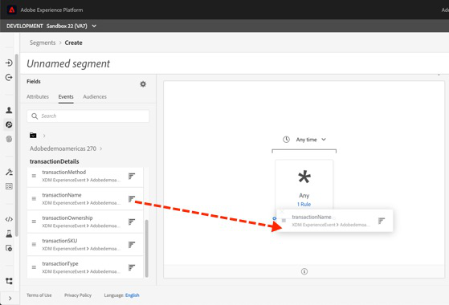</kbd>

17.	In the segment canvas, select the 'transactionMethod' event. A container will appear below to configure the rule for the event.  In the text box to the right of equals, type “broker” and press ‘Enter’

	<kbd>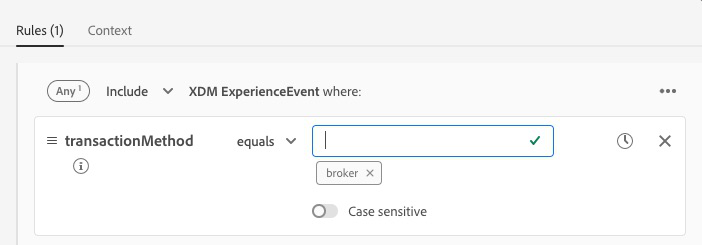</kbd>

18.  In the segment canvas, select the 'transactionName' event.  In the event rule container, change the condition from equals to contains.  In the text box to the right of contains, type "IRA" and press 'Enter'

       <kbd>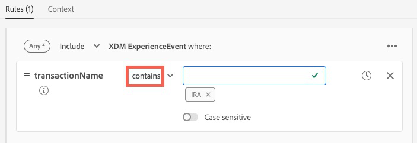</kbd>

19.  At the top of the ‘Events’ canvas, update the time value to ‘In last 24 Hour(s)’

   <kbd></kbd>

20.	Enter the segment name “Female IRA customer working with Broker” followed by your Student ID (e.g. “Female IRA customer working with Broker 025”)
	 Enter the same value as the description   
	
	<kbd>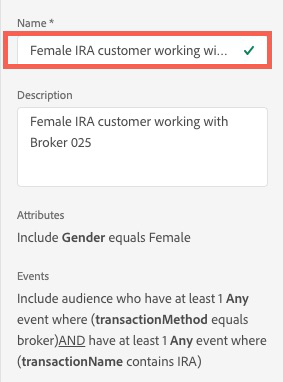</kbd>
           
21.	Save the Segment
           
      <kbd></kbd>  
 
 
 
 

# Lab 6.3 - Segmentation - Dynamic Segmentation

<table style="border-collapse: collapse; border: none;" class="tab" cellspacing="0" cellpadding="0">

<tr style="border: none;">

<td width="600" style="border: none;">
<table>
<tbody valign="top">
      <tr width="500">
            <td valign="top"><h3>Objective:</h3></td>
            <td valign="top"> In this exercise, we’ll create a segment using Commerce ExperienceEvents and dynamic segmentation. Dynamic segmentation solves the scalability problems marketers traditionally face when building segments for marketing campaigns or other use cases where setting up multiple variations of the same segment was required. 
       On an ongoing basis, a financial institution wants to remarket to customers who have clicked through an email offer to a mortgage application, started filling out the online form, but have not completed the online form.   <i>The financial institution uses the Checkout and Purchase events for the form events and uses the products variable to capture the form name.</i> </td>
     </tr>
     <tr width="500">
           <td valign="top"><h3>Prerequisites:</h3></td>
           <td valign="top"> none</td>
     </tr>
</tbody>
</table>
</td>

<td style="border: none;" valign="top">

<table>
<tbody valign="top">
      <tr>
            <td valign="middle" height="70"><b>section</b></td>
            <td valign="middle" height="70"></td>
      </tr>
      <tr>
            <td valign="middle" height="70"><b>version</b></td>
            <td valign="middle" height="70">1.0.1</td>
      </tr>
      <tr>
            <td valign="middle" height="70"><b>date</b></td>
            <td valign="middle" height="70">2020-01-06</td>
      </tr>
</tbody>
</table>
</td>

</tr>
</table>

## Instructions:

1. Navigate to Segment Builder in the left navigation and select Create segment.

   

2. Click the gear icon to the right of Fields in the left pane

3. Verify ‘Show full XDM schema’ is selected

   

4. Click on the gear icon again to hide the setting

5. In the left pane, select ‘Events’ under Fields

6. In the search box, enter ‘eVar1’

   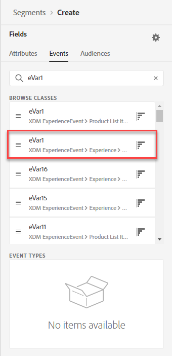

7. Drag ‘eVar1’ to the segment canvas 

8. In the left pane, clear out the Search box

9. Under ‘Event Types’, locate ‘Checkouts’, and drag this to the segment canvas to the right of the ‘Any’ event

   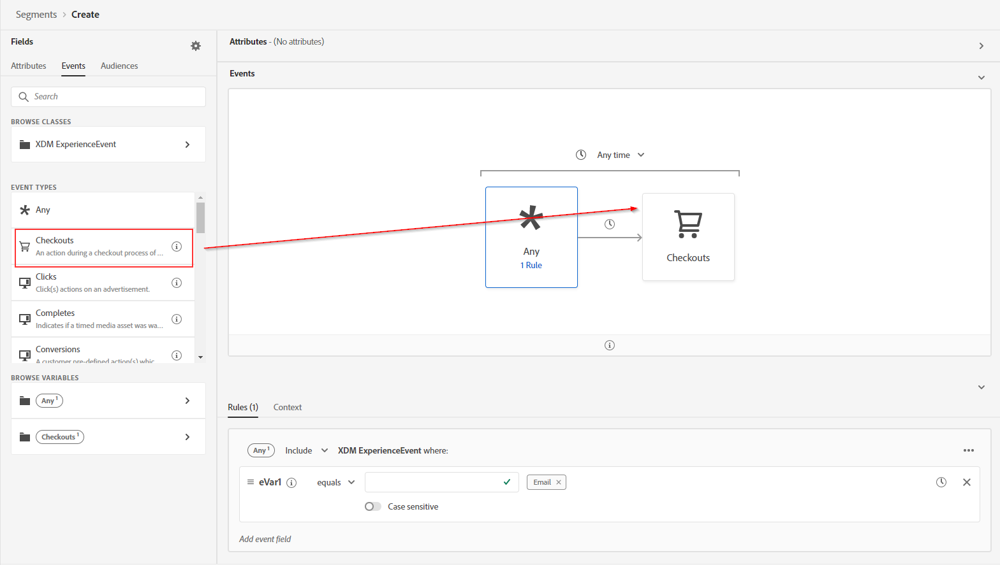

10. In the left pane, locate ‘Purchases’ and drag this to the segment canvas to the right of the ‘Checkouts’ event.

    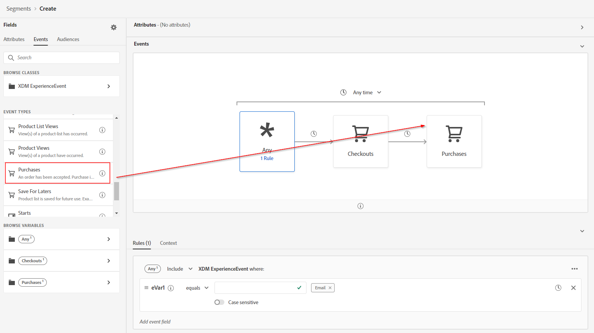

11. Click on ‘Any’ in the segment canvas

12. Type ‘Email’ in the text box to the right of ‘eVar1’ equals and press Enter

   

13. Click on ‘Checkouts' in the segment canvas

14. In the left pane, search for 'SKU'

15. Select the ‘SKU’ field and drag that into the ‘XDM ExperienceEvent’ container for ‘Checkouts’

    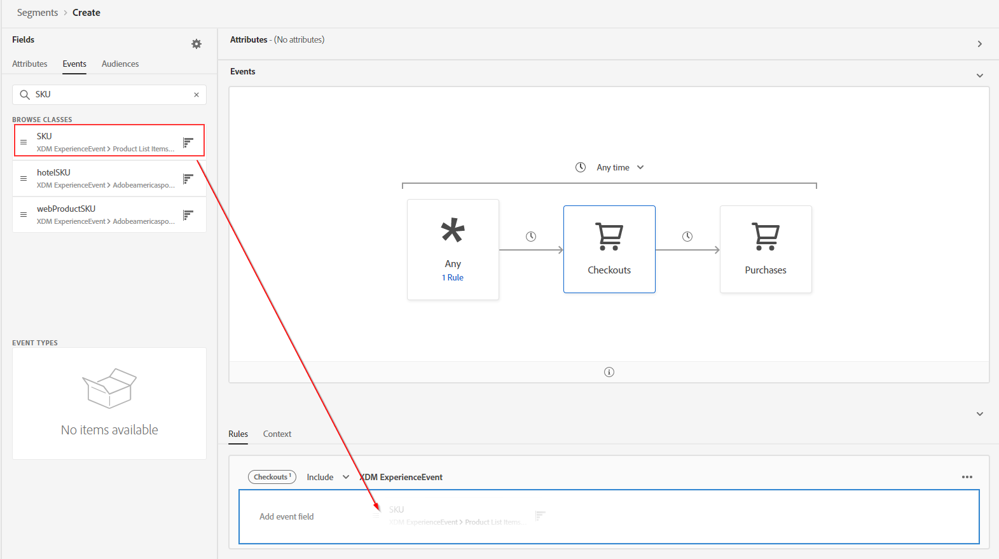

16. Change the operator to “exists”

    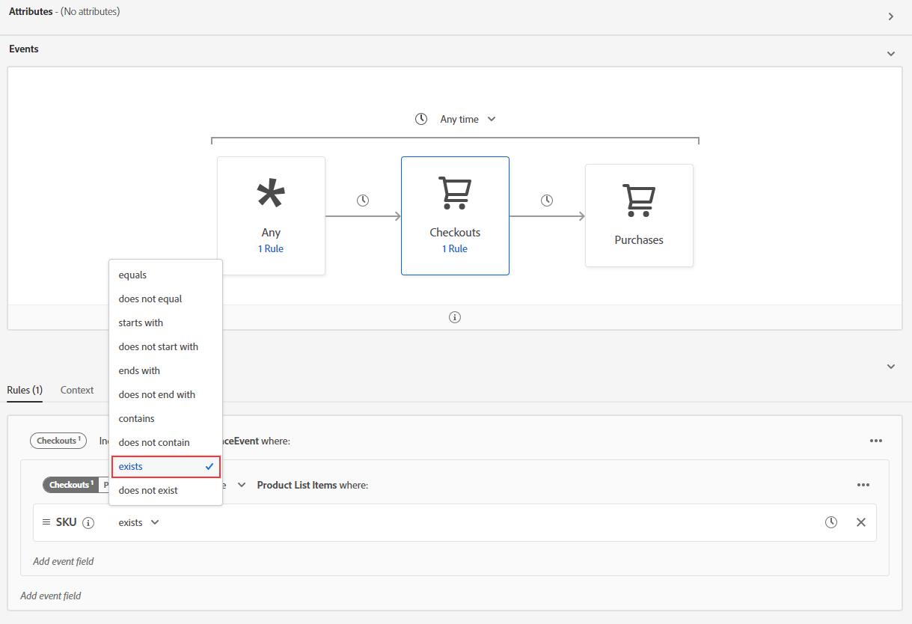

17. Clear the search box. And Select 'Puchases' event.

18. Search for ‘SKU’ and drag that into the ‘XDM ExperienceEvent’ container for ‘Purchases’

    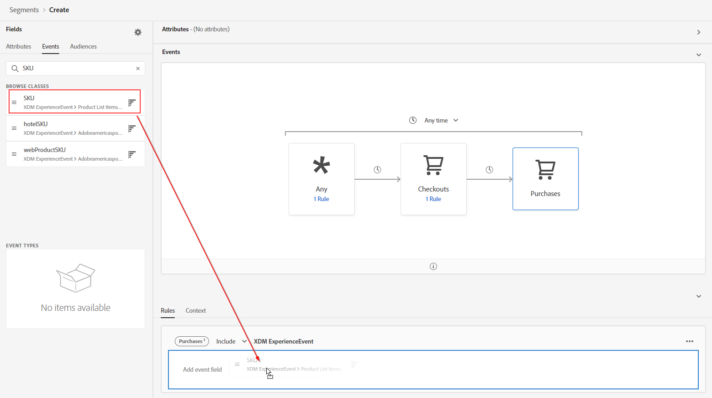

19. Clear the search box

    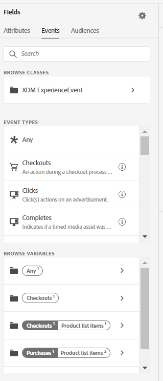

20. Now, we are going to make this a dynamic segment. We will be using the SKU from previous events to make sure that that same SKU is being checked for the subsequent events in the segment. To make is easy for the users segment builder visualizes these parameters under 'Browse Variables' in the left panel.

    

21. Select the 'Checkout Product List Items Varaibles amd drag and drop the SKU to the condition section that says 'Add to compare operants.

    

22. The dynamic condition should now look like this

    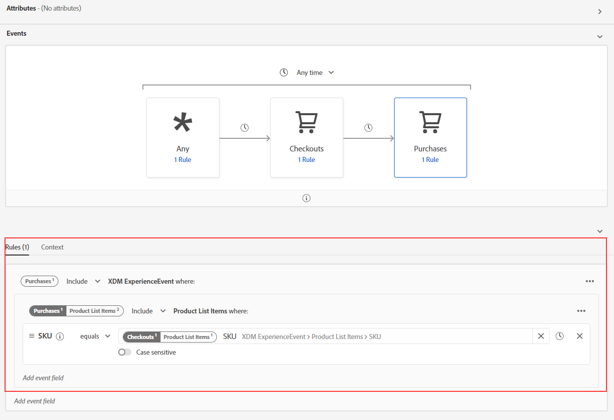

23. Change the ‘XDM ExperienceEvent’ container for ‘Purchases1’ to ‘Exclude’

    

24. At the top of the ‘Events’ canvas, update the time value to ‘In last 24 Hour(s)’

25. Enter the segment name “Email Channel Online Application Abandoners”.

26. Enter the same value as the description

29. Save the Segment

    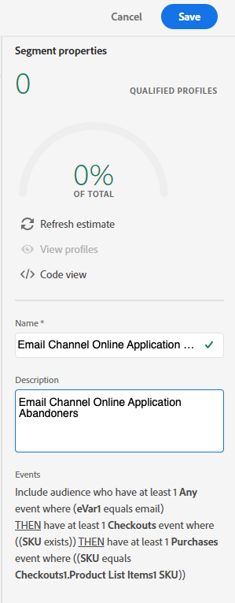
 
 
   
Return to [Lab Agenda Directory](https://github.com/adobe/AEP-Hands-on-Labs/blob/master/labs/fsi6/README.md#lab-agenda)
 
 
