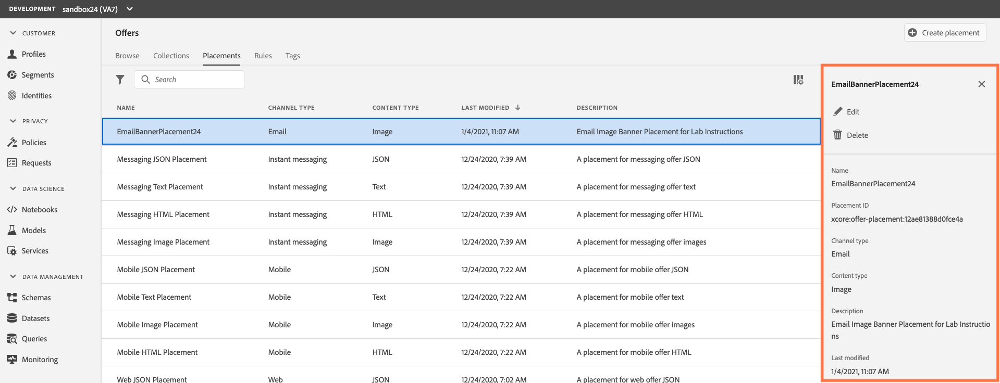

## Exercise 2 - Define a Placement

A placement helps ensure that the right offer content shows up in the right location with your message. When you add content to an offer, you will be asked to select a placement where that content can be shown.
In the example below, there are three placements, corresponding to different types of content (image, text, HTML).

   

We are going to create a placement for an email hero banner using an image, text for an email and text for a Mobile SMS Message.

To create a Placement, follow these steps:

1.	Go to the Placements tab, then click `Create placement`.

    

2.	Define the placement’s properties:

* **Name:** The name of the placement. Make sure to define a meaningful name to retrieve it more easily. For the purposes of the lab, please use this naming convention. (EmailBannerPlacement  + your sandbox number. Ex: EmailBannerPlacement24)
* **Channel type:** The channel for which the placement will be used. Please select “Email”
* **Content type:** The type of content that the placement will be allowed to display: Text, HTML or Image Link. Please select “Image”
* **Description:** A description of the placement (optional but encouraged). For the purposes of the lab, please use, “Email banner image” in the description field

    
    
3.	Click `Save` to confirm.

4.	Once the placement is created, it displays in the placements list. You can select it to display its properties and edit it. 

*Please do not edit/delete existing placements as it may break the offers workflow built for demo purposes.*

Next, follow steps 1-3 to create placements for an Email Text Placement and a Mobile Text Placement, using the following naming convention.
* EmailTextPlacement  + your sandbox number. Ex: EmailTextPlacement24
   - Channel Type: Email
   - Content Type: Text
   - Description: “Email text placement”
* MobileTextPlacement  + your sandbox number. Ex: MobileTextPlacement24
   - Channel Type: Mobile
   - Content Type: Text
   - Description: “Description: “Mobile text placement””  
   

 ---

Next Step: [Exercise 3 - Define a Decision Rule](Exercise3-DecisionRules.md)
