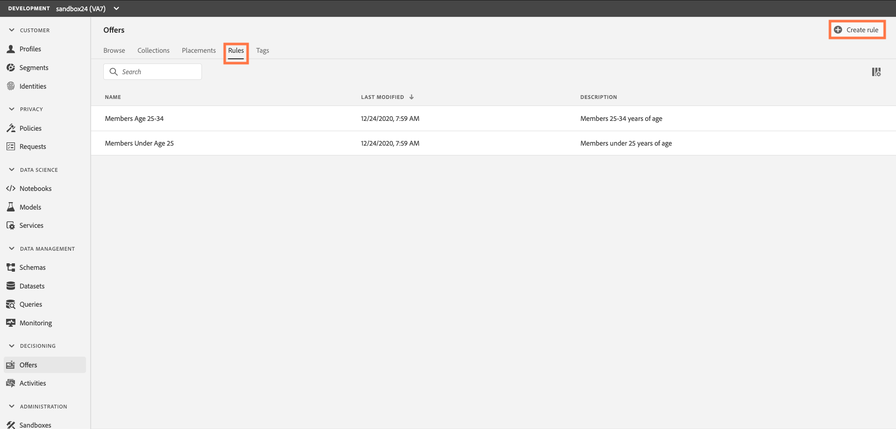
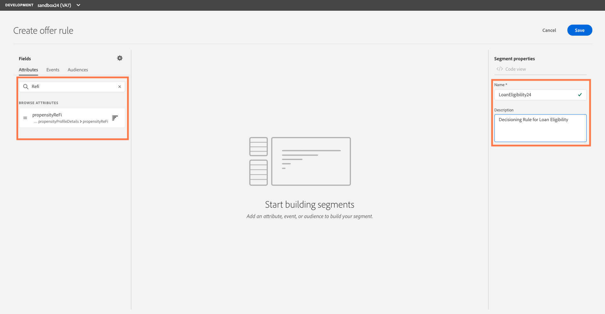
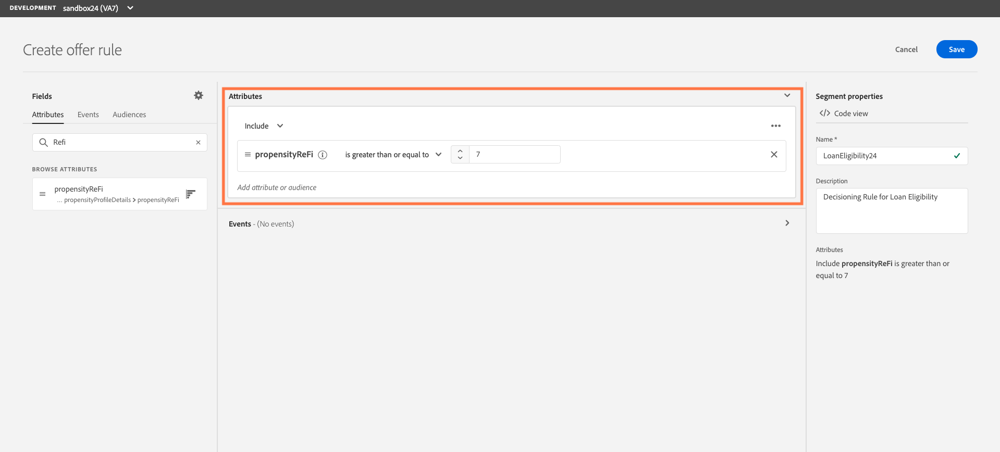
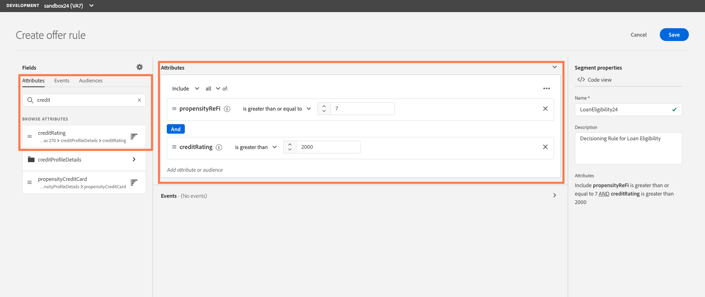

## Exercise 3 - Define a Decison Rule

You can create offer decision rules based on data available in Adobe Experience Platform. Decision rules determine to whom an offer can be shown.
For example, you can specify that you only want a ‘Loan Eligibility Offer’ to be shown when (Credit Rating is higher than “750”) and (Propensity to refinance is greater than 7).

In this exercise, we are creating 2 rules.

1. Loan Eligibility
    - Conditions: A customer with a FICO score greater than or equal to 2000 and propensity to ReFi greater than or equal to 7
2. Affluent Customers
    - Conditions: Customers with a FICO score greater than 700, household income greater than $100k and between the ages of 30 -50

## Create a ”Loan Eligibility” Decision Rule using a Profile Attribute

1.	Go to the Rules tab, then click `Create rule`.

    
    
    - Name the Rule with the following naming convention. (LoanEligibility  + your sandbox number. Ex: LoanEligibility24)
    - Provide a description: “Decisioning rule for loan eligibility”

2.	With the Attributes section highlighted, type “Refi” in the Search bar. You should see an attribute called “propensityReFi” as a result. 

    
    
3.	Select the “propensityReFi” attribute and drag to the segment builder canvas on the right
    - Change the operator from “equals” to “is greater than or equal to”
    - Enter 7 in the value field

       
     
4.	With the Attributes section highlighted, type “credit” in the Search bar. You should see an attribute called “creditRating” as a result 
    - Select the “creditRating” attribute and drag to the segment builder canvas under the “propensityReFi” attribute
    - Change the operator from “equals” to “is greater than”
    - Enter 2000 in the value field

5.  Click `Save` to confrim.

       
     
Once the rule is created, it displays in the Rules list. You can select it to display its properties and edit or delete it.

  
     

## Create an ”Affluent Customer” Decision Rule using a Profile Attribute

1.	Go to the Rules tab, then click `Create rule`.

    
    
    - Name the Rule with the following naming convention. (AffluentCustomer  + your sandbox number. Ex AffluentCustomer24)
    - Provide a description: “Decisioning rule for affluent customer”

2.	With the Attributes section highlighted, type “birth” in the Search bar. You should see an attribute called “Birth date” as a result.  **Use the first one.**

    
    
3.	Select the first “Birth date” attribute and drag to the segment builder canvas on the right ***NOTE: You may need to expand your browser window to see the rules options.***

    - Change the “Today” to “Rolling Range” and add 50 to the input field
    - Change “Day(s)” to “Year(s)
    - Click on “+to” and change 50 to 100 in the input field

       
     
4.	With the Attributes section highlighted, type “Refi” in the Search bar. You should see an attribute called “propensityReFi” as a result. 

5.	Select the “propensityReFi” attribute and drag to the segment builder canvas above the “Birth date” attribute
    - Change the operator from “equals” to “is greater than”
    - Enter 7 in the value field
    
6.	Again, with the Attributes section highlighted, type “credit” in the Search bar. You should see an attribute called “creditRating” as a result 
    - Select the “creditRating” attribute and drag to the segment builder canvas under the “propensityReFi” attribute
    - Change the operator from “equals” to “is greater than or equal to”
    - Enter 2000 in the value field

    
       
      

5.  Click `Save` to confrim.

 ---

Next Step: [Exercise 4 - Create a Personalized Offer](Exercise4-PersonalizedOffers.md)
