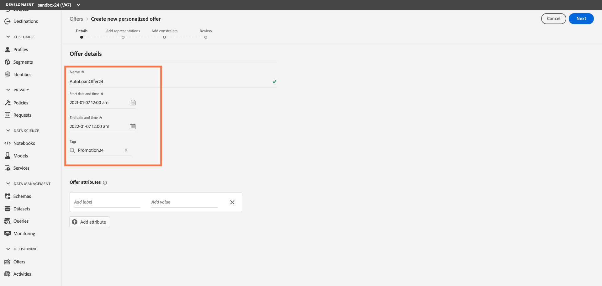
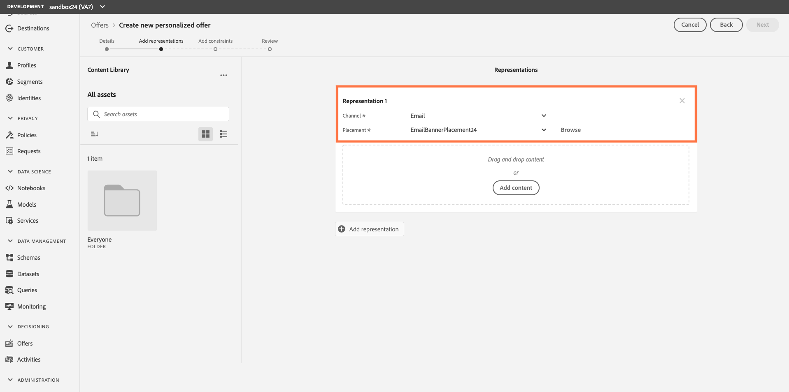
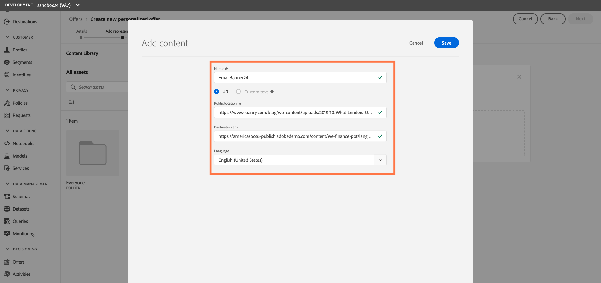
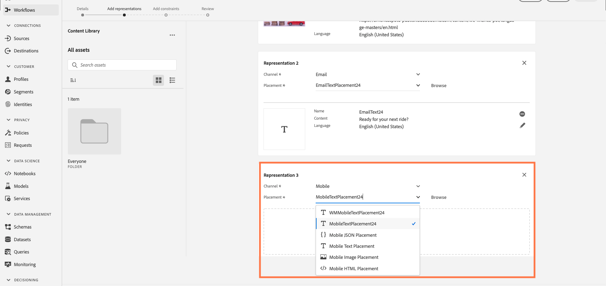
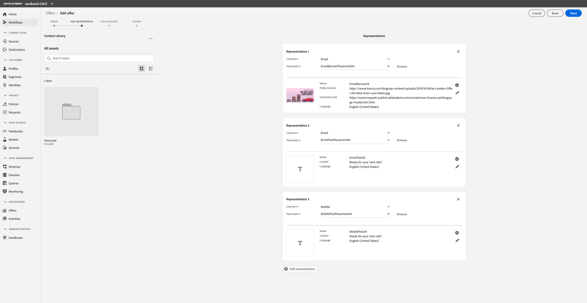
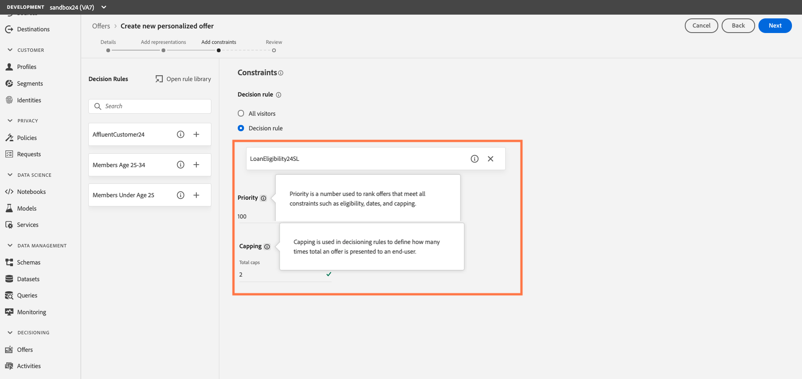
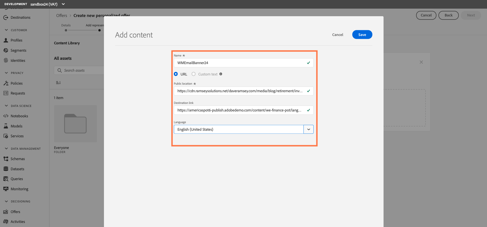
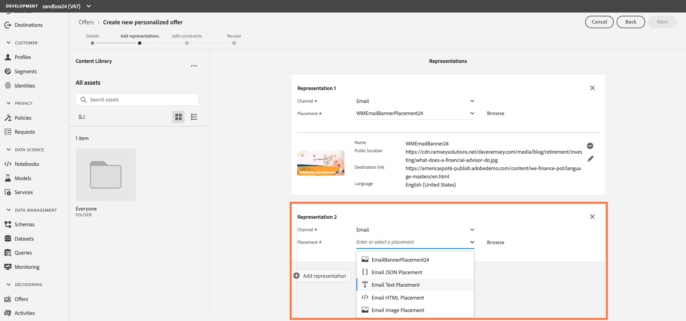
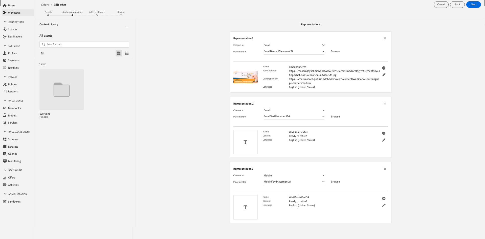

## Exercise 4 - Create a Personalized Offer and Decision Rules for an Auto Loan

Now that we have created a Tag, Placements and Decision Rules, let’s create our personalized offers. Offers will contain one or more representations. A representation is simply a piece of content mapped to a specific placement.

### Create Offer and Email Banner Representation

To create a personalized offer, follow these steps:

1.	In the Browse tab, click `Create offer` then select `Personalized offer`

    

2.	Name the Rule with the following naming convention. (“AutoLoanOffer  + your sandbox number.” Ex: “AutoLoanOffer24”)
3.	Start date = today. End date 1 year from now
4.	Add the tag you created earlier (“Promotion + your sandbox number.” Ex: “Promotion24”)
***Note: Offer Attributes are key value pairs associated with the offer and can be used for reporting and analysis. You can skip this optional step today.***

    

5.	Click `Next` to add content representations
6.	Select `Email` as the channel
7.	Select the Placement you created earlier EX: “EmailBannerPlacement24”

    
    
8.	Click `Add content`
9.	Name the Content with the following naming convention. (“EmailBanner  + your sandbox number.” Ex: “EmailBanner24”)
10.	Add the URL to the banner: https://www.loanry.com/blog/wp-content/uploads/2019/10/What-Lenders-Offer-the-Best-Auto-Loan-Rates.jpg
11.	Add the Destination Link: https://americaspot6-publish.adobedemo.com/content/we-finance-pot/language-masters/en.html
12.	Select “English (United States”) for Language

    
    
13.	Click `Save` 

You should now see the Email Banner Representation

### Create an Email Text Representation

1.	Click on `Add representation` button under your newly create banner
2.	Select `Email` as the channel
3.	Select the Placement you created earlier EX: “EmailTextPlacement24”

    

4.	Click `Next` to advance to the “Add content” screen
5.	Name your content with the following naming convention. (“EmailText  + your sandbox number.” Ex: “EmailText24”)
6.	Select `Custom Text` and add “Ready for your next ride?” in the Content field
7.	Select “English (United States”) for Language

    
    
8.	Click `Save` 

You should now see a representation for your Email Banner placement and your Email Text placement

### Create a Mobile Text Representation
1.	Click on Add representation
2.	Select `Mobile` as the channel
3.	Select the “MobileTextPlacement + your sandbox number” Ex. “MobileTextPlacement24” 

    
    
4.	Click `Next` to advance to the “Add Content” screen
5.	Name the Content with the following naming convention. (MobileText  + your sandbox number. Ex: “MobileText24”)
6.	Select `Custom Text` and add “Ready for your next ride?” in the Content field
7.	Select “English (United States”) for Language
8.	Click `Save` 

    
    
You should now see a representation for your Email Banner placement, Email Text and Mobile Text placement

 
9.	Click `Next` to define the eligibility criteria

### Assign a Decision Rule

1.	Select the `Decision Rule` radio button to see the Decision Rules you built earlier

    
    
2.	Because this is the Auto Loan offer, select the “Loan Eligibility” rule you created
    - Add or drag and drop from the decision rules panel
    - Set the priority to 100 for the purposes of our lab **Note: Priority is a number used to rank offers that meet all constraints such as eligibility, dates, and capping.**
    - Set capping to 3

    
3.	Click, `Next` to review a summary of your Auto Loan Offer
4.	Click, `Finish` and `Save and Approve` to save your offer

## Create a Personalized Offer for a Wealth Management Offer

### Create Offer and an Email Banner Representation

Now we will follow the same steps to create a personalized offer and decision rules for Wealth Management:

1.	In the Browse tab, click `Create offer` then select `Personalized offer`
2.	Name the Rule with the following naming convention. (“WealthManagementOffer  + your sandbox number.” Ex: “WealthManagementOffer24”)
3.	Start date = today. End date 1 year from now
4.	Add the tag you created earlier (“Promotion + your sandbox number.” Ex: “Promotion24”)

    

5.	Click `Next` to add content
6.	Select `Email` as the channel
7.	Select the Placement you created earlier EX: “EmailBannerPlacement24”

    
    
8.	Click `Add content`
9.	Name the Content with the following naming convention. (“WMEmailBanner  + your sandbox number.: Ex: “WMEmailBanner24”)
10.	Add the URL to the banner: https://cdn.ramseysolutions.net/daveramsey.com/media/blog/retirement/investing/what-does-a-financial-advisor-do.jpg
11.	Add the Destination Link: https://americaspot6-publish.adobedemo.com/content/we-finance-pot/language-masters/en.html
12.	Select “English (United States”) for Language

     

13.	Click `Save` You should now see the Email Banner Representation

### Create an Email Text Representation
1.	Click on `Add representation`
2.	Select `Email` as the channel
3.	Select the Placement you created earlier EX: “EmailTextPlacement24”

     

4.	Select the “WMEmailText + your sandbox number” EX. WMEmailText24” as the Placement 
5.	Click `Next` to advance to the “Add Content” screen
6.	Name the Content with the following naming convention. (“WMEmailText  + your sandbox number.” Ex: “WMEmailText24”)
7.	Select `Custom Text` and add “Ready to retire?” in the Content field
8.	Select “English (United States”) for Language
9.	Click `Save`

You should now see a representation for your Email Banner placement and your Email Text placement

### Create a Mobile Text Representation
1.	Click on `Add representation`
2.	Select `Mobile` as the channel
3.	Select the Placement you created earlier EX: “MobileTextPlacement24”
4.	Click `Next`to advance to the “Add Content” screen
5.	Name the Content with the following naming convention. (“WMMobileText  + your sandbox number.” Ex: “WMMobileText24”)
6.	Select `Custom Text` and add “Ready to retire?” in the Content field
7.	Select “English (United States)” for Language
8.	Click `Save` 

You should now see a representation for your Email Banner placement, Email Text and Mobile Text placement

9.	Click `Next` to define the eligibility criteria

### Assign a Wealth Management Decision Rule

1.	Select the `Decision Rule` radial button to see the Decision Rules you built earlier

     

2.	Because this is the Wealth Management offer, select the “AffluentCustomer” rule you created
    - Add or drag and drop from the decision rules panel
    - Set the priority to 101 for the purposes of our lab **Note: Priority is a number used to rank offers that meet all constraints such as eligibility, dates, and capping.**
    - Set capping to 3
 
3.	Click`Next` to review a summary of your Wealth Management Offer

    

4.	Click`Finish` and `Save and Approve` to save your offer

 ---

Next Step: [Exercise 5 - Create a Fallback Offer](Exercise5-FallbackOffer.md)

