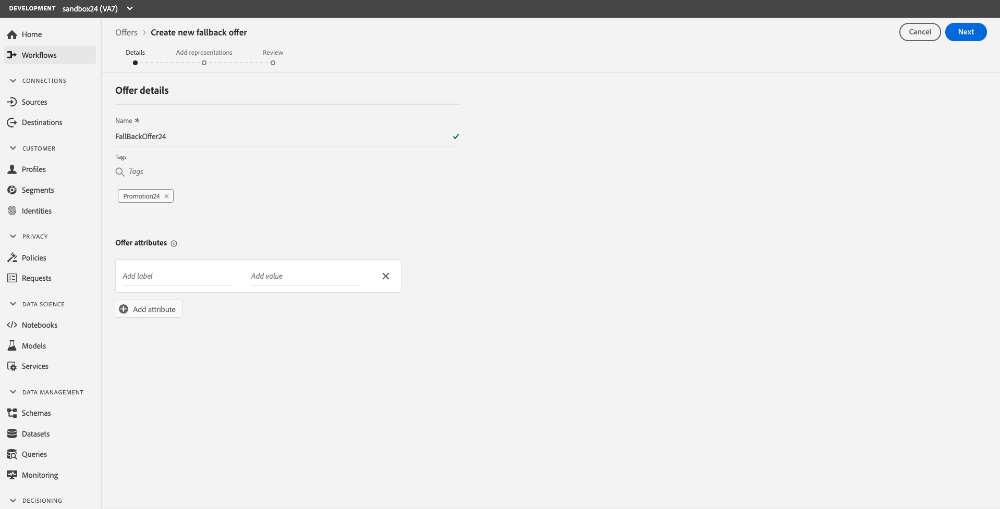
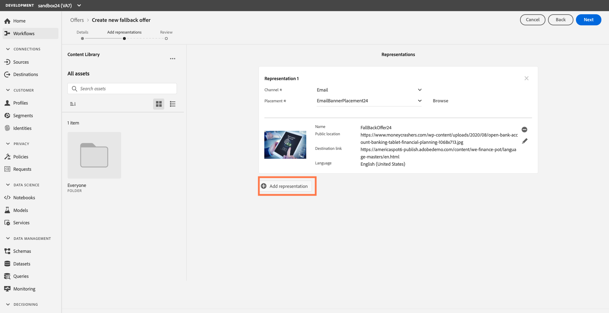

## Exercise 5 - Create a Fallback offer

Fallback offers are default offers which are shown to customers who don’t qualify for any of your personalized offers. We need to create a placement and representation content for our email banner, email text and mobile text for our Fallback offer. 

To create a fall back offer, follow these steps:

1.	In the Browse tab, click “Create offer,” then select “Fallback offer.”

    

2.	For the purposes of the lab, please use this naming convention. (“FallbackOffer + your sandbox number.” Ex: “FallbackOffer24”)

    

3.	Click “Next” to add a Representation for your Email Banner
4.	Select “Email” as the channel
5.	Select the Placement you created earlier EX: “EmailBannerPlacement24”
6.	Click “Add content” 
7.	Name the Content with the following naming convention. (“FallBackEmailBanner  + your sandbox number.” Ex: “FallBackEmailBanner24”)
8.	Add the URL to the banner: https://www.moneycrashers.com/wp-content/uploads/2020/08/open-bank-account-banking-tablet-financial-planning-1068x713.jpg
9.	Add the Destination Link: https://americaspot6-publish.adobedemo.com/content/we-finance-pot/language-masters/en.html
10.	Select “English (United States)” for Language

    

11.	Click “Save.” 

We will now create representations for both the email text and SMS text fallback offer

### Add Representations for Email Text
1.	Click on “Add representation”

     
     
2.	Select “Email” as the channel
3.	Select the placement you created earlier Ex. “EmailTextPlacement24”
4.	Click “Add content”
5.	Name the Content “FallBackEmailText + your sandbox number” Ex. “FallBackEmailText24”
6.	Enter “Banking reimagined!” in the Content field
7.	Select “English (United States” for Language)

### Add Representations for a Mobile Text
1.	Click on “Add representation”
2.	Select “Mobile” as the channel
3.	Select the placement your created earlier Ex: “MobileTextPlacement24”
4.	Click “Add content”
5.	Name the Content “FallBackMobileText + your sandbox number” Ex. “FallBackMobileText24” 
6.	Enter “Banking reimagined!” in the Content field
7.	Select “English (United States” for Language)
8.	Click “Next” to review and then  “Finish” and “Save and Approve” to save your offer

You should now see your Fallback offer 

   
     
 ---

Next Step: [Exercise 6 - Create a Collection](Exercise6-Collections.md)
