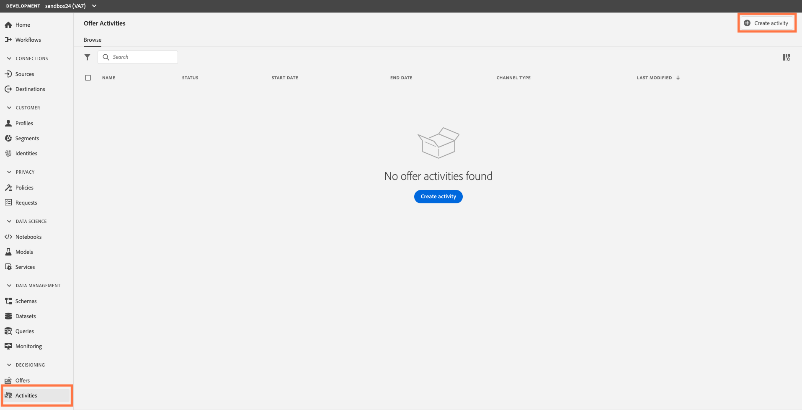
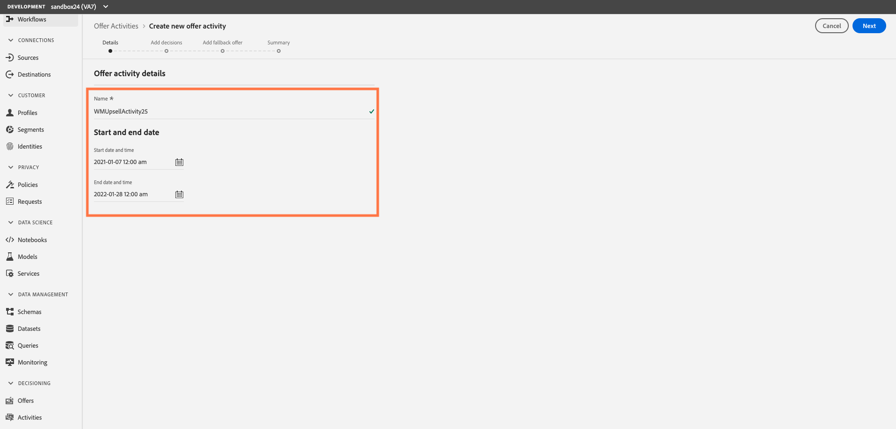

## Exercise 7 - Create an Offer Activity/Decision

To create an activity/decision, follow these steps:

1.	Select the Decisions within Decision Management -> Offers, then click `Create decision`

    
    
  - Specify the activity’s name. For the purposes of the lab, please use this naming convention. (“UpsellActivity + your sandbox number. Ex: AutoLoanUpsellActivity24”)

2.	 Define a start and end date, and time. Start date = today. End date = 1 year from today, then click `Next`

    
3.	Drag and drop or click on the “+” to add the placements for the banner, email text and mobile text from the list to add it to the activity. 

     
    
4.	Click `Add collection` for the EmailBannerPlacement. You should see your associated offers listed in the collection we created earlier.
5.	Click `Add` to add all of the available offers in the collection to the placement.

     

6.	Repeat this process for both the EmailTextPlacement and the MobileTextPlacement by clicking on `Add collection` and clicking `Add` to add all the available offers in the collection to that placement.
7.	Click `Next` to confirm.
8.	Select the Fallback offer that will be presented as a last resort to the customers that do not match the offers eligibility rules and constraints
9.	Click `Next` to review a summary of you offer activity. You should see 3 decisions, each containing 2 offer types (Auto loan and Wealth management,) and a fallback offer.
 
     
    
10.	If everything is configured properly and your activity is ready to be used to present offers to customers, click `Finish` then select `Save and activate`

 ---

Next Step: [Exercise 8 - Validate Your Offer ](Exercise8-ValidateOffer.md)
