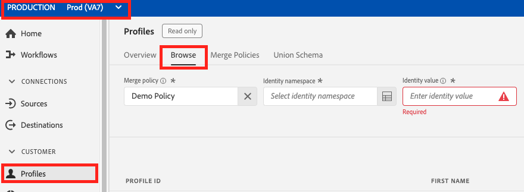
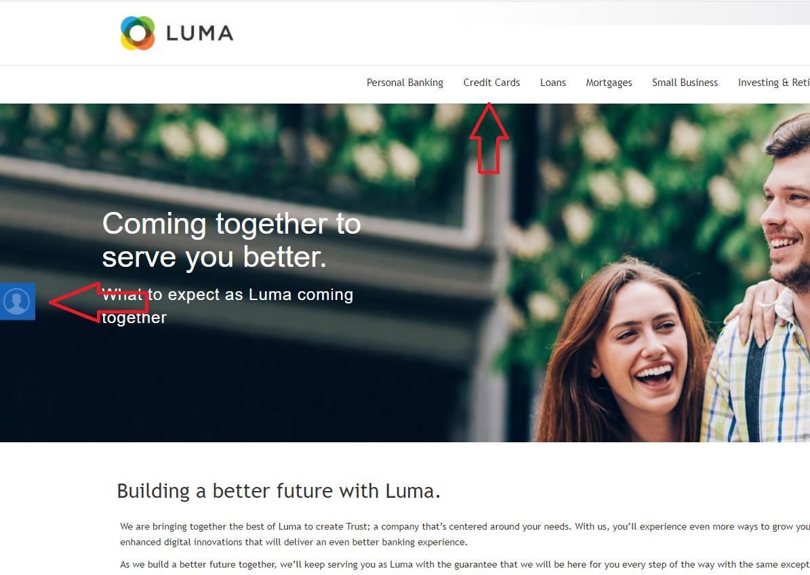

Lab 5.1 - Profiles - UPS Review
==========
<table style="border-collapse: collapse; border: none;" class="tab" cellspacing="0" cellpadding="0">

<tr style="border: none;">

<td width="600" style="border: none;">
<table>
<tbody valign="top">
      <tr width="500">
            <td valign="top"><h3>Objective:</h3></td>
            <td valign="top"> In this lab, you will look up your Customer Profile.
            </td>
     </tr>
     <tr width="500">
           <td valign="top"><h3>Prerequisites:</h3></td>
           <td valign="top"> none</td>
     </tr>
</tbody>
</table>
</td>

<td style="border: none;" valign="top">

<table>
<tbody valign="top">
      <tr>
            <td valign="middle" height="70"><b>section</b></td>
            <td valign="middle" height="70"></td>
      </tr>
      <tr>
            <td valign="middle" height="70"><b>version</b></td>
            <td valign="middle" height="70">1.0.1</td>
      </tr>
      <tr>
            <td valign="middle" height="70"><b>date</b></td>
            <td valign="middle" height="70">2020-01-06</td>
      </tr>
</tbody>
</table>
</td>

</tr>
</table>

In Adobe Experience Platform there's a new feature of visualizing the entire real-time customer profile. This one feature is what all of our customer's have been trying to get for years: a single view of the customer.

Instructions:
-----------------
	1.	Log in to Adobe Experience Platform by going to this URL: https://platform.adobe.com
2.	After logging in, you'll land on the homepage of Adobe Experience Platform.
3.	Make sure you are in the 'Prod(VA7)' instance and not in your sandbox instance.
4.	In the menu on the left side, go to Profiles.
5.	Click on the 'Browse' tab. You will see a UI in which a namespace and an ID can be entered.
 
<kbd></kbd>
 
6.	Next, go to https://americaspot2-publish.adobedemo.com/content/luma/language-masters/en.html in a browser and click into a category page
7.	In the left margin, click on the “person” icon. This will display the X-ray panel from this website.
 
<kbd></kbd>
 
8.	Expand the 'Real-time Customer Profile section'.
 
<kbd></kbd>
 
9.	Observe the identities and their linkage to a namespace.
10.	Copy the value for ECID.
11.	Go back to Profiles Browse view in Experience Platform.
12.	Select "ECID" in the "Identity namespace" dropdown and paste the ECID value copied previously into the "Identity value" field.
 
<kbd></kbd>
 
13.	Click on each of the tabs you see - Details, Attributes, Events and Segment Membership.
 
<kbd></kbd>
 
14.	Go back to https://americaspot2-publish.adobedemo.com/content/luma/language-masters/en.html.
15.	Click on the "Open An Account" at the top of the page
 
16.	Enter an email address, first name and last name. Click "Register Now".
17.	Go back to Experience Platform, click on 'Profiles' in the left panel, click on the 'Browse' tab and look up your ECID again.
18.	You will see a name, Crmid and email tied to linked to your ECID as a result of the registration action.
<kbd></kbd>
 
19.	Go back to https://americaspot2-publish.adobedemo.com/content/luma/language-masters/en.html.
20.	Click on Login (top right of page).
21.	Enter the email address you used during registration and a value in Company Name (you can leave the default for number) and hit 'Login'.
22.	Go back to Experience Platform, click on 'Profiles' in the left panel, click on the 'Browse' tab and look up your ECID again.
23.	Note any changes to the customer profile on the Details tab.
<kbd></kbd>

Return to [Lab Agenda Directory](https://github.com/adobe/AEP-Hands-on-Labs/blob/master/labs/media/README.md#lab-agenda)
