Lab  - Build an Orders schema (ExperienceEvent)
==========
<table style="border-collapse: collapse; border: none;" class="tab" cellspacing="0" cellpadding="0">

<tr style="border: none;">

<td width="600" style="border: none;">
<table>
<tbody valign="top">
      <tr width="500">
            <td valign="top"><h3>Objective:</h3></td>
            <td valign="top"> This lab will show you how to construct a schema.
            </td>
     </tr>
     <tr width="500">
           <td valign="top"><h3>Prerequisites:</h3></td>
           <td valign="top"> none
           </td>
     </tr>
</tbody>
</table>
</td>

<td style="border: none;" valign="top">

<table>
<tbody valign="top">
      <tr>
            <td valign="middle" height="70"><b>section</b></td>
            <td valign="middle" height="70"></td>
      </tr>
      <tr>
            <td valign="middle" height="70"><b>version</b></td>
            <td valign="middle" height="70">1.0.10</td>
      </tr>
      <tr>
            <td valign="middle" height="70"><b>date</b></td>
            <td valign="middle" height="70">2020-01-06</td>
      </tr>
</tbody>
</table>
</td>

</tr>
</table>

Before we begin go to [https://platform.adobe.com/home](https://platform.adobe.com/home). Follow the instructions detailed below.

Instructions:
-----------------
1. In the left-hand menu, navigate to "Schemas"

      <!--
      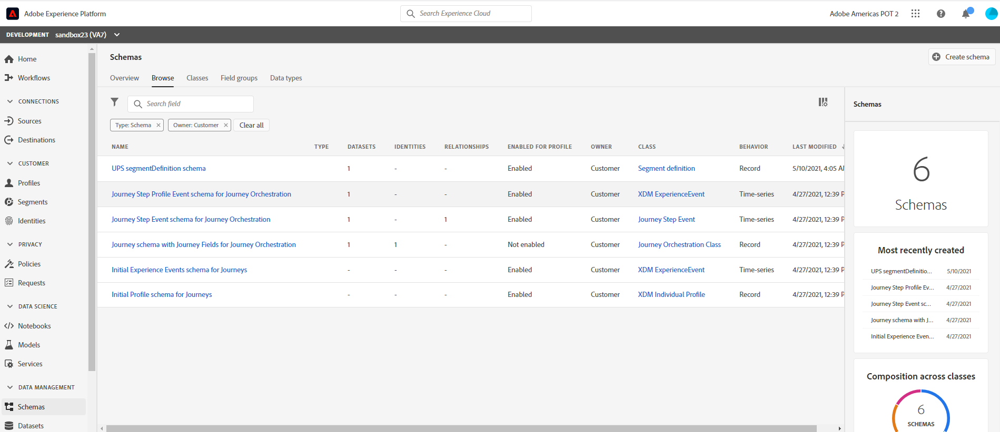
      -->
      
      <kbd></kbd> 
      
2. Click "Create Schema" on the top right

      <!--
      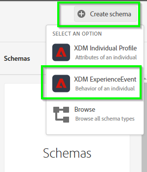
      -->
      
      <kbd></kbd>
      
3. Click on "Untitled Schema" in the structure view

    <!---
    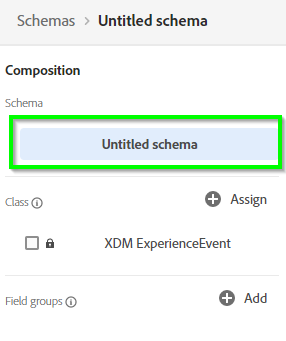
    --->

    <kbd></kdb>

      
      
4. In the right-hand menu, name it "Subscription Schema &lt;your-assigned-number>" (Description is optional)
      
      <!--
      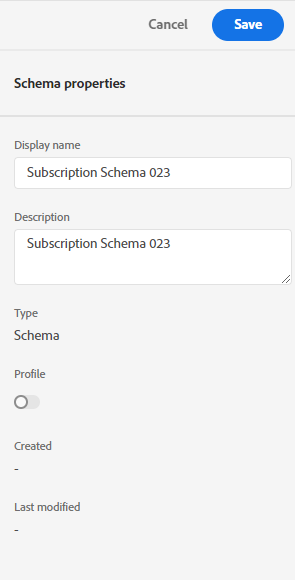
      -->
      
      <kbd></kdb>

      
5. In the left-hand schema composition menu, click on the "Assign" button across from Class

    <!---
    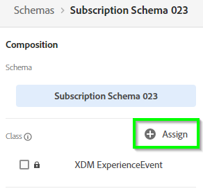
    --->

    <kbd></kdb>

      
      
    Here's where you can choose your base level schema behavior:
    - Time-based Events (ExperienceEvent)
    - Customer Snapshots (Profile)
     
      <!--
      
      -->
      
      <kbd></kdb>

      Note: There are other classes available out of the box that represent specific objects needed for Experience Modeling.

6. In this example, choose "XDM ExperienceEvent" and click "Assign class"

      <!--
      
      -->
      
      <kbd></kdb>
       
      
7. Now, click on the "Add" button across from "Mixins" on the left panel

    <!---
    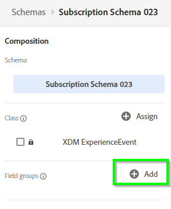
    --->

    <kbd></kdb>

      
      
      Here's where you can build your own Mixin or use a prior/similar Mixin object that conforms to your data.
           
      
8. In this lab we will be adding two pre-built mixins listed below

      - Subscription Details Mixin EE,
      - Identities Mixin EE
     
      Search for 'Subscription Details Mixin EE'. Select the mixin and hit Assign Mixin
      
     <!-- 
     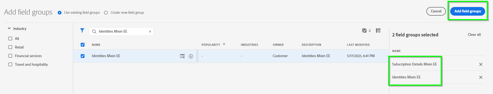
     -->
      <kbd></kdb>
      
      Your schema will now have the Subscription Details Mixin EE object and all of the fields within this object
      
      <!---
      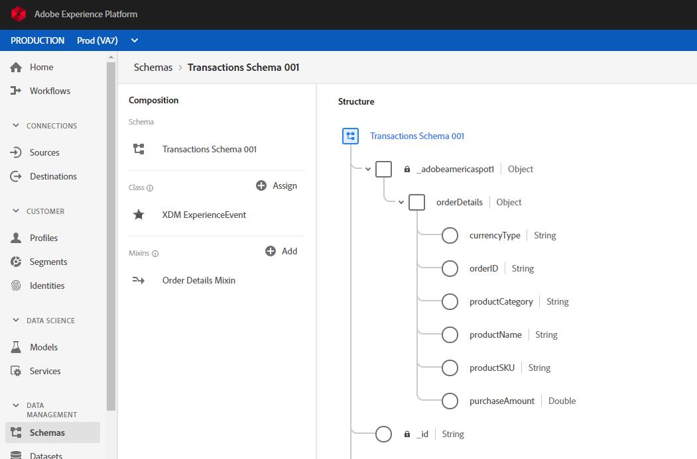
      --->

      <kbd></kdb>          
             
      Hit +Add to go back to the Mixin list
     
      <kbd>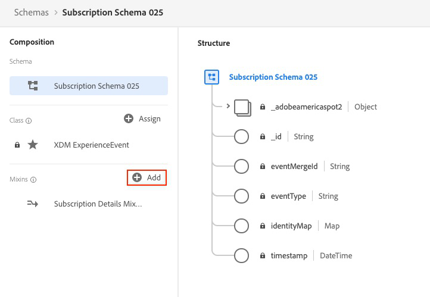</kdb>            
                 
      And, repeat the steps for the Identities Mixin EE.  Search for 'Identities Mixin EE'. Select the mixin and hit Assign Mixin 
                        
      <kbd>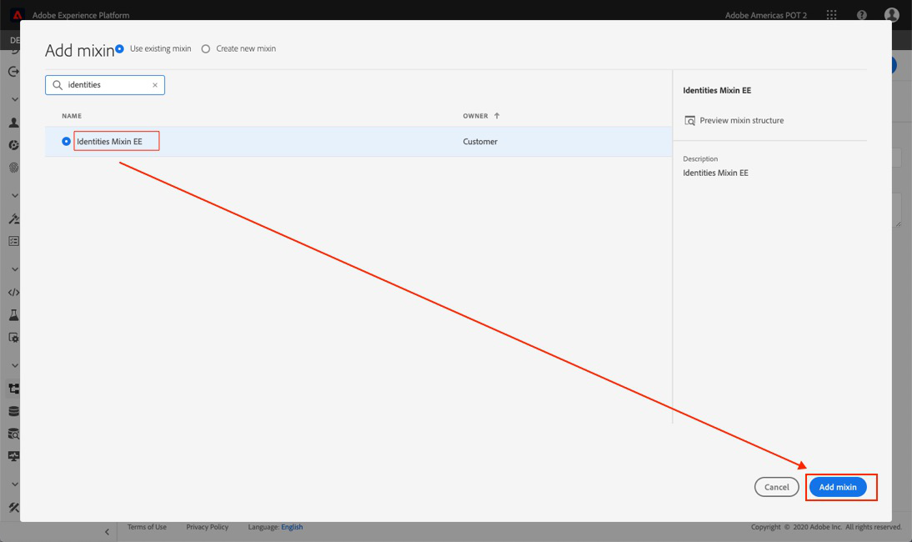</kdb>     
       
      Your schema will now have the Identities Mixin EE object and all of the fields within this object
      
      <kbd>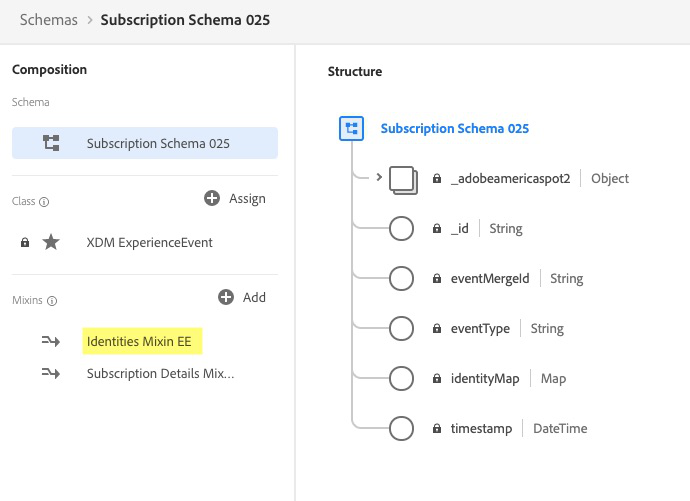</kdb>
      
        
9. Now, we'll create a new Mixin from scratch. Go back and hit the +Add button on the left panel.

      <kbd>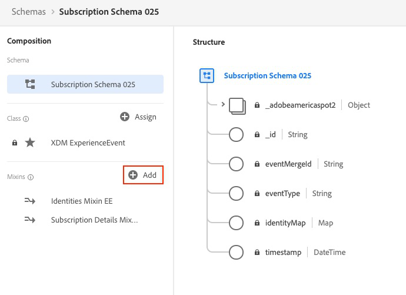</kdb>    
       
      
10. Select "Create new mixin" on the very top

      <kbd>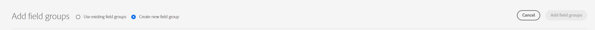</kdb>    
      
      
11. Display name is "Account Details Mixin EE &lt;your-assigned-number>" and then hit 'Add Mixin'
      
    <!--  
    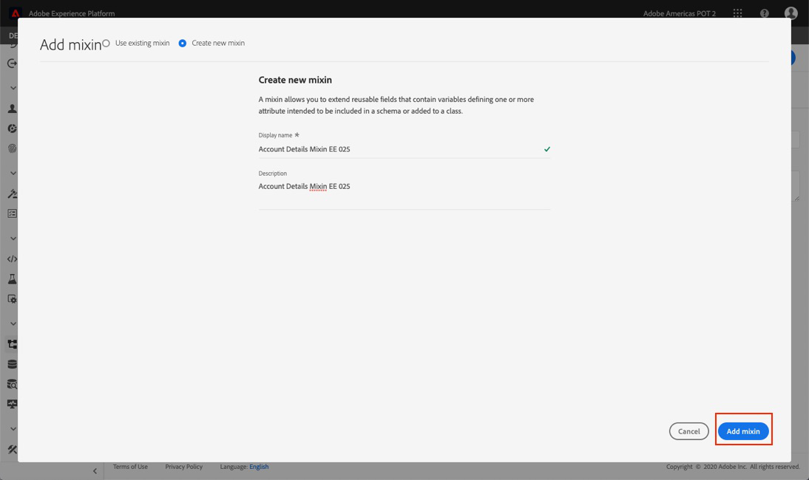
    --> 
    <kbd></kdb>     
     
12. In the left-hand schema composition menu, click on your newly create Mixin (it should be highlighted now)

    <!---
    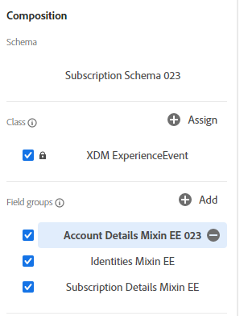
    --->

    <kbd></kdb>   
       

13. Notice that on the Structure view a '+Add Field' appears next to the Schema name, Click it to start adding fields 

    <!---
    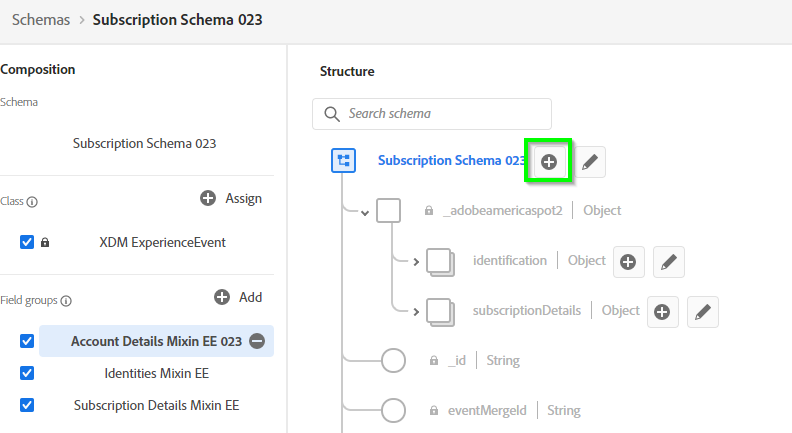
    --->

    <kbd></kdb>   

14. On the Field Properties panel to the right add the following  
      - FieldName = accountDetails
      - Description = Account Details
      - Type = Object

    <!--  
    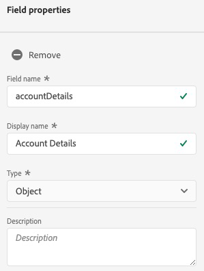
    -->
    <kbd></kdb>    

    Scroll  down and hit Apply

    <!--  
    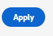
    -->
    <kbd></kdb>    

15. Next, we will be adding fields to the 'accountDetails' object. Click "+Add Field" next to this object

    <!---
    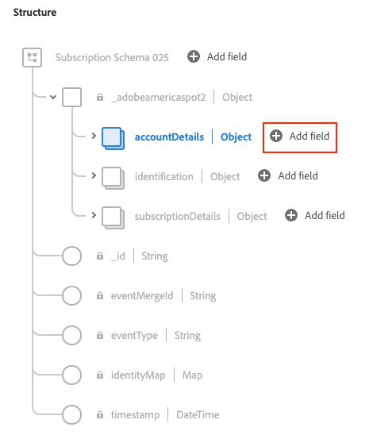
    --->

    <kbd></kdb>   

16. On the Field Properties panel to the right add the following  
      - FieldName = accountCurrentContractMonth
      - Description = Account Current Contract Month
      - Type = String

     <!-- 
     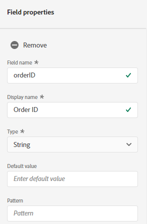
     -->
     <kbd>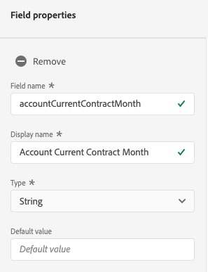</kdb>   

     Scroll down and hit Apply

    <!--  
    
    -->
    <kbd></kdb>    

17. We will be adding two more fields to the 'accountDetails' object.  Click "+Add Field" next to the object

    <!---
    
    --->

    <kbd></kdb>

18. On the Field Properties panel to the right add the following  
      - FieldName = accountOriginChannel
      - Description = Account Origin Channel
      - Type = String

    <!--  
    
    -->
    <kbd>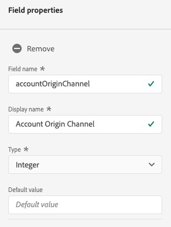</kdb>

    Scroll down and hit Apply

    <!--  
    
    -->
    <kbd></kdb>
    
19. Click "+Add Field" next to the 'accountDetails' object.

    <!---
    
    --->

    <kbd></kdb>

20. On the Field Properties panel to the right add the following  
      - FieldName = accountStatus
      - Description = Account Status
      - Type = String

    <!--  
    
    -->
    <kbd>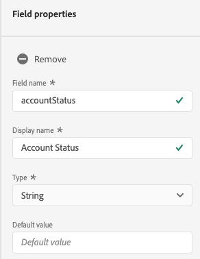</kdb>

    Scroll down and hit Apply

    <!--  
    
    -->
    <kbd></kdb>
    
    
21. We are done with modeling the schema. Make sure that your schema structure looks like the one in the screenshot below
 
     <!---
     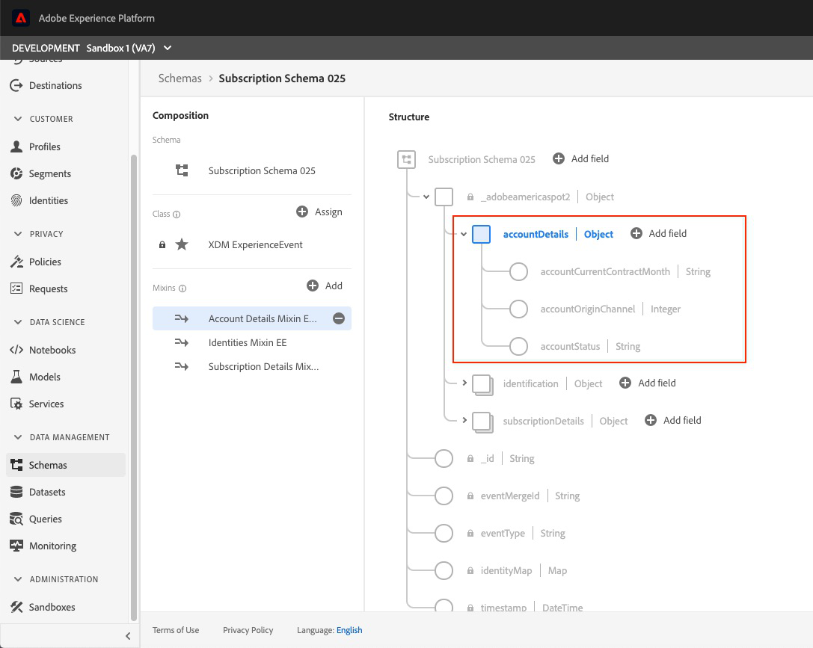
     --->
     <kbd></kdb>

22.  Save your schema. hit Save on the top right corner.

      <kbd>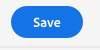</kdb>
 
23. Congratulations!!! You have constructed your schema.
 
 
 
 

Return to [Lab Agenda Directory](https://github.com/adobe/AEP-Hands-on-Labs/blob/master/labs/retail/README.md#lab-agenda)

