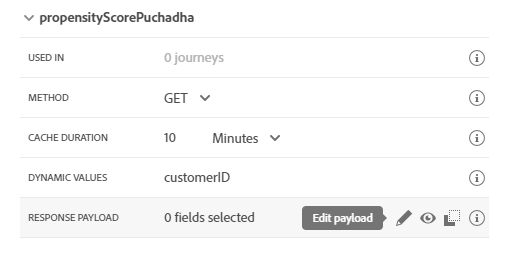
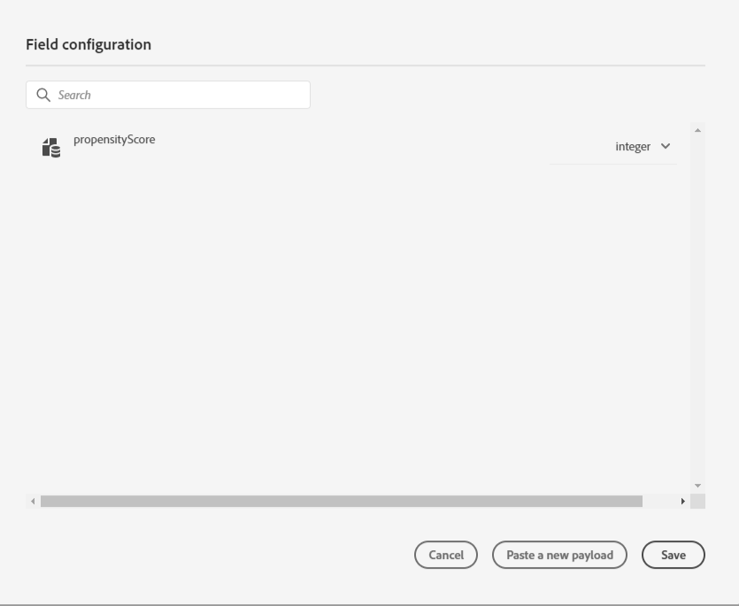

## Exercise 2 - Define an External Data Source

In this exercise, you'll create a custom External Data Source by making use of Journey Orchestration in combination with Adobe Experience Platform

1. Go to [https://experience.adobe.com/#/@adobeamericaspot5/home](https://experience.adobe.com/#/@adobeamericaspot5/home)

   You'll see the `Adobe Experience Cloud`-homepage.

   

2. Click on `Journey Orchestration`.

   

   Next, you'll see the `Journey Orchestration`-homepage.

   

3. In the menu, click on `Data Sources`.

   

   You'll then see the `Data Sources`-list.

     <!---
     
     --->

   <kbd></kdb>

4. Click `Add` to start adding your data source.

   

   You'll see an empty data source popup.

     <!---
     
     --->

   <kbd></kdb>

5. We will use an API endpoint to retrive a customer's likelyhood to subscribe. This service will take in an ECID value and respond with a propensity score between 1 - 10, 1 being the least likey and 10 being the most likely to convert.

   Back to `Journey Orchestration`, to your empty `External Data Source`-popup.

   Name the Data Source, use **getPropensityScore{emailAddress}** and replace **emailAddress** with your email address name. E.g. **getPropensityScorePuchadha**.

   Set Description to: **Access to the Propensity Scores**.

   The URL for to get scores is: `https://adobeamericaspot2.adobeioruntime.net/api/v1/web/aep-hol-0.0.1/getScore`

     <!---
     
     --->

   <kbd></kdb>

6. Next, you need to select the Authentication to use. Select 'No authentication' from the 'Type' drop-down.

     <!---
     
     --->

   <kbd></kdb>

7. Finally, you need to define a `FieldGroup`, which is the request you'll be sending to the Weather API.

   In our case, we want to use a customerID to request score for a specific profile.

     <!---
     
     --->

   <kbd></kdb>

   In order to match the expected API Request, configure your FieldGroup as follows:

   **IMPORTANT**

   The Field group name has to be unique, please rename fieldGroup and use this naming convention: **propensityScoreemailAddress** so in this case, the name should be **propensityScorePuchadha**

For Cache Duration select 10 mins.

Dynamic Values, is where we allow parameter inputs we will be passing in a customerID to this data source add 'customerID'

     <!---
     
     --->

<kbd></kdb>

8. For the Response Payload, you need to paste an example of the Response that will be sent by the API copy the JSON Response below here:

   ```json
   {
     "propensityScore": 10
   }
   ```

9. Click the `Edit Payload`-icon.

     <!---
     
     --->

   <kbd></kdb>

   You'll see a popup where you now have to paste the above JSON Reponse.

   

   Paste your JSON Response.

   

10. Click `Save`.

    

    Your custom Data Source configuration is now complete. Scroll up and click `Save`.

      <!---
      
      --->

    <kbd></kdb>

    Your Data Source has now been created successfully and is part of the `Data Sources`-list.

      <!---
      
      --->

    <kbd></kdb>

Next Step: [Exercise 3 - Define a Custom Action](./Exercise3-Action.md)

```

```
