## Exercise 4 - Design a trigger-based Customer Journey

In this exercise, you'll create an Orchestrated Journey by making use of Journey Orchestration in combination with Adobe Experience Platform

1. Go to [https://experience.adobe.com/#/@adobeamericaspot5/home](https://experience.adobe.com/#/@adobeamericaspot5/home)

   You'll see the `Adobe Experience Cloud`-homepage.

   

2. Click on `Journey Orchestration`.

   

   Next, you'll see the `Journey Orchestration`-homepage, which shows all existing Journeys.

   

3. Click `Create` to start creating your Journey.

   

   You'll then see a new, blank Journey.

   <!---
   
   --->

   <kbd></kdb>

4. Name the Journey **Subscription Page Abandonment emailAddress** and replace **emailAddress** with LDAP. In this example, the Journey Name is **Subscription Page Abandonment puchadha**. No other values must be set at this moment.

   <!---
   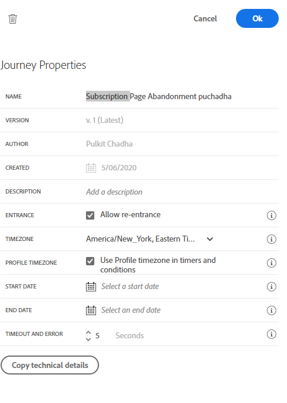
   --->

   <kbd></kdb>

   Click `OK`.

   

5. On the left side of your screen, have a look at `Events`. You should see your previously create Event on that list. Select it, then drag and drop it on the Journey Canvas.

   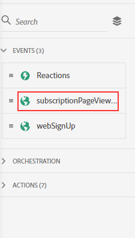

   Your Journey then looks like this:

   

6. Next, click on `Orchestration`.

   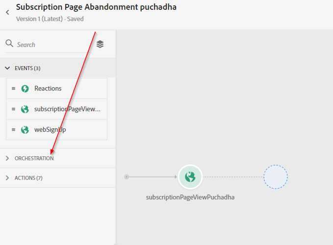

   You now see `Orchestration`-capabilities.

   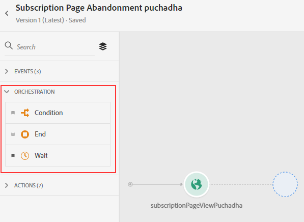

7. Select `Wait`, then drag and drop it on the Journey Canvas, and update Amount of time tp 10 minutes.

   <!---
   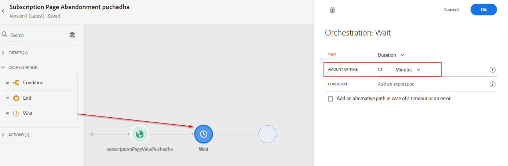
   --->

   <kbd></kdb>

8. Click `OK`.

   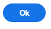

9. Select `Condition`, then drag and drop it on the Journey Canvas.

   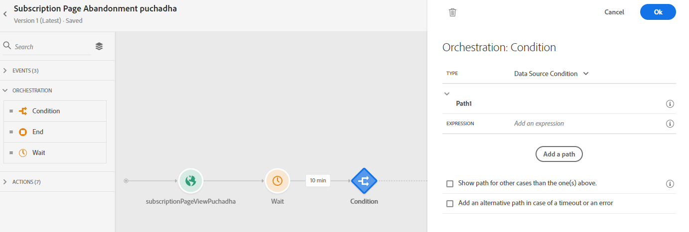

10. Click on the `Edit`-icon for the expression of Path1.

    <!---
    
    --->

    <kbd></kdb>

    You'll then see an empty `Simple Editor`-screen.

    

    Our query will be a bit more advanced, so we'll need the `Advanced Mode`.

11. Click `Advanced Mode`.

    

    You'll then see the `Advanced Editor` which allows code entry. Paste it in `count(#{ExperiencePlatform.ExperienceEvents.experienceevent.all(currentDataPackField.eventType =="subcribed" and currentDataPackField.timestamp > nowWithDelta(-1, "days"))._id}) > 0`

    You'll then see this.

    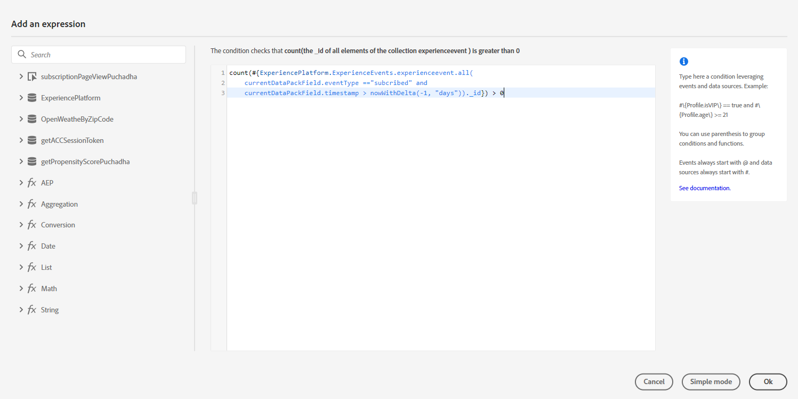

12. Click `OK`.

    

13. Rename the path from path1 to 'subscribed'

    <!---
    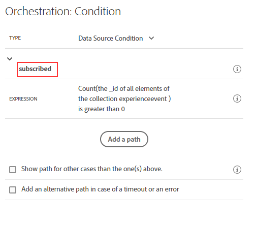
    --->

    <kbd></kdb>

14. Next, check the other cases checkbox. This will add a fallback path if none of the previous paths are true for the profile. label this Path `did not subscribe`
    <!---
    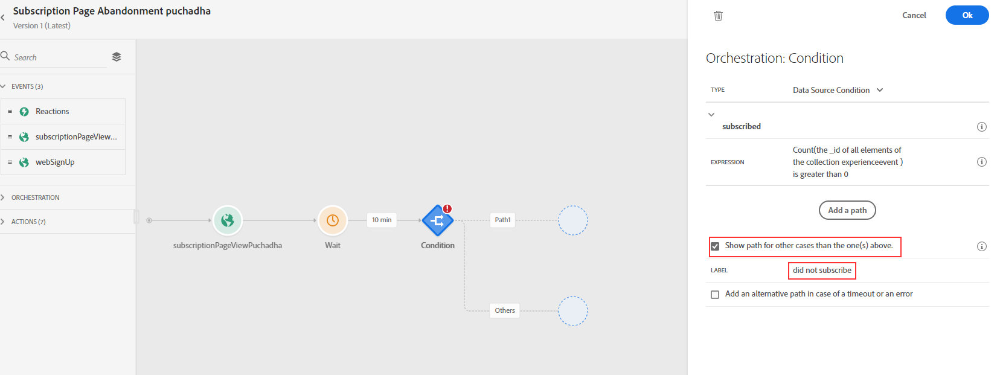
    --->

    <kbd></kdb>

15. Click `OK`.

    

16. Drag and drop the end activity for the subscribed path. We wont be communicating to profiles that have converted.

    <kbd>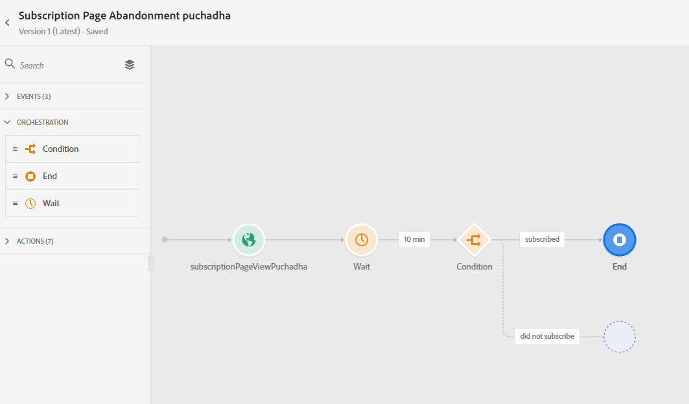</kdb>

17. Next, we will be adding in Actions

    #### Add Actions for did not subscribe Path

    We'll attempt to send an SMS message to our customer.

    Your Journey will then look like this.

    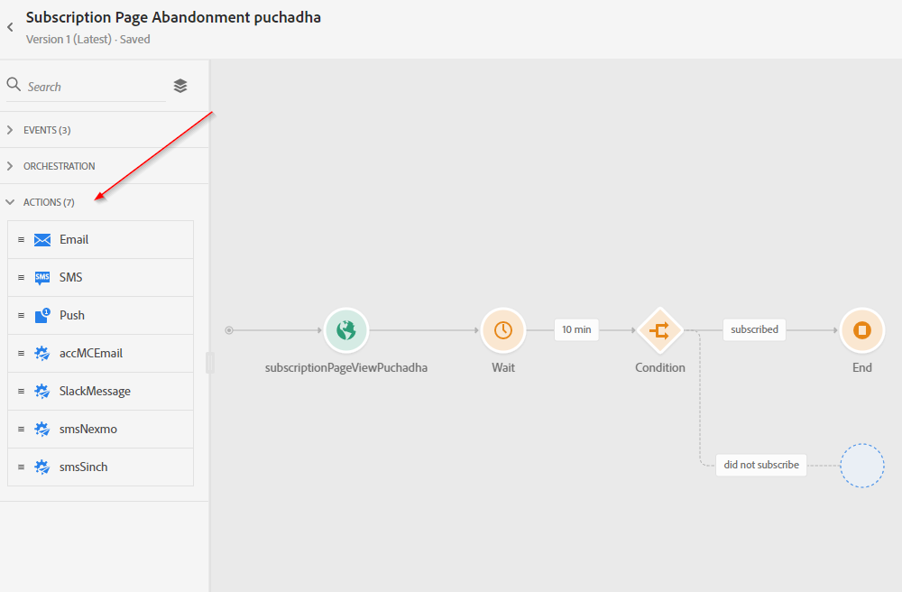

18. Click on `Actions` as indicated in the screenshot.

    Select the smsNexmoemailAddress - action (your emailAddress), then drag and drop it after the condition you just added.

    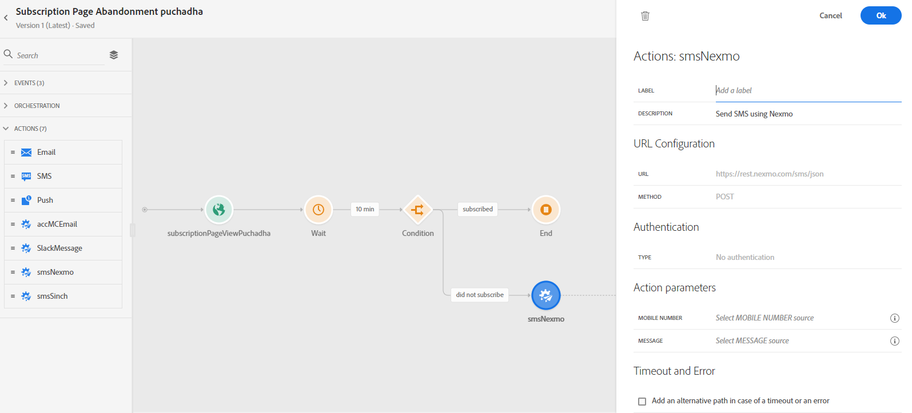

    You'll see a popup.

    <!---
    
    --->

    <kbd></kdb>

19. Navigate to the `Action Parameters`.

    <!---
    
    --->

    <kbd></kdb>

20. Click on the `Edit`-icon for the Action Parameter `Mobile PhoneNumber`.

    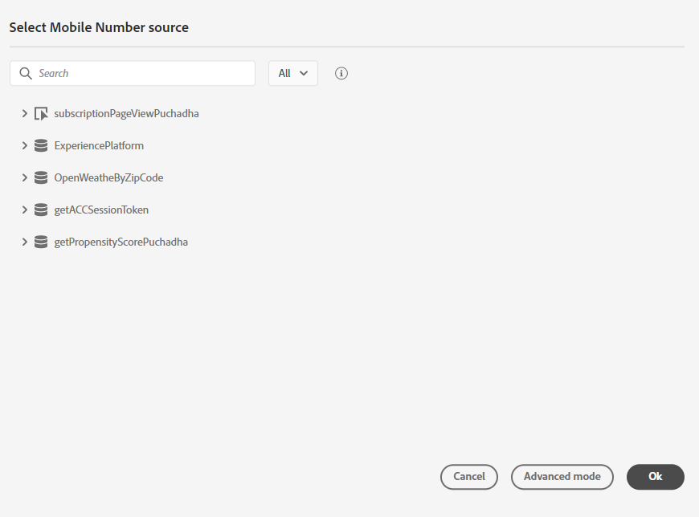

    In the popup, you'll see, click on `Advanced Mode`.

    

    Select the below code, copy it, and paste it in the `Advanced Mode Editor`.

    `#{ExperiencePlatform.ProfileFieldGroup.profile.mobilePhone.number}`

    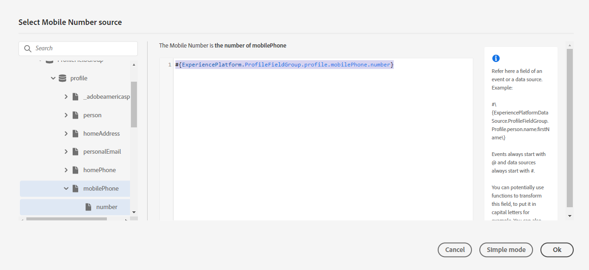

21. Click `OK`.

22. Click on the `Edit`-icon for the Action Parameter `Message`.

    <!---
    
    --->

    <kbd></kdb>

    You'll see a popup with the `Simple Mode Editor`.

    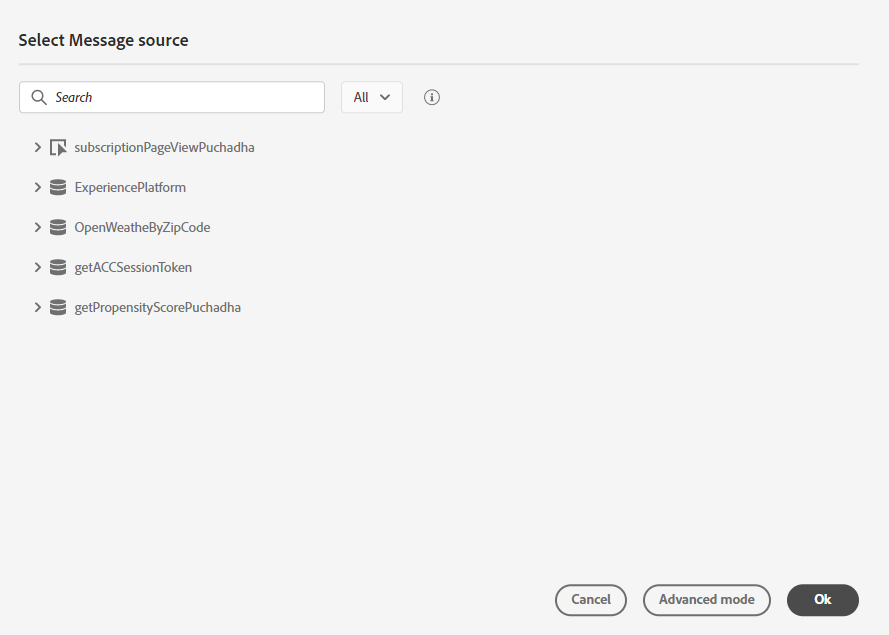

    In the popup, you'll see, click on `Advanced Mode`.

    

23. Paste this code in the `Advanced Mode Editor`. Click `OK`.

    `"Hi "+ #{ExperiencePlatform.ProfileFieldGroup.profile.person.name.firstName} +", dont miss out on exclusive offers on your subscribtion."`

    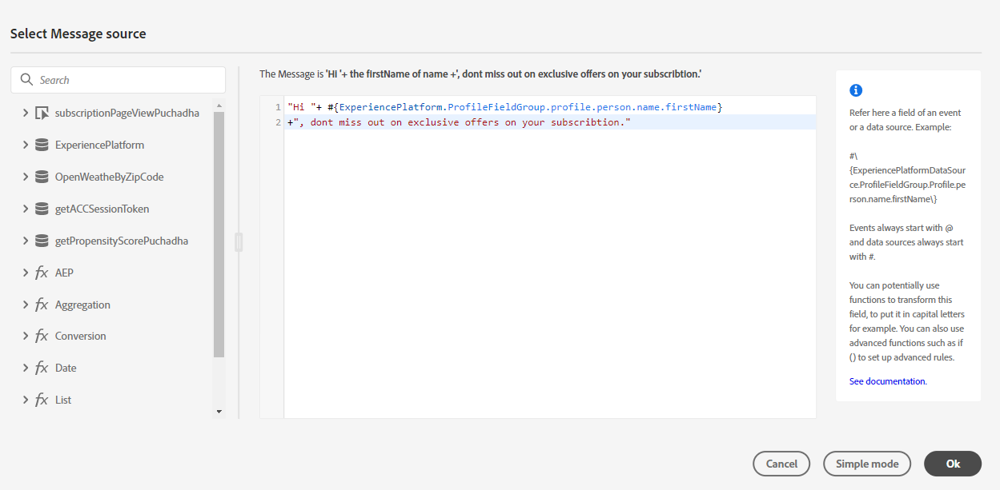

24. Click `OK`.

    

25. Click `OK`.

    <!---
    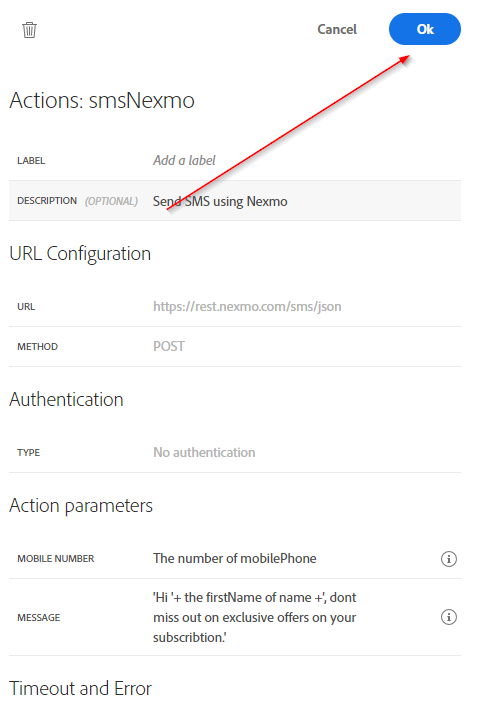
    --->

    <kbd></kdb>

26. Select `Wait`, then drag and drop it on the Journey Canvas, and update Amount of time to 30 minutes.

   <!---
   
   --->

<kbd>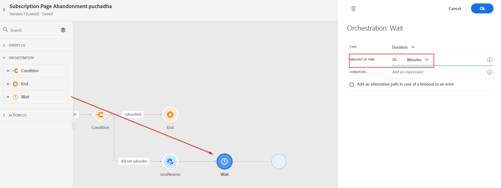</kdb>

28. Click `OK`.

    

29. Select `Condition`, then drag and drop it on the Journey Canvas.

    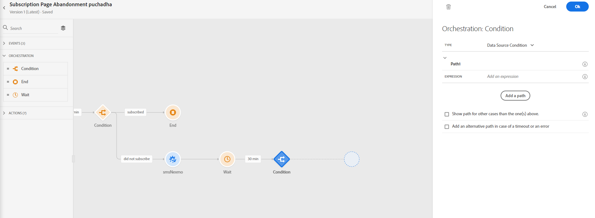

30. Click on the `Edit`-icon for the expression of Path1.

    <kbd></kdb>

    You'll then see an empty `Simple Editor`-screen.

    

    Our query will be a bit more advanced, so we'll need the `Advanced Mode`.

31. Click `Advanced Mode`.

    

    You'll then see the `Advanced Editor` which allows code entry. Paste it in `#{getPropensityScoreemailAddress.propensityScoreemailAddress.propensityScore} >= 6` (replace emailAddress)

    You'll then see this.

    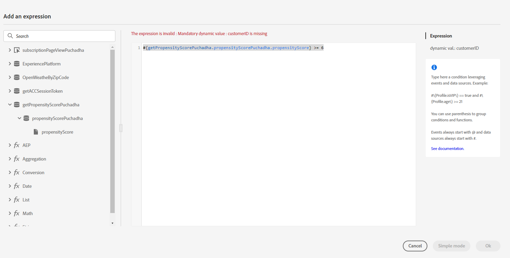

32. Click the dynamic val :customerID in the top rigth. This is the place where we will pass in the customerID value to retrive the score

    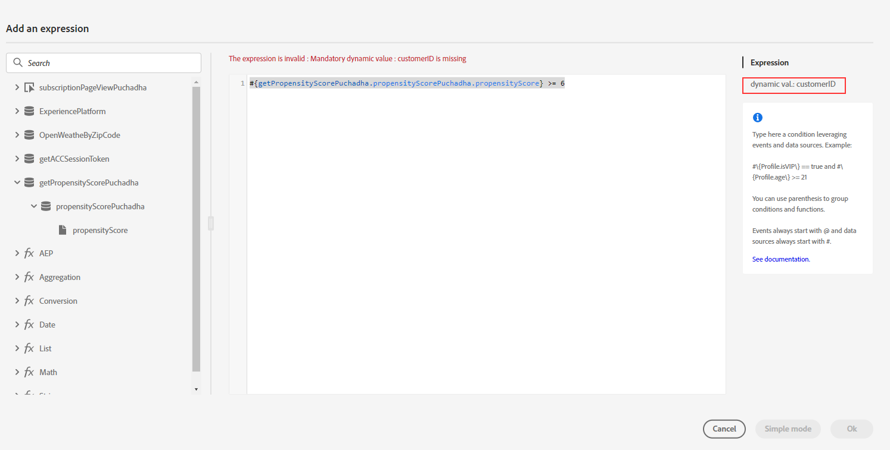

33. Pass in the ECID value by copy pasting this expression it in `@{subscriptionPageViewPuchadha._adobeamericaspot2.identification.ECID}`

    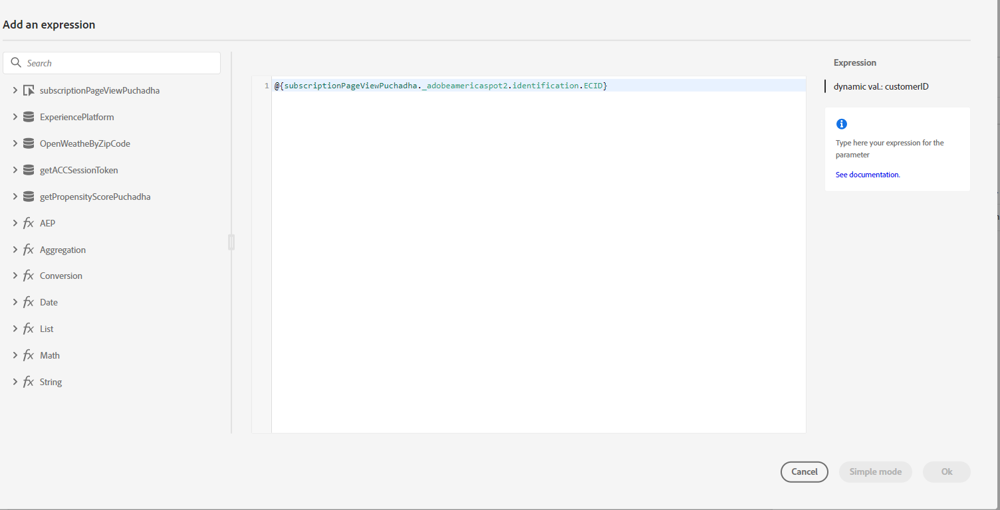

34. Click `OK`.

    

35. Rename the path from path1 to 'likely to subscribe'

    <!---
    
    --->

    <kbd>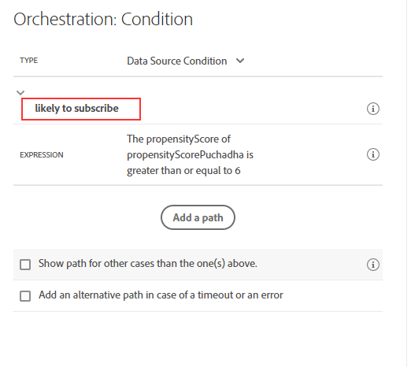</kdb>

36. Next, check the other cases checkbox. This will add a fallback path if none of the previous paths are true for the profile. label this Path `low propensity to subscribe`
    <!---
    
    --->

    <kbd>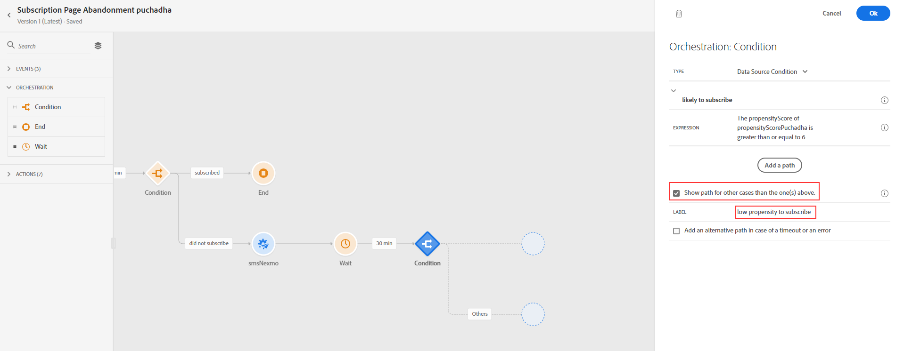</kdb>

37. Click `OK`.

    

38. Drag and drop the end activity for the subscribed path. We wont be communicating to profiles that have converted.

    <kbd>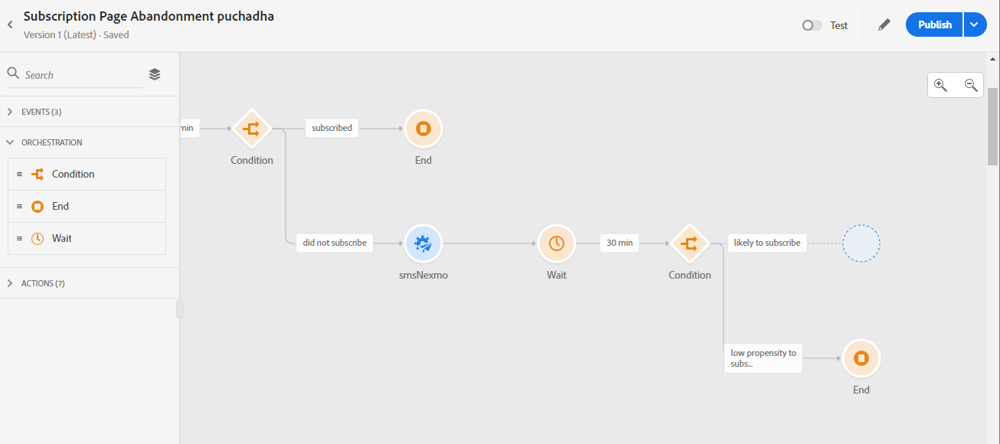</kdb>

39. In the left menu, go back to `Actions`, select the Action `slackNotification`, then drag and drop it after

    <!---
    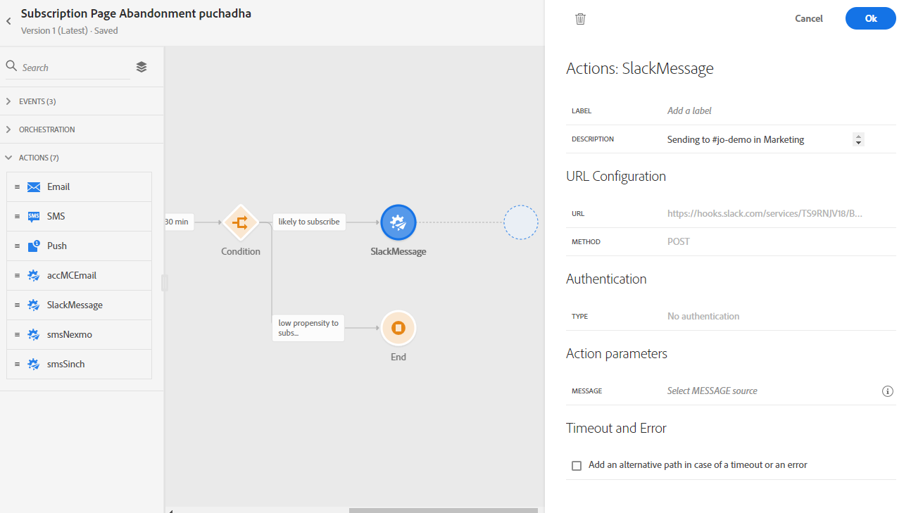
    --->

    <kbd></kdb>

40. Go to `Action Parameters` and click the `Edit`-icon for the parameter `Message`.

    <!---
    
    --->

    <kbd></kdb>

    In the popup window, click `Advanced Mode`.

    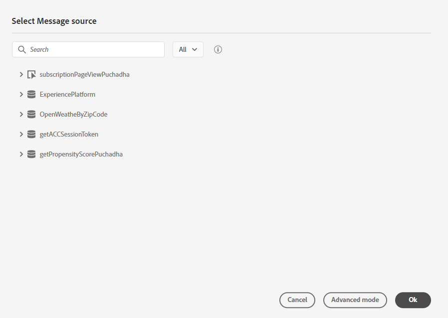

41. Select the below code, copy it, and paste it in the `Advanced Mode Editor`.

    `@{subscriptionPageViewPuchadha._adobeamericaspot2.identification.ECID} + "Likely to suncscribe. Place an Outbound call to - " + #{ExperiencePlatform.ProfileFieldGroup.profile.homePhone.number}`

    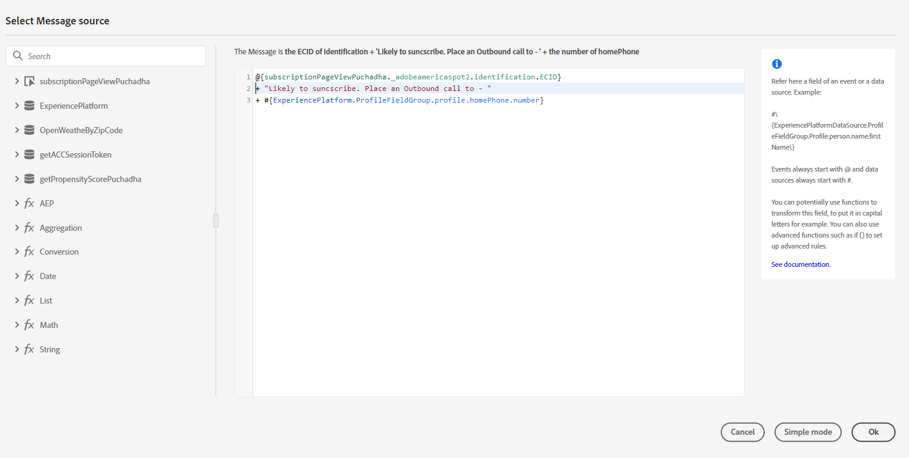

42. Click `OK`.

    

43. Click `OK`.

    <!---
    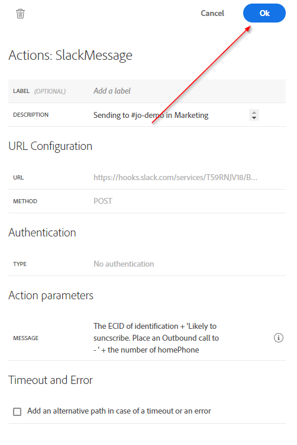
    --->

    <kbd></kdb>

44. In the left menu, go to `Orchestration`, select `End`, then drag and drop `End` after the `SlackMessase`-Action.

    <!---
    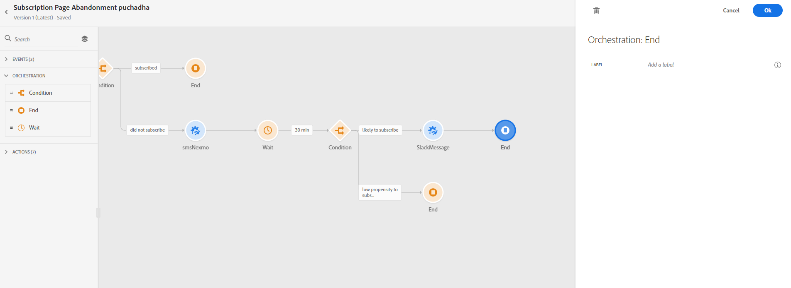
    --->

    <kbd></kdb>

    Your Journey is now fully configured.

    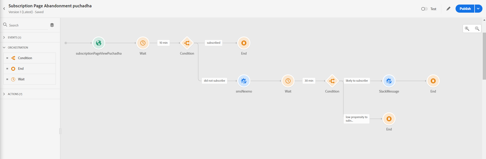

45. Click `Publish`.

    

46. Click `Publish`.

    

    Your Journey is now published.

    

---
