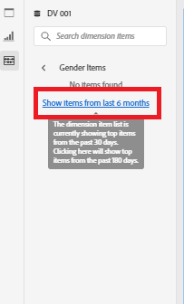
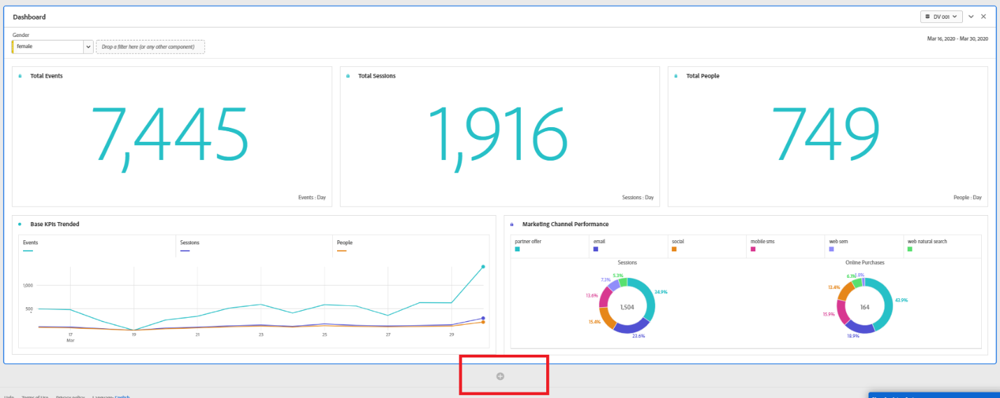
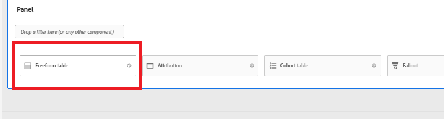
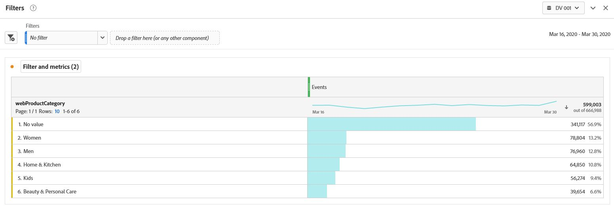
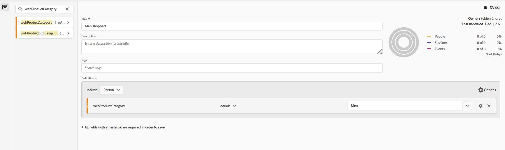
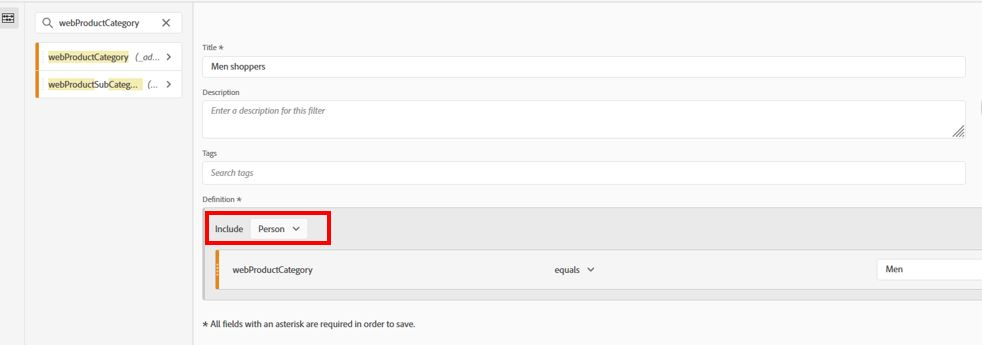
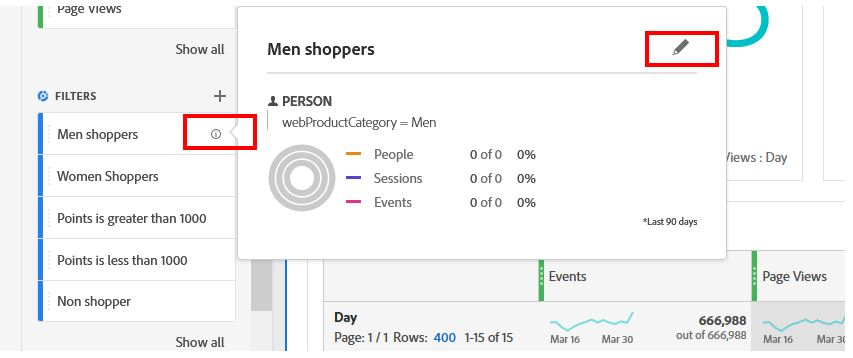
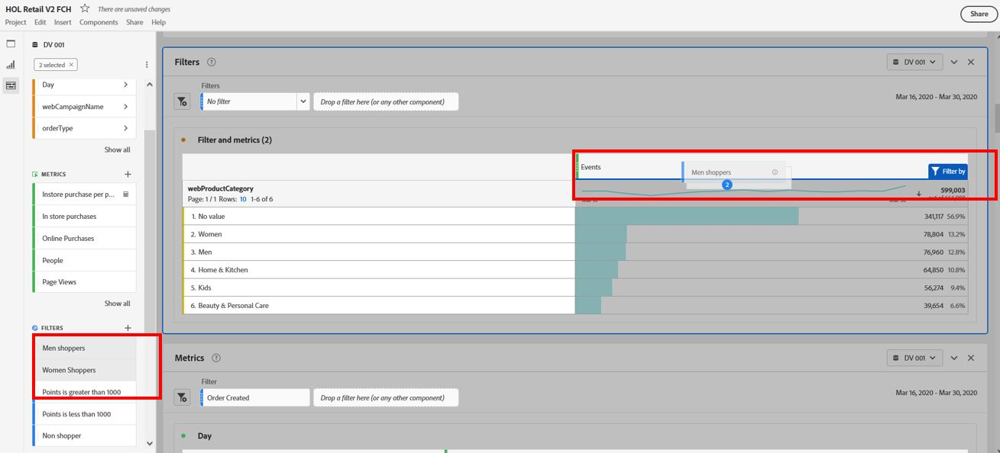

Lab  - Filters
==========
<table style="border-collapse: collapse; border: none;" class="tab" cellspacing="0" cellpadding="0">

<tr style="border: none;">

<td width="600" style="border: none;">
<table>
<tbody valign="top">
      <tr width="500">
            <td valign="top"><h3>Objective:</h3></td>
            <td valign="top"> This lab will show you how to use filters for CJA analyses.
            </td>
     </tr>
     <tr width="500">
           <td valign="top"><h3>Prerequisites:</h3></td>
           <td valign="top"> none
           </td>
     </tr>
</tbody>
</table>
</td>

<td style="border: none;" valign="top">

<table>
<tbody valign="top">
      <tr>
            <td valign="middle" height="70"><b>section</b></td>
            <td valign="middle" height="70">CJA</td>
      </tr>
      <tr>
            <td valign="middle" height="70"><b>version</b></td>
            <td valign="middle" height="70">2.0.00</td>
      </tr>
      <tr>
            <td valign="middle" height="70"><b>date</b></td>
            <td valign="middle" height="70">2021-12-09</td>
      </tr>
</tbody>
</table>
</td>

</tr>
</table>

After completing the Dashboard Lab, the Dashboard now looks exactly how we want it. Next we would like to be able to filter this Dashboard by the Gender of the customers. One of the sources loaded was CRM data and Gender was one of the attributes included in the CRM data.

There are a couple ways to apply Filters.
1. Drag a filter in one at a time
2. Add multiple filters to a drop-down which allows users to select the filter they want to apply as they need it.

**Dragging a Filter One at a Time.**

1. Scroll to the top of the dashboard.
2. In the top left area of the panel is an area where we can drop filters.
 
<kbd></kbd> 

3. Search for "Gender" in the Components menu.
4. Click on the arrow to the right of the Gender dimension to see the items in that dimension.
  
<kbd></kbd> 

5. You may need to click "Show items from the last X months" multiple times.

<kbd></kbd> 

6. Drag "male" from the Gender dimension and drop it into the Filter drop zone to filter the entire dashboard by "Male" customers.
 
<kbd></kbd> 

7. To filter by "Females", drag "female" from the Gender dimension and drop it over "male" in the Filter drop zone when it says "Replace".
 
<kbd></kbd> 

**Add Multiple Filters to a Drop-down**

Instead of dragging individual item, we can create a Filter drop-down that allows us to pick our filter from a drop-down.

1. Grab male" again and hover over "female" in the Filter drop zone. When it highlights "Replace (press shift to create a drop-down)", hold shift and drop "male".
This will create a drop-down menu that can be used to slice the project by either male or female customers. Any number of dropdowns can be created.
      - If you select multiple dropdowns at the same time, they act as an AND clause. By default, any filter applied in the Filter drop zone is an event-based filter, but that can be modified.

<kbd></kbd> 

**Analysis Using Filters**

Let's go a bit deeper into the types of analysis that we can do with CJA.
We want to understand how people shop cross brand or cross product category. To do that we'll build some Filters that allow us to look at Sessions, purchases and break them into different types of people.
      

1. We'll do this by creating some Filters we can then apply against the data as well as use in metrics.
      - Click the + sign below the Panel we were working on to create a new Panel.
  
<kbd></kbd> 

This creates a new Panel in the Project we're working on, that asks where we want to start.

2. We want start with a Freeform Table, so click on Freeform Table.
 
<kbd></kbd> 

Ensure you're using the "DV 001" Data View and that the Date Range is set to the correct date range: March 18-30, 2020

3. Drag the "webProductCategory" dimension into the table.
That will give us the number of event (page view or purchase) per brand or product category 

<kbd></kbd> 

**Filtering by persona / customer interest**

We want understand if our customers shop only in one brand or one product category, or if we have customers who shop cross brand/category 

1. Click on the "+" icon to the right of Filters in the Components menu to open up the Filter Builder.
 
<kbd></kbd> 

2. We'll build a Filter for people who shoped for men product: name it "Men shoppers".
3. Drag the "webProductCategory" Views metric into the drop zone.
4. Change the criteria from webProductCategory equal Men.
 
<kbd></kbd> 

5. Change the "Include" drop-down from "Event" to "Person".
 
<kbd></kbd> 

This Filter will allow us to filter by People that have at least one Page View or product purchase in category Men.

6. Click Save.
      - Notice the new Men shoppers Filter in the Components menu.

7. Hover over the Men shopper filter in the Components menu and click on the "i" to see details of the filter.
 
<kbd></kbd> 

8. Click on the pencil icon to bring up the Filter Builder with the same metric we just built.
 
9. We're going to make a few changes and save as a new Women shopper filter.

10. Change the name from "Men shoppers" to "Women shoppers".

11. Change the criteria from product category equal "Men" to "Women"

12. Click on Save As to save a new filter.

13. Now that we have our filters, let's try to understand how many people who browse/purchase category also browse category men or women.

14. Select the 2 filters just created, drag them under "event" metric until the blue pop-up says "Filter By", and drop the filters. 

<kbd></kbd> 

### This completes the Filter creation excercise in CJA  
Next we will review how to build calculated [Metrics](https://github.com/adobe/AEP-Hands-on-Labs/blob/master/labs/retail/CJA/CJA-Metrics.md)
