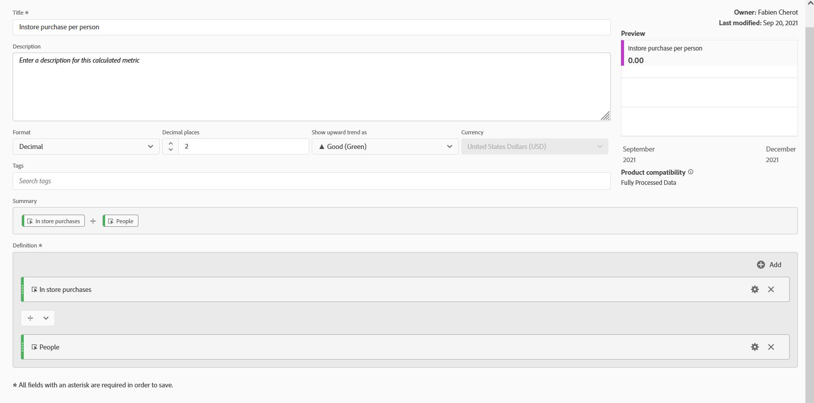
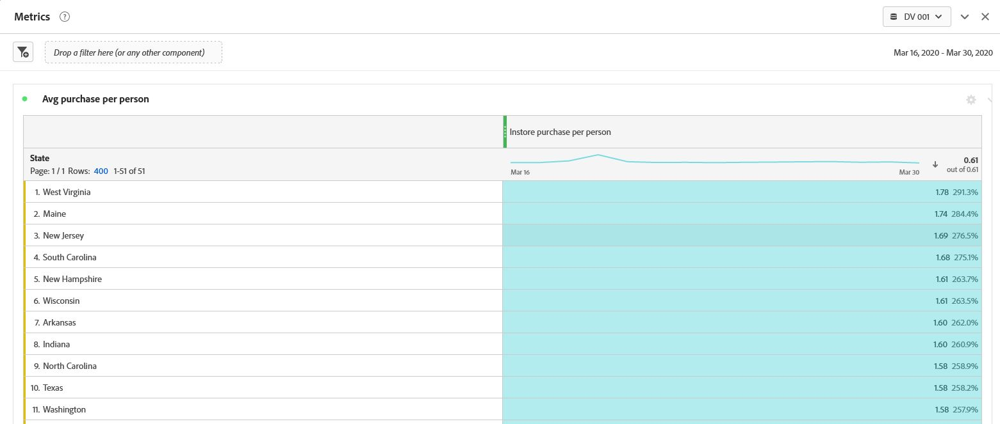
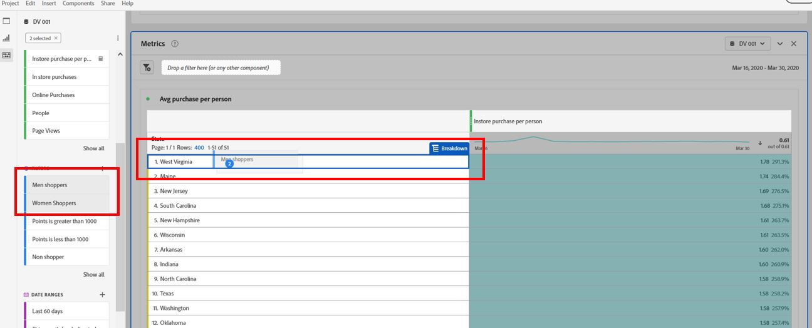
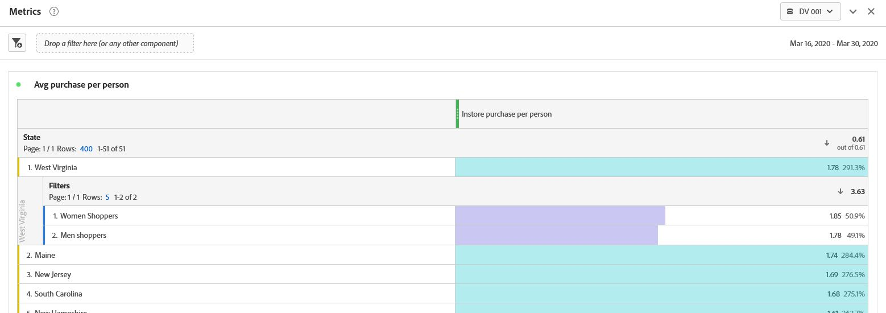

Lab  - Metrics
==========
<table style="border-collapse: collapse; border: none;" class="tab" cellspacing="0" cellpadding="0">

<tr style="border: none;">

<td width="600" style="border: none;">
<table>
<tbody valign="top">
      <tr width="500">
            <td valign="top"><h3>Objective:</h3></td>
            <td valign="top"> This lab will show you how to utilize and create Metrics.
            </td>
     </tr>
     <tr width="500">
           <td valign="top"><h3>Prerequisites:</h3></td>
           <td valign="top"> none
           </td>
     </tr>
</tbody>
</table>
</td>

<td style="border: none;" valign="top">

<table>
<tbody valign="top">
      <tr>
            <td valign="middle" height="70"><b>section</b></td>
            <td valign="middle" height="70">CJA</td>
      </tr>
      <tr>
            <td valign="middle" height="70"><b>version</b></td>
            <td valign="middle" height="70">2.0.00</td>
      </tr>
      <tr>
            <td valign="middle" height="70"><b>date</b></td>
            <td valign="middle" height="70">2021-12-09</td>
      </tr>
</tbody>
</table>
</td>

</tr>
</table>

After completing the Filters Lab let's review Calculated Metrics.

There are obviously metrics that come out of the box, but there will be a need to create new custom metrics that measure more specific items. That's where **Calculated Metrics** come into play. Calculated Metrics allow you to build off of the base metrics and create much more specific metrics.

For example, we may want to compare the average number of purchase per week or month for different group of users. 
1. Click on the "+" to the right of Metrics in the Components menu to bring up the Calculated Metric Builder.
      - Name the Calculated Metric "Instore purchase per person"
      - Drag the "in store purchases" metric into the Definition drop zone
      - Drag the "people" metric into the same zone, under purchases. 
      - Ensure the operand is "%"
      - The format should be decimal. Select the number of digit you want to display. for example "2"
      - Click Save

<kbd></kbd>

Now that we've built these metrics, we can do some more interesting analysis.
For example, We can analyze if we have different customer behaviour by location, loyaty status, brand etc. 

5. Create a new panel below the last panel we just worked on, title it “Metrics”, ensure your date range for POT5 is March 18-30, 2020 and select Freeform table.
      - Create a table with the “State” dimension.
      - By default the freeform display the event, let's replace it with the new Calculated Metric we just created

<kbd></kbd>

In our data, there is not that much difference between stae, but let's dig dipper. 

6. Select the 2 filters "mens" and "women shoppers" we created previously, then drag and drop them in one of the state row 

<kbd></kbd>

6. You know have a breakdown of number of purchase per person, per state and product category purchasers.  

<kbd></kbd>

### This completes the Metrics section of the CJA lab  
Next we will review [Attribution IQ](https://github.com/adobe/AEP-Hands-on-Labs/blob/master/labs/retail/CJA/CJA-AttributionIQ.md)
