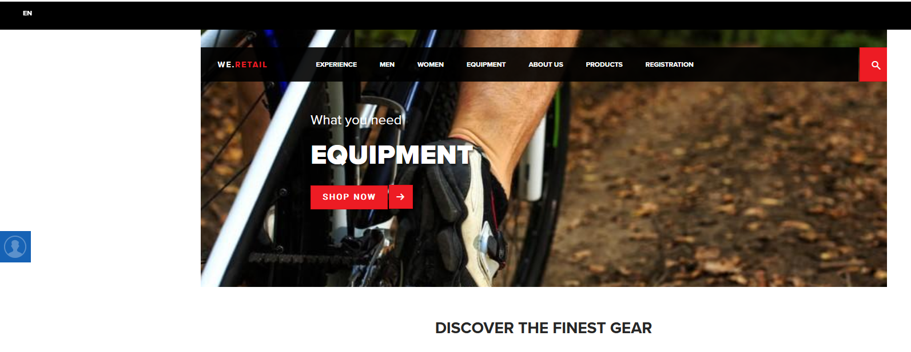

Bi-directional Segment Sharing - AEP > Target Review
==========
<table style="border-collapse: collapse; border: none;" class="tab" cellspacing="0" cellpadding="0">

<tr style="border: none;">

<td width="600" style="border: none;">
<table>
<tbody valign="top">
      <tr width="500">
            <td valign="top"><h3>Objective:</h3></td>
            <td valign="top"> In this lab, you will see a Target experience using an AEP segment.
            </td>
     </tr>
     <tr width="500">
           <td valign="top"><h3>Prerequisites:</h3></td>
           <td valign="top"> none</td>
     </tr>
</tbody>
</table>
</td>

<td style="border: none;" valign="top">

<table>
<tbody valign="top">
      <tr>
            <td valign="middle" height="70"><b>section</b></td>
            <td valign="middle" height="70">RTCDP</td>
      </tr>
      <tr>
            <td valign="middle" height="70"><b>version</b></td>
            <td valign="middle" height="70">1.0</td>
      </tr>
      <tr>
            <td valign="middle" height="70"><b>date</b></td>
            <td valign="middle" height="70">2021-01-07</td>
      </tr>
</tbody>
</table>
</td>

</tr>
</table>

The audience sharing functionality between Audience Manager and Adobe Experience Platform allows you to share your Audience Manager traits and segments to Adobe Experience Platform and vice-versa. If you don't own Audience Manager, you can share Experience Platform segments to other owned Experience Cloud solution via the Core Serves integration.

Instructions:
-----------------

1.    Log in to Adobe Experience Platform by going to this URL: https://platform.adobe.com
2.    Next, go to https://americaspot5-publish.adobedemo.com/content/we-retail/language-masters/en.html# in a private/incognito browser window. The default hero image is presented.

<kbd></kbd>

3.    In the left margin, click on the “person” icon. This will display the X-ray panel from this website. We'll be reviewing this panel as we navigate to different pages in the website.
4.    Navigate to the Equipment category page using the top navigation
5.    Expand the X-ray panel and view the details under "Journey (ExperienceEvents)". 
6.    Hide the X-ray panel and navigate to the Homepage using the top navigation (We.Retail) link. Notice the hero image has been updated to Equipment to reflect the last category page viewed.

<kbd></kbd>

7.    Expand the X-ray panel and view the Segment Membership details

<kbd></kbd>

8.    Additionally, expand the Journey (ExperienceEvents) details to explore the event information sent into platform for your user journey.

9.    Views of the Men and Women category pages will also update the hero image on the Homepage when those pages are viewed previous to the Homepage.

10.   Use the 9-picker in the upper right corner to navigate to Adobe Target.

<kbd></kbd>

11.   Select 'Audiences' from the top navigation and scroll until you see the three AEP segments used for the Target experiences on the We Retail website.

<kbd></kbd>

12.   Select 'Activities' and click on the 'Viewed Equipment Category Test' activity. You can view the AEP audience used for the test by clicking on the 'Informational' icon under Target Audience.

<kbd></kbd>

13.   Use the 9-picker in the upper right corner to navigate back to Experience Platform.

Return to [Lab Agenda Directory](https://github.com/adobe/AEP-Hands-on-Labs/blob/master/labs/retail/README.md#lab-agenda)
