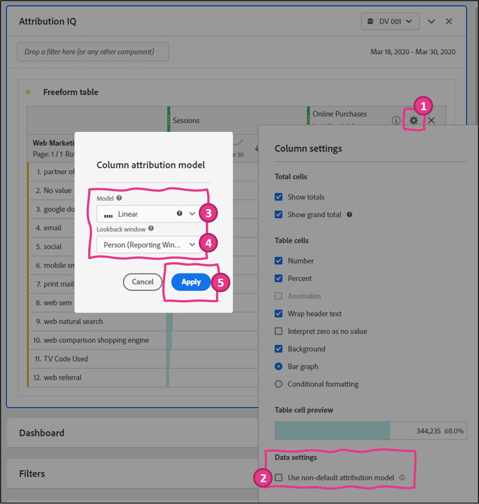
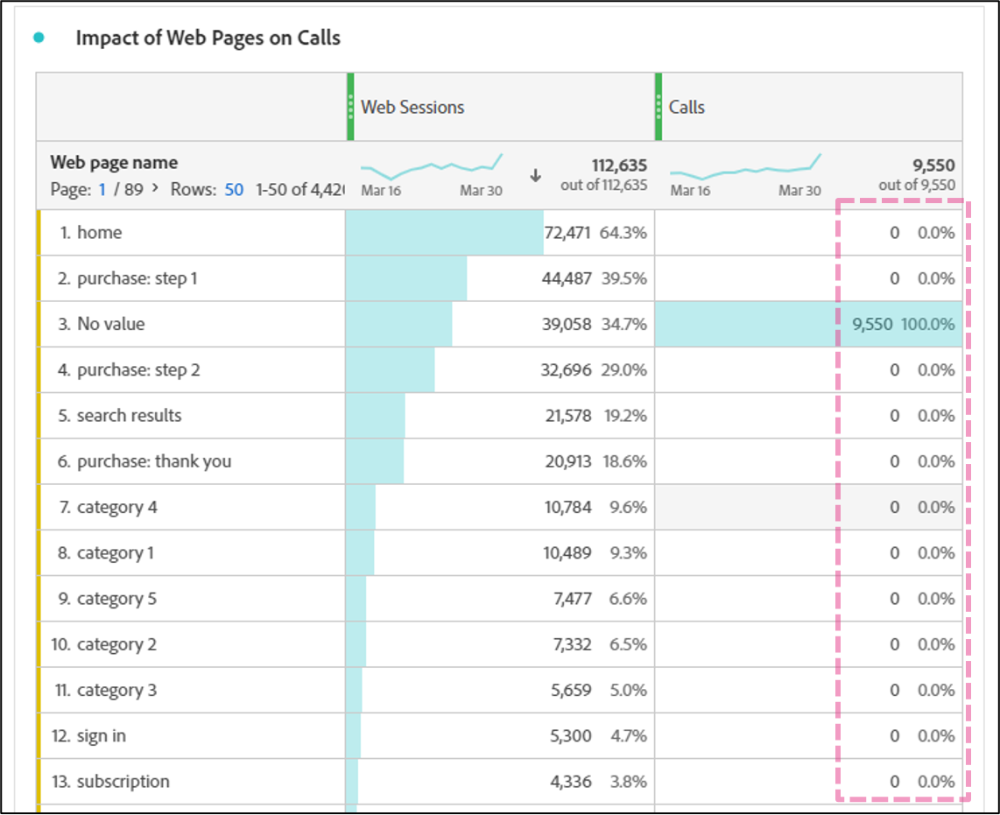

Lab  - Attribution IQ
==========
<table style="border-collapse: collapse; border: none;" class="tab" cellspacing="0" cellpadding="0">

<tr style="border: none;">

<td width="600" style="border: none;">
<table>
<tbody valign="top">
      <tr width="500">
            <td valign="top"><h3>Objective:</h3></td>
            <td valign="top"> This lab will show you how to measure the influence of any data point through Attribution IQ
            </td>
     </tr>
     <tr width="500">
           <td valign="top"><h3>Prerequisites:</h3></td>
           <td valign="top"> none
           </td>
     </tr>
</tbody>
</table>
</td>

<td style="border: none;" valign="top">

<table>
<tbody valign="top">
      <tr>
            <td valign="middle" height="70"><b>section</b></td>
            <td valign="middle" height="70">CJA</td>
      </tr>
      <tr>
            <td valign="middle" height="70"><b>version</b></td>
            <td valign="middle" height="70">1.0.10</td>
      </tr>
      <tr>
            <td valign="middle" height="70"><b>date</b></td>
            <td valign="middle" height="70">2021-05-24</td>
      </tr>
</tbody>
</table>
</td>

</tr>
</table>

Before we begin:
1. Navigate to [https://experience.adobe.com](https://experience.adobe.com)
2. Login with provided credentials
3. Click on "Customer Journey Analytics" from the Quick Access bar, or navigate to 
4. Click "Projects" in the top navigation
5. Click "Create New Project"

-----

**ATTRIBUTION IQ**

Attribution IQ can be used to dig a bit deeper into this analysis use case. Attribution IQ allows users to measure the influence that any data point has on driving an event of interest.
In most cases, people think of measuring the influence of marketing touches on driving conversions when talking about attribution. Attribution IQ supports this use case very well, but it can also be used for many other use cases. For example, measuring the influence of web pages on driving calls.
Let's start with the marketing use case.

1. Create a new panel with a Freeform Table and title it “Attribution IQ”. Ensure your date range for POT5 is March 18-30, 2020. Drag the “Web Marketing Channel” dimension & drop it into the panel, then add in the “Sessions” & “Online Purchases” metrics:

      <kbd></kbd>

This table shows the performance of these Marketing Channels on driving Online Purchases from a Last Touch perspective. This is because the Marketing Channel dimension is setup to use a default attribution model of Last Touch. But using Attribution IQ, users can dynamically change the model being used on the fly. Let's change the model being used now.

2. Hover over the “Online Purchases" metric in the table and click on the gear icon when it appears. This will open column settings.
      - In column settings, click on the "Use non-default attribution model" checkbox down in the Data settings section to enable Attribution IQ on this metric. This will open the Attribution IQ configuration window.
      - From here we can select the Attribution Model and Lookback Window
      - Click on the Model drop-down list to access all the attribution models available and select “Linear”
      - Click on the Lookback window drop-down and select “Person (Reporting Window)” and click Apply

   <kbd></kbd>

**Notes on Attribution Model selection**: Let's say that as a business we've determined that the Linear Model is the model that makes the most sense to use because it splits the credit across all the touches that a customer has leading up to a conversion, opposed to just one touch. Depending on the analysis scenario, we may want to use different Attribution Models. Attribution IQ provides the flexibility to select the model that makes the most sense for the job.

**Notes on Lookback window selection**: Selecting “Session” means that we will only give credit to touches that occur prior to a conversion within a Session.
“Person” means Touches across Sessions can be given credit within the Reporting Timeframe of the Panel. We’ve selected “Person” because a person may have multiple marketing interactions across multiple Sessions on their path to a conversion.

3. We can now understand the influence that Marketing Channels have on driving conversions

<kbd></kbd>

   We could also easily turn this freeform table into a nice pretty visualization if we wanted.
  
Let's switch gears and use Attribution IQ to score pages based on their influence on driving calls into the call center. 

4. Add another table to your Attribution IQ freeform panel.
      - In your new table, drag the “Web page name” dimension & drop it into the panel, then add in the “Web Sessions” & “Calls” metrics:

<kbd></kbd>

As expected, the “Calls” metric reports all 0's because there are no Call events that occur on the same event as a Page View.

Let's use Attribution IQ to configure how attribution works for this metric.

5. Click on the gear to the right of the Calls metric in the table and click the checkbox to "use non-default attribution model".
      - In attribution model settings, select the Time Decay model and configure a 15-Minute Half-life. Set the Lookback window to “Person (Reporting Window)”

<kbd></kbd>

   This is a perfect model for what we're trying to do. Typically, customers will try to do something online for a while before they give up and call into the call center. This means that they may hit a couple of pages before they call. We don't just want to give credit to the last page for driving the call. But we probably do want to give the most credit to the last page for driving the call.

We configured the time decay model to look back from the call event up to 15 minutes and give the most credit to the last page that a person saw prior to a call, and then incrementally less credit to each page behind that, up to 15 minutes prior to the call.
      - Click "Apply" and look at the resulting table

<kbd></kbd>

Based on this table, we can see the top pages that are driving calls into the call center. Lets go deeper.

6. In the Components menu, search for the “Call reason" dimension and click on the arrow to the right to see the items within that dimension.
      - In the "Call reason Items" view, click "Show items from last X months" until values show
      - Select the top 4 call reasons

<kbd></kbd>

Now drag them under the "Calls" metric in your table until the "Filter By" prompt in blue appears, then drop them.

<kbd></kbd>

The result is a table that uses a 15-Minute Time Decay model to give credit to pages for driving calls, broken out by the top 4 Call Reason types.

<kbd></kbd>

Clients typically use this data to uncover the top pages driving calls and testing different versions of those pages (Adobe Target is a great option here) until they find a version that works best at keeping people in the cheaper, online channel.

### This completes the excercise on Attribution IQ in CJA
Next we will review [Flow Visualizations](https://github.com/adobe/AEP-Hands-on-Labs/blob/master/labs/retail/Foundations/CJA-Flow.md)
