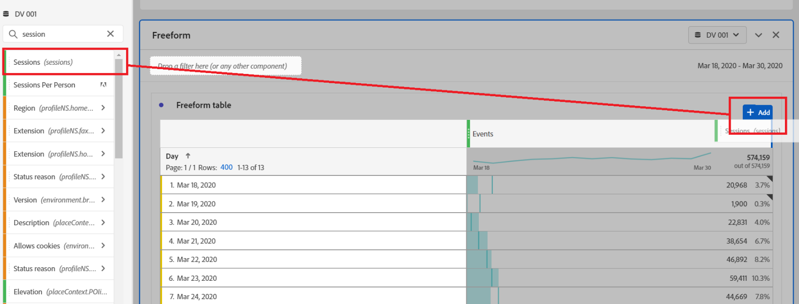
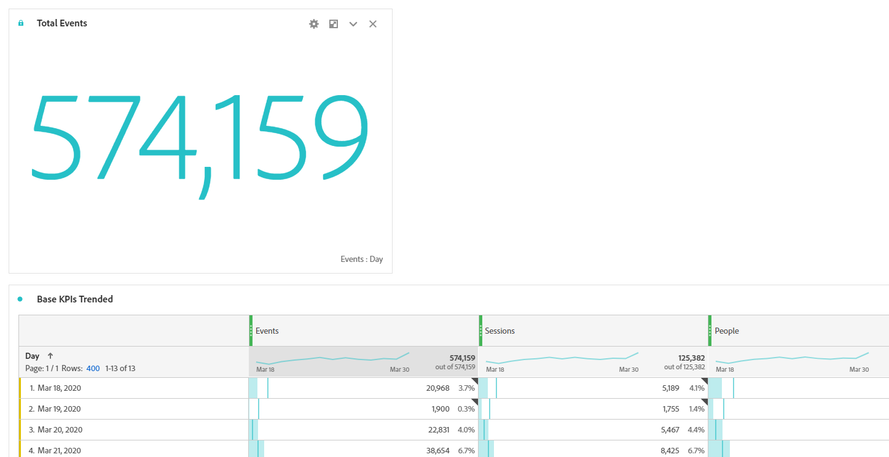
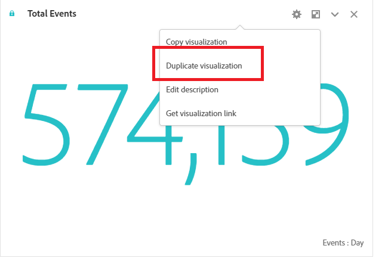
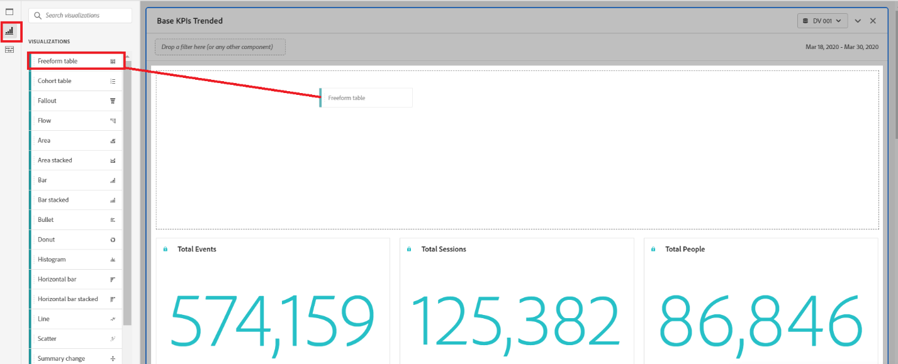
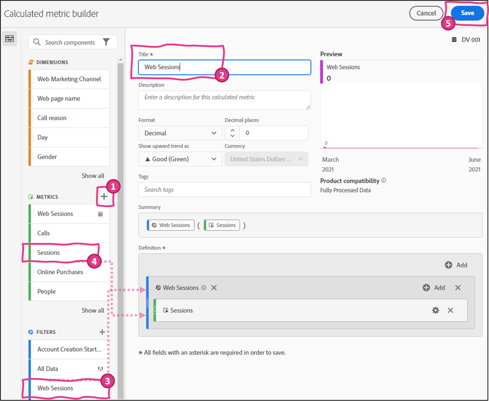
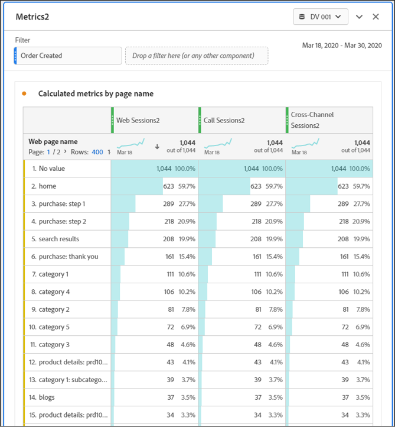
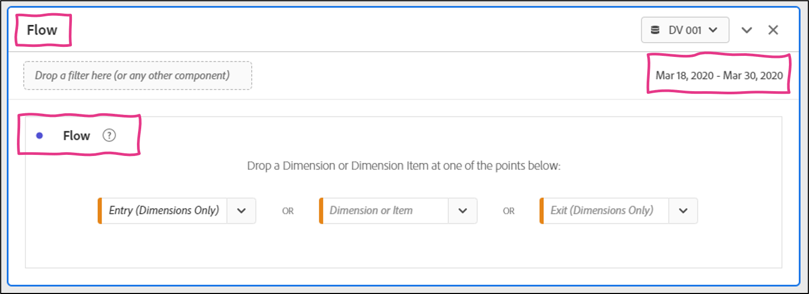
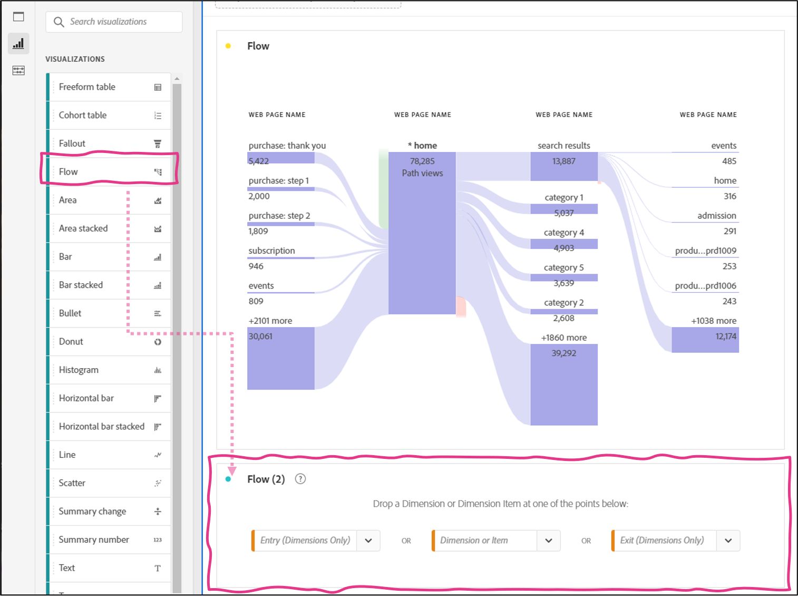
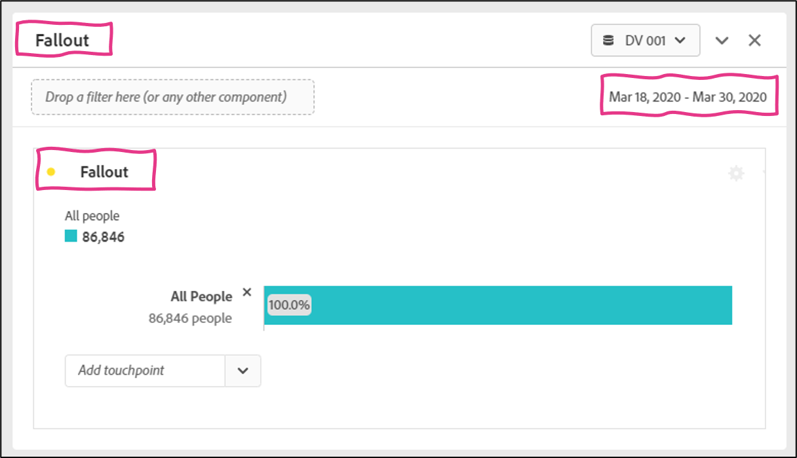
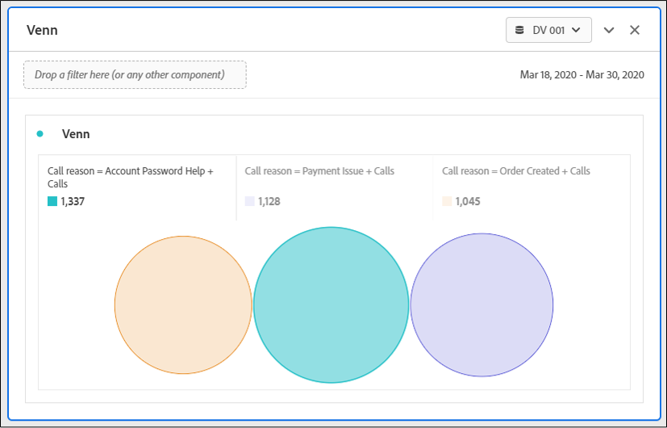

Lab  - Build a CJA Dashboard
==========
<table style="border-collapse: collapse; border: none;" class="tab" cellspacing="0" cellpadding="0">

<tr style="border: none;">

<td width="600" style="border: none;">
<table>
<tbody valign="top">
      <tr width="500">
            <td valign="top"><h3>Objective:</h3></td>
            <td valign="top"> This lab will show you how to construct a CJA Dashboard.
            </td>
     </tr>
     <tr width="500">
           <td valign="top"><h3>Prerequisites:</h3></td>
           <td valign="top"> none
           </td>
     </tr>
</tbody>
</table>
</td>

<td style="border: none;" valign="top">

<table>
<tbody valign="top">
      <tr>
            <td valign="middle" height="70"><b>section</b></td>
            <td valign="middle" height="70"></td>
      </tr>
      <tr>
            <td valign="middle" height="70"><b>version</b></td>
            <td valign="middle" height="70">1.0.10</td>
      </tr>
      <tr>
            <td valign="middle" height="70"><b>date</b></td>
            <td valign="middle" height="70">2021-05-24</td>
      </tr>
</tbody>
</table>
</td>

</tr>
</table>

Before we begin:
1. Navigate to [https://experience.adobe.com](https://experience.adobe.com)
2. Login with provided credentials
3. Click on "Customer Journey Analytics" from the Quick Access bar, or navigate to 
4. Click "Projects" in the top navigation
5. Click "Create New Project"

Introduction to Analysis Workspace Interface:
-----------------
The left side rail contains the Panel menu (where new panels can be dragged to the project), the Visualization menu (where visualizations can be dragged to a panel), and the Components menu (where Dimensions, Metrics and Filters are found and can be dragged to the panel visualizations).
If you're familiar with Adobe Analytics Workspace Analysis, you'll notice several features in CJA have been renamed to align with industry standards. Some updated names include:
- Segments are now known as 'Filters'
- Virtual Report Suites are now known as 'Data Views'
- Classifications are now known as 'Lookup datasets'
- Customer attributes are now known as 'Profile datasets'
- Hit containers are now known as 'Event' containers
- Visit containers are now known as 'Session' containers
- Visitor containers are now known as 'Person' containers
-----
DASHBOARD
Add Freeform Panel
1.	Let's jump right in and start building a dashboard. 
2.	Ensure that the "DV 001" Data View is selected in the Data View selector
3.	Set Reporting Date Range to March 18-30, 2020 from table below and click "Apply".

<kbd></kbd>
4.	Drag the "Day" dimension from the Components menu and drop it into the Freeform Table visualization in the Panel.

<kbd></kbd>
5.	Drag the "Sessions" metric from the Components menu and "Add" it to the right of the "Events" metric by hovering to the right of the "Events" metric until the "+ Add" appears in the Freeform Table visualization in the Panel.

<kbd></kbd>
6.	Do the same for the "People" metric from the Components menu 
7.	Click on "Freeform Table" in the top left corner of the table and change the name to "Base KPIs Trended".
8.	Click on "Freeform" in the top left corner of the panel and change the name to "Dashboard".

<kbd></kbd>

Add Line Visualization
1.	Click on Visualizations in the left menu and drag the Line visualization to the Dashboard panel above the Base KPIs Trended table.

<kbd></kbd>

<kbd></kbd>

2.	The Line visualization will automatically connect to the Base KPIs Trended table and will visualize the dimensions and metrics in that table. The dimension is the x-axis and the metrics are trended. You can click individual metrics to disable them in the visualization.

      a.	Click on "Line" in the top left corner of the Line visualization and change the name to "Base KPIs Trended".

<kbd></kbd>

Add Summary Number Visualization
1.	Right-click on the number under the "Events" metric in the "Base KPIs Trended" table to bring up a menu with several options, including adding a visualization tied to that metric.

<kbd></kbd>
2.	Click on the Visualize option and scroll down to and select Summary Number.

<kbd></kbd>

3.	The Summary Number visualization will be added to the panel. This visualization is showing the total number of Events for the reporting timeframe.

<kbd></kbd>

4.	This visualization is not "Locked" which means if any selections are made in the Base KPIs Trended table, the Summary Number visualization will change to the new selection.
Lock Selection
1.	Click on the number under Sessions and watch what happens to the Summary Number visualization.
2.	Scroll up to the Base KPIs Trended Line visualization and notice it is impacted by the selection in the table.
<kbd></kbd>
3.	Select the number under the "Events" metric again and click on the round dot in the top left corner of the Summary Number visualization to bring up the "Data Sources Settings" menu.
4.	Click on Lock Selection to lock the visualization to the "Events" metric in the table.
5.	Click on "Summary Number" in the Summary Number visualization and name it "Total Events".
6.	Drag the right bottom corner of the Total Events visualization to make it smaller. Make it about 1/3 of the width of the screen.

<kbd></kbd>

<kbd></kbd>

Duplicate Summary Visualizations
1.	Now let's create a Summary Number visualization for the "Sessions" and "People" metrics.
2.	We could go through the same process, but instead we'll duplicate the Total Sessions summary number visualization, rename it and lock it to the desired metric. 

      a.	Hover your mouse over the top center of the "Total Session" summary number visualization and right-click when you see the mouse change to the crosshairs icon, to bring up the menu.

      b.	Click on Duplicate Visualization to make a duplicate copy of the "Summary Number" visualization that we just created.

      c.	Duplicate it again.

<kbd></kbd>
3.	We now have 3 instances of the "Total Events" summary number visualization.

      a.Drag one copy to the right of the first instance and drag the other copy next to that one.

      b.Click on the number under the "Sessions" metric in the Base KPIs Trended table.

      c.Click on the round dot in the top left corner of the Total Events (2) Summary Number visualization to bring up the Data Sources Settings menu.

      d.Deselect the "Lock Selection" to unlock it from the "Events" metric.

4.	Because the "Sessions" metric is selected in the "Base KPIs Trended" table, and the duplicated Summary Number has been unlocked, the Summary Number visualization will now be tied to the "Sessions" metric.

      a.Click on the "Lock Selection" checkbox again to now lock it to the "Sessions" metric.

      b.Click on "Total Events (2)" in the duplicated Summary Number visualization and name it "Total Sessions" to match the metric it represents.

      c.Click on the number under the "Sessions" metric in the Base KPIs Trended table.

      d.Then click on the round dot in the top left corner of the Total Events (2) Summary Number visualization to bring up the Data Sources Settings menu.

      e.Deselect the "Lock Selection" to unlock it from the "Events" metric.

5.	Because the People metric is selected in the Base KPIs Trended table, and the duplicated Summary Number has been unlocked, the Summary Number visualization will now be tied to the People metric.
      a.Click on the "Lock Selection" checkbox again to now lock it to the People metric.

      b.Click on "Total Events (3)" in the duplicated Summary Number visualization and name it "Total People" to match the metric it represents.

<kbd></kbd>

Save Project
1.	Now would be a good time to save this Project so we don't lose any of our work.
2.	Click on Project and then Save to open the Save Project window.
3.	Name the project "Hands-on Lab Working Project" and click Save Project.

<kbd></kbd>

Donut Visualization

1.	Now let's add a Donut visualization to this panel that is built off another dimension of data (other than Day). The Donut visualization, like the Line visualization is tied to a table, so we need to add a table with the dimension and metrics that we want to visualize in the Donut visualization.

      a.Click on Visualizations in the left menu and drag a Freeform Table and drop it in the project above the "Base KPIs Trended" table.

<kbd></kbd>

2.	The dimension that we want to work with in this case is the Web Marketing Channel that we looked at when we built the Data View, and configured to have a default attribution model of Last Touch at a Person level.

      a.Drag the "Web Marketing Channel" from the Components menu into the Freeform Table you added to the panel. If you can't find it in the Components menu, you can search for it at the top.

<kbd></kbd>

3.	The table will default to the "Events" metric, but let's say we want to see the Sessions driven by each Web Marketing Channel as well as the conversions that each of these Marketing Channels are driving from a Last Touch perspective.

      a.Drag the "Sessions" metric from the Components menu and replace the "Events" metric with it, by hovering over the "Events" metric until it says "Replace" and then dropping it.

<kbd></kbd>
4.	Drag the "Online Purchases" metric from the Components menu and "Add" it to the right of the "Sessions" metric you just added to the table.
5.	We now have a table with the dimension and metrics we want to represent in the Donut visualization. Rename the "Freeform Table (2)" table to "Marketing Channel Performance".

<kbd></kbd>
6.	Drag the Donut visualization from the Visualizations menu and drop it above the "Marketing Channel Performance" table.

7.	The Donut visualization automatically connects to the last table that was added to the project, but if we wanted it to connect to a different table we could by clicking the round dot in the top left corner of the visualization to Manage Data Sources and selecting the table that we want the visualization tied to.

8.	We'll keep it tied to the Marketing Channel Performance table.
a.	Rename the Donut visualization to "Marketing Channel Performance".

9.	The Donut visualization will automatically show the top 6 items in the table it is tied to, but this can be customized.

<kbd></kbd>

10.	If we wanted to show specific channels instead of the top 6. We can select those channels in the table and lock the Donut visualization to those selections.

Lock Selected Items in Donut Visualization
1.	In the Marketing Channel Performance table, select the following channels:

      a.partner offer

      b.email

      c.social

      d.mobile sms

      e.web sem

      f.web natural search

<kbd></kbd>
2.	Click on the round dot in the top left corner of the Donut visualization to bring up the Data Source Settings menu and click the "Lock Selection" checkbox.

3.	Under the "Lock Selection" checkbox is a drop-down list that defaults to "Selected Positions". This means that the Donut visualization is tied to the elements in the selected positions in the table. That's not what we want because these channels of interest may move around in the table over time based on performance.
      a.Click on the drop-down and select "Selected Items" instead of "Selected Positions". This will tie the Donut visualization to the specific channels of interest.

<kbd></kbd>

4.	The number of items the Donut visualization will show can be configured by clicking on the gear in the top right corner of the Donut visualization and increasing or decreasing the "Limit Max Items" setting.

Dashboard Cleanup
1.	Let's say these visualizations represent all the data points you hope to have in your dashboard. We can now clean up the dashboard to look as we desire.
2.	Drag the Base KPIs Trended Line Graph below the Summary Number visualizations.
3.	Drag the right side of the Line Graph and change the size of the visualization to cover just the left half of the project.
4.	Scroll down and drag the left side of the Donut visualization so it pops up to the right side of the Line Graph.
5.	The tables the visualizations are built from can now be minimized or even hidden since we're only interested in the visualizations.
6.	Click on the small downward facing arrow in the top right corner of the "Marketing Channel Performance" and "Base KPIs Trended" tables to minimize them.
7.	The tables have now been minimized.
8.	To fully hide the tables, click on the Data Sources Settings round dot for any visualization that uses that table and deselect the checkbox for "Show Data Source".

9.	The tables are now fully hidden.

<kbd></kbd>

-----
**METRICS**

There are obviously metrics that come out of the box, but there will be a need to create new custom metrics that measure more specific types of things. That's where **Calculated Metrics** come into play. Calculated Metrics allow you to build off of the base metrics and create much more specific metrics.

Let's build some Calculated Metrics using the filters we just created.
We'll start with a metric we'll call "Web Sessions" that represents Sessions where Web pages were touched.

1. Click on the "+" to the right of Metrics in the Components menu to bring up the Calculated Metric Builder.
      - Name the Calculated Metric "Web Sessions"
      - Drag the Web Sessions filter into the Definition drop zone
      - Drag the "Sessions" metric into the drop zone. This is what we are counting within the Calculated Metric we are creating
      - Click Save

This formula will calculate the Sessions where a customer touched at least one page.

<kbd></kbd>

2. We'll do the same thing to create a “Call Sessions" metric:
      - Click on the "i" to the right of the “Web Sessions” metric that we just created
      - Click the pencil to edit that metric in the Calculated Metric builder

<kbd></kbd>

3. Once you’re in the Calculated Metric builder settings:
      - Change the name of the Calculated Metric to "Call Sessions"
      - Click the "x" to the right of the “Web Sessions” filter in the formula to remove that filter
      - Drop the “Call Sessions” filter where the “Web Sessions” filter was to filter Sessions by Sessions where a Call exists.
      - Click **Save As** to save the “Call Sessions" metric (and to not override the Web Sessions Calculated Metric we just created)

<kbd></kbd>

4. We'll do the same thing to create a “Cross-Channel Sessions" metric:
      - Click on the "i" to the right of the “Call Sessions” metric that we just created
      - Click the pencil to edit that metric in the Calculated Metric builder
      - Change the name of the Calculated Metric from "Call Sessions“ to “Cross-Channel Sessions”
      - Click the "x" to the right of the “Call Sessions” filter in the formula to remove that filter
      - Drop the “Cross-Channel Sessions” filter where the “Call Sessions” filter was to filter Sessions by Sessions where a Cross-Channel session exists
      - Click **Save As** to save the “Cross-Channel Sessions" metric (and to not override the Call Sessions Calculated Metric we just created)

<kbd></kbd>

Now that we've built these metrics, we can do some more interesting analysis.
For example, a Dashboard could be created that uses these metrics to measure the number of Web Sessions, Call Sessions, and Cross-Channel Sessions we're getting. Let's build it.

5. Create a new panel below the last panel we just worked on, title it “Metrics”, ensure your date range for POT5 is March 18-30, 2020 and select Freeform table.
      - Create a table with the “Day” dimension and the new Calculated Metrics we just created (Web Sessions, Call Sessions & Cross-Channel Sessions):

<kbd></kbd>

6. Create another table with the “Web page name” dimension (instead of the “Day” dimension) and the same new Calculated Metrics we just created:

<kbd></kbd>

This is an interesting view of the data because it allows us to understand what pages customers view in the same sessions where they also call into the call center. This is starting to give us a view into the pages that may be worthy of optimizing if we want to try to reduce calls into the call center by increasing self-service functionality on the website. We can go a level deeper here.

Let say we want to be able to see what pages customers interact with in the sessions where they call into the call center, broken out by the various call reasons. We can use the “Call reason" dimension to do this.

7. The top call reason for POT5 is “Order Created”, so lets add that to the panel filter drop zone to filter by those call types:
      - In the Components menu, click on the arrow to the right of the “Call reason” dimension to see the items within that dimension
      - Click "Show items from last X months" until values show
      - Drag & drop “Order Created” into the filter drop zone

<kbd></kbd>

All data is now bucketed into a “No value” page item in the table using the “Web page name" dimension.

The reason for this: when you drop a filter into the filter drop zone, it creates an **Event-based** filter by default. Because there are no instances where someone can have a "Page View" event and "Call" event in the same Event (that would be impossible), no actual values populate within the "Web page name" table view. Since we are trying to find the Sessions where someone had a specific call type and see the pages they touched in those sessions, we need to change this filter to be **Session-based** instead of Event-based.

8. Hover over the Call Reason filter in the table 
      - Click on the "i"
      - Then click the pencil icon to edit the Event-based virtual filter that was created by default

<kbd></kbd>

This brings us into the Filter Builder with the details of the virtual filter loaded.

9. Change the level of the filter to "Include" **Sessions** instead of **Events**. This will make it a session-based filter.
      - Click Save and view the impact it has on the Panel

<kbd></kbd>

We can now see the pages customers see in the sessions that they call with an "Order Created" reason

<kbd></kbd>

-----

**ATTRIBUTION IQ**

Attribution IQ can be used to dig a bit deeper into this analysis use case. Attribution IQ allows users to measure the influence that any data point has on driving an event of interest.
In most cases, people think of measuring the influence of marketing touches on driving conversions when talking about attribution. Attribution IQ supports this use case very well, but it can also be used for many other use cases. For example, measuring the influence of web pages on driving calls.
Let's start with the marketing use case.

1. Create a new panel with a Freeform Table and title it “Attribution IQ”. Ensure your date range for POT5 is March 18-30, 2020. Drag the “Web Marketing Channel” dimension & drop it into the panel, then add in the “Sessions” & “Online Purchases” metrics:

      <kbd></kbd>

This table shows the performance of these Marketing Channels on driving Online Purchases from a Last Touch perspective. This is because the Marketing Channel dimension is setup to use a default attribution model of Last Touch. But using Attribution IQ, users can dynamically change the model being used on the fly. Let's change the model being used now.

2. Hover over the “Online Purchases" metric in the table and click on the gear icon when it appears. This will open column settings.
      - In column settings, click on the "Use non-default attribution model" checkbox down in the Data settings section to enable Attribution IQ on this metric. This will open the Attribution IQ configuration window.
      - From here we can select the Attribution Model and Lookback Window
      - Click on the Model drop-down list to access all the attribution models available and select “Linear”
      - Click on the Lookback window drop-down and select “Person (Reporting Window)” and click Apply

   <kbd></kbd>

**Notes on Attribution Model selection**: Let's say that as a business we've determined that the Linear Model is the model that makes the most sense to use because it splits the credit across all the touches that a customer has leading up to a conversion, opposed to just one touch. Depending on the analysis scenario, we may want to use different Attribution Models. Attribution IQ provides the flexibility to select the model that makes the most sense for the job.

**Notes on Lookback window selection**: Selecting “Session” means that we will only give credit to touches that occur prior to a conversion within a Session.
“Person” means Touches across Sessions can be given credit within the Reporting Timeframe of the Panel. We’ve selected “Person” because a person may have multiple marketing interactions across multiple Sessions on their path to a conversion.

3. We can now understand the influence that Marketing Channels have on driving conversions

<kbd></kbd>

   We could also easily turn this freeform table into a nice pretty visualization if we wanted.
  
Let's switch gears and use Attribution IQ to score pages based on their influence on driving calls into the call center. 

4. Add another table to your Attribution IQ freeform panel.
      - In your new table, drag the “Web page name” dimension & drop it into the panel, then add in the “Web Sessions” & “Calls” metrics:

<kbd></kbd>

As expected, the “Calls” metric reports all 0's because there are no Call events that occur on the same event as a Page View.

Let's use Attribution IQ to configure how attribution works for this metric.

5. Click on the gear to the right of the Calls metric in the table and click the checkbox to "use non-default attribution model".
      - In attribution model settings, select the Time Decay model and configure a 15-Minute Half-life. Set the Lookback window to “Person (Reporting Window)”

<kbd></kbd>

   This is a perfect model for what we're trying to do. Typically, customers will try to do something online for a while before they give up and call into the call center. This means that they may hit a couple of pages before they call. We don't just want to give credit to the last page for driving the call. But we probably do want to give the most credit to the last page for driving the call.

We configured the time decay model to look back from the call event up to 15 minutes and give the most credit to the last page that a person saw prior to a call, and then incrementally less credit to each page behind that, up to 15 minutes prior to the call.
      - Click "Apply" and look at the resulting table

<kbd></kbd>

Based on this table, we can see the top pages that are driving calls into the call center. Lets go deeper.

6. In the Components menu, search for the “Call reason" dimension and click on the arrow to the right to see the items within that dimension.
      - In the "Call reason Items" view, click "Show items from last X months" until values show
      - Select the top 4 call reasons

<kbd></kbd>

Now drag them under the "Calls" metric in your table until the "Filter By" prompt in blue appears, then drop them.

<kbd></kbd>

The result is a table that uses a 15-Minute Time Decay model to give credit to pages for driving calls, broken out by the top 4 Call Reason types.

<kbd></kbd>

Clients typically use this data to uncover the top pages driving calls and testing different versions of those pages (Adobe Target is a great option here) until they find a version that works best at keeping people in the cheaper, online channel.

-----

**FLOW**

The Flow visualization is a very powerful for understanding customer journeys in a single channel, or across channels. This lends itself nicely to what we're analyzing so far.

1. Click the "+" beneath the last panel that you created to create a new panel.
      - Title it “Flow” and ensure your date range for POT5 is March 18-30, 2020
      - Select the Flow visualization and this will bring you to the Flow visualization configuration view:

<kbd></kbd>

**Notes on Dimension configuration:** 
- Dropping a dimension as the Entry point will show the top first values seen in that dimension either at a Session or Person level
- Dropping a dimension as the Exit point will show the top last values seen for a dimension at a Session or Person level
- Dropping a dimension or a dimensional element in the middle will show you how often that element is the entry or exit, as well as the top elements a person saw prior or after from a pathing perspective. This can also be configured at the Session or Person level.

Let's try this from a Web Pathing perspective to start with.

2. From the Components menu, click on the arrow to the right of the “Web page name” dimension.
      - Click on “Show items from last X months” until the values show up
      - Drag the “home” page and drop it into the center drop zone for the Flow visualization:

<kbd></kbd>

This is what your panel should look like now:

<kbd></kbd>

_(If you get 0 results make sure you're using the correct date range and that you're in the DV 001 Data View)_

This view allows you to see:
      - how many people enter the site at the home page 
      - how many people exit the site at the home page 
      - the top pages that drive customers to the home page
      - the top pages that customers go to from the home page

3. Click on the "search results" page on the branch on the right to see where customers go to from there.
      - Then right-click on the "events" node within the branch to the right to see the various options as it relates to digging deeper into this data

<kbd></kbd>

   One option that is very interesting is the "Create filter for this path" option, which will create a filter based on customers that follow that specific path. This becomes an    interesting way to do further analysis around the types of customers that follow a specific path.

4. Click the gear in the top right of the visualization to bring up the Flow Settings menu. From here we can define if we want to see paths at a Session or Person level.

<kbd></kbd>

_No action needed in this view_

5. From the Visualizations menu, drag a Flow visualization beneath the Flow visualization we just built and drop it in the panel we're working on.

<kbd></kbd>

Let's go back to the use case that we've been working on: Understanding how customers navigate from Web to the Call Center. We want to understand the journey that customers are taking from the web site into the call center. To do this, we will start with call reason.

6. Drag the “Call reason" dimension and drop it in the Exit drop zone:

<kbd></kbd>

  This shows us the top Call Reasons for customer calls into the call center.

One very powerful capability the Flow visualization supports is the ability to mix and match the dimensions being used.

7. Drag the “Web page name" dimension and drop it to the left of the “Call Reason" values on the left side of the visualization when you get the blue "Add" box.
The result is a view into the top pages customers interact with prior to a call, broken out by call type:

<kbd></kbd>

8. Drill into the "home" page to see what customers interact with prior to that on their path to a call.

<kbd></kbd>

This can be very powerful in understanding customer journeys across channels.

-----

**FALLOUT**

The Fallout visualization is great for understanding customer paths when there are specific points or events you want to account for. For example, measuring a process on the site.

1. Create a new panel, title it “Fallout” and ensure your date range for POT5 is March 18-30, 2020. Select the Fallout visualization as the starting point of the panel.

<kbd></kbd>

The Fallout visualization requires touchpoints in the process you want to measure fall-through as well as fall-out for.

2. From the Components menu, click on the arrow to the right of the “Web page name" dimension, click on “Show items from the last X months” until the values show up, and search for “account".
      - Drag "create account: step 1" into the Add Touchpoint drop zone

<kbd></kbd>

We can see that 2,327 people have started the process of creating an account.

4. Next,
      - Drag "create account: step 2" into the Add Touchpoint drop zone
      - Drag "create account: step 3" into the Add Touchpoint drop zone
      - Drag "create account: thank you" into the Add Touchpoint drop zone

<kbd></kbd>

We can see that out of 2,327 people who started the account creation process, 834 made it to the end goal

5. Right-click on “step 3” in the Fallout and review all the options you have to drill deeper into analysis.
      - Of particular interest is the ability to see where people go next after Step 3, if they **fall-through** (make it to the Thank You page) or **fall-out** (don't make it to the Thank You page)

<kbd></kbd>
_(no action needed on this view)_

Let's see how many of these people call into the call center.

6. Remove the last step in the fallout by clicking on the "x" to the right of the last step.
      - Now drag the "Calls" metric and drop it into the Touchpoint drop zone

<kbd></kbd>

  We can see that there are 171 people that make it to step 3 and then call into the call center

7. Remove step 3 in the fallout by clicking the "x" to the right of step 3.

<kbd></kbd>

  We can see that 228 people make it to step 2 and then call.
  
  -----

**COHORT**

The Cohort Table allows us to measure downstream behavior after an event of interest.
In this case, we want to understand customer call behaviors. Specifically, we want to understand the repeat call behaviors of those customers.

1. Create a new panel below the last panel we just worked on, title it “Cohort”, ensure your date range for POT5 is March 18-30, 2020 and select the Cohort Table visualization.

<kbd></kbd>

   The Cohort table is a sophisticated visualization with many different configuration options. We’ll use it for a basic analysis use-case in this exercise, but know that it can support much more complex use-cases.
   
The Cohort table configuration should look like this:

<kbd></kbd>

- The **Inclusion Criteria** allows you to set a metric as Day 0. Anyone that has this event will fall into Day 0. Filters can be applied to be very specific about the event criteria.
 
- The **Return Criteria** allows you to set a metric as the event that will happen in the future that you want to measure. Anyone that met the inclusion criteria and then meets the return criteria will be measured.

Let's say we want to measure people that call and then understand if they call again in the future. In that case, the Inclusion Criteria as well as the Return Criteria will be the Calls metric.

2. Drag the "Calls" metrics to the "Inclusion Criteria Metrics" and "Return Criteria Metrics" drop zones.
      - Set the granularity to "Day" since we want to see the data over days
      - Click "Build"

<kbd></kbd>

The resulting Cohort Table shows the number of people who called by day as well as the number of people that called back in the + Days after that call:

<kbd></kbd>

There aren't a lot of people with repeat calls, but there are some.
- For example, there were 234 calls on March 18. By March 30 (12 days later), 13 of those calls were repeat callers

To dig deeper, you could also add Call Reason filters to the Inclusion and Return Criteria to see if they are calling for the same or different reasons. Go on and try it!

-----

**SEQUENTIAL FILTERING**

Filters can be used to understand customers who follow a particular path or journey. Sequential Filters is a very powerful way of doing this.

1. Open the Filter Builder by clicking on the "+" to the right of Filters in the Components menu. This will bring you to the filter configuration screen

<kbd></kbd>

Let's say that we want to dig deeper into the Account Creation Process we were measuring with the Fallout visualization earlier.
We want to create a Filter that allows us to measure the People that hit Step 1 of the Account Creation process and then call within 1 day.

2. Lets configure the filter:
      - Drag the "Web page name" dimension from the Components menu into the drop zone
      - Type in "create account: step 1" into the select value field
      - Drag the "Calls" metric and drop it under the criteria for the "webPagename"
      - Change the "equals 1" for Calls to "exists"
      - Click on the "And" between the two and change it to "Then"
      - Click on the clock image to the right of "Then" and select "within"
      - Change the "Week(s)" to Day(s)
      - Change the Include from "Event" to Person"
      - Give the Filter a name of "Account Creation Start - Call within 1 Day“
      - Click “Save”

<kbd></kbd>

This filter will find people who hit the first step of the Account Creation process and made a call within 1 day

3. Now create a new panel below the last panel we just worked on, title it “Sequential Filtering”, ensure your date range for POT5 is March 18-30, 2020 and select the Freeform table.
      - Drag the “Call reason" dimension into the table
      - Drag the “People” metric into the table, twice so that they’re side by side (you’ll have 2 identical “People” metrics next to each other)
      - Now drag the new filter we just created underneath one the "People" metrics to "Filter" the metric by those people

<kbd></kbd>

Now we can see the volume of Calls vs. the volume Calls that also made it to step 1 of the Account Creation process. This is a great way to understand what People who made it to step 1 are calling about.
      - We can see from our filter that most of them call about a Payment Issue or Account Password Help

-----

**VENN**

The Venn Visualization is great for measuring cross-over between events, sessions, or people, as it allows us to visually represent the cross-over. Let's use it to measure the crossover between different call reasons. We'll take the top 3 reasons and create a Venn Visualization that allows us to see cross-over at a Person level.

1. Create a new panel below the last panel we just worked on, title it “Venn”, ensure your date range for POT5 is March 18-30, 2020 and select the Venn visualization
      - Drag the top 3 “Call reason” individually into the Filters zone
      - From the “Add One Metric” dropdown, select the "Calls" metric (alternatively, you can drag & drop the Calls metric from Components into the Metric drop zone)
      - Click "Build"

<kbd></kbd>

The Venn visualization defaults to an Event level analysis:

<kbd></kbd>

There are no Events where a customer calls about 2 reasons, therefore there is no overlap.

Lets configure this to be at the Person level.

2. Click the round dot in the top left corner of the visualization to open the Data Sources Settings and select "Show Data Source":

<kbd></kbd>

**Note**: The Venn visualization automatically creates a hidden table with some virtual Filters upon clicking “Build.” We are unhiding the table so we can edit the level of the Filters.

3. In the table, click the “i" to the right of the first Filter to see the level of the filter (Event) and then click on the pencil to open it up in the Filter Builder:

<kbd></kbd>

4. Change the "Include Event" to "Include Person" and Click Save.
      - Do the same for the next 2 filters and review the resulting Venn visualization:

<kbd></kbd>

Although there isn't a lot of overlap, there is some:

<kbd></kbd>

You can hover over the Venn circles to see the exact overlap:
- 95 Calls where the reason was Payment Issue & Account Password Help
- 84 Calls where the reason was Account Password Help & Order Created
- 84 Calls where the reason was Payment Issue & Order Created

**NOTE:** If you want to hide the table from view, click on the round dot in the top left corner of the Venn visualization and deselect the checkbox to “Show Data Source”
