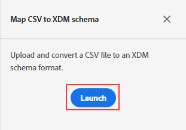

Lab 1.1 - Ingestion - CSV to XDM Mapping
==========
<table style="border-collapse: collapse; border: none;" class="tab" cellspacing="0" cellpadding="0">

<tr style="border: none;">

<td width="600" style="border: none;">
<table>
<tbody valign="top">
      <tr width="500">
            <td valign="top"><h3>Objective:</h3></td>
            <td valign="top"> This lab will show you how to add CSV data to the AEP datasets in a manner that will be usable (or conformed) to either the user Profile or Experience Event schema.
            </td>
     </tr>
     <tr width="500">
           <td valign="top"><h3>Prerequisites:</h3></td>
           <td valign="top"> <li>download "crm_data_xxx.csv" file</li>
                            <li>schema in place</li>
                            <li>dataset in place</li>
           </td>
     </tr>
</tbody>
</table>
</td>

<td style="border: none;" valign="top">

<table>
<tbody valign="top">
      <tr>
            <td valign="middle" height="70"><b>section</b></td>
            <td valign="middle" height="70"></td>
      </tr>
      <tr>
            <td valign="middle" height="70"><b>version</b></td>
            <td valign="middle" height="70">1.0.1</td>
      </tr>
      <tr>
            <td valign="middle" height="70"><b>date</b></td>
            <td valign="middle" height="70">2020-01-06</td>
      </tr>
</tbody>
</table>
</td>

</tr>
</table>

Instructions:
-----------------

Go to https://platform.adobe.com/home

1. In the left-hand menu, navigate to "Workflows"

      

2. We will be ingesting an adhoc CSV file. Please select "Map CSV to XDM schema"

      
      
      
3. Hit Launch to start the workflow

      

4. First step in the workflow is to Add data. 

      
      

5. Drag and drop the 'crm_data_xxx.csv' file profiled in the lab downloads. Within a few seconds you will see a preview of the data. Hit 'Next' 

      
      
      
6. The next step is to select a Destination for this data. Search for 'CRM Profile Dataset' , select it and hit Next 

      
      
      
7. Next, we need to map the CSV file fields to the XDM fields in the schema. The mapper tried to parse and map fields however there are some that were not mapped or are mis mapped. We will make corrections.

      
      

8. To re map a field click the   icon to open the schema. Remapping the list is left as a excersise for the participant.

    Once corrected the mappings should like shown in the screenshot below. Once you have verified that the mappings are correct, hit Next.

    

9. Finally, we are ready to ingest the data. Hit 'Ingest' 

    

10. After a few mins, Adobe Experience Platform will start the workflow of converting the CSV file data to XDM format. This process takes a few mins. once completed hit the 'Finish' to complete the workflow.

    

11. Congratulation !! we have imported an adhoc file into platform.

 
 
 
 

Return to [Lab Agenda Directory](https://github.com/adobe/AEP-Hands-on-Labs/blob/master/labs/retail/README.md#lab-agenda)

