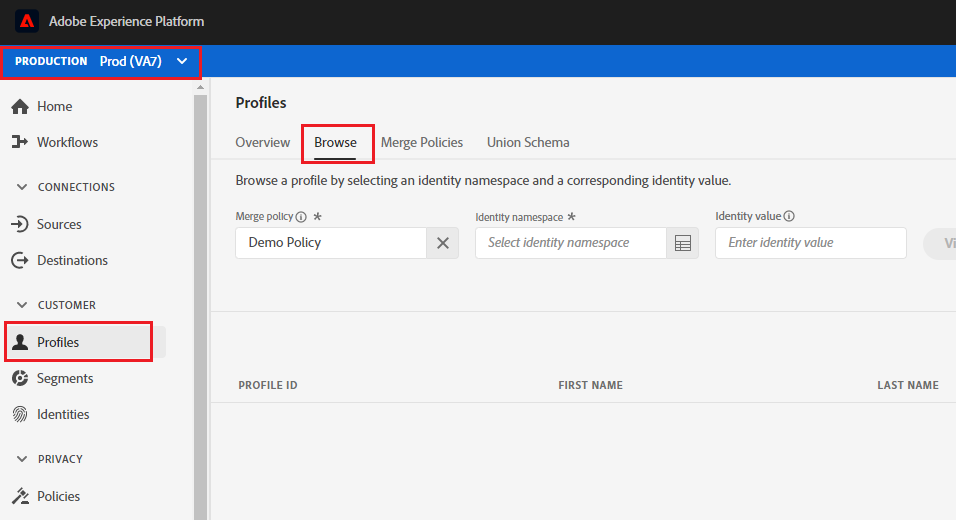

Lab 5.1 - Profiles - UPS Review
==========
<table style="border-collapse: collapse; border: none;" class="tab" cellspacing="0" cellpadding="0">

<tr style="border: none;">

<td width="600" style="border: none;">
<table>
<tbody valign="top">
      <tr width="500">
            <td valign="top"><h3>Objective:</h3></td>
            <td valign="top"> In this lab, you will look up your Customer Profile.
            </td>
     </tr>
     <tr width="500">
           <td valign="top"><h3>Prerequisites:</h3></td>
           <td valign="top"> none</td>
     </tr>
</tbody>
</table>
</td>

<td style="border: none;" valign="top">

<table>
<tbody valign="top">
      <tr>
            <td valign="middle" height="70"><b>section</b></td>
            <td valign="middle" height="70"></td>
      </tr>
      <tr>
            <td valign="middle" height="70"><b>version</b></td>
            <td valign="middle" height="70">1.0.1</td>
      </tr>
      <tr>
            <td valign="middle" height="70"><b>date</b></td>
            <td valign="middle" height="70">2020-01-06</td>
      </tr>
</tbody>
</table>
</td>

</tr>
</table>

In Adobe Experience Platform there's a new feature of visualizing the entire real-time customer profile. This one feature is what all of our customer's have been trying to get for years: a single view of the customer.

Instructions:
-----------------

1.    Log in to Adobe Experience Platform by going to this URL: https://platform.adobe.com
2.    After logging in, you'll land on the homepage of Adobe Experience Platform.
3.    Make sure you are in the 'Prod(VA7)' instance and not in your sandbox instance.
4.    In the menu on the left side, go to Profiles.
5.    Click on the 'Browse' tab. You will see a UI in which a namespace and an ID can be entered.
    
<kbd></kbd>
    
6.    Next, go to https://americaspot5-publish.adobedemo.com/content/ch_robinson/language-masters/en.html in a browser.
7.    In the left margin, click on the “person” icon. This will display the X-ray panel from this website.
8.    Expand the 'Real-time Customer Profile section'. 
9.    Observe the identities and their linkage to a namespace.
10.   Copy the value for ECID and save it to a text editor of your choice</li>
11.   Go back to Profile view page in Experience Platform.
12.   Select ECID from the Namespace dropdown and paste the value copied in the step above to view your Profile.
13.   Click on each of the tabs you see - Details, Attributes, Events and Segment Membership
14.   Now, go back to https://americaspot5-publish.adobedemo.com/content/ch_robinson/language-masters/en.html
15.   Click on the 'Registration' tab on the top right of the page.
16.   Plug in some details and hit 'Register Now'
17.   Go back to Experience Platform, click on 'Profiles' in the left panel, click on the 'Browse' tab and look up your ECID       again
18.   Note any changes in the Details, Attributes and Events tab. 
19.   You will see a CRM Id assigned and linked to your ECID as a result of the registration action.

Return to [Lab Agenda Directory](https://github.com/adobe/AEP-Hands-on-Labs/blob/master/labs/media/README.md#lab-agenda)
